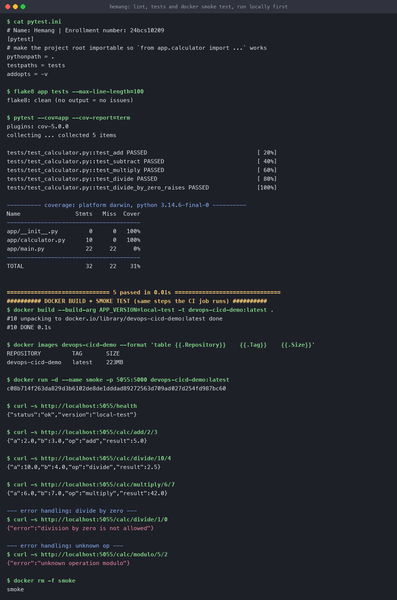
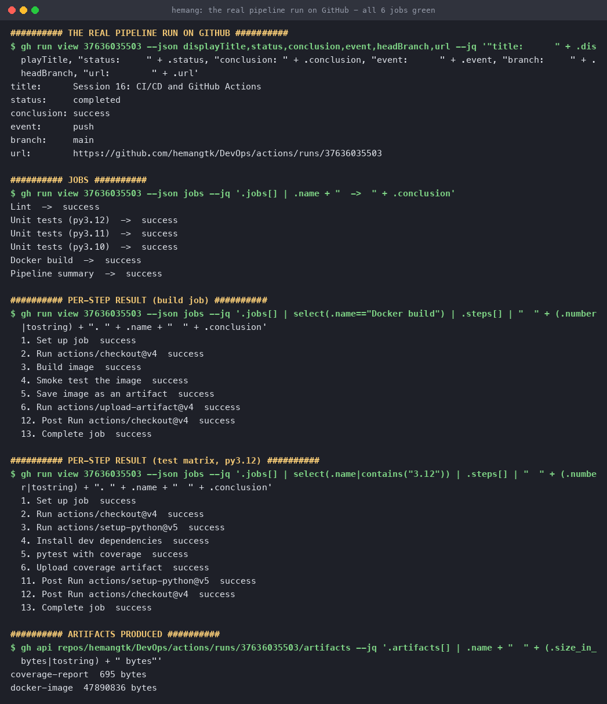

# CI/CD and GitHub Actions

**Name:** Hemang
**Enrollment number:** 24bcs10209

Session 16. A real CI pipeline that runs on **every push to this repository** — not a sample
workflow file, an actually-executing one.

**Live proof:** [run #37636035503](https://github.com/hemangtk/DevOps/actions/runs/37636035503) —
all 6 jobs green.

Workflow: [`.github/workflows/ci.yml`](../.github/workflows/ci.yml) (must live at the repo root)
· App: [`app/`](app/) · Tests: [`tests/`](tests/)

---

## 1. CI vs CD

| | **CI — Continuous Integration** | **CD — Continuous Delivery / Deployment** |
|---|---|---|
| Question | "Does this change break anything?" | "Can this change reach users safely?" |
| Trigger | Every push / PR | A green CI run on the main branch |
| Steps | Checkout, lint, test, build, scan | Push image, deploy, verify, roll back on failure |
| Output | A **verdict** plus artifacts | A **running deployment** |
| Fails when | Tests, lint or build fail | Deploy or post-deploy health checks fail |

**Delivery** stops at a deployable artifact a human approves; **Deployment** goes all the way to
production automatically. This session's pipeline is CI plus the build half of CD — it produces
and smoke-tests a deployable image. Session 17 adds security gates, and Session 21 wires it to
a real cluster.

---

## 2. The vocabulary

```text
Workflow          one .yml file in .github/workflows/   ← "CI Pipeline"
 ├── Event        what triggers it                      ← push, pull_request, workflow_dispatch
 ├── Job          a unit that runs on ONE runner        ← lint / test / build / summary
 │    ├── Runner  the VM executing it                   ← ubuntu-latest
 │    └── Step    one command or action                 ← actions/checkout@v4, `pytest`
 └── Artifact     a file kept after the run             ← coverage.xml, image.tar.gz
```

**Jobs run in parallel by default** and get a *fresh* runner each — nothing is shared unless you
declare `needs:` for ordering or upload/download artifacts for data.

---

## 3. The application

A small calculator plus a Flask wrapper, so there is something real to test *and* to containerise.

```python
# app/calculator.py
def divide(a, b):
    if b == 0:
        raise ValueError("division by zero is not allowed")
    return a / b
```

```python
# tests/test_calculator.py
def test_divide_by_zero_raises():
    with pytest.raises(ValueError, match="division by zero"):
        divide(1, 0)
```

---

## 4. The pipeline

```text
       push / pull_request / manual dispatch
                      │
          ┌───────────┴───────────┐
          ▼                       ▼
      ┌───────┐           ┌──────────────────────────┐
      │ lint  │           │ test  (matrix)           │
      │flake8 │           │ py3.10 │ py3.11 │ py3.12 │   ← 3 runners in parallel
      └───┬───┘           └────────────┬─────────────┘
          │                            │
          └──────────┬─────────────────┘
                     ▼   needs: [lint, test]   ← the gate
              ┌──────────────┐
              │    build     │  docker build → smoke test → artifact
              └──────┬───────┘
                     ▼
              ┌──────────────┐
              │   summary    │  if: always()
              └──────────────┘
```

### Triggers

```yaml
on:
  push:
    branches: [main]
    paths:
      - 'CICD and GitHub Actions/**'     # only run when THIS app changes
      - '.github/workflows/ci.yml'
  pull_request:
    branches: [main]
  workflow_dispatch:                      # a manual "Run workflow" button
```

The `paths` filter matters in a repo like this one — without it, editing a Kubernetes README
would pointlessly run the Python pipeline.

### The matrix

```yaml
strategy:
  fail-fast: false
  matrix:
    python-version: ['3.10', '3.11', '3.12']
```

One job definition, three parallel runners. `fail-fast: false` means a failure on 3.10 does
**not** cancel 3.11 and 3.12 — you want to see whether it breaks on one version or all three.

### The gate

```yaml
build:
  needs: [lint, test]      # only runs if BOTH succeeded
```

This is what makes it a *pipeline* rather than four unrelated jobs. No image is ever built from
code that failed lint or tests.

### Caching

```yaml
- uses: actions/setup-python@v5
  with:
    python-version: '3.12'
    cache: pip
```

One line, and dependency downloads are cached between runs.

---

## 5. Verified locally first

Before pushing anything, the same three checks were run on my machine — and this caught two
real bugs.

```console
$ flake8 app tests --max-line-length=100
flake8: clean (no output = no issues)

$ pytest --cov=app --cov-report=term
tests/test_calculator.py::test_add PASSED                                [ 20%]
tests/test_calculator.py::test_subtract PASSED                           [ 40%]
tests/test_calculator.py::test_multiply PASSED                           [ 60%]
tests/test_calculator.py::test_divide PASSED                             [ 80%]
tests/test_calculator.py::test_divide_by_zero_raises PASSED              [100%]

Name                Stmts   Miss  Cover
app/calculator.py      10      0   100%
============================== 5 passed in 0.01s ===============================
```

> **Bug 1 — caught by running tests locally.** The first `pytest` run failed with
> `ModuleNotFoundError: No module named 'app'`: the project root wasn't on `sys.path`. Fixed
> with a `pytest.ini` setting `pythonpath = .`. Had I pushed first, this would have been a red
> pipeline instead of a ten-second fix.

```console
$ docker build --build-arg APP_VERSION=local-test -t devops-cicd-demo:latest .
$ docker run -d --name smoke -p 5055:5000 devops-cicd-demo:latest

$ curl -s http://localhost:5055/health
{"status":"ok","version":"local-test"}

$ curl -s http://localhost:5055/calc/add/2/3
{"a":2.0,"b":3.0,"op":"add","result":5.0}

$ curl -s http://localhost:5055/calc/divide/10/4
{"a":10.0,"b":4.0,"op":"divide","result":2.5}

$ curl -s http://localhost:5055/calc/divide/1/0
{"error":"division by zero is not allowed"}

$ curl -s http://localhost:5055/calc/modulo/5/2
{"error":"unknown operation modulo"}
```

> **Bug 2 — caught by the smoke test.** `/calc/add/2/3` originally returned **404**. Flask's
> `<float:a>` route converter does **not** match a plain integer like `2` — it requires a
> decimal point. The unit tests all passed, because they test `calculator.py` directly and never
> exercise the routes. Fixed by taking the operands as strings and parsing them.
>
> That is the argument for smoke-testing the built artifact and not just unit-testing the code.



---

## 6. The real run

```console
$ gh run view 37636035503
title:      Session 16: CI/CD and GitHub Actions
status:     completed
conclusion: success
event:      push
branch:     main
url:        https://github.com/hemangtk/DevOps/actions/runs/37636035503

$ gh run view 37636035503 --json jobs
Lint                  ->  success
Unit tests (py3.12)   ->  success
Unit tests (py3.11)   ->  success
Unit tests (py3.10)   ->  success
Docker build          ->  success
Pipeline summary      ->  success
```

### Steps inside the build job

```console
  1. Set up job                         success
  2. Run actions/checkout@v4            success
  3. Build image                        success
  4. Smoke test the image               success
  5. Save image as an artifact          success
  6. Run actions/upload-artifact@v4     success
```

### pytest, running on GitHub's runner

```console
Unit tests (py3.12)  tests/test_calculator.py::test_add PASSED                [ 20%]
Unit tests (py3.12)  tests/test_calculator.py::test_subtract PASSED           [ 40%]
Unit tests (py3.12)  tests/test_calculator.py::test_multiply PASSED           [ 60%]
Unit tests (py3.12)  tests/test_calculator.py::test_divide PASSED             [ 80%]
Unit tests (py3.12)  tests/test_calculator.py::test_divide_by_zero_raises PASSED [100%]
Unit tests (py3.12)  app/calculator.py      10      0   100%
Unit tests (py3.12)  5 passed in 0.05s
Unit tests (py3.11)  tests/test_calculator.py::test_add PASSED                [ 20%]
```

### Artifacts

```console
$ gh api repos/hemangtk/DevOps/actions/runs/37636035503/artifacts
coverage-report     695 bytes
docker-image        47890836 bytes       # ~46 MB, the gzipped image
```

The whole run took **~45 seconds**.



---

## 7. Secrets

Not needed for this pipeline — nothing is pushed to a registry yet — but the mechanism:

```yaml
- name: Log in to the registry
  run: echo "${{ secrets.REGISTRY_TOKEN }}" | docker login -u "${{ secrets.REGISTRY_USER }}" --password-stdin
```

Rules that matter:

- Stored encrypted at repo / environment / organisation level; **never** readable back in the UI.
- **Masked in logs** — printing one shows `***`.
- **Not passed to workflows from forked PRs**, which is what stops a drive-by PR stealing them.
- Prefer **OIDC** over long-lived secrets for cloud deploys: the workflow exchanges a short-lived
  token for cloud credentials, so there is no standing secret to leak.

---

## 8. Reproduce

```bash
cd "CICD and GitHub Actions"
pip install -r requirements-dev.txt
flake8 app tests --max-line-length=100
pytest --cov=app

docker build --build-arg APP_VERSION=local -t devops-cicd-demo:latest .
docker run -d --name smoke -p 5055:5000 devops-cicd-demo:latest
curl -s http://localhost:5055/calc/add/2/3
docker rm -f smoke

# the pipeline itself
gh run list --workflow=ci.yml
gh run view <run-id> --log
gh workflow run ci.yml          # manual trigger (workflow_dispatch)
```

---

## 9. What I took away

1. **`needs:` turns jobs into a pipeline.** Without it they all race in parallel and an image
   could be built from code that failed its tests.
2. **A matrix is one job definition and N runners.** `fail-fast: false` is what makes it useful
   for diagnosis.
3. **Unit tests and smoke tests catch different bugs.** 100% coverage on `calculator.py` and the
   HTTP route was still broken — only running the built container found it.
4. **Run the pipeline's steps locally first.** Both bugs here were found before the first push,
   which is much faster than iterating on red CI runs.
5. **`paths:` filters matter in a monorepo** — otherwise every unrelated commit burns runner
   minutes.
6. **Artifacts are how jobs hand work forward**, since each job gets a clean runner.
