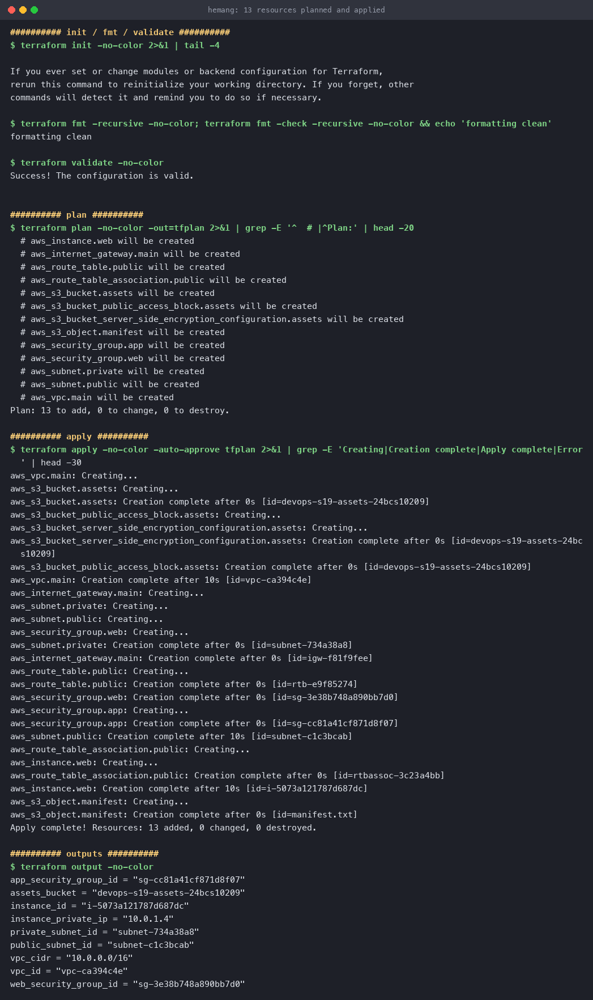
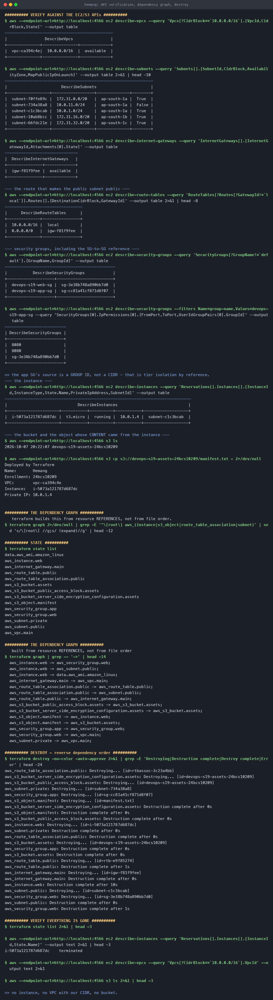

# Cloud and Terraform in Action

**Name:** Hemang
**Enrollment number:** 24bcs10209

Session 19. An end-to-end cloud architecture — **VPC → Subnets → Internet Gateway → Route Table
→ Security Groups → EC2 → S3** — built, verified against the API, and torn down. **13 resources**
from one `terraform apply`.

> **Where this ran:** against **LocalStack** in Docker, not real AWS. The EC2 and S3 API calls
> and their responses are genuine; nothing is billable. Pointing at real AWS means deleting the
> `endpoints` block and fake credentials from `provider.tf`.

Config: [`infra/`](infra/) · Mini project: [`mini-project/`](mini-project/) — the course's exact
six-resource brief (VPC `10.20.0.0/16`), built and verified separately.

---

## The architecture

```text
                            Internet
                                │
                        ┌───────▼────────┐
                        │ Internet GW    │  igw-f81f9fee
                        └───────┬────────┘
                                │ 0.0.0.0/0
  VPC  10.0.0.0/16      ┌───────▼─────────────────────────────┐
  vpc-ca394c4e          │  Route table (public)               │
                        │    10.0.0.0/16 → local              │
                        │    0.0.0.0/0   → igw  ← makes it public
                        └───────┬─────────────────────────────┘
                                │ associated with
   ┌────────────────────────────▼──────────────┐   ┌──────────────────────────┐
   │ PUBLIC subnet   10.0.1.0/24               │   │ PRIVATE subnet           │
   │ subnet-c1c3bcab    map_public_ip = true   │   │ 10.0.11.0/24             │
   │                                           │   │ subnet-734a38a8          │
   │   ┌───────────────────────────────┐       │   │ NO internet route        │
   │   │ EC2  i-5073a121787d687dc      │       │   │ (databases would go here)│
   │   │ t3.micro · 10.0.1.4           │       │   └──────────────────────────┘
   │   │ SG: web-sg (80, 443 from any) │       │
   │   └───────────────────────────────┘       │
   └───────────────────────────────────────────┘

   app-sg : port 8080 FROM web-sg (by group reference, not a CIDR)

   S3  devops-s19-assets-24bcs10209
       └── manifest.txt   ← content interpolates the VPC and instance IDs
```

### File layout

| File | Contains |
|---|---|
| `provider.tf` | Terraform + AWS provider config |
| `variables.tf` | Typed inputs with defaults |
| `network.tf` | VPC, subnets, IGW, route table, association |
| `security.tf` | The two security groups |
| `compute.tf` | AMI data source + EC2 instance |
| `storage.tf` | S3 bucket, hardening, manifest object |
| `outputs.tf` | Nine outputs |

---

## Plan and apply

```console
$ terraform validate
Success! The configuration is valid.

$ terraform plan -out=tfplan
  # aws_instance.web will be created
  # aws_internet_gateway.main will be created
  # aws_route_table.public will be created
  # aws_route_table_association.public will be created
  # aws_s3_bucket.assets will be created
  # aws_s3_bucket_public_access_block.assets will be created
  # aws_s3_bucket_server_side_encryption_configuration.assets will be created
  # aws_s3_object.manifest will be created
  # aws_security_group.app will be created
  # aws_security_group.web will be created
  # aws_subnet.private will be created
  # aws_subnet.public will be created
  # aws_vpc.main will be created
Plan: 13 to add, 0 to change, 0 to destroy.
```

```console
$ terraform apply -auto-approve tfplan
aws_vpc.main: Creating...
aws_s3_bucket.assets: Creating...                      ← independent, starts immediately
aws_s3_bucket.assets: Creation complete after 0s
aws_vpc.main: Creation complete after 10s [id=vpc-ca394c4e]
aws_internet_gateway.main: Creating...                 ← waited for the VPC
aws_subnet.private: Creating...
aws_subnet.public: Creating...
aws_security_group.web: Creating...
aws_security_group.web: Creation complete after 0s [id=sg-3e38b748a890bb7d0]
aws_security_group.app: Creating...                    ← waited for web-sg
aws_subnet.public: Creation complete after 10s [id=subnet-c1c3bcab]
aws_instance.web: Creating...                          ← waited for subnet + SG
aws_instance.web: Creation complete after 10s [id=i-5073a121787d687dc]
aws_s3_object.manifest: Creating...                    ← waited for the instance
aws_s3_object.manifest: Creation complete after 0s

Apply complete! Resources: 13 added, 0 changed, 0 destroyed.
```

**The ordering in that output is the dependency graph executing.** The S3 bucket starts at the
same moment as the VPC because nothing connects them; the instance waits for both its subnet and
its security group.



---

## Dependencies

Terraform infers order from **references**, not file order:

```console
$ terraform graph | grep -- '->'
  aws_instance.web                  -> aws_security_group.web
  aws_instance.web                  -> aws_subnet.public
  aws_instance.web                  -> data.aws_ami.amazon_linux
  aws_internet_gateway.main         -> aws_vpc.main
  aws_route_table_association.public-> aws_route_table.public
  aws_route_table_association.public-> aws_subnet.public
  aws_route_table.public            -> aws_internet_gateway.main
  aws_s3_bucket_public_access_block.assets -> aws_s3_bucket.assets
  aws_s3_object.manifest            -> aws_instance.web
  aws_s3_object.manifest            -> aws_s3_bucket.assets
  aws_security_group.app            -> aws_security_group.web
  aws_security_group.web            -> aws_vpc.main
  aws_subnet.private                -> aws_vpc.main
```

Two of these are worth singling out:

**`aws_s3_object.manifest -> aws_instance.web`** — I never wrote `depends_on`. The edge exists
because the object's content interpolates the instance:

```hcl
content = <<-EOT
  VPC:        ${aws_vpc.main.id}
  Instance:   ${aws_instance.web.id}
  Private IP: ${aws_instance.web.private_ip}
EOT
```

**`aws_security_group.app -> aws_security_group.web`** — the app tier references the web tier's
*group ID* as its traffic source:

```hcl
ingress {
  from_port       = 8080
  to_port         = 8080
  security_groups = [aws_security_group.web.id]   # not a CIDR
}
```

Use `depends_on` only for dependencies Terraform **cannot** see — an IAM policy that must exist
before an instance profile is usable, for example.

---

## Verified against the API

Terraform reporting success is one claim; asking AWS is another.

```console
$ aws ec2 describe-vpcs
+--------------+---------------+-------------+
|  vpc-ca394c4e|  10.0.0.0/16  |  available  |

$ aws ec2 describe-subnets
|  subnet-734a38a8 |  10.0.11.0/24 |  ap-south-1a |  False |   ← private
|  subnet-c1c3bcab |  10.0.1.0/24  |  ap-south-1a |  True  |   ← public

$ aws ec2 describe-route-tables
|  10.0.0.0/16 |  local         |
|  0.0.0.0/0   |  igw-f81f9fee  |   ← THE line that makes a subnet public

$ aws ec2 describe-instances
|  i-5073a121787d687dc |  t3.micro |  running |  10.0.1.4 |  subnet-c1c3bcab  |
```

The `MapPublicIpOnLaunch` column tells the whole story: `True` for public, `False` for private.

### Security group chaining

```console
$ aws ec2 describe-security-groups --filters Name=group-name,Values=devops-s19-app-sg \
    --query 'SecurityGroups[0].IpPermissions[0].[FromPort,ToPort,UserIdGroupPairs[0].GroupId]'
|  8080                  |
|  8080                  |
|  sg-3e38b748a890bb7d0  |   ← the WEB security group, not an IP range
```

The source is a **group ID**. Scale the web tier to 50 instances and the rule still holds, with
no CIDR to maintain. This is the same isolation principle as the Docker three-tier network in
[Docker Networks](../Docker%20Networks/#task-1--container-networking) — membership, not addresses.

### The interpolated manifest

```console
$ aws s3 cp s3://devops-s19-assets-24bcs10209/manifest.txt -
Deployed by Terraform
Name:       Hemang
Enrollment: 24bcs10209
VPC:        vpc-ca394c4e
Instance:   i-5073a121787d687dc
Private IP: 10.0.1.4
```

Those IDs match `terraform output` exactly — proof the interpolation resolved against real
created resources, not placeholders.

### Outputs

```console
$ terraform output
app_security_group_id = "sg-cc81a41cf871d8f07"
assets_bucket         = "devops-s19-assets-24bcs10209"
instance_id           = "i-5073a121787d687dc"
instance_private_ip   = "10.0.1.4"
private_subnet_id     = "subnet-734a38a8"
public_subnet_id      = "subnet-c1c3bcab"
vpc_cidr              = "10.0.0.0/16"
vpc_id                = "vpc-ca394c4e"
web_security_group_id = "sg-3e38b748a890bb7d0"
```

---

## Destroy — in reverse

```console
$ terraform destroy -auto-approve
aws_s3_object.manifest: Destroying...                  ← dependents first
aws_route_table_association.public: Destroying...
aws_security_group.app: Destroying...
aws_instance.web: Destroying...
aws_s3_bucket.assets: Destroying...                    ← after its object
aws_route_table.public: Destroying...
aws_internet_gateway.main: Destroying...
aws_instance.web: Destruction complete after 10s
aws_subnet.public: Destroying...                       ← after the instance in it
aws_security_group.web: Destroying...                  ← after app-sg that referenced it
aws_subnet.public: Destruction complete after 0s
aws_security_group.web: Destruction complete after 1s
```

**Exactly the reverse of create.** The object before the bucket, the instance before its subnet,
`app-sg` before the `web-sg` it referenced — because AWS rejects deleting anything still in use.

```console
$ terraform state list                                  # empty
$ aws ec2 describe-vpcs --query 'Vpcs[?CidrBlock==`10.0.0.0/16`].VpcId'   # empty
$ aws s3 ls                                             # empty
$ aws ec2 describe-instances
i-5073a121787d687dc   terminated
```

The instance shows `terminated` rather than vanishing — correct AWS behaviour, as terminated
instances stay visible for a short while.



---

## Reproduce

```bash
docker run -d --name localstack -p 4566:4566 -e SERVICES=s3,ec2,iam localstack/localstack:3.8
export AWS_ACCESS_KEY_ID=test AWS_SECRET_ACCESS_KEY=test AWS_DEFAULT_REGION=ap-south-1

cd infra
terraform init && terraform validate
terraform plan -out=tfplan
terraform apply -auto-approve tfplan
terraform output
terraform graph | grep -- '->'

aws --endpoint-url=http://localhost:4566 ec2 describe-instances
terraform destroy -auto-approve
```

---

## What I took away

1. **The graph is derived, not declared.** Thirteen resources created in exactly the right order
   from a config with no `depends_on` anywhere — because every dependency was expressed as a
   reference.
2. **Interpolation creates dependencies.** Putting `${aws_instance.web.id}` inside an S3 object's
   content was enough to make Terraform wait for the instance.
3. **A subnet is public only because of a route table entry.** There is no "public" flag — just
   `0.0.0.0/0 → igw`, which is visible in `describe-route-tables`.
4. **Security groups referencing security groups** is how you express tiering without hardcoding
   IPs, and it survives scaling.
5. **Destroy is the graph in reverse**, which is why it reliably unwinds dependencies that a
   hand-written teardown script would get wrong.
6. **Verify against the provider API.** Terraform's own "Apply complete!" and
   `aws ec2 describe-instances` returning `running` are two different facts.
