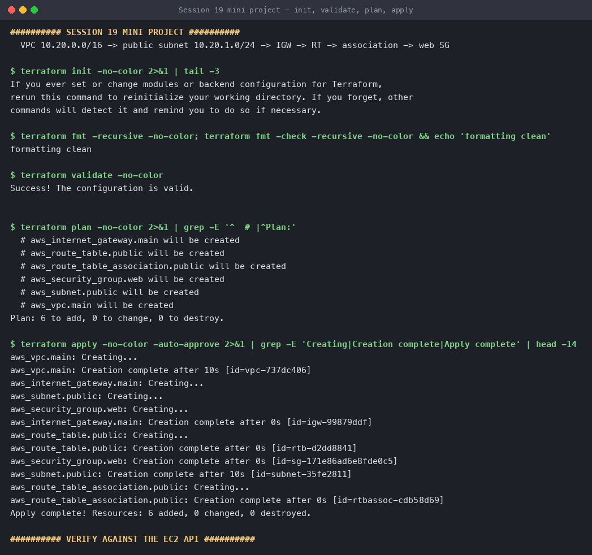
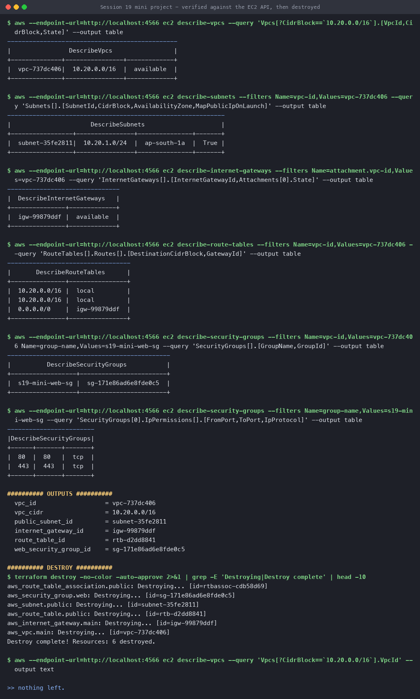

# Session 19 — Mini Project: Build a Complete Cloud Architecture

**Name:** Hemang
**Enrollment number:** 24bcs10209

The course's mini-project brief, built exactly to spec:

```text
VPC  10.20.0.0/16
 └── Public Subnet  10.20.1.0/24
 └── Internet Gateway
 └── Public Route Table   (0.0.0.0/0 → IGW)
 └── Route Table Association
 └── Web Security Group   (80, 443)
```

Six resources, one `terraform apply`, verified against the EC2 API and destroyed.

> **Where this ran:** against **LocalStack** in Docker. The API calls and responses are real;
> nothing is billable. For real AWS, delete the `endpoints` block and the fake credentials
> from [`versions.tf`](versions.tf).

This is the small, exactly-to-brief version. The larger thirteen-resource architecture —
private subnet, EC2, S3, security-group chaining and the dependency graph — is in the
[parent session README](../README.md).

---

## Files

| File | Contains |
|---|---|
| [`versions.tf`](versions.tf) | Terraform + AWS provider, LocalStack endpoints |
| [`variables.tf`](variables.tf) | `vpc_cidr`, `public_subnet_cidr`, project name, common tags |
| [`main.tf`](main.tf) | All six resources |
| [`outputs.tf`](outputs.tf) | The six IDs |

Every resource is tagged `Owner = Hemang`, `Enrollment = 24bcs10209`, `ManagedBy = Terraform`
through a single `merge(var.common_tags, {...})` — one place to change, applied everywhere.

---

## Apply

```console
$ terraform fmt -check -recursive
formatting clean

$ terraform validate
Success! The configuration is valid.

$ terraform plan
  # aws_internet_gateway.main will be created
  # aws_route_table.public will be created
  # aws_route_table_association.public will be created
  # aws_security_group.web will be created
  # aws_subnet.public will be created
  # aws_vpc.main will be created
Plan: 6 to add, 0 to change, 0 to destroy.

$ terraform apply -auto-approve
aws_vpc.main: Creating...
aws_vpc.main: Creation complete after 10s [id=vpc-737dc406]
aws_internet_gateway.main: Creating...          ← all three waited for the VPC
aws_subnet.public: Creating...
aws_security_group.web: Creating...
aws_internet_gateway.main: Creation complete after 0s [id=igw-99879ddf]
aws_route_table.public: Creating...             ← waited for the IGW it routes to
aws_route_table.public: Creation complete after 0s [id=rtb-d2dd8841]
aws_security_group.web: Creation complete after 0s [id=sg-171e86ad6e8fde0c5]
aws_subnet.public: Creation complete after 10s [id=subnet-35fe2811]
aws_route_table_association.public: Creating... ← waited for BOTH the subnet and the table
aws_route_table_association.public: Creation complete after 0s [id=rtbassoc-cdb58d69]

Apply complete! Resources: 6 added, 0 changed, 0 destroyed.
```

The ordering is the dependency graph running. Nothing in this config uses `depends_on`;
Terraform derived all of it from references — the route table waits for
`aws_internet_gateway.main.id`, the association waits for both the subnet and the table.



---

## Verified against the EC2 API

Terraform saying "Apply complete!" is one claim. Asking AWS is another.

```console
$ aws ec2 describe-vpcs --query 'Vpcs[?CidrBlock==`10.20.0.0/16`].[VpcId,CidrBlock,State]'
|  vpc-737dc406 |  10.20.0.0/16  |  available  |

$ aws ec2 describe-subnets --filters Name=vpc-id,Values=vpc-737dc406
|  subnet-35fe2811 |  10.20.1.0/24 |  ap-south-1a |  True |
                                                      ↑ MapPublicIpOnLaunch

$ aws ec2 describe-internet-gateways --filters Name=attachment.vpc-id,Values=vpc-737dc406
|  igw-99879ddf |  available  |          ← attached, not just created

$ aws ec2 describe-route-tables --filters Name=vpc-id,Values=vpc-737dc406
|  10.20.0.0/16 |  local         |
|  10.20.0.0/16 |  local         |
|  0.0.0.0/0    |  igw-99879ddf  |       ← THE line that makes the subnet public

$ aws ec2 describe-security-groups --filters Name=group-name,Values=s19-mini-web-sg
|  s19-mini-web-sg |  sg-171e86ad6e8fde0c5  |
|  80  |  80   |  tcp  |
|  443 |  443  |  tcp  |
```

Two `10.20.0.0/16 → local` rows appear because the VPC has **two** route tables: the one this
config creates and the default main table AWS makes with every VPC. Only mine carries the
`0.0.0.0/0` route — the default main table has no internet route at all, which is why a subnet
left unassociated stays private.

### Outputs

```console
$ terraform output
vpc_id                = "vpc-737dc406"
vpc_cidr              = "10.20.0.0/16"
public_subnet_id      = "subnet-35fe2811"
internet_gateway_id   = "igw-99879ddf"
route_table_id        = "rtb-d2dd8841"
web_security_group_id = "sg-171e86ad6e8fde0c5"
```

---

## Destroy

```console
$ terraform destroy -auto-approve
aws_route_table_association.public: Destroying... [id=rtbassoc-cdb58d69]   ← first
aws_security_group.web: Destroying...
aws_subnet.public: Destroying...
aws_route_table.public: Destroying...
aws_internet_gateway.main: Destroying...
aws_vpc.main: Destroying...                                               ← last
Destroy complete! Resources: 6 destroyed.

$ aws ec2 describe-vpcs --query 'Vpcs[?CidrBlock==`10.20.0.0/16`].VpcId'
                                          ← empty
```

Reverse of create: the association unwinds before the subnet and route table it joined, and the
VPC goes last because everything else lives inside it. AWS rejects deleting a resource that is
still in use, so this ordering is not a nicety — it is the only order that works.



---

## Reproduce

```bash
docker run -d --name localstack -p 4566:4566 -e SERVICES=ec2,sts localstack/localstack:3.8
export AWS_ACCESS_KEY_ID=test AWS_SECRET_ACCESS_KEY=test AWS_DEFAULT_REGION=ap-south-1

terraform init
terraform fmt -check -recursive
terraform validate
terraform plan
terraform apply -auto-approve
terraform output

aws --endpoint-url=http://localhost:4566 ec2 describe-route-tables
terraform destroy -auto-approve
```

---

## What I took away

1. **A subnet is public because of a route table row, not a flag.** `0.0.0.0/0 → igw` is the
   whole mechanism. `MapPublicIpOnLaunch` only decides whether instances get a public IP — it
   does not create a path to the internet.
2. **The association is a separate resource for a reason.** The subnet and the route table can
   each exist happily alone; it is joining them that makes the subnet public, and that join is
   the one thing Terraform tears down first.
3. **Every VPC gets a main route table for free**, and it has no internet route. Forgetting the
   association does not fail — it silently leaves the subnet private.
4. **`terraform fmt -check` in CI costs nothing** and removes whitespace diffs from review
   entirely.
5. **Verify with the provider's own API.** A green apply and `describe-route-tables` showing the
   IGW route are two different facts.
