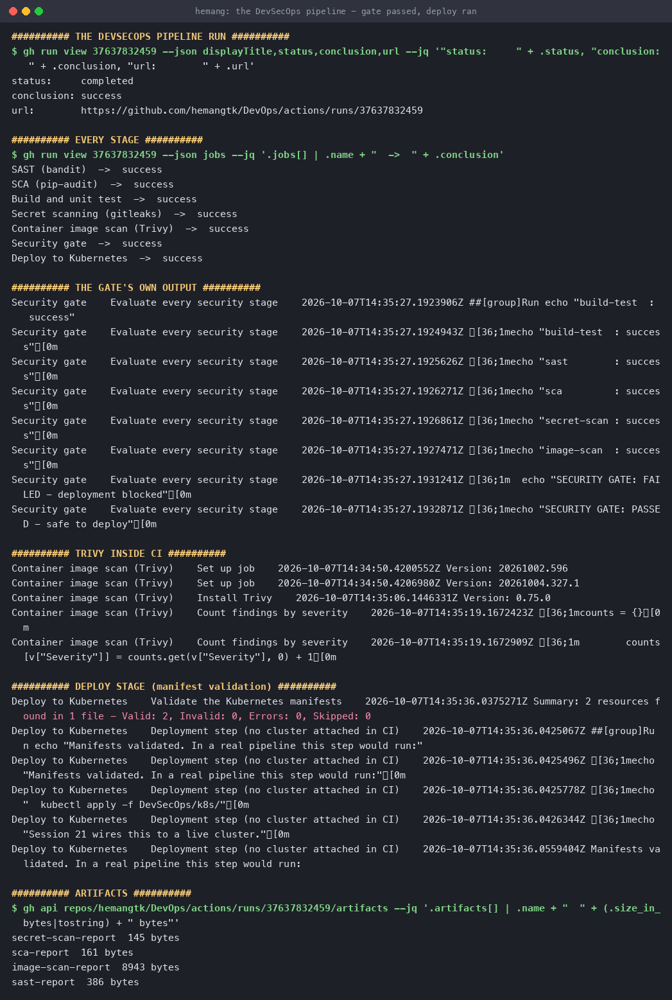
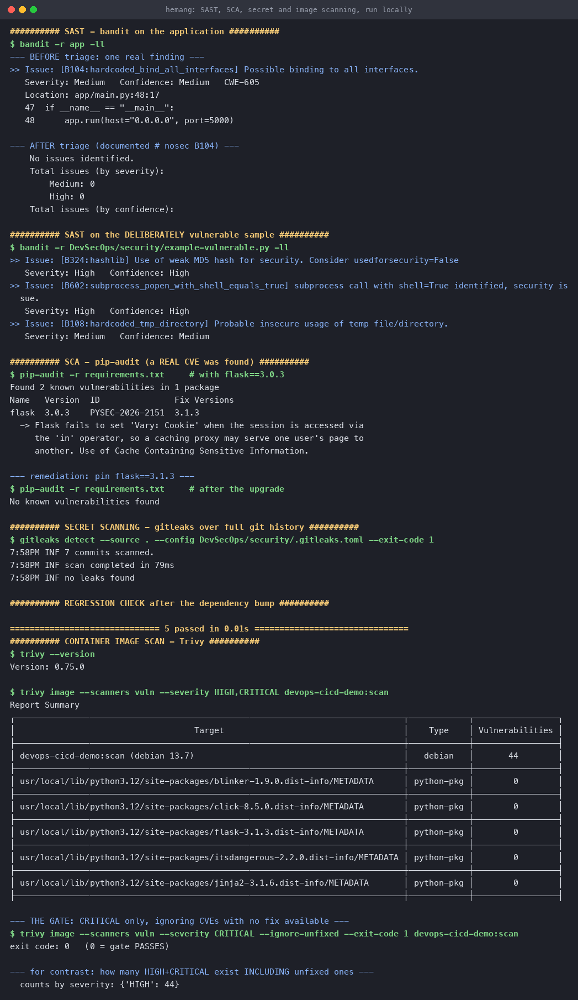

# Complete CI/CD and DevSecOps

**Name:** Hemang
**Enrollment number:** 24bcs10209

Session 17. The Session 16 pipeline with security built into it — four scanners, a gate that can
block a deploy, and hardened Kubernetes manifests.

**Live proof:** [run #37637832459](https://github.com/hemangtk/DevOps/actions/runs/37637832459) —
all 7 jobs green, gate passed, deploy ran.

Workflow: [`.github/workflows/devsecops.yml`](../.github/workflows/devsecops.yml)
· Manifests: [`k8s/`](k8s/) · Scanner config: [`security/`](security/)

---

## The pipeline

```text
  Code
   │
   ├──────────┬──────────┬──────────────┐
   ▼          ▼          ▼              ▼
Build+Test   SAST       SCA        Secret Scan        ← all in parallel
 (pytest)  (bandit)  (pip-audit)    (gitleaks)
   │          │          │              │
   ▼          │          │              │
Image Scan ───┤          │              │
  (Trivy)     │          │              │
   │          │          │              │
   └──────────┴────┬─────┴──────────────┘
                   ▼
            SECURITY GATE          ← every stage must be green
                   │
          ┌────────┴────────┐
          ▼                 ▼
   Push to GHCR      Deploy to Kubernetes   ← both skipped if the gate fails
  (SHA + latest)
```

| Stage | Tool | Looks for |
|---|---|---|
| **SAST** | bandit | Insecure patterns in **our own** source |
| **SCA** | pip-audit | Known CVEs in **third-party dependencies** |
| **Secret scanning** | gitleaks | Credentials committed to git, **across all history** |
| **Image scanning** | Trivy | CVEs in the **OS packages and libraries** inside the image |

Four scanners because they look at four different things. An app can be clean on all its own
code and still ship a base image with a critical libc bug.

---

## 1. SAST — bandit

It found a real issue on the first run:

```console
$ bandit -r app -ll
>> Issue: [B104:hardcoded_bind_all_interfaces] Possible binding to all interfaces.
   Severity: Medium   Confidence: Medium   CWE-605
   Location: app/main.py:48:17
   47  if __name__ == "__main__":
   48      app.run(host="0.0.0.0", port=5000)
```

**This is a false positive in context, and triaging it properly matters more than silencing it.**
A containerised process *must* bind `0.0.0.0` — binding `127.0.0.1` makes it unreachable through
the published port, which is exactly the mistake demonstrated in
[Docker Fundamentals](../Docker%20Fundamentals/#1-nodejs-app). Exposure here is controlled by
port publishing and NetworkPolicy, not by the bind address.

So it is suppressed **narrowly, with the reasoning written down**:

```python
if __name__ == "__main__":
    # bandit B104: binding to 0.0.0.0 is flagged as "all interfaces".
    # ACCEPTED, with justification: this process runs inside a container whose
    # only network namespace is its own. Binding 127.0.0.1 would make it
    # unreachable through the published port. Exposure is controlled by the
    # container's port publishing and by Kubernetes NetworkPolicy.
    app.run(host="0.0.0.0", port=5000)  # nosec B104
```

```console
$ bandit -r app -ll
	No issues identified.
```

The alternative — dropping to `-lll`, or removing the job — would have hidden *every* medium
finding, not just this one. **Suppress one finding, never a whole severity class.**

### What it looks like when there is something to find

[`security/example-vulnerable.py`](security/example-vulnerable.py) is deliberately insecure and
is **not** part of the app:

```console
$ bandit -r DevSecOps/security/example-vulnerable.py -ll
>> Issue: [B324:hashlib] Use of weak MD5 hash for security.
   Severity: High   Confidence: High
>> Issue: [B602:subprocess_popen_with_shell_equals_true] subprocess call with shell=True.
   Severity: High   Confidence: High
>> Issue: [B108:hardcoded_tmp_directory] Probable insecure usage of temp file/directory.
   Severity: Medium   Confidence: Medium
```

---

## 2. SCA — pip-audit, and a real CVE

This one was not a false positive:

```console
$ pip-audit -r requirements.txt          # with flask==3.0.3
Found 2 known vulnerabilities in 1 package
Name   Version  ID               Fix Versions
flask  3.0.3    PYSEC-2026-2151  3.1.3
```

> **PYSEC-2026-2151** — Flask fails to set the `Vary: Cookie` header when the session is accessed
> in ways that only touch keys (e.g. the `in` operator). Behind a caching proxy that doesn't
> ignore responses with cookies, one user's page can be served to another.
> *Use of Cache Containing Sensitive Information.*

**Remediation** — pin the fixed version:

```diff
- flask==3.0.3
+ flask==3.1.3
```

```console
$ pip-audit -r requirements.txt          # after the upgrade
No known vulnerabilities found

$ pytest -q
5 passed in 0.01s                        # no regression

$ curl -s http://localhost:5056/calc/add/2/3
{"a":2.0,"b":3.0,"op":"add","result":5.0}
```

A complete find → fix → verify cycle, and a good illustration of why SCA is separate from SAST:
**I didn't write the bug, and no amount of reviewing my own code would have found it.**

---

## 3. Secret scanning — gitleaks

Scans the **entire git history**, not just the working tree, because a secret removed in a later
commit is still in the objects:

```yaml
- uses: actions/checkout@v4
  with: { fetch-depth: 0 }      # full history
```

```console
$ gitleaks detect --source . --config DevSecOps/security/.gitleaks.toml --exit-code 1
INF 7 commits scanned.
INF scan completed in 79ms
INF no leaks found
```

### The allowlist problem

This repository *deliberately* contains fake credentials — the
[Secrets topic](../Kubernetes%20Ingress%20ConfigMaps%20and%20Secrets/#2-secret) exists to teach
that base64 is not encryption, and shows `UzNjcjN0UEBzcw==` decoding to a password. A scanner
that screams about teaching material gets ignored, and then it misses the real thing.

[`security/.gitleaks.toml`](security/.gitleaks.toml) allowlists those paths **and nothing else**:

```toml
[extend]
useDefault = true          # keep every built-in rule

[allowlist]
description = "Teaching material with deliberately fake credentials"
paths = [
  '''Kubernetes Ingress ConfigMaps and Secrets/.*''',
  '''DevSecOps/security/example-vulnerable\.py''',
]
```

> **A note on getting this wrong:** my first version used `[[allowlist]]` (a TOML array) and
> gitleaks rejected it — `'Allowlist' expected a map, got 'slice'`. Running the scanner locally
> caught that in seconds; in CI it would have been a red run.

---

## 4. Image scanning — Trivy

The app's own code can be perfect while the base image ships known CVEs:

```console
$ trivy image --scanners vuln --severity HIGH,CRITICAL devops-cicd-demo:scan
┌──────────────────────────────────────────┬────────────┬─────────────────┐
│                  Target                  │    Type    │ Vulnerabilities │
├──────────────────────────────────────────┼────────────┼─────────────────┤
│ devops-cicd-demo:scan (debian 13.7)      │   debian   │       44        │
│ .../flask-3.1.3.dist-info/METADATA       │ python-pkg │        0        │
│ .../jinja2-3.1.6.dist-info/METADATA      │ python-pkg │        0        │
└──────────────────────────────────────────┴────────────┴─────────────────┘

  counts by severity: {'HIGH': 44}
```

**44 HIGH findings — and the gate still passes.** That is deliberate:

```console
$ trivy image --scanners vuln --severity CRITICAL --ignore-unfixed --exit-code 1 devops-cicd-demo:scan
exit code: 0   (0 = gate PASSES)
```

| Flag | Why |
|---|---|
| `--severity CRITICAL` | Gating on HIGH would block every build forever on base-image noise |
| `--ignore-unfixed` | A CVE with **no patch available** cannot be acted on — blocking on it just teaches people to bypass the gate |
| `--exit-code 1` | This is what turns a report into a gate |

All 44 of those HIGH findings are in the Debian base layer with no fix available. The honest
response is to report them, track the base image, and gate on what is *actionable*.

---

## 5. The security gate

```yaml
security-gate:
  needs: [build-test, sast, sca, secret-scan, image-scan]
  if: always()
  steps:
    - run: |
        if [ "${{ needs.sast.result }}" != "success" ] || ... ; then
          echo "SECURITY GATE: FAILED - deployment blocked"
          exit 1
        fi
        echo "SECURITY GATE: PASSED - safe to deploy"

deploy:
  needs: [security-gate]        # cannot run unless the gate passed
```

`if: always()` makes the gate run even when an upstream job failed — otherwise it would be
*skipped* and `deploy` might slip through.

### Proof that the gate actually blocks

An earlier run of this pipeline failed, and the result is exactly what you want to see:

```console
Build and unit test          ->  success
SAST (bandit)                ->  success
SCA (pip-audit)              ->  success
Secret scanning (gitleaks)   ->  success
Container image scan (Trivy) ->  failure
Security gate                ->  failure
Deploy to Kubernetes         ->  skipped      <-- blocked
```

> **What actually broke, honestly:** not a CVE. I had pinned `aquasecurity/trivy-action@0.28.0`
> and the action's tags are `v`-prefixed — `Unable to resolve action ... unable to find version
> 0.28.0`. After fixing the tag it failed *again* inside the action's own first step despite
> `exit-code: 0`, so I stopped debugging a third-party action's input schema and installed the
> Trivy binary directly in a shell step. That is the version in the repo now, and it matches
> what I had already verified locally.
>
> The accidental lesson is a good one: **a broken scanner fails closed.** The gate blocked the
> deploy because a security stage did not report success — it never had to decide whether the
> image was safe.

### The passing run

```console
$ gh run view 37637832459
status:     completed
conclusion: success

SAST (bandit)                ->  success
SCA (pip-audit)              ->  success
Build and unit test          ->  success
Secret scanning (gitleaks)   ->  success
Container image scan (Trivy) ->  success
Security gate                ->  success
Deploy to Kubernetes         ->  success
```

Artifacts kept from the run:

```console
sast-report          386 bytes
sca-report           161 bytes
secret-scan-report   145 bytes
image-scan-report    8943 bytes
```



---

## 6. Push to the registry — after the gate, never before

```yaml
push-image:
  name: Push to the container registry
  needs: [security-gate]        # the image cannot leave CI unless the gate passed
  if: github.event_name == 'push' && github.ref == 'refs/heads/main'
```

**`needs: [security-gate]` is the entire security control.** A scanned-but-unpushed image is
harmless; the moment it reaches a registry, anything with pull access can run it. So the push is
downstream of the gate, and the `if:` keeps pull-request builds — which are untrusted code —
from publishing anything at all.

Authentication uses no stored password:

```yaml
permissions:
  packages: write               # scopes the per-run GITHUB_TOKEN

- run: echo "${{ secrets.GITHUB_TOKEN }}" | docker login ghcr.io -u ${{ github.actor }} --password-stdin
```

`GITHUB_TOKEN` is minted for the run and expires with it. Compare that with a long-lived
`REGISTRY_PASSWORD` in repository secrets, which is valid until somebody remembers to rotate it.

### Tagging

```bash
REPO=ghcr.io/hemangtk/devops-cicd-demo
SHA=${GITHUB_SHA::12}
docker build -t "$REPO:$SHA" -t "$REPO:latest" .
```

Two tags, and the `:$SHA` one is the one that matters. **`latest` is a moving pointer** — it says
nothing about what is actually running, so "we deployed latest" is unanswerable at 3am. The
commit SHA tag makes a running container traceable to the exact source that built it, which is
also what makes a rollback a specific tag rather than a guess.

---

## 7. Deploy stage

```console
$ kubeconform -strict -summary DevSecOps/k8s/
Summary: 2 resources found in 1 file - Valid: 2, Invalid: 0, Errors: 0, Skipped: 0
```

The manifests are schema-validated in CI. The actual `kubectl apply` is stubbed here because no
cluster is attached to the runner — **Session 21 wires this to a live cluster.** In production
the runner would reach the cluster with a `KUBECONFIG` secret or, better, OIDC.

### Hardened manifests

[`k8s/deployment.yaml`](k8s/deployment.yaml) applies the container-security basics:

```yaml
securityContext:              # pod level
  runAsNonRoot: true
  runAsUser: 10001
  seccompProfile: { type: RuntimeDefault }
containers:
  - securityContext:          # container level
      allowPrivilegeEscalation: false
      readOnlyRootFilesystem: true
      capabilities:
        drop: ["ALL"]
```

| Setting | What it prevents |
|---|---|
| `runAsNonRoot` | A container escape landing as root on the node |
| `readOnlyRootFilesystem` | An attacker writing a binary into the container |
| `drop: ["ALL"]` | Using Linux capabilities to escalate |
| `allowPrivilegeEscalation: false` | `setuid` binaries gaining privileges |
| `seccompProfile: RuntimeDefault` | Dangerous syscalls |

`readOnlyRootFilesystem: true` needs a writable `emptyDir` at `/tmp`, which the manifest mounts —
that is the usual catch when enabling it.



---

## 8. Reproduce

```bash
cd "CICD and GitHub Actions"
pip install bandit pip-audit

bandit -r app -ll                          # SAST
pip-audit -r requirements.txt --desc       # SCA

cd ../..
gitleaks detect --source . --config DevSecOps/security/.gitleaks.toml --exit-code 1

docker build -t devops-cicd-demo:scan "CICD and GitHub Actions"
trivy image --scanners vuln --severity HIGH,CRITICAL devops-cicd-demo:scan
trivy image --scanners vuln --severity CRITICAL --ignore-unfixed --exit-code 1 devops-cicd-demo:scan

kubeconform -strict -summary DevSecOps/k8s/
```

---

## 9. What I took away

1. **Four scanners, four blind spots.** SAST reads your code, SCA reads your dependencies,
   gitleaks reads your history, Trivy reads your image. Only SCA would have found the Flask CVE.
2. **Triage beats suppression.** The bandit B104 finding was a genuine false positive — the fix
   was a narrow `# nosec` with written justification, not lowering the severity threshold.
3. **Gate on what is actionable.** 44 HIGH CVEs with no available fix are information; a fixable
   CRITICAL is a decision. `--ignore-unfixed` is what stops a gate becoming theatre people route
   around.
4. **Scanners fail closed.** A broken Trivy step blocked the deploy just as effectively as a real
   vulnerability would have — which is the correct default.
5. **Allowlist by path, never by disabling rules.** Teaching material is excluded; the real source
   tree is still fully scanned.
6. **Run scanners locally first.** The gitleaks TOML schema error and the bandit finding were both
   caught before any push.
