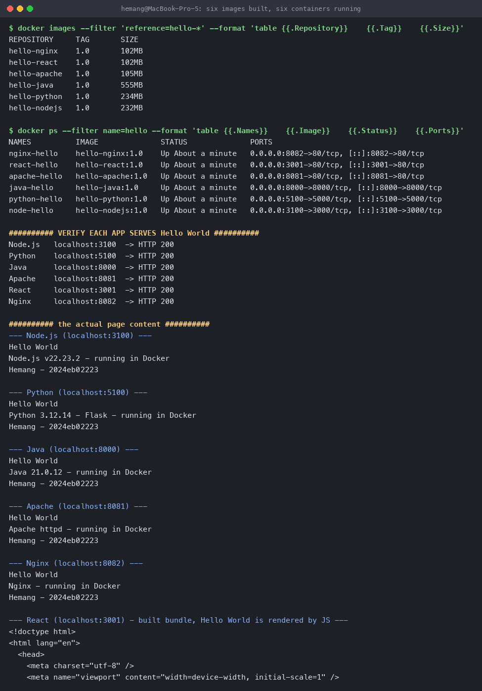

# Docker Fundamentals — six Hello World applications

**Name:** Hemang
**Enrollment number:** 24bcs10209

Six separate Hello World web applications, each with its own folder, its own application code
and its own Dockerfile. All six were built, run, and verified in a browser.

```
Docker Fundamentals/
├── nodejs-app/     app.js, package.json, Dockerfile, .dockerignore
├── python-app/     app.py, requirements.txt, Dockerfile
├── java-app/       Main.java, Dockerfile
├── Apache-app/     index.html, Dockerfile
├── React-app/      src/, index.html, vite.config.js, package.json, Dockerfile
└── nginx-app/      index.html, Dockerfile
```

## Summary

| App | Base image | Image name | Container port | Host port | Image size | Verified |
|---|---|---|---|---|---|---|
| Node.js | `node:22-alpine` | `hello-nodejs:1.0` | 3000 | **3100** | 232 MB | HTTP 200 |
| Python | `python:3.12-slim` | `hello-python:1.0` | 5000 | **5100** | 234 MB | HTTP 200 |
| Java | `eclipse-temurin:21-jdk-alpine` | `hello-java:1.0` | 8000 | **8000** | 555 MB | HTTP 200 |
| Apache | `httpd:2.4-alpine` | `hello-apache:1.0` | 80 | **8081** | 105 MB | HTTP 200 |
| React | `node:22-alpine` → `nginx:alpine` | `hello-react:1.0` | 80 | **3001** | 102 MB | HTTP 200 |
| Nginx | `nginx:alpine` | `hello-nginx:1.0` | 80 | **8082** | 102 MB | HTTP 200 |

> Node and Python are mapped to host ports 3100 and 5100 because 3000 and 5000 were already
> taken on this machine. The container-side ports are the conventional 3000 and 5000.

---

## 1. `nodejs-app`

A plain Node HTTP server — no framework, so there is nothing to install but the runtime.

**`app.js`** (abridged)

```js
const http = require('http');
const PORT = process.env.PORT || 3000;

const page = `<!doctype html><html>...<h1>Hello World</h1>
<p>Node.js ${process.version} &middot; running in Docker</p>
<p>Hemang &middot; 24bcs10209</p>...</html>`;

const server = http.createServer((req, res) => {
  res.writeHead(200, { 'Content-Type': 'text/html; charset=utf-8' });
  res.end(page);
});

server.listen(PORT, '0.0.0.0', () => {
  console.log(`Node.js app listening on http://0.0.0.0:${PORT}`);
});
```

**`Dockerfile`**

```dockerfile
FROM node:22-alpine
WORKDIR /app

# Copy the manifest first so this layer is cached and only re-runs
# when dependencies actually change.
COPY package.json ./
RUN npm install --omit=dev

COPY app.js ./

EXPOSE 3000
CMD ["node", "app.js"]
```

```bash
docker build -t hello-nodejs:1.0 nodejs-app
docker run -d --name node-hello -p 3100:3000 hello-nodejs:1.0
```


Binding to `0.0.0.0` rather than `localhost` matters here: a server listening on `127.0.0.1`
inside a container is unreachable from the host no matter how you publish the port.

---

## 2. `python-app`

Flask, so this one actually has a dependency to install.

**`app.py`** (abridged)

```python
import sys
from flask import Flask

app = Flask(__name__)

@app.route("/")
def hello():
    return PAGE.format(version=sys.version.split()[0])

if __name__ == "__main__":
    app.run(host="0.0.0.0", port=5000)
```

**`Dockerfile`**

```dockerfile
FROM python:3.12-slim
WORKDIR /app

COPY requirements.txt ./
RUN pip install --no-cache-dir -r requirements.txt

COPY app.py ./

EXPOSE 5000
CMD ["python", "app.py"]
```

```bash
docker build -t hello-python:1.0 python-app
docker run -d --name python-hello -p 5100:5000 hello-python:1.0
```


`--no-cache-dir` keeps pip's download cache out of the image layer; `-slim` is the small
Debian variant, about a quarter the size of the full `python:3.12`.

---

## 3. `java-app`

Java's built-in `com.sun.net.httpserver`, so no Maven, Gradle or framework is needed.

**`Main.java`** (abridged)

```java
public class Main {
    public static void main(String[] args) throws Exception {
        HttpServer server = HttpServer.create(new InetSocketAddress("0.0.0.0", 8000), 0);
        server.createContext("/", exchange -> {
            byte[] body = page.getBytes(StandardCharsets.UTF_8);
            exchange.getResponseHeaders().set("Content-Type", "text/html; charset=utf-8");
            exchange.sendResponseHeaders(200, body.length);
            try (OutputStream os = exchange.getResponseBody()) { os.write(body); }
        });
        server.start();
    }
}
```

**`Dockerfile`**

```dockerfile
FROM eclipse-temurin:21-jdk-alpine
WORKDIR /app
COPY Main.java ./

# Compile at build time so the container starts straight into the app.
RUN javac Main.java

EXPOSE 8000
CMD ["java", "Main"]
```

```bash
docker build -t hello-java:1.0 java-app
docker run -d --name java-hello -p 8000:8000 hello-java:1.0
```


At **555 MB** this is by far the largest image, because it ships a whole JDK to run one class.
Compiling in one stage and copying only the `.class` files into a `jre-alpine` stage is exactly
the problem the multi-stage build in the next topic solves.

---

## 4. `Apache-app`

No application code at all — Apache just serves a document root.

**`Dockerfile`**

```dockerfile
FROM httpd:2.4-alpine

# httpd's document root inside this image
COPY index.html /usr/local/apache2/htdocs/index.html

EXPOSE 80
CMD ["httpd-foreground"]
```

```bash
docker build -t hello-apache:1.0 Apache-app
docker run -d --name apache-hello -p 8081:80 hello-apache:1.0
```


The document root is `/usr/local/apache2/htdocs` for the official `httpd` image — different
from nginx's `/usr/share/nginx/html`, which is an easy thing to get wrong. `httpd-foreground`
keeps the server in the foreground; a daemonised process would exit immediately and take the
container with it.

---

## 5. `React-app`

A real Vite + React build, with a **multi-stage** Dockerfile.

**`src/App.jsx`** (abridged)

```jsx
export default function App() {
  return (
    <div style={styles.page}>
      <h1 style={styles.h1}>Hello World</h1>
      <p>React {React.version} &middot; built with Vite &middot; served by Nginx in Docker</p>
      <p>Hemang &middot; 24bcs10209</p>
    </div>
  )
}
```

**`Dockerfile`**

```dockerfile
# ---------- stage 1: build ----------
FROM node:22-alpine AS build
WORKDIR /app

COPY package.json ./
RUN npm install

COPY vite.config.js index.html ./
COPY src ./src
RUN npm run build          # produces /app/dist

# ---------- stage 2: serve ----------
FROM nginx:alpine
COPY --from=build /app/dist /usr/share/nginx/html

EXPOSE 80
CMD ["nginx", "-g", "daemon off;"]
```

```bash
docker build -t hello-react:1.0 React-app
docker run -d --name react-hello -p 3001:80 hello-react:1.0
```


Stage 1 needs Node and `node_modules` to compile JSX; stage 2 needs neither, because the output
is plain static files. Only `/app/dist` crosses the `COPY --from=build` line, so the finished
image is **102 MB** instead of the ~450 MB it would be if the toolchain shipped with it — the
same size as the plain nginx app.

Because React renders in the browser, `curl` on the root URL returns only the HTML shell. The
text lives in the bundle, which is what the browser executes:

```console
$ curl -s http://localhost:3001 | head -c 200
<!doctype html>
<html lang="en">
  <head>
    <title>React in Docker</title>
    <script type="module" crossorigin src="/assets/index-Cl4pFuU5.js"></script>
  </head>
  <body><div id="root"></div></body>
</html>

$ curl -s http://localhost:3001/assets/index-Cl4pFuU5.js | grep -o 'Hello World'
Hello World
```

The screenshot above is the rendered result.

---

## 6. `nginx-app`

The simplest of the six: swap nginx's welcome page for ours.

**`Dockerfile`**

```dockerfile
FROM nginx:alpine

# Replace the default nginx welcome page with ours.
COPY index.html /usr/share/nginx/html/index.html

EXPOSE 80
CMD ["nginx", "-g", "daemon off;"]
```

```bash
docker build -t hello-nginx:1.0 nginx-app
docker run -d --name nginx-hello -p 8082:80 hello-nginx:1.0
```


`daemon off;` is the nginx equivalent of `httpd-foreground` — it stops nginx backgrounding
itself so it stays PID 1 in the container.

---

## Build and run everything

```bash
docker build -t hello-nodejs:1.0 nodejs-app
docker build -t hello-python:1.0 python-app
docker build -t hello-java:1.0   java-app
docker build -t hello-apache:1.0 Apache-app
docker build -t hello-react:1.0  React-app
docker build -t hello-nginx:1.0  nginx-app

docker run -d --name node-hello   -p 3100:3000 hello-nodejs:1.0
docker run -d --name python-hello -p 5100:5000 hello-python:1.0
docker run -d --name java-hello   -p 8000:8000 hello-java:1.0
docker run -d --name apache-hello -p 8081:80   hello-apache:1.0
docker run -d --name react-hello  -p 3001:80   hello-react:1.0
docker run -d --name nginx-hello  -p 8082:80   hello-nginx:1.0
```

### All six images

```console
$ docker images --filter 'reference=hello-*' --format 'table {{.Repository}}\t{{.Tag}}\t{{.Size}}'
REPOSITORY     TAG       SIZE
hello-nginx    1.0       102MB
hello-react    1.0       102MB
hello-apache   1.0       105MB
hello-java     1.0       555MB
hello-python   1.0       234MB
hello-nodejs   1.0       232MB
```

### All six containers running

```console
$ docker ps --filter name=hello --format 'table {{.Names}}\t{{.Image}}\t{{.Status}}\t{{.Ports}}'
NAMES          IMAGE              STATUS              PORTS
nginx-hello    hello-nginx:1.0    Up About a minute   0.0.0.0:8082->80/tcp, [::]:8082->80/tcp
react-hello    hello-react:1.0    Up About a minute   0.0.0.0:3001->80/tcp, [::]:3001->80/tcp
apache-hello   hello-apache:1.0   Up About a minute   0.0.0.0:8081->80/tcp, [::]:8081->80/tcp
java-hello     hello-java:1.0     Up About a minute   0.0.0.0:8000->8000/tcp, [::]:8000->8000/tcp
python-hello   hello-python:1.0   Up About a minute   0.0.0.0:5100->5000/tcp, [::]:5100->5000/tcp
node-hello     hello-nodejs:1.0   Up About a minute   0.0.0.0:3100->3000/tcp, [::]:3100->3000/tcp
```

### Every app answers

```console
Node.js   localhost:3100  -> HTTP 200
Python    localhost:5100  -> HTTP 200
Java      localhost:8000  -> HTTP 200
Apache    localhost:8081  -> HTTP 200
React     localhost:3001  -> HTTP 200
Nginx     localhost:8082  -> HTTP 200
```

And the page content each one serves:

```console
--- Node.js (localhost:3100) ---     --- Apache (localhost:8081) ---
Hello World                          Hello World
Node.js v22.23.2 - running in Docker Apache httpd - running in Docker
Hemang - 24bcs10209                 Hemang - 24bcs10209

--- Python (localhost:5100) ---      --- Nginx (localhost:8082) ---
Hello World                          Hello World
Python 3.12.14 - Flask - in Docker   Nginx - running in Docker
Hemang - 24bcs10209                 Hemang - 24bcs10209

--- Java (localhost:8000) ---
Hello World
Java 21.0.12 - running in Docker
Hemang - 24bcs10209
```



### Clean up

```bash
docker rm -f node-hello python-hello java-hello apache-hello react-hello nginx-hello
```

---

## What I took away from building all six

1. **Interpreted vs compiled vs static.** Node and Python copy source and run it. Java compiles
   at build time. Apache and Nginx run no application code at all — they only need files in the
   right directory. React sits in between: it compiles at build time but *serves* as static
   files, which is why it fits the multi-stage pattern so naturally.
2. **Layer order is the main performance lever.** Copying `package.json`/`requirements.txt` and
   installing *before* copying source means editing the source doesn't re-run the install; the
   dependency layer stays cached.
3. **Image size follows the base image.** Alpine bases land near 100 MB, `-slim` near 230 MB,
   and a full JDK at 555 MB. Picking the base image is most of the size decision.
4. **The process must stay in the foreground.** `httpd-foreground` and `daemon off;` exist
   because a container lives exactly as long as its PID 1.
5. **`EXPOSE` documents, `-p` publishes.** `EXPOSE 3000` alone makes nothing reachable —
   `-p 3100:3000` is what actually maps a host port to the container.
