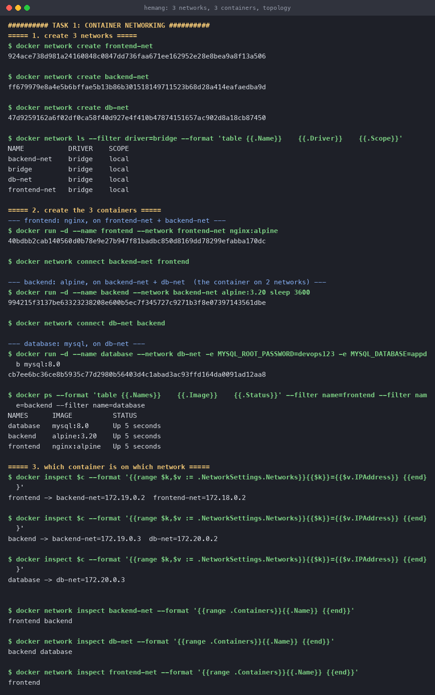
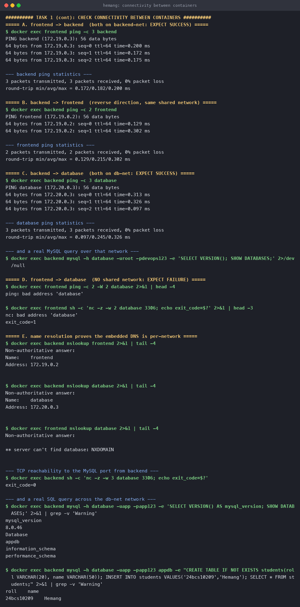
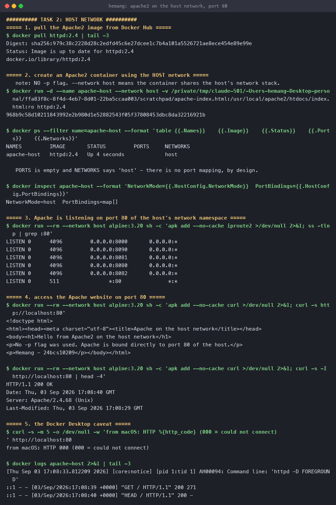
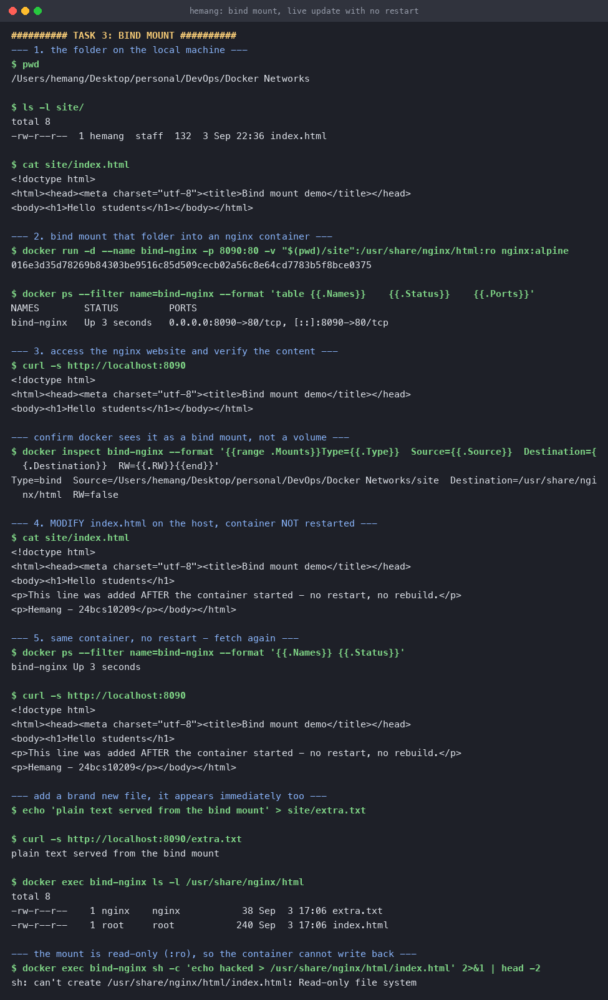
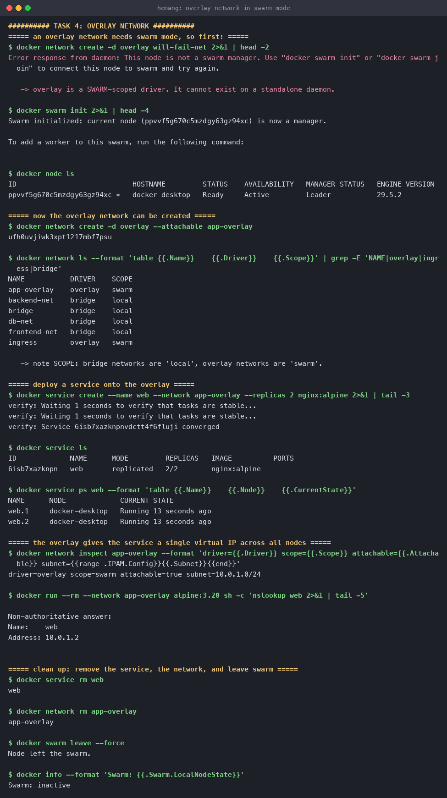
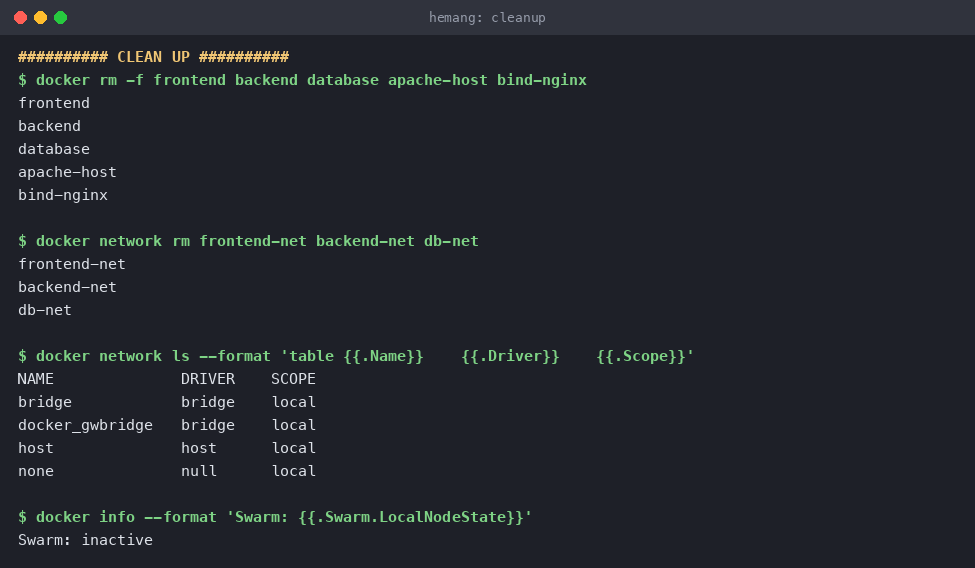

# Docker Networking and Volumes

**Name:** Hemang
**Enrollment number:** 24bcs10209

| Task | What it covers |
|---|---|
| [Task 1](#task-1--container-networking) | 3 containers, 3 networks, backend on 2 of them, connectivity |
| [Task 2](#task-2--host-network) | Apache2 on the host network, port 80 |
| [Task 3](#task-3--bind-mount) | Bind mount an nginx document root, live edits |
| [Task 4](#task-4--overlay-network) | Overlay networks, use cases, multi-host behaviour |

---

## Task 1 — Container networking

### Topology

Three networks and three containers, wired as a standard three-tier application. The
**backend** sits on **two** networks, which is what lets it talk to both sides while keeping
the frontend away from the database.

```
   frontend-net            backend-net              db-net
  ┌────────────┐        ┌──────────────┐        ┌─────────────┐
  │  frontend  │────────│   frontend   │        │             │
  │  (nginx)   │        │   backend    │────────│   backend   │
  └────────────┘        └──────────────┘        │  database   │
                                                │  (mysql)    │
                                                └─────────────┘

  frontend  -> frontend-net, backend-net
  backend   -> backend-net, db-net        <- on 2 networks
  database  -> db-net
```

The point of the layout: `frontend` and `backend` share `backend-net`, and `backend` and
`database` share `db-net`, but **`frontend` and `database` share nothing** — so the database is
unreachable from the frontend without any firewall rules at all.

### Create the networks

```console
$ docker network create frontend-net
$ docker network create backend-net
$ docker network create db-net

$ docker network ls --filter driver=bridge --format 'table {{.Name}}\t{{.Driver}}\t{{.Scope}}'
NAME           DRIVER    SCOPE
backend-net    bridge    local
db-net         bridge    local
frontend-net   bridge    local
```

### Create the containers

```console
# frontend: nginx, on frontend-net then also connected to backend-net
$ docker run -d --name frontend --network frontend-net nginx:alpine
$ docker network connect backend-net frontend

# backend: alpine, on backend-net then also connected to db-net  <- 2 networks
$ docker run -d --name backend --network backend-net alpine:3.20 sleep 3600
$ docker network connect db-net backend

# database: mysql, on db-net
$ docker run -d --name database --network db-net \
    -e MYSQL_ROOT_PASSWORD=devops123 -e MYSQL_DATABASE=appdb mysql:8.0

$ docker ps --format 'table {{.Names}}\t{{.Image}}\t{{.Status}}'
NAMES      IMAGE          STATUS
database   mysql:8.0      Up 5 seconds
backend    alpine:3.20    Up 5 seconds
frontend   nginx:alpine   Up 5 seconds
```

A container can only be given one network with `docker run`. Additional networks are attached
afterwards with `docker network connect`, and the container gets **a separate IP address on
each**.

### Who is on which network

```console
frontend -> backend-net=172.19.0.2   frontend-net=172.18.0.2
backend  -> backend-net=172.19.0.3   db-net=172.20.0.2
database -> db-net=172.20.0.3

$ docker network inspect backend-net  --format '{{range .Containers}}{{.Name}} {{end}}'
frontend backend

$ docker network inspect db-net       --format '{{range .Containers}}{{.Name}} {{end}}'
backend database

$ docker network inspect frontend-net --format '{{range .Containers}}{{.Name}} {{end}}'
frontend
```

Each network is its own subnet — `172.18.x`, `172.19.x`, `172.20.x` — and `backend` genuinely
holds two addresses, one per network.



### Check connectivity

**A. frontend → backend** — they share `backend-net`:

```console
$ docker exec frontend ping -c 3 backend
PING backend (172.19.0.3): 56 data bytes
64 bytes from 172.19.0.3: seq=0 ttl=64 time=0.200 ms
64 bytes from 172.19.0.3: seq=1 ttl=64 time=0.172 ms
64 bytes from 172.19.0.3: seq=2 ttl=64 time=0.175 ms

--- backend ping statistics ---
3 packets transmitted, 3 packets received, 0% packet loss
```

**B. backend → frontend** — same link, other direction:

```console
$ docker exec backend ping -c 2 frontend
PING frontend (172.19.0.2): 56 data bytes
64 bytes from 172.19.0.2: seq=0 ttl=64 time=0.129 ms
2 packets transmitted, 2 packets received, 0% packet loss
```

**C. backend → database** — they share `db-net`:

```console
$ docker exec backend ping -c 3 database
PING database (172.20.0.3): 56 data bytes
64 bytes from 172.20.0.3: seq=0 ttl=64 time=0.313 ms
3 packets transmitted, 3 packets received, 0% packet loss

$ docker exec backend sh -c 'nc -z -w 3 database 3306; echo exit_code=$?'
exit_code=0
```

And a real query all the way across the network, not just a ping:

```console
$ docker exec backend mysql -h database -uapp -papp123 -e 'SELECT VERSION(); SHOW DATABASES;'
mysql_version
8.0.46
Database
appdb
information_schema
performance_schema

$ docker exec backend mysql -h database -uapp -papp123 appdb -e \
    "CREATE TABLE IF NOT EXISTS students(roll VARCHAR(20), name VARCHAR(50));
     INSERT INTO students VALUES('24bcs10209','Hemang');
     SELECT * FROM students;"
roll         name
24bcs10209   Hemang
```

**D. frontend → database** — no shared network, so this must fail:

```console
$ docker exec frontend ping -c 2 -W 2 database
ping: bad address 'database'

$ docker exec frontend sh -c 'nc -z -w 2 database 3306; echo exit_code=$?'
nc: bad address 'database'
exit_code=1
```

**E. name resolution is per-network**, which is what makes the above happen:

```console
$ docker exec backend nslookup frontend
Name:	frontend
Address: 172.19.0.2

$ docker exec backend nslookup database
Name:	database
Address: 172.20.0.3

$ docker exec frontend nslookup database
** server can't find database: NXDOMAIN
```



### What I understood

- **User-defined bridge networks give you DNS for free.** Containers resolve each other by
  **container name** — `ping backend` works with no IP or `--link` anywhere. The default
  `bridge` network does *not* do this; it is one of the main reasons to always create your own.
- **Isolation is the default, not something you configure.** `frontend` cannot reach
  `database` because Docker's embedded DNS only answers for containers on a *shared* network.
  The failure is `bad address` / `NXDOMAIN` — the name does not resolve at all, so the packet
  is never even sent.
- **Multi-homing is how you bridge tiers deliberately.** Putting `backend` on two networks is
  an explicit decision to let it be the only path from the frontend to the data. This is the
  container-level equivalent of a DMZ.
- **One IP per network.** `backend` has `172.19.0.3` and `172.20.0.2`; which one it uses
  depends on which network the destination is on.

---

## Task 2 — Host network

With `--network host` the container does **not** get its own network namespace. It shares the
host's stack directly, so there is no NAT, no virtual ethernet pair and **no `-p` flag** — the
process binds host ports itself.

```console
$ docker pull httpd:2.4

$ docker run -d --name apache-host --network host \
    -v $(pwd)/apache-index.html:/usr/local/apache2/htdocs/index.html:ro httpd:2.4

$ docker ps --filter name=apache-host --format 'table {{.Names}}\t{{.Image}}\t{{.Status}}\t{{.Ports}}\t{{.Networks}}'
NAMES         IMAGE       STATUS         PORTS     NETWORKS
apache-host   httpd:2.4   Up 4 seconds             host

$ docker inspect apache-host --format 'NetworkMode={{.HostConfig.NetworkMode}}  PortBindings={{.HostConfig.PortBindings}}'
NetworkMode=host  PortBindings=map[]
```

The `PORTS` column is **empty** and `PortBindings` is an empty map, yet the server is reachable
— because there is nothing to map. Apache is listening on port 80 of the host itself:

```console
$ ss -tlnp | grep :80
LISTEN 0      4096         0.0.0.0:8000       0.0.0.0:*
LISTEN 0      4096         0.0.0.0:8090       0.0.0.0:*
LISTEN 0      4096         0.0.0.0:8081       0.0.0.0:*
LISTEN 0      4096         0.0.0.0:8080       0.0.0.0:*
LISTEN 0      4096         0.0.0.0:8082       0.0.0.0:*
LISTEN 0      511                *:80               *:*
```

That listing is itself the proof: `*:80` is our Apache, and the 8080/8081/8082/8090 entries are
the *other* containers' published ports — all visible in one namespace, because a host-network
container sees the host's sockets.

Accessing the site on port 80:

```console
$ curl -s http://localhost:80
<!doctype html>
<html><head><meta charset="utf-8"><title>Apache on the host network</title></head>
<body><h1>Hello from Apache2 on the host network</h1>
<p>No -p flag was used. Apache is bound directly to port 80 of the host.</p>
<p>Hemang - 24bcs10209</p></body></html>

$ curl -s -I http://localhost:80 | head -4
HTTP/1.1 200 OK
Date: Thu, 03 Sep 2026 17:08:40 GMT
Server: Apache/2.4.68 (Unix)
Last-Modified: Thu, 03 Sep 2026 17:08:29 GMT

$ docker logs apache-host | tail -2
::1 - - [03/Sep/2026:17:08:39 +0000] "GET / HTTP/1.1" 200 271
::1 - - [03/Sep/2026:17:08:40 +0000] "HEAD / HTTP/1.1" 200 -
```

Apache's own access log confirms it served both requests with `200`.



### An honest note about Docker Desktop on macOS

This was run on Docker Desktop for Mac, where the Docker daemon lives inside a Linux VM. So
"the host" that `--network host` joins is **the VM, not macOS**:

```console
$ curl -s -m 5 -o /dev/null -w 'from macOS: HTTP %{http_code}\n' http://localhost:80
from macOS: HTTP 000     # 000 = could not connect
```

The two `curl` results above were therefore run from inside that host network namespace
(`docker run --rm --network host alpine ... curl localhost:80`), which is the host Apache is
actually bound to. On native Linux, `curl http://localhost:80` from the terminal returns the
page directly. Docker Desktop also ships an opt-in "host networking" setting that forwards it
through to macOS.

### What I understood

- **Host mode trades isolation for speed.** No NAT layer and no bridge means slightly lower
  latency and no port-mapping bookkeeping, which is why it suits high-throughput or
  packet-capture workloads.
- **The cost is real.** Port conflicts become possible — two host-network containers both
  wanting port 80 cannot coexist, and neither can one of them and a host process. You also lose
  container-name DNS, because there is no user-defined network to provide it.
- **`-p` is meaningless in host mode.** Docker ignores it; the container binds host ports
  directly.
- **Linux only.** On macOS and Windows the daemon runs in a VM, so `host` refers to that VM.

---

## Task 3 — Bind mount

A bind mount maps a directory **on the host** straight into the container. Unlike a named
volume, there is no copy — the container reads the host's actual files, so edits are visible
immediately.

### 1. The folder on the local machine

```console
$ ls -l site/
-rw-r--r--  1 hemang  staff  132  3 Sep 22:36 index.html

$ cat site/index.html
<!doctype html>
<html><head><meta charset="utf-8"><title>Bind mount demo</title></head>
<body><h1>Hello students</h1></body></html>
```

### 2. Bind mount it into an nginx container

```console
$ docker run -d --name bind-nginx -p 8090:80 \
    -v "$(pwd)/site":/usr/share/nginx/html:ro nginx:alpine

$ docker ps --filter name=bind-nginx --format 'table {{.Names}}\t{{.Status}}\t{{.Ports}}'
NAMES        STATUS         PORTS
bind-nginx   Up 3 seconds   0.0.0.0:8090->80/tcp, [::]:8090->80/tcp

$ docker inspect bind-nginx --format '{{range .Mounts}}Type={{.Type}} Source={{.Source}} Destination={{.Destination}} RW={{.RW}}{{end}}'
Type=bind  Source=/Users/hemang/Desktop/personal/DevOps/Docker Networks/site
Destination=/usr/share/nginx/html  RW=false
```

`Type=bind` (not `volume`) confirms which kind of mount this is.

### 3. Access the site

```console
$ curl -s http://localhost:8090
<!doctype html>
<html><head><meta charset="utf-8"><title>Bind mount demo</title></head>
<body><h1>Hello students</h1></body></html>
```

**Hello students** is served, as required.

### 4. Modify `index.html` — no restart

The file is edited on the host while the container keeps running:

```console
$ cat site/index.html
<!doctype html>
<html><head><meta charset="utf-8"><title>Bind mount demo</title></head>
<body><h1>Hello students</h1>
<p>This line was added AFTER the container started - no restart, no rebuild.</p>
<p>Hemang - 24bcs10209</p></body></html>
```

### 5. Verify the change is live

```console
$ docker ps --filter name=bind-nginx --format '{{.Names}} {{.Status}}'
bind-nginx Up 3 seconds          <- same container, never restarted

$ curl -s http://localhost:8090
<!doctype html>
<html><head><meta charset="utf-8"><title>Bind mount demo</title></head>
<body><h1>Hello students</h1>
<p>This line was added AFTER the container started - no restart, no rebuild.</p>
<p>Hemang - 24bcs10209</p></body></html>
```

The new content is served with **no restart and no rebuild**. Entirely new files appear too:

```console
$ echo 'plain text served from the bind mount' > site/extra.txt

$ curl -s http://localhost:8090/extra.txt
plain text served from the bind mount

$ docker exec bind-nginx ls -l /usr/share/nginx/html
-rw-r--r--    1 nginx    nginx           38 Sep  3 17:06 extra.txt
-rw-r--r--    1 root     root           240 Sep  3 17:06 index.html
```

And because the mount was made `:ro`, the traffic is one-way:

```console
$ docker exec bind-nginx sh -c 'echo hacked > /usr/share/nginx/html/index.html'
sh: can't create /usr/share/nginx/html/index.html: Read-only file system
```



### What I understood

- **This is what makes local development with containers usable.** Editing a file on the host
  and refreshing the browser needs no rebuild, because the container was never given a copy in
  the first place.
- **Bind mount vs named volume.** A bind mount points at a host path you control and is ideal
  for source code and config. A named volume is managed by Docker in its own storage area, is
  portable between machines, and is the right choice for database data.
- **A bind mount shadows whatever was already at that path.** nginx's default welcome page is
  still inside the image; it is just hidden while the mount is in place.
- **`:ro` is worth adding by default** for anything the container only needs to read — the
  container serves the files but cannot alter them.

---

## Task 4 — Overlay network

### What it is

`bridge` connects containers on **one** Docker host. `overlay` connects containers across
**many** hosts, making a group of separate machines look like one flat network. Docker does
this by encapsulating container traffic in **VXLAN** packets (UDP 4789) and sending them over
the physical network between nodes.

### It requires swarm mode

```console
$ docker network create -d overlay will-fail-net
Error response from daemon: This node is not a swarm manager. Use "docker swarm init" or
"docker swarm join" to connect this node to swarm and try again.
```

That error is the lesson: `overlay` is a **swarm-scoped** driver. It needs a cluster-wide
key-value store to keep every node's view of the network in sync, which swarm mode provides.

```console
$ docker swarm init
Swarm initialized: current node (ppvvf5g670c5mzdgy63gz94xc) is now a manager.

$ docker node ls
ID                            HOSTNAME         STATUS    AVAILABILITY   MANAGER STATUS   ENGINE VERSION
ppvvf5g670c5mzdgy63gz94xc *   docker-desktop   Ready     Active         Leader           29.5.2

$ docker network create -d overlay --attachable app-overlay
ufh0uvjiwk3xpt1217mbf7psu

$ docker network ls --format 'table {{.Name}}\t{{.Driver}}\t{{.Scope}}'
NAME           DRIVER    SCOPE
app-overlay    overlay   swarm
backend-net    bridge    local
db-net         bridge    local
frontend-net   bridge    local
ingress        overlay   swarm
```

The `SCOPE` column is the whole difference: bridge networks are `local` (this daemon only),
overlay networks are `swarm` (every node in the cluster). `ingress` is the overlay network
swarm creates automatically for its built-in load balancer.

### A service on the overlay

```console
$ docker service create --name web --network app-overlay --replicas 2 nginx:alpine
verify: Service converged

$ docker service ls
ID             NAME      MODE         REPLICAS   IMAGE
6isb7xazknpn   web       replicated   2/2        nginx:alpine

$ docker service ps web --format 'table {{.Name}}\t{{.Node}}\t{{.CurrentState}}'
NAME      NODE             CURRENT STATE
web.1     docker-desktop   Running 13 seconds ago
web.2     docker-desktop   Running 13 seconds ago

$ docker network inspect app-overlay --format 'driver={{.Driver}} scope={{.Scope}} attachable={{.Attachable}} subnet={{range .IPAM.Config}}{{.Subnet}}{{end}}'
driver=overlay scope=swarm attachable=true subnet=10.0.1.0/24

$ docker run --rm --network app-overlay alpine:3.20 nslookup web
Name:	web
Address: 10.0.1.2
```

Two replicas, but the name `web` resolves to a **single address, `10.0.1.2`**. That is a
*virtual IP*: swarm load-balances across the replicas behind one stable name, so callers never
track individual container addresses. `--attachable` is what allowed a plain `docker run`
container to join a swarm network at all.

```console
$ docker service rm web
$ docker network rm app-overlay
$ docker swarm leave --force
$ docker info --format 'Swarm: {{.Swarm.LocalNodeState}}'
Swarm: inactive
```



### How it works across multiple hosts

1. Every node joins the swarm and shares an encrypted control plane, so all of them learn the
   network's subnet and which container has which IP.
2. When a container on node A sends a packet to a container on node B, the local Docker daemon
   wraps that layer-2 frame in a **VXLAN** header and sends it as a UDP datagram (port 4789) to
   node B's physical address.
3. Node B unwraps it and delivers the original frame to the target container.
4. The containers themselves see a plain local network. They never learn that a physical hop
   happened — which is exactly the point.

Adding `--opt encrypted` turns on IPsec for the data plane, so traffic between nodes is
encrypted as well as the control plane.

### Use cases

| Use case | Why overlay |
|---|---|
| Multi-host clusters (Swarm, and conceptually Kubernetes CNIs) | Containers need one flat address space regardless of the machine they land on |
| Scaling a service across nodes | Replicas keep talking over the same network as they are rescheduled |
| Service discovery at cluster scale | One DNS name and a virtual IP hide however many replicas exist |
| Isolating multi-tenant apps | Each application gets its own encrypted overlay across the same hardware |
| Rolling updates and failover | A container that moves to another node keeps the same network identity |

### bridge vs overlay

| | bridge | overlay |
|---|---|---|
| Scope | Single host (`local`) | Whole cluster (`swarm`) |
| Needs swarm mode | No | Yes |
| How traffic moves | Linux bridge + NAT | VXLAN encapsulation over the physical network |
| Container-name DNS | Yes, within the host | Yes, cluster-wide |
| Load balancing | None built in | Virtual IP across replicas |
| Encryption option | No | Yes, `--opt encrypted` |
| Typical use | One machine, dev, compose | Production clusters |

---

## Summary of all four tasks

| Task | Result |
|---|---|
| 3 containers, 3 networks, backend on 2 | Done — frontend↔backend and backend↔database connect; frontend↔database correctly blocked |
| Apache2 on host network, port 80 | Done — `NetworkMode=host`, no port mapping, `HTTP 200` on port 80 |
| Bind mount with live edit | Done — `Hello students` served, edits visible with no restart |
| Overlay network | Done — created in swarm mode, service with a virtual IP, then cleaned up |

### Clean up

```console
$ docker rm -f frontend backend database apache-host bind-nginx
$ docker network rm frontend-net backend-net db-net
$ docker info --format 'Swarm: {{.Swarm.LocalNodeState}}'
Swarm: inactive
```


