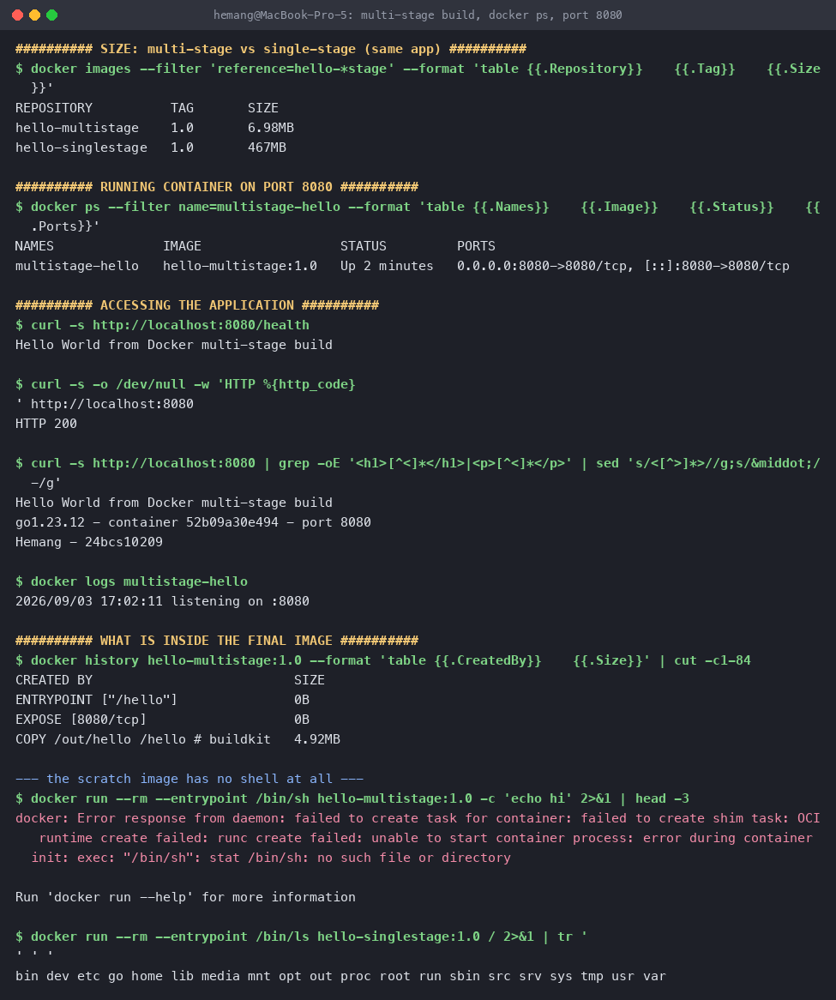
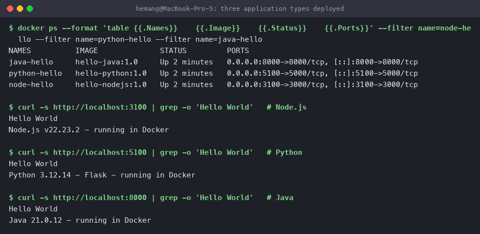

# Dockerfiles and Images — multi-stage build

**Name:** Hemang
**Enrollment number:** 24bcs10209

| Task | What it covers |
|---|---|
| [Task 1](#task-1--run-the-multi-stage-dockerfile) | Build and run a multi-stage Dockerfile on port 8080 |
| [Task 2](#task-2--documentation) | Documentation with name, enrollment number and evidence |
| [Task 3](#task-3--deploy-three-application-types) | Deploy three different application types with Docker |

---

## Why multi-stage

A compiled program needs a toolchain to **build** but not to **run**. A single-stage Dockerfile
ships the compiler, the source and the build cache alongside the finished binary, none of which
the running program uses.

A multi-stage Dockerfile uses one `FROM` to build and a second, much smaller `FROM` to run,
copying across only what the second stage actually needs with `COPY --from=<stage>`. Everything
else is discarded when the build ends.

---

## The application

`main.go` is a small HTTP server on port **8080** with no external dependencies. `/` returns an
HTML page reading *Hello World from Docker multi-stage build*; `/health` returns the same line
as plain text, which is convenient for `curl` and for container health checks.

```go
// Name: Hemang | Enrollment number: 24bcs10209
package main

import (
	"fmt"
	"log"
	"net/http"
	"os"
	"runtime"
)

const page = `<!doctype html>
<html>...<h1>Hello World from Docker multi-stage build</h1>
<p>%s &middot; container %s &middot; port 8080</p>
<p>Hemang &middot; 24bcs10209</p>...</html>`

func main() {
	host, _ := os.Hostname()

	http.HandleFunc("/", func(w http.ResponseWriter, r *http.Request) {
		w.Header().Set("Content-Type", "text/html; charset=utf-8")
		fmt.Fprintf(w, page, runtime.Version(), host)
	})

	http.HandleFunc("/health", func(w http.ResponseWriter, r *http.Request) {
		w.WriteHeader(http.StatusOK)
		fmt.Fprintln(w, "Hello World from Docker multi-stage build")
	})

	log.Println("listening on :8080")
	log.Fatal(http.ListenAndServe(":8080", nil))
}
```

## The multi-stage Dockerfile

```dockerfile
# ---------- stage 1: build ----------
FROM golang:1.23-alpine AS build
WORKDIR /src

COPY main.go .
RUN go mod init hello-multistage >/dev/null 2>&1 \
 && CGO_ENABLED=0 GOOS=linux go build -ldflags="-s -w" -o /out/hello .
# CGO_ENABLED=0 -> a fully static binary, so it can run on an image with no libc.
# -ldflags="-s -w" -> strip the symbol table and DWARF debug info.

# ---------- stage 2: run ----------
FROM scratch
COPY --from=build /out/hello /hello

EXPOSE 8080
ENTRYPOINT ["/hello"]
```

Line by line:

- **`AS build`** names the first stage so the second can refer to it.
- **`CGO_ENABLED=0`** produces a statically linked binary with no libc dependency. Without it
  the binary would need shared libraries that `scratch` does not have, and the container would
  die instantly with "no such file or directory".
- **`-ldflags="-s -w"`** strips symbols and debug info, shrinking the binary.
- **`FROM scratch`** is the completely empty base image — zero bytes, no shell, no package
  manager, no libc.
- **`COPY --from=build`** reaches into the first stage and takes only `/out/hello`. The Go
  toolchain, the module cache and `main.go` are all left behind.

[`Dockerfile.singlestage`](Dockerfile.singlestage) builds the **same application** without the
second stage, purely so the two can be compared below.

---

## Task 1 — Run the multi-stage Dockerfile

```bash
# clone the repository containing the multi-stage Dockerfile
git clone https://github.com/hemangtk/DevOps.git
cd "DevOps/DockerFiles and Images"

# build the image
docker build -t hello-multistage:1.0 .

# run a container from it
docker run -d --name multistage-hello -p 8080:8080 hello-multistage:1.0

# access the application
curl http://localhost:8080/health
```

### The size difference

Both images contain the same program:

```console
$ docker images --filter 'reference=hello-*stage' --format 'table {{.Repository}}\t{{.Tag}}\t{{.Size}}'
REPOSITORY          TAG       SIZE
hello-multistage    1.0       6.98MB
hello-singlestage   1.0       467MB
```

**467 MB → 6.98 MB**, about a **67× reduction**, for byte-identical behaviour.

### Verify the running container with `docker ps`

```console
$ docker ps --filter name=multistage-hello --format 'table {{.Names}}\t{{.Image}}\t{{.Status}}\t{{.Ports}}'
NAMES              IMAGE                  STATUS         PORTS
multistage-hello   hello-multistage:1.0   Up 2 minutes   0.0.0.0:8080->8080/tcp, [::]:8080->8080/tcp
```

Confirmed: the container is **Up**, and the application is running on **port 8080**.

### Access the application

```console
$ curl -s http://localhost:8080/health
Hello World from Docker multi-stage build

$ curl -s -o /dev/null -w 'HTTP %{http_code}\n' http://localhost:8080
HTTP 200

$ curl -s http://localhost:8080 | grep -oE '<h1>[^<]*</h1>|<p>[^<]*</p>' | sed 's/<[^>]*>//g'
Hello World from Docker multi-stage build
go1.23.12 - container 52b09a30e494 - port 8080
Hemang - 24bcs10209

$ docker logs multistage-hello
2026/09/03 17:02:11 listening on :8080
```

The application displays **Hello World from Docker multi-stage build**, as required.

### In the browser, on port 8080


### What actually ended up inside the image

```console
$ docker history hello-multistage:1.0 --format 'table {{.CreatedBy}}\t{{.Size}}'
CREATED BY                          SIZE
ENTRYPOINT ["/hello"]               0B
EXPOSE [8080/tcp]                   0B
COPY /out/hello /hello # buildkit   4.92MB
```

Three layers, and only one of them has any size — the 4.92 MB binary. There is no OS
underneath it at all, which is easy to prove:

```console
$ docker run --rm --entrypoint /bin/sh hello-multistage:1.0 -c 'echo hi'
docker: Error response from daemon: failed to create task for container: ...
unable to start container process: error during container init: exec: "/bin/sh":
stat /bin/sh: no such file or directory

$ docker run --rm --entrypoint /bin/ls hello-singlestage:1.0 /
bin dev etc go home lib media mnt opt out proc root run sbin src srv sys tmp usr var
```

The `scratch` image genuinely has no `/bin/sh`. The single-stage image has a whole Alpine
filesystem plus `/go` and `/src` — the toolchain and source that the multi-stage build threw
away.

That missing shell is a **security benefit**, not a limitation: there is no shell for an
attacker to drop into and no package manager to pull tools with, so the attack surface is one
static binary. The trade-off is that `docker exec ... sh` cannot be used to debug it; for
images that need a little more, `gcr.io/distroless/static` or `alpine` are the usual middle
ground.



---

## Task 2 — Documentation

- **Name:** Hemang
- **Enrollment number:** 24bcs10209
- **Application output:** *Hello World from Docker multi-stage build* — shown in the `curl`
  output and the browser screenshot above.
- **`docker ps` on port 8080:** shown above — `0.0.0.0:8080->8080/tcp`, status `Up`.

This file is that documentation.

---

## Task 3 — Deploy three application types

Three different application types deployed with Docker. The full source, Dockerfiles and
per-app notes are in [`../Docker Fundamentals/`](../Docker%20Fundamentals/).

| Type | Base image | Image | Port | Result |
|---|---|---|---|---|
| **Node.js** | `node:22-alpine` | `hello-nodejs:1.0` | 3100 → 3000 | HTTP 200, Hello World |
| **Python** (Flask) | `python:3.12-slim` | `hello-python:1.0` | 5100 → 5000 | HTTP 200, Hello World |
| **Java** | `eclipse-temurin:21-jdk-alpine` | `hello-java:1.0` | 8000 → 8000 | HTTP 200, Hello World |

```console
$ docker ps --format 'table {{.Names}}\t{{.Image}}\t{{.Status}}\t{{.Ports}}' \
    --filter name=node-hello --filter name=python-hello --filter name=java-hello
NAMES          IMAGE              STATUS         PORTS
java-hello     hello-java:1.0     Up 2 minutes   0.0.0.0:8000->8000/tcp, [::]:8000->8000/tcp
python-hello   hello-python:1.0   Up 2 minutes   0.0.0.0:5100->5000/tcp, [::]:5100->5000/tcp
node-hello     hello-nodejs:1.0   Up 2 minutes   0.0.0.0:3100->3000/tcp, [::]:3100->3000/tcp
```

All three answering:

```console
$ curl -s http://localhost:3100 | grep -o 'Hello World'   # Node.js
Hello World
Node.js v22.23.2 - running in Docker

$ curl -s http://localhost:5100 | grep -o 'Hello World'   # Python
Hello World
Python 3.12.14 - Flask - running in Docker

$ curl -s http://localhost:8000 | grep -o 'Hello World'   # Java
Hello World
Java 21.0.12 - running in Docker
```



Three more — Apache, React and Nginx — are covered in the same folder, six in total.

---

## Reproduce

```bash
docker build -t hello-multistage:1.0 .
docker build -f Dockerfile.singlestage -t hello-singlestage:1.0 .
docker run -d --name multistage-hello -p 8080:8080 hello-multistage:1.0

curl http://localhost:8080/health
docker ps --filter name=multistage-hello

# clean up
docker rm -f multistage-hello
```

---

## What I took away

1. **The runtime base image is almost the entire size decision.** Same source, same binary,
   same behaviour: 467 MB or 6.98 MB depending only on what the final `FROM` is.
2. **`COPY --from` is the whole mechanism.** Anything not explicitly copied out of a build
   stage never reaches the final image, so build tools cost nothing at runtime.
3. **`CGO_ENABLED=0` is what makes `scratch` possible.** A dynamically linked binary would need
   a libc that `scratch` cannot provide.
4. **Smaller images are faster and safer**, not just tidier: less to push and pull, fewer
   packages that can carry a CVE, and no shell to exploit.
5. **The same pattern is not Go-specific.** The React app in `Docker Fundamentals` uses it too —
   build with Node, serve with nginx — and the Java app there is the counter-example, a 555 MB
   image that would shrink a great deal by compiling in one stage and running on a JRE in the next.
