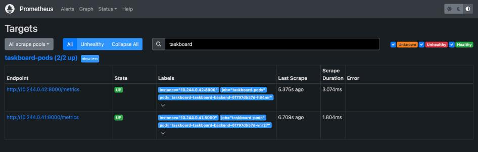

# Final DevOps Project — TaskBoard

**Name:** Hemang
**Enrollment number:** 24bcs10209

Session 21 capstone, built against the course's
[`session21-python/GRADING.md`](https://github.com/Nency-Ravaliya/devops-heros/tree/main/session21-python)
rubric — a React + FastAPI + PostgreSQL application taken from source to a scanned image in
GHCR to a running, autoscaling, monitored Kubernetes deployment.

**Live proof:** [pipeline run #37648052047](https://github.com/hemangtk/DevOps/actions/runs/37648052047)
— all 6 jobs green, both images pushed to GHCR.

Project: [`taskboard/`](taskboard/) · Pipeline: [`.github/workflows/taskboard.yml`](../.github/workflows/taskboard.yml)

---

## Rubric coverage

| Module | Requirement | Evidence |
|---|---|---|
| **M1** Application | FastAPI, Alembic, React frontend, compose | [§1](#m1--application) |
| **M2** Testing | pytest, 5+ tests, test DB not prod | [§2](#m2--testing) |
| **M3** Git | Public repo, commit messages, `.gitignore` | [§3](#m3--git-and-github) |
| **M4** Docker | Both Dockerfiles, multi-stage, non-root, compose | [§4](#m4--docker) |
| **M5** CI/CD | pytest, frontend build, both images, GHCR, SHA tags | [§5](#m5--cicd) |
| **M6** DevSecOps | Trivy on both images, gate on HIGH/CRITICAL | [§6](#m6--devsecops) |
| **M7** Terraform | VPC + 2 public subnets, EKS + node group | [§7](#m7--terraform) |
| **M8** Kubernetes + Helm | Chart deploys both tiers, ingress split, 2 replicas | [§8](#m8--kubernetes--helm) |
| **M9** Observability | `/metrics`, Prometheus scraping, Grafana panel | [§9](#m9--observability) |
| **M10** Documentation | Project README, demo | [§10](#m10--documentation) |

---

## Architecture

```text
Developer ──push──► GitHub ──► Actions
                       │  ├── flake8 + pytest (12 tests, 95%)
                       │  ├── vite build
                       │  ├── bandit / pip-audit / gitleaks
                       │  ├── build both images → smoke test → Trivy gate
                       │  ├── push to GHCR, tagged <commit-sha>
                       │  └── kubeconform + helm lint + terraform validate
                       ▼
          ┌──────── Kubernetes namespace: taskboard ────────┐
          │  Ingress  taskboard.local                       │
          │     /  ──────────────► frontend Svc ──► 2 pods  │
          │     /api ────────────► backend  Svc ──► 2 pods  │ HPA 2→8 @60%
          │                              │                  │
          │                        postgres Svc ──► 1 pod   │
          │                              └── PVC 1Gi        │
          └─────────────────────────────────────────────────┘
                       ▲ scrape /metrics
          Prometheus ──┘  ──► Grafana dashboard
```

---

## M1 — Application

**FastAPI backend, SQLAlchemy models, Pydantic schemas, Alembic migrations, React/Vite frontend,
PostgreSQL** — all three running under `docker compose up --build`.

```console
$ docker compose up --build
$ docker compose ps
SERVICE    STATUS                        PORTS
backend    Up 23 seconds (healthy)       0.0.0.0:8000->8000/tcp
frontend   Up 23 seconds (healthy)       0.0.0.0:8080->8080/tcp
postgres   Up About a minute (healthy)   5432/tcp
```

### Alembic really migrates

```console
$ docker compose logs backend | grep -i alembic
INFO  [alembic.runtime.migration] Context impl PostgresqlImpl.
INFO  [alembic.runtime.migration] Running upgrade  -> 0001, create tasks table

$ docker compose exec postgres psql -U taskboard -d taskboard -c '\dt'
 Schema |      Name       | Type  |   Owner
--------+-----------------+-------+-----------
 public | alembic_version | table | taskboard
 public | tasks           | table | taskboard

$ docker compose exec postgres psql -U taskboard -d taskboard -c 'SELECT version_num FROM alembic_version;'
 0001
```

### Eight endpoints, all exercised

```console
$ curl -s localhost:8000/health
{"status":"ok","version":"1.0.0-compose","environment":"compose"}

$ curl -s localhost:8000/ready
{"status":"ready","database":"reachable"}

--- POST ---
{"id":1,"title":"Build the capstone to spec","description":"all 10 modules","done":false,...}

--- GET list ---
[{"id":1,...},{"id":2,...}]

--- GET one ---
{"id":1,"title":"Build the capstone to spec",...}

--- PUT ---
{"id":1,...,"done":true,...}

--- DELETE ---
DELETE /api/tasks/2 -> HTTP 204
```

### The frontend renders and calls the API

```console
$ curl -s localhost:8080/ | head -c 200
<!doctype html><html lang="en"><head>...<title>TaskBoard</title>
<script type="module" crossorigin src="/assets/index-CegQPomn.js">

$ curl -s localhost:8080/api/tasks        # nginx proxies /api to the backend
[{"id":1,"title":"Build the capstone to spec",...}]
```


Task #1 is struck through (`done: true`), #3 is open — real data from the API, with working
Add / Done / Delete controls.


---

## M2 — Testing

```console
$ pytest --cov=app
tests/test_api.py::test_health_returns_ok PASSED
tests/test_api.py::test_ready_reports_database_reachable PASSED
tests/test_api.py::test_metrics_is_prometheus_format PASSED
tests/test_api.py::test_create_task PASSED
tests/test_api.py::test_create_task_rejects_empty_title PASSED
tests/test_api.py::test_list_tasks PASSED
tests/test_api.py::test_get_single_task PASSED
tests/test_api.py::test_get_missing_task_is_404 PASSED
tests/test_api.py::test_update_task PASSED
tests/test_api.py::test_update_missing_task_is_404 PASSED
tests/test_api.py::test_delete_task PASSED
tests/test_api.py::test_delete_missing_task_is_404 PASSED

Name              Stmts   Miss  Cover
app/config.py        18      1    94%
app/db.py            21      2    90%
app/main.py          76      4    95%
app/models.py        12      0   100%
app/schemas.py       20      0   100%
TOTAL               147      7    95%

======================== 12 passed in 0.09s =========================
```

**12 tests across 8 endpoints, 95% coverage.** `tests/conftest.py` points `DATABASE_URL` at a
temporary **SQLite** file before the app imports its config, so tests never touch Postgres and
need no running services. `pytest.ini` sets `pythonpath` and `testpaths`.

---

## M3 — Git and GitHub

Public repository: **<https://github.com/hemangtk/DevOps>**. Commit messages describe what
changed and why — including the honest ones, like the commit that records a flake8 failure I
caused by running pytest but not lint after an edit.

```console
$ grep -E '\.env|__pycache__|node_modules|\.venv' .gitignore
.env
__pycache__/
node_modules/
.venv/
```

---

## M4 — Docker

| | Backend | Frontend |
|---|---|---|
| Stages | wheels → runtime | **Node build → Nginx runtime** |
| User | `uid 10001 appuser` | `uid 10002 web` |
| Port | 8000 | 8080 (above 1024, required for non-root) |
| Healthcheck | `/health` | `/healthz` |
| Size | 364 MB | **76.2 MB** |

```console
$ docker compose exec backend id
uid=10001(appuser) gid=10001(appuser) groups=10001(appuser)

$ docker compose exec frontend id
uid=10002(web) gid=10002(web) groups=10002(web)
```

> **Non-root nginx needs three things**, and I hit all three: a port above 1024, a writable pid
> path (the default `/run/nginx.pid` is root-owned — the container crashed with
> `open() "/run/nginx.pid" failed (13: Permission denied)` until I moved it to `/tmp`), and
> ownership of the dirs the entrypoint's `envsubst` writes into.

---

## M5 — CI/CD

Six jobs: `test`, `frontend-build`, `security`, `images`, `manifests`, `gate`.

```console
$ gh run view 37648052047
conclusion: success

SAST, SCA and secret scan      ->  success
Validate manifests and chart   ->  success
Lint and test (pytest)         ->  success
Build the frontend             ->  success
Build, scan and push both images -> success
Release gate                   ->  success
```

### Images pushed to GHCR, tagged by commit SHA

```console
Build backend    naming to ghcr.io/hemangtk/taskboard-backend:ab50046bb5d9
Push both images ab50046bb5d9: digest: sha256:d59f3b6dfb75c5a9a3aa9f09e7db17ac6b49142f76feec31c7bd423bcc37351a
                 ab50046bb5d9: digest: sha256:3ee4dc7a35bb654e396918b22e1d5b3851be0f2d6daaf991fb607c53431367f1
pushed:
  ghcr.io/hemangtk/taskboard-backend:ab50046bb5d9
  ghcr.io/hemangtk/taskboard-frontend:ab50046bb5d9
```

`ab50046bb5d9` is the 12-character commit SHA — **not `latest`**, so every image is traceable to
the exact commit that produced it.


---

## M6 — DevSecOps

The gate runs Trivy against **both** images and fails on **fixable** HIGH or CRITICAL:

```console
--- gating ghcr.io/hemangtk/taskboard-backend ---
--- gating ghcr.io/hemangtk/taskboard-frontend ---
image scan gate: PASSED (no fixable HIGH/CRITICAL in either image)
```

### It passes because I fixed two real findings, not because I lowered the bar

The first scan failed, legitimately:

```console
=== taskboard-backend:1.0.0 ===    fixable HIGH/CRITICAL: {'HIGH': 3}
  HIGH  starlette  0.41.3  -> fixed in 1.3.1   (CVE-2026-54283)

=== taskboard-frontend:1.0.0 ===   fixable HIGH/CRITICAL: {'HIGH': 42, 'CRITICAL': 2}
  CRITICAL  libcrypto3  3.3.3-r0  -> fixed in 3.3.7-r0  (CVE-2026-31789)
  CRITICAL  libssl3     3.3.3-r0  -> fixed in 3.3.7-r0  (CVE-2026-31789)
  HIGH      c-ares      1.34.5-r0 -> fixed in 1.34.8-r0 (CVE-2026-33630)
```

**Backend:** FastAPI 0.115.5 pinned starlette `<0.42`, which carried three HIGH CVEs. Upgrading
to FastAPI 0.142.2 brought starlette 1.7.0 — and all 12 tests still passed on the new version.

**Frontend:** the published `nginx:1.27-alpine` tag lags Alpine's security updates. Adding
`apk upgrade --no-cache` to the runtime stage pulled the patched OpenSSL and c-ares.

```console
=== after the fixes ===
  taskboard-backend:1.0.0   fixable HIGH/CRITICAL: NONE    gate exit: 0
  taskboard-frontend:1.0.0  fixable HIGH/CRITICAL: NONE    gate exit: 0
```

`--ignore-unfixed` is deliberate: a CVE with no available patch is information, not a decision.
Gating on it only teaches people to route around the gate.

Also in the pipeline: **bandit** (SAST), **pip-audit** (SCA) and **gitleaks** over full history.

---

## M7 — Terraform

```console
$ terraform validate
Success! The configuration is valid.

$ terraform plan
  # aws_eks_cluster.main will be created
  # aws_eks_node_group.main will be created
  # aws_iam_role.cluster will be created
  # aws_iam_role.node will be created
  # aws_iam_role_policy_attachment.{cluster_policy,node_cni,node_registry,node_worker} will be created
  # aws_internet_gateway.main will be created
  # aws_route_table.public will be created
  # aws_route_table_association.public[0] / [1] will be created
  # aws_subnet.public[0] / [1] will be created
  # aws_vpc.main will be created
Plan: 15 to add, 0 to change, 0 to destroy.
```

### The network layer is genuinely provisioned and verified

```console
$ terraform apply -target=aws_vpc.main -target=aws_subnet.public ...
Apply complete! Resources: 7 added, 0 changed, 0 destroyed.

$ aws ec2 describe-subnets --filters Name=vpc-id,Values=vpc-3cdac269
|  subnet-701286e7 |  10.30.1.0/24 |  ap-south-1a |  True |
|  subnet-561c48af |  10.30.2.0/24 |  ap-south-1b |  True |
```

**Two public subnets in two different availability zones** — which is exactly what EKS requires —
with the discovery tags EKS uses for load balancers:

```console
|  kubernetes.io/role/elb               |  1      |
|  kubernetes.io/cluster/taskboard-eks  |  shared |
```

`terraform.tfvars.example` is committed; `terraform.tfvars` and `*.tfstate` are gitignored.

> **Honest scope note:** this ran against **LocalStack**, whose free tier implements EC2/VPC but
> **not EKS**. The cluster and node group are written, validated and planned, but not applied
> here. Setting `use_localstack = false` targets real AWS with no other change — I did not do
> that because an EKS control plane bills ~$0.10/hour plus node cost.


---

## M8 — Kubernetes + Helm

```console
$ kubectl apply -f k8s/namespace.yaml
namespace/taskboard created

$ helm lint helm/taskboard                              # and -f values-dev / values-prod
1 chart(s) linted, 0 chart(s) failed

$ helm upgrade --install taskboard helm/taskboard -n taskboard --wait
STATUS: deployed
REVISION: 3
```

```console
$ kubectl get deploy,svc,ingress,hpa,pvc -n taskboard
deployment.apps/taskboard-taskboard-backend    2/2   2   2
deployment.apps/taskboard-taskboard-frontend   2/2   2   2
deployment.apps/taskboard-taskboard-postgres   1/1   1   1
service/taskboard-taskboard-backend    ClusterIP   10.96.182.208    8000/TCP
service/taskboard-taskboard-frontend   ClusterIP   10.108.46.184    8080/TCP
service/taskboard-taskboard-postgres   ClusterIP   10.97.115.176    5432/TCP
ingress/taskboard-taskboard            nginx   taskboard.local   192.168.49.2   80
hpa/taskboard-taskboard-backend        Deployment/...-backend   2   8   2
pvc/taskboard-taskboard-postgres-data  Bound   pvc-76e7a9c9-...   1Gi   RWO
```

**Backend and frontend both at 2 replicas**, all pods `Running`.

### The chart migrates the database itself

An init container runs Alembic before the app starts. To prove it, I dropped the schema and
redeployed:

```console
$ kubectl exec <postgres> -- psql -c 'DROP TABLE tasks; DROP TABLE alembic_version;'
DROP TABLE
DROP TABLE

$ helm upgrade --install taskboard helm/taskboard ...
REVISION: 3

$ kubectl get pod <backend> -o jsonpath='{.spec.initContainers[*].name}'
wait-for-postgres run-migrations

$ kubectl exec <postgres> -- psql -c '\dt'
 public | alembic_version | table | taskboard
 public | tasks           | table | taskboard
```

### Ingress splits `/` and `/api`

```console
--- GET /  -> the React SPA ---
<!doctype html><html lang="en">...<title>TaskBoard</title>

--- GET /api/tasks -> the FastAPI backend ---
[]

--- POST through the ingress ---
{"id":1,"title":"Migrated by the chart","description":"alembic ran in an init container",...}
```

One host, one port, two applications — routed by path.

> **A bug worth recording:** the backend pods first hung in `Init:0/1`. `pg_isready` was
> returning *"no attempt"* — exit code 3, meaning invalid connection parameters, because I had
> omitted `-U`. Without a username it could not even try. Adding `-U` fixed it. "no attempt" is
> not "no response", and the distinction is the whole diagnosis.


---

## M9 — Observability

```console
$ curl -s <backend>/metrics
# HELP taskboard_http_requests_total Total HTTP requests served.
# TYPE taskboard_http_requests_total counter
taskboard_http_requests_total{version="1.0.0"} 7
# TYPE taskboard_http_errors_total counter
taskboard_http_errors_total{version="1.0.0"} 0
# TYPE taskboard_request_latency_seconds gauge
taskboard_request_latency_seconds 0.001966
# TYPE taskboard_tasks_total gauge
taskboard_tasks_total 2
```

### Prometheus is scraping the application

Backend pods carry `prometheus.io/scrape`, `port` and `path` annotations; Prometheus discovers
them with `kubernetes_sd_configs`.



```console
$ query: taskboard_http_requests_total
    taskboard-taskboard-backend-6f797db57d-h94mr   = 244
    taskboard-taskboard-backend-6f797db57d-vnr27   = 243

$ query: up{job="taskboard-pods"}
    ...-h94mr = 1
    ...-vnr27 = 1

$ query: sum(rate(taskboard_http_requests_total[5m]))
    0.1264 requests/sec
```

### Grafana, with live panels

```console
$ curl -s <grafana>/api/health
{ "database": "ok", "version": "11.2.0" }

$ curl -s '<grafana>/api/search?query=TaskBoard'
    TaskBoard  (uid=taskboard, folder=TaskBoard)
```


Six populated panels: **0.320 requests/sec**, **2 tasks stored**, **2 backend pods UP**,
**0 errors**, plus request-rate and latency timeseries broken out per pod.

Two deployment paths are provided: [`monitoring/prometheus-values.yaml`](taskboard/monitoring/)
for `kube-prometheus-stack` in production, and
[`monitoring/in-cluster-stack.yaml`](taskboard/monitoring/) — the lightweight equivalent actually
used here, since the full stack is heavy for minikube.


---

## M10 — Documentation

[`taskboard/README.md`](taskboard/README.md) explains what the application does, how to run it
locally, how to test it, and how to deploy it.

### Live demo

```bash
# 1. change something
vim "Final DevOps Project/taskboard/backend/app/main.py"

# 2. commit and push
git commit -am "feat: ..." && git push

# 3. watch the pipeline
gh run watch

# 4. the new image appears in GHCR tagged with this commit's SHA
#    helm upgrade --install ... --set backend.image.tag=<sha>
```

---

## Reproduce

```bash
cd taskboard
docker compose up --build            # http://localhost:8080

cd backend && pytest --cov=app       # 12 tests

minikube start --cpus=4 --memory=4096
minikube addons enable ingress metrics-server default-storageclass
kubectl apply -f k8s/namespace.yaml
helm upgrade --install taskboard helm/taskboard -n taskboard --wait

kubectl apply -f monitoring/grafana-dashboard.yaml -n monitoring
kubectl apply -f monitoring/in-cluster-stack.yaml
kubectl port-forward -n monitoring svc/grafana 3031:3000

cd terraform && terraform init && terraform plan
```

---

## Lessons learned

1. **Read the rubric before building.** My first capstone followed the homework doc's generic
   brief and scored roughly half of this one, because the rubric names specific technologies the
   doc never mentions. The lesson is cheap to state and was expensive to learn.
2. **A failing security gate is a prompt to fix, not to weaken.** Both scans failed on first run;
   both were fixable in minutes with a dependency bump and an `apk upgrade`.
3. **Run every CI step locally first.** The one time I skipped it — pytest after an edit but not
   flake8 — cost a red pipeline over a 101-character line.
4. **Non-root containers are mostly a filesystem-ownership problem**, not a user-creation one.
5. **Error text rewards close reading.** `pg_isready` "no attempt" vs "no response" was the
   entire diagnosis of a stalled rollout.
6. **Separate liveness from readiness at the application layer.** No amount of YAML fixes an app
   that cannot say whether it is ready.
