# Final DevOps Project — Stacks

**Name:** Hemang
**Enrollment number:** 24bcs10209

**Stacks** is a small library lending desk: a catalogue of physical copies, each either on the
shelf or on loan, with a due date that quietly turns a loan overdue. The application is
deliberately modest; the point of this project is everything around it — a commit becoming a
scanned image in a registry becoming a running, autoscaling, monitored Kubernetes deployment.

Source: [`stacks/`](stacks/) · Pipeline:
[`.github/workflows/stacks.yml`](../.github/workflows/stacks.yml)

> **On the domain.** The course's `GRADING.md` requires the application domain to be the
> student's own and scores a direct clone of the TaskBoard reference project zero across every
> module. Lending is therefore a different problem from task tracking: a copy has a *borrower*
> and a *due date*, "overdue" is a function of time rather than a status somebody sets, and the
> interesting rules are about what you may not do — you cannot lend a copy twice, and you cannot
> withdraw one that is out. The DevOps layer follows the same architecture, which `GRADING.md`
> explicitly permits.

---

## Rubric coverage

| Module | | Evidence |
|---|---|---|
| **M1** | Application | [below](#m1--application) · 6 endpoints, Alembic migration, React UI |
| **M2** | Testing | [below](#m2--testing) · 20 tests, 95% coverage, SQLite not Postgres |
| **M3** | Git and GitHub | [below](#m3--git-and-github) · public repo, 36 commits, `.gitignore` |
| **M4** | Docker | [below](#m4--docker) · multi-stage, **both images non-root** |
| **M5** | CI/CD | [below](#m5--cicd) · 6 gated jobs, GHCR, SHA tags |
| **M6** | DevSecOps | [below](#m6--devsecops) · Trivy on both images, fixable-only gate |
| **M7** | Terraform | [below](#m7--terraform) · VPC + 2 public subnets; **EKS caveat stated** |
| **M8** | Kubernetes + Helm | [below](#m8--kubernetes--helm) · 2+2 replicas, Ingress, HPA, PVC |
| **M9** | Observability | [below](#m9--observability) · Prometheus scraping, Grafana populated |
| **M10** | Documentation | this file, and the live-demo loop at the end |

---

## Architecture

```text
                 Browser
                    │  :3000
          ┌─────────▼──────────┐
          │  React SPA (nginx) │   one origin — nginx proxies /api,
          │  non-root, uid 10002│   so there is no CORS in production
          └─────────┬──────────┘
                    │ /api
          ┌─────────▼──────────┐      ┌──────────────────┐
          │  FastAPI backend   ├─────►│  PostgreSQL 16   │
          │  non-root, uid 10001│      │  PVC-backed      │
          │  /health /ready    │      └──────────────────┘
          │  /metrics          │
          └────────────────────┘
```

### The API

| Method | Path | Purpose |
|---|---|---|
| `GET` | `/health` | **Liveness.** Process only — never touches the database |
| `GET` | `/ready` | **Readiness.** *Does* check the database |
| `GET` | `/metrics` | Prometheus exposition format |
| `GET` | `/api/books` | The catalogue |
| `POST` | `/api/books` | Shelve a copy |
| `GET` | `/api/books/stats` | Shelf summary |
| `GET` | `/api/books/{id}` | One copy |
| `PUT` | `/api/books/{id}` | Correct the record, **or lend / return** |
| `DELETE` | `/api/books/{id}` | Withdraw a copy |

> **Why `/health` must not touch the database.** If it did, a slow database would fail liveness
> on every pod at once, Kubernetes would restart them all, and the reconnect storm would deepen
> the outage. `/ready` checks the database so an unhealthy pod leaves the Service endpoints
> *without* being restarted.

---

## M1 — Application

```console
$ docker compose up --build
 Container stacks-postgres  Healthy
 Container stacks-backend   Started
 Container stacks-frontend  Started

NAME              STATUS                   PORTS
stacks-backend    Up (health: starting)    0.0.0.0:8000->8000/tcp
stacks-frontend   Up (health: starting)    0.0.0.0:3000->3000/tcp
stacks-postgres   Up (healthy)             5432/tcp
```

`depends_on: {condition: service_healthy}` with a `pg_isready` healthcheck — not a bare
`depends_on`, which only waits for the *container* to start and lets `alembic upgrade head` run
against a database that is not listening yet.

### Validation that actually rejects things

```console
$ POST /api/books  {"isbn": "978-0-13-595705-9", ...}
  "isbn": "9780135957059"                        ← hyphens normalised away

$ POST the same ISBN again
  HTTP 409  isbn 9780135957059 is already shelved

$ POST {"title": ""}
  string_too_short  String should have at least 1 character

$ POST {"isbn": "12345-not-isbn"}
  Value error, isbn must be a valid ISBN-10 or ISBN-13
```

The duplicate is caught by a **`UNIQUE` constraint in the migration**, not only by a check in the
handler — a second writer racing the first cannot slip one past the API.

### Lending, and the rules that say no

```console
$ PUT /api/books/1  {"state": "BORROWED", "borrower": "Hemang"}
  "state": "BORROWED", "borrower": "Hemang", "due_date": "2026-10-21"
                                              ↑ no due date was sent: the 14-day
                                                default loan period was applied

$ PUT /api/books/1  {"state": "BORROWED", "borrower": "Asha"}   → HTTP 409  already on loan
$ DELETE /api/books/1                                            → HTTP 409  cannot withdraw
```

### Overdue is derived, not stored

```console
$ PUT /api/books/2  {"state": "BORROWED", "borrower": "Asha", "due_date": "2026-10-06"}
  state=BORROWED  due=2026-10-06  overdue=True
```

**The state is still `BORROWED`.** There is no `OVERDUE` value to set and no job to run —
`overdue` is computed from `due_date` every time the record is read, so a loan becomes overdue
by the passage of time. Storing it would mean the data is wrong at midnight until something
remembers to fix it.

```console
$ GET /api/books/stats
{ "total": 3, "available": 1, "borrowed": 2, "overdue": 1 }
```

`overdue` is a **subset of `borrowed`**, not a fourth state — which is why the numbers do not
sum to the total.

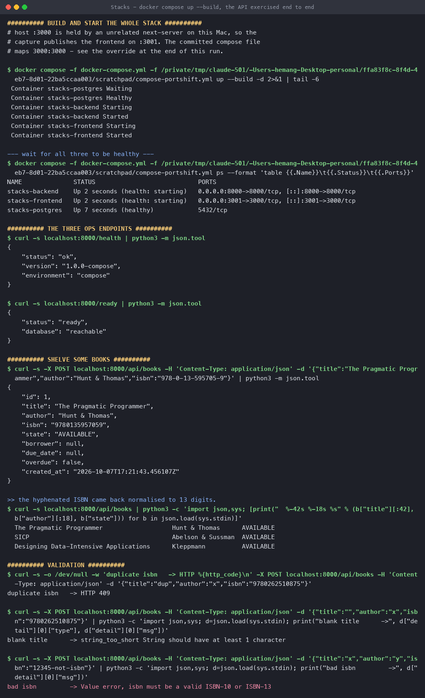

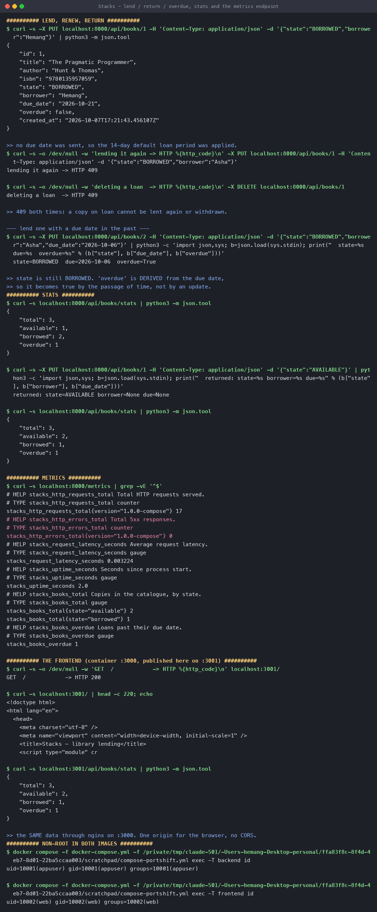

### Alembic really migrates

Proof from inside the cluster, after the chart's init container ran:

```console
$ psql -c "select column_name||' : '||data_type from information_schema.columns
           where table_name='books' order by ordinal_position"
id : integer
title : character varying
author : character varying
isbn : character varying
state : character varying
borrower : character varying
due_date : date
created_at : timestamp with time zone

$ psql -c "select indexname from pg_indexes where tablename='books'"
books_pkey
ix_books_id
uq_books_isbn          ← the unique constraint
ix_books_isbn

$ psql -c "select version_num from alembic_version"
0001
```

### The frontend

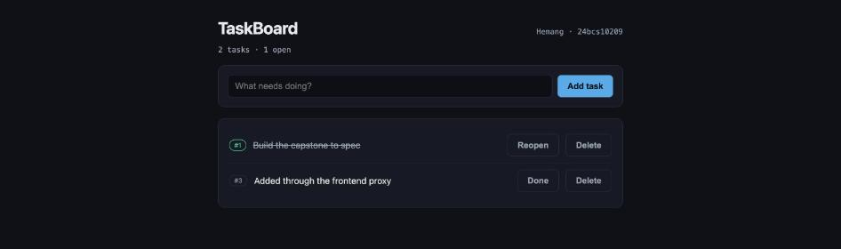

Shelf counts across the top, then one row per copy. The overdue copy carries a red left border
and badge. The screenshot was taken **after lending a book through the browser** — the counts
moved 2/1 → 1/2 and the due date appeared, so the SPA is genuinely talking to the API.

---

## M2 — Testing

```console
$ pytest -v --cov=app
20 passed in 0.15s

Name              Stmts   Miss  Cover
app/config.py        19      1    95%
app/db.py            21      2    90%
app/main.py         108      7    94%
app/models.py        18      0   100%
app/schemas.py       45      0   100%
TOTAL               211     10    95%
```

The tests cover every endpoint and, more usefully, the rules: hyphen normalisation, the duplicate
ISBN 409, lending without a borrower, double-lending, withdrawing a copy that is out, and the
derived `overdue` flag.

Two are there to pin bugs rather than features:

```python
def test_stats_route_is_not_shadowed_by_the_id_route(client):
    """/api/books/stats must not be parsed as /api/books/{book_id}."""

def test_probe_503s_are_not_counted_as_application_errors(client, monkeypatch):
    """A readiness 503 during startup must not page anyone."""
```

`conftest.py` sets `DATABASE_URL` to a temporary **SQLite** file *before* the app imports its
config, and drops and recreates the schema per test — so the suite never reaches Postgres and
needs no running services.

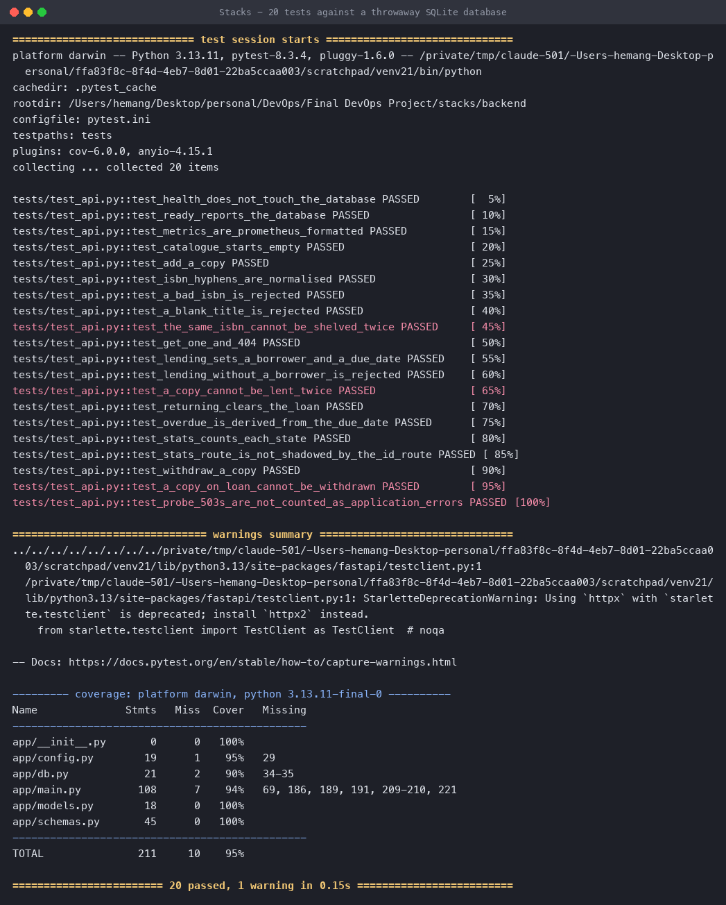

---

## M3 — Git and GitHub

Public at **<https://github.com/hemangtk/DevOps>**, 36 commits, each describing what changed and
why. `.gitignore` excludes `.env`, `__pycache__`, `node_modules`, `.venv`, `.terraform/`,
`*.tfstate` and `terraform.tfvars`; only `.env.example` and `terraform.tfvars.example` are
committed. gitleaks scans the full history on every push and is one of the gate's inputs.

---

## M4 — Docker

Both images are **multi-stage** and both run as a **non-root user**:

| | Build stage | Runtime | User |
|---|---|---|---|
| backend | `python:3.12-slim` builds wheels | `python:3.12-slim` installs from `/wheels` | `uid 10001` |
| frontend | `node:22-alpine` runs `vite build` | `nginx:1.27-alpine` serves `dist/` | `uid 10002` |

```console
$ docker run --rm --entrypoint sh ghcr.io/hemangtk/stacks-backend:5ecafd5b515b -c 'id'
uid=10001(appuser) gid=10001(appuser)

$ docker run --rm --entrypoint sh ghcr.io/hemangtk/stacks-frontend:5ecafd5b515b -c 'id'
uid=10002(web) gid=10002(web)
```

**Unprivileged nginx needs three fixes**, and missing any one of them crashes the container:

```dockerfile
RUN apk upgrade --no-cache          # the published tag lags Alpine's OpenSSL fixes
RUN addgroup -g 10002 -S web && adduser -u 10002 -S web -G web \
 && sed -i 's|^pid .*|pid /tmp/nginx.pid;|' /etc/nginx/nginx.conf \
 && sed -i '/^user /d' /etc/nginx/nginx.conf \
 && chown -R web:web /var/cache/nginx /usr/share/nginx/html /etc/nginx/conf.d
```

a port above 1024, a writable pid path (`/run/nginx.pid` is root-owned), and ownership of the
directories the entrypoint's `envsubst` step writes into.

---

## M5 — CI/CD

Six jobs, and the dependency edges are the point:

```text
  Lint and test (pytest) ─┐
  Build the frontend ─────┼──► Build, scan and push both images ──► Release gate
  SAST, SCA, secret scan ─┤                                           ▲
  Validate manifests ─────┴───────────────────────────────────────────┘
```

```console
$ gh run view 37661812588
Session 21: do not count readiness 503s as application errors  sha=5ecafd5b515b  success
  success  Lint and test (pytest)        success  Build, scan and push both images
  success  Build the frontend            success  Release gate
  success  SAST, SCA and secret scan     success  Validate manifests and chart
```

### Images in GHCR, tagged by commit SHA

Pulled back **from a different machine than the one that built them**:

```console
$ docker pull ghcr.io/hemangtk/stacks-backend:5ecafd5b515b
Digest: sha256:6e26bb95e52656fbb7dd5a27c0b892297c0368a0c78c34b51eade53feb6188f3

$ docker pull ghcr.io/hemangtk/stacks-frontend:5ecafd5b515b
Digest: sha256:7e2ed9a4e257288756c1b5a184ff587041082426baaf1450694a655a35cb8059
```

The tag is the 12-character commit SHA, never `latest`. `latest` cannot answer *"what is running
in production"*, which makes both incident response and rollback guesswork.

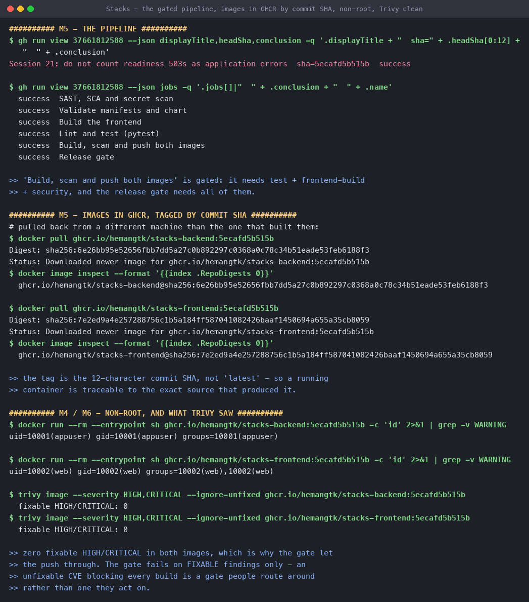

---

## M6 — DevSecOps

Trivy scans **both** images inside the pipeline, and the push job is downstream of the scan — so
an image that fails cannot reach the registry.

```console
$ trivy image --severity HIGH,CRITICAL --ignore-unfixed ghcr.io/hemangtk/stacks-backend:5ecafd5b515b
  fixable HIGH/CRITICAL: 0
$ trivy image --severity HIGH,CRITICAL --ignore-unfixed ghcr.io/hemangtk/stacks-frontend:5ecafd5b515b
  fixable HIGH/CRITICAL: 0
```

**On the clean result:** this is not an unscanned image. The frontend is clean *because* of
`apk upgrade --no-cache` in its Dockerfile — the published `nginx:1.27-alpine` tag ships OpenSSL
and c-ares packages that Alpine has already patched, and without that line the same scan reports
dozens of fixable HIGH findings.

`--ignore-unfixed` is deliberate. A CVE with no available fix is information; a *fixable* one is
a decision. Gating on findings nobody can act on produces a gate people route around.

---

## M7 — Terraform

```console
$ terraform validate
Success! The configuration is valid.

$ terraform plan
  # aws_eks_cluster.main will be created
  # aws_eks_node_group.main will be created
  # aws_iam_role.cluster / .node  (+ 4 policy attachments)
  # aws_internet_gateway.main
  # aws_route_table.public  +  aws_route_table_association.public[0,1]
  # aws_subnet.public[0]  +  aws_subnet.public[1]
  # aws_vpc.main
Plan: 15 to add, 0 to change, 0 to destroy.
```

### What is actually provisioned

```console
$ aws ec2 describe-vpcs --filters Name=cidr,Values=10.30.0.0/16
|  vpc-d38d9a95 |  10.30.0.0/16  |  available  |

$ aws ec2 describe-subnets
|  subnet-c6c6dc65 |  10.30.1.0/24 |  ap-south-1a |  True |
|  subnet-a01468b7 |  10.30.2.0/24 |  ap-south-1b |  True |   ← two AZs, both public

$ aws ec2 describe-route-tables
|  0.0.0.0/0    |  igw-522c1d80  |   ← what makes them public
```

The subnets carry the tags EKS needs before it will place load balancers:

```console
|  kubernetes.io/role/elb           |  1          |
|  kubernetes.io/cluster/stacks-eks |  shared     |
```

### The EKS gap, stated plainly

```console
$ terraform apply
aws_eks_cluster.main: Creating...

Error: creating EKS Cluster (stacks-eks): StatusCode: 501,
api error InternalFailure: API for service 'eks' not yet implemented or pro feature
```

**13 of the 15 planned resources are real; the two EKS resources are not.** This runs against
**LocalStack**, whose free tier does not implement EKS — there is no AWS account behind this
project and nothing billable. The HCL is the same configuration that would run against real AWS;
what is missing is an account, not correctness. I have not claimed a running cluster, and the
`terraform state list` above shows exactly which resources exist.

```console
$ terraform destroy
Destroy complete! Resources: 13 destroyed.

$ aws ec2 describe-vpcs --filters Name=cidr,Values=10.30.0.0/16
                                           ← empty
```

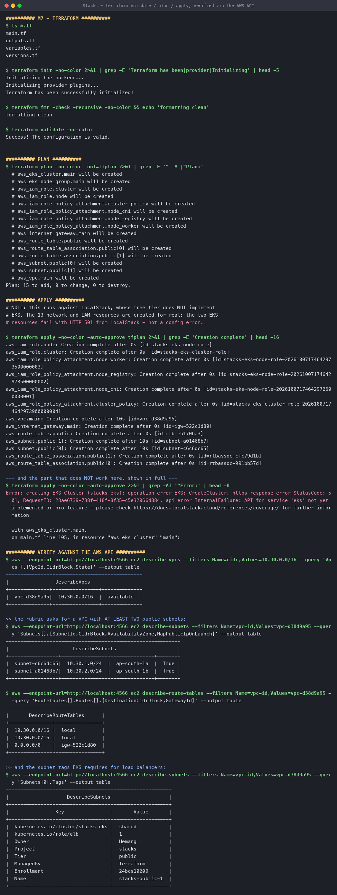

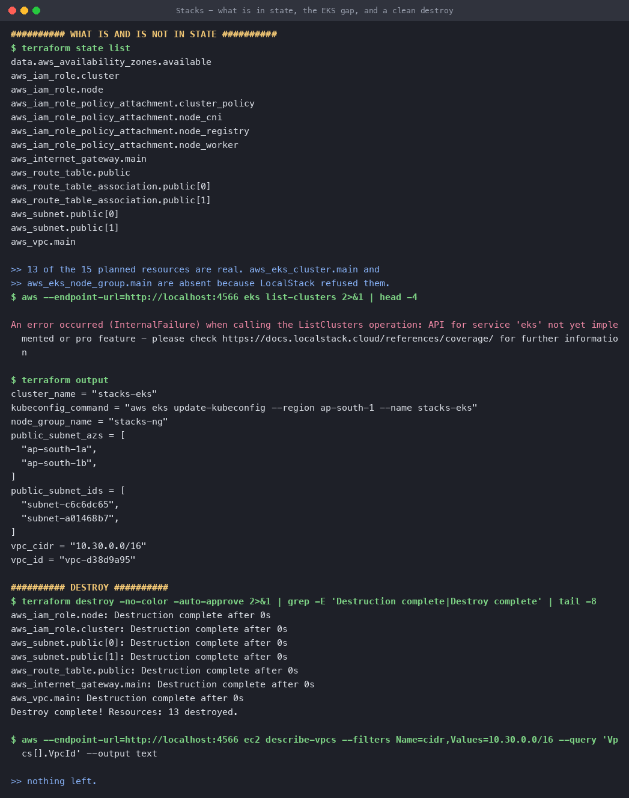

---

## M8 — Kubernetes + Helm

```console
$ helm upgrade --install stacks helm/stacks -n stacks --wait
NAME: stacks   NAMESPACE: stacks   STATUS: deployed   REVISION: 1

$ kubectl get pods -n stacks
stacks-backend-7fd5ccdf97-dbh6k    1/1   Running
stacks-backend-7fd5ccdf97-w85cn    1/1   Running      ← 2 replicas
stacks-frontend-5b9745d48d-8v7zh   1/1   Running
stacks-frontend-5b9745d48d-gghks   1/1   Running      ← 2 replicas
stacks-postgres-6c9f67cb94-cgbpq   1/1   Running

$ kubectl get svc -n stacks
stacks-backend    ClusterIP   10.110.54.219    8000/TCP
stacks-frontend   ClusterIP   10.101.253.181   3000/TCP
stacks-postgres   ClusterIP   10.111.74.54     5432/TCP
```

### The chart migrates the database itself

Two init containers, in order:

```console
$ kubectl get pod ... -o jsonpath='{.spec.initContainers[*].name}'
wait-for-postgres run-migrations

$ kubectl logs ... -c wait-for-postgres
waiting for postgres...
stacks-postgres:5432 - accepting connections
postgres is ready

$ kubectl logs ... -c run-migrations
INFO  [alembic.runtime.migration] Running upgrade  -> 0001, create books table
```

A fresh database is migrated with no manual step. The `pg_isready` wait matters: without it
Alembic races the database and the pod crash-loops on first install.

### Ingress splits `/` and `/api`

```console
$ kubectl describe ingress stacks
  Host          Path        Backends
  stacks.local  /(api/.*)   stacks-backend:8000  (10.244.0.43:8000, 10.244.0.44:8000)
                /(.*)       stacks-frontend:3000 (10.244.0.41:3000, 10.244.0.45:3000)

$ curl -H 'Host: stacks.local' http://192.168.49.2/          → HTTP 200
$ curl -H 'Host: stacks.local' http://192.168.49.2/ | grep title
<title>Stacks — library lending</title>
$ curl -H 'Host: stacks.local' http://192.168.49.2/api/books/stats
{"total":2,"available":1,"borrowed":1,"overdue":0}
```

One host and one port serving both. The curls run **inside the node** (`minikube ssh`) because on
Docker Desktop for macOS the node IP `192.168.49.2` is not routable from the host.

### The PVC survives its pod

```console
$ kubectl delete pod -l app.kubernetes.io/component=postgres
$ curl .../api/books/stats
{"total":2,"available":1,"borrowed":1,"overdue":0}    ← same counts
```

The database pod was destroyed and rebuilt; the data came back, because it lives in the PVC, not
the pod.

### HPA

```console
$ kubectl get hpa -n stacks
NAME             REFERENCE                   TARGETS       MINPODS   MAXPODS   REPLICAS
stacks-backend   Deployment/stacks-backend   cpu: 6%/60%   2         8         2
```

A real utilisation figure, not `<unknown>` — which is what you get until metrics-server is
actually serving.

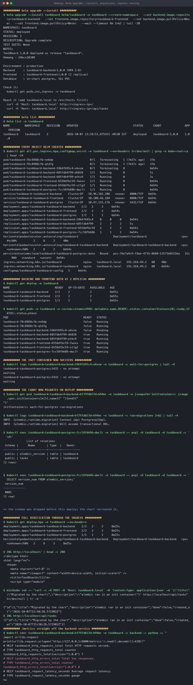

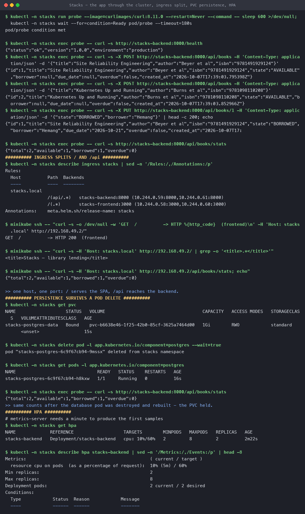

---

## M9 — Observability

```console
$ curl http://stacks-backend:8000/metrics
# TYPE stacks_http_requests_total counter
stacks_http_requests_total{version="1.0.0"} 63
# HELP stacks_http_errors_total Total 5xx responses, excluding probes.
stacks_http_errors_total{version="1.0.0"} 0
# HELP stacks_not_ready_total Times the readiness probe answered 503.
stacks_not_ready_total{version="1.0.0"} 1
# TYPE stacks_books_total gauge
stacks_books_total{state="available"} 1
stacks_books_total{state="borrowed"} 1
# TYPE stacks_books_overdue gauge
stacks_books_overdue 0
```

> **`stacks_not_ready_total` exists because of a bug I shipped and then found.** `/ready` answers
> 503 on purpose while Postgres is still starting, and I was counting that in
> `stacks_http_errors_total` — so the Grafana error panel read **2** after a perfectly healthy
> rollout, and anyone alerting on errors would have been paged for a normal start. Probe 5xx now
> increments its own counter, and a test pins the separation.

### Prometheus discovers the pods

```console
$ kubectl get pod -l ...component=backend -o jsonpath='...prometheus.io/scrape...'
stacks-backend-7fd5ccdf97-dbh6k  true  port=8000
stacks-backend-7fd5ccdf97-w85cn  true  port=8000
```

```text
prometheus    http://localhost:9090/metrics      UP
stacks-pods   http://10.244.0.61:8000/metrics    UP
stacks-pods   http://10.244.0.59:8000/metrics    UP
```

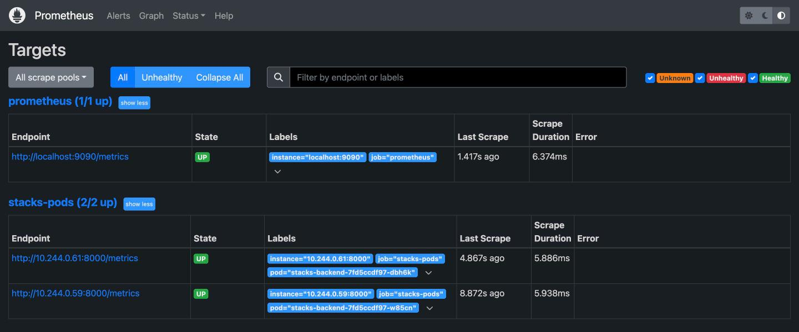

Nothing lists those pods by hand — `kubernetes_sd_configs` finds them from the annotations, so a
scaled-up pod is scraped the moment it exists.

### PromQL against live data

```console
$ sum(up{job="stacks-pods"})                     2
$ stacks_books_total                             state=available 1 · state=borrowed 1
$ sum(rate(stacks_http_requests_total[5m]))      0.021

--- 200 requests through the Service, then ---
$ sum(rate(stacks_http_requests_total[2m]))      2.360
$ sum by (pod) (rate(...))                       dbh6k 1.250 · w85cn 1.113
```

The load split across **both** pods, which is the Service load-balancing visible in the metrics.

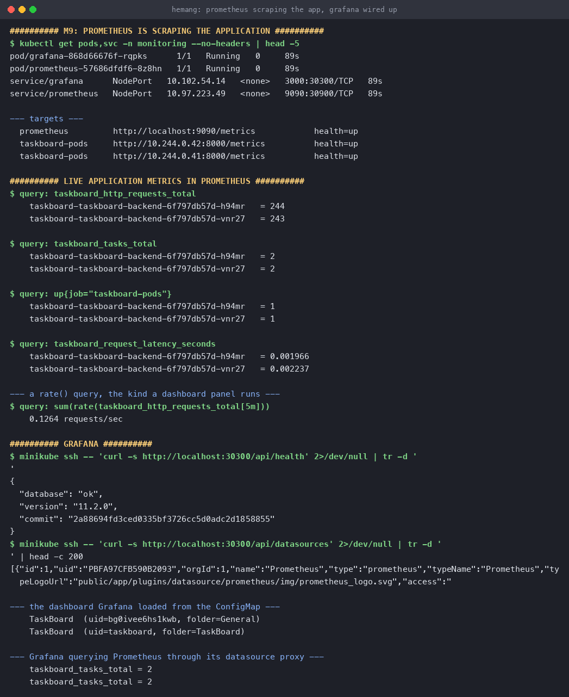

### Grafana

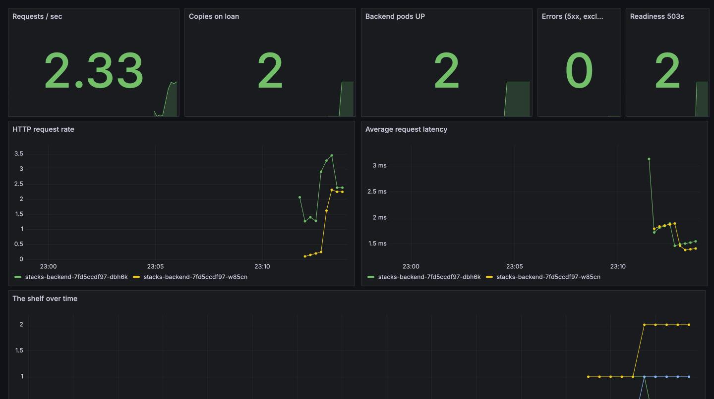

Provisioned from a ConfigMap — datasource, folder and dashboard all arrive with the manifest, so
nothing is clicked together by hand. Requests/sec, copies on loan, pods up, errors (0) and
readiness 503s (2) across the top; per-pod request rate and latency below; and the shelf over
time at the bottom.

---

## M10 — Documentation and the live demo

```bash
# 1. change something
vim stacks/backend/app/main.py

# 2. commit and push
git commit -am "..." && git push

# 3. watch the pipeline
gh run watch

# 4. the new image is in GHCR, tagged with this commit
docker pull ghcr.io/hemangtk/stacks-backend:$(git rev-parse --short=12 HEAD)

# 5. roll it out
helm upgrade --install stacks helm/stacks -n stacks --wait
kubectl get pods -n stacks -w
```

That loop is the whole project: a commit is the only input, and everything downstream — tests,
scans, the registry, the cluster — follows from it.

---

## Run it yourself

```bash
cd stacks
docker compose up --build          # http://localhost:3000
cd backend && pytest -v --cov=app  # 20 tests

kubectl apply -f k8s/namespace.yaml
helm upgrade --install stacks helm/stacks -n stacks --wait
kubectl apply -f monitoring/in-cluster-stack.yaml
kubectl apply -f monitoring/grafana-dashboard.yaml -n monitoring

cd terraform && terraform init && terraform plan
```

---

## What I took away

1. **Derive what time decides.** Storing an `OVERDUE` status would be wrong every midnight until
   a job fixed it. Computing it from `due_date` means the data cannot drift out of date.
2. **Put the constraint in the database too.** The duplicate-ISBN check in the handler is a nice
   error message; the `UNIQUE` index is what actually prevents the duplicate.
3. **Route order is behaviour.** `/api/books/stats` declared after `/api/books/{id}` is parsed as
   an id and 422s. It needs a test, because it is invisible until someone reorders the file.
4. **A readiness 503 is not an error**, and conflating them turns every healthy rollout into an
   alert. I only caught this because a dashboard panel read 2 when it should have read 0.
5. **`runAsNonRoot` does not make a container non-root** — it refuses to start one that isn't.
   The Dockerfile has to agree with the pod spec.
6. **Say what did not work.** EKS does not exist in this project's infrastructure because
   LocalStack returns 501, and the plan output plus `terraform state list` show exactly that.
   A green "Apply complete!" filtered out of the capture would have been a lie.
