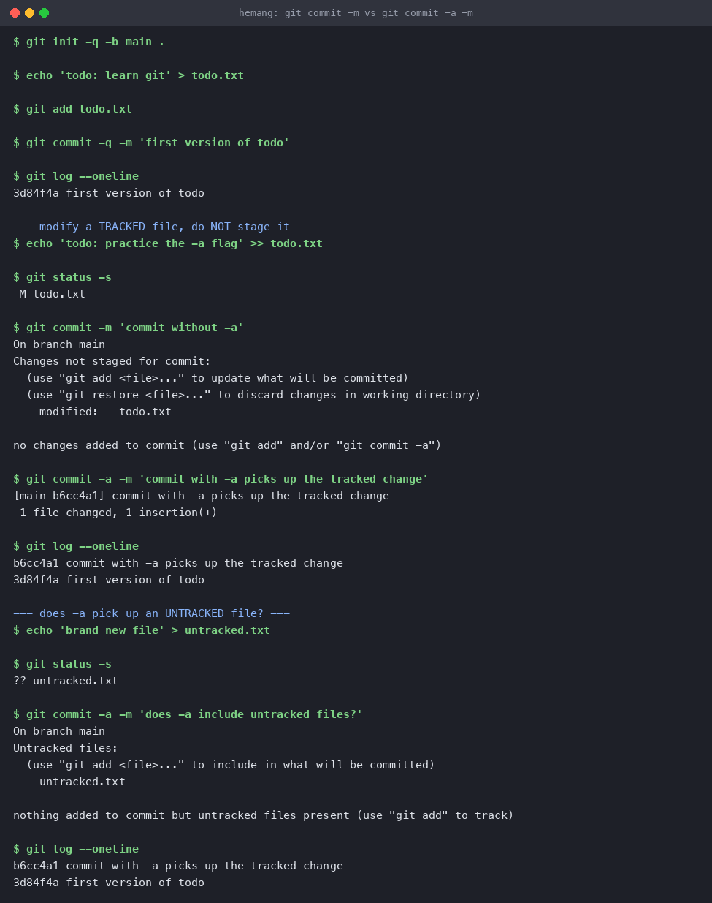
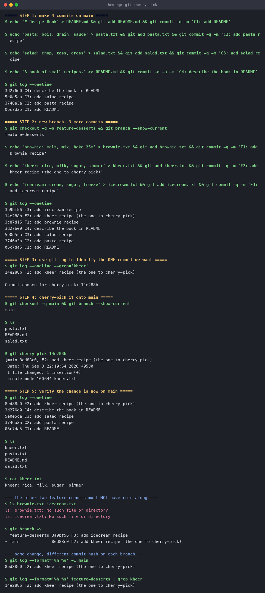

# Git and GitHub

**Name:** Hemang
**Enrollment number:** 24bcs10209

Two experiments, both run in throwaway repositories, with the real terminal output pasted in
and rendered as screenshots.

| Task | What it covers |
|---|---|
| [Task 1](#task-1--git-commit--m-vs-git-commit--a--m) | `git commit -m` vs `git commit -a -m` |
| [Task 2](#task-2--git-cherry-pick) | `git cherry-pick` |

---

## Task 1 — `git commit -m` vs `git commit -a -m`

### The difference

The whole difference is the **staging area** (the index), which sits between your working
directory and the repository.

- `git commit -m "msg"` commits **whatever is already staged**. If you edited a file and never
  ran `git add`, that edit is simply not in the commit.
- `git commit -a -m "msg"` first stages every **tracked** file that has been modified or
  deleted, then commits. It is a shortcut for `git add -u && git commit -m`.
- Neither form touches **untracked** files. A file git has never seen always needs an explicit
  `git add` first.

```
working directory  --git add-->  staging area (index)  --git commit-->  repository
                    \___________________ -a skips this step ___________/
                            (for TRACKED files only)
```

### Session output

Start a repo and make one normal commit:

```console
$ git init -q -b main .

$ echo 'todo: learn git' > todo.txt

$ git add todo.txt

$ git commit -q -m 'first version of todo'

$ git log --oneline
3d84f4a first version of todo
```

Now modify a **tracked** file and deliberately do *not* stage it:

```console
$ echo 'todo: practice the -a flag' >> todo.txt

$ git status -s
 M todo.txt
```

The `M` is in the **second** column, meaning "modified in the working tree, not staged". Try to
commit without `-a`:

```console
$ git commit -m 'commit without -a'
On branch main
Changes not staged for commit:
  (use "git add <file>..." to update what will be committed)
  (use "git restore <file>..." to discard changes in working directory)
	modified:   todo.txt

no changes added to commit (use "git add" and/or "git commit -a")
```

**Nothing was committed.** Git even names the two ways out. Now the same command with `-a`:

```console
$ git commit -a -m 'commit with -a picks up the tracked change'
[main b6cc4a1] commit with -a picks up the tracked change
 1 file changed, 1 insertion(+)

$ git log --oneline
b6cc4a1 commit with -a picks up the tracked change
3d84f4a first version of todo
```

That worked in a single step. Now the important limit — does `-a` also pick up a **brand-new**
file?

```console
$ echo 'brand new file' > untracked.txt

$ git status -s
?? untracked.txt

$ git commit -a -m 'does -a include untracked files?'
On branch main
Untracked files:
  (use "git add <file>..." to include in what will be committed)
	untracked.txt

nothing added to commit but untracked files present (use "git add" to track)

$ git log --oneline
b6cc4a1 commit with -a picks up the tracked change
3d84f4a first version of todo
```

**No.** `??` means untracked, and `-a` ignored it completely. The log still shows only two
commits.



### What I observed

1. `git commit -m` on an unstaged change committed **nothing** and exited with a warning.
2. `git commit -a -m` staged and committed the tracked change in one step.
3. `git commit -a -m` **still** ignored the untracked file — `-a` means "all *tracked* files",
   not "all files".
4. Practical rule: `-a` is a convenience for editing files git already knows about. Any new
   file needs `git add`. Avoid `-a` when you want to commit only part of your changes, because
   it sweeps up every modified tracked file whether you meant it or not.

---

## Task 2 — `git cherry-pick`

### The idea

`git cherry-pick <commit>` takes the **diff** introduced by one commit and replays it on top of
your current branch as a **new** commit. It is the tool for "I need just that one fix from that
branch, not the rest of it".

### Step 1 — four commits on `main`

```console
$ echo '# Recipe Book' > README.md && git add README.md && git commit -q -m 'C1: add README'
$ echo 'pasta: boil, drain, sauce' > pasta.txt && git add pasta.txt && git commit -q -m 'C2: add pasta recipe'
$ echo 'salad: chop, toss, dress' > salad.txt && git add salad.txt && git commit -q -m 'C3: add salad recipe'
$ echo 'A book of small recipes.' >> README.md && git commit -q -a -m 'C4: describe the book in README'

$ git log --oneline
3d276e0 C4: describe the book in README
5e0e5ca C3: add salad recipe
3746a3a C2: add pasta recipe
06c7da5 C1: add README
```

### Step 2 — a new branch with three commits

```console
$ git checkout -q -b feature-desserts && git branch --show-current
feature-desserts

$ echo 'brownie: melt, mix, bake 25m' > brownie.txt && git add brownie.txt && git commit -q -m 'F1: add brownie recipe'
$ echo 'kheer: rice, milk, sugar, simmer' > kheer.txt && git add kheer.txt && git commit -q -m 'F2: add kheer recipe (the one to cherry-pick)'
$ echo 'icecream: cream, sugar, freeze' > icecream.txt && git add icecream.txt && git commit -q -m 'F3: add icecream recipe'

$ git log --oneline
3a9bf56 F3: add icecream recipe
14e288b F2: add kheer recipe (the one to cherry-pick)
3c87d15 F1: add brownie recipe
3d276e0 C4: describe the book in README
5e0e5ca C3: add salad recipe
3746a3a C2: add pasta recipe
06c7da5 C1: add README
```

### Step 3 — use `git log` to identify the one commit

I want **F2** (the kheer recipe) on `main`, but not F1 or F3:

```console
$ git log --oneline --grep='kheer'
14e288b F2: add kheer recipe (the one to cherry-pick)
```

Commit chosen: **`14e288b`**.

### Step 4 — cherry-pick it onto `main`

```console
$ git checkout -q main && git branch --show-current
main

$ ls
README.md  pasta.txt  salad.txt

$ git cherry-pick 14e288b
[main 8ed88c0] F2: add kheer recipe (the one to cherry-pick)
 Date: Thu Sep 3 22:07:20 2026 +0530
 1 file changed, 1 insertion(+)
 create mode 100644 kheer.txt
```

### Step 5 — verify

```console
$ git log --oneline
8ed88c0 F2: add kheer recipe (the one to cherry-pick)
3d276e0 C4: describe the book in README
5e0e5ca C3: add salad recipe
3746a3a C2: add pasta recipe
06c7da5 C1: add README

$ ls
README.md  kheer.txt  pasta.txt  salad.txt

$ cat kheer.txt
kheer: rice, milk, sugar, simmer
```

`kheer.txt` is on `main` with the right contents. And crucially, the two neighbouring commits
did **not** come along:

```console
$ ls brownie.txt icecream.txt
ls: brownie.txt: No such file or directory
ls: icecream.txt: No such file or directory

$ git branch -v
  feature-desserts 3a9bf56 F3: add icecream recipe
* main             8ed88c0 F2: add kheer recipe (the one to cherry-pick)
```



### The detail worth noticing

The same change now exists on both branches under **two different hashes**:

```console
$ git log --format='%h %s' -1 main
8ed88c0 F2: add kheer recipe (the one to cherry-pick)

$ git log --format='%h %s' feature-desserts | grep kheer
14e288b F2: add kheer recipe (the one to cherry-pick)
```

Original `14e288b`, cherry-picked copy `8ed88c0`. A commit hash covers its parent and its
timestamp, not just the diff — so replaying the same change onto a different parent necessarily
produces a different commit. That is why cherry-picking is a *copy*, not a *move*, and why
merging the two branches later can produce a duplicate-looking history. `git cherry-pick -x`
appends a `(cherry picked from commit ...)` line to the message to keep the trail.

### What I observed

1. Cherry-picking moved exactly one commit's change, leaving F1 and F3 behind on the branch.
2. The picked commit got a new hash because its parent changed.
3. The commit message and original author date were preserved.
4. If the picked commit had touched lines that `main` had also changed, the cherry-pick would
   have stopped with a conflict, to be resolved and then finished with
   `git cherry-pick --continue` (or abandoned with `--abort`).

---

## How to reproduce

Both labs are plain shell — no setup beyond git:

```bash
mkdir /tmp/git-lab && cd /tmp/git-lab && git init -b main .
# ...then the commands above, in order
```
