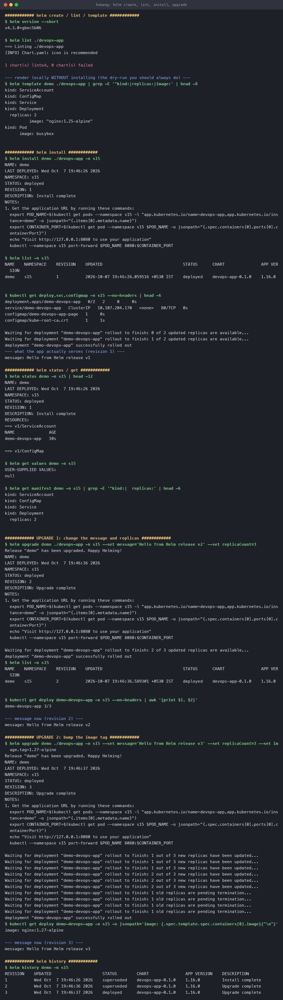
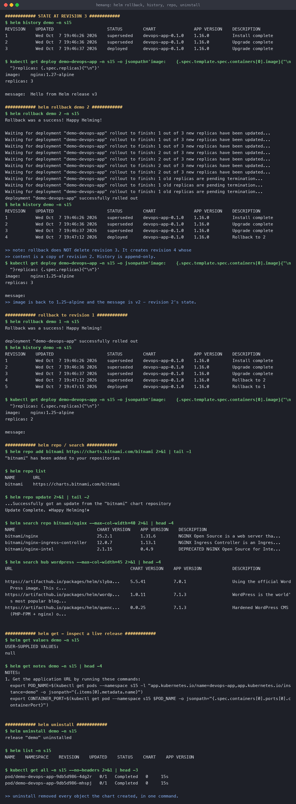

# Helm

**Name:** Hemang
**Enrollment number:** 24bcs10209

Session 15. A chart built from scratch, then the full release lifecycle — install, two upgrades,
two rollbacks, uninstall — run against a live minikube cluster with **Helm v4.3.0**.

Chart: [`devops-app/`](devops-app/)

| Task | Covers |
|---|---|
| [Task 1](#task-1--the-commands) | `create`, `lint`, `template`, `install`, `list`, `status`, `get`, `upgrade`, `history`, `rollback`, `uninstall`, `repo`, `search` |
| [Task 2](#task-2--the-rollback-workflow) | install → upgrade → verify → upgrade → verify → rollback → verify |

---

## Why Helm

Raw `kubectl apply` has three problems Helm exists to solve:

| Problem | Helm's answer |
|---|---|
| The same YAML copy-pasted per environment, with values hand-edited | **Templates + `values.yaml`** — one chart, many configurations |
| "Which 12 objects belong to this app?" | A **release** — one named unit you install and delete atomically |
| "The new version is broken, undo it" | **Revision history + `helm rollback`** |

```text
Chart  = the package (templates + default values)
Values = the configuration fed into it
Release = one installation of a chart into a cluster, with a version history
```

---

## The chart

```console
$ helm create devops-app

devops-app/
├── Chart.yaml           # name, version, appVersion, description
├── values.yaml          # the defaults users override
├── templates/
│   ├── deployment.yaml
│   ├── service.yaml
│   ├── configmap.yaml   # added: serves a page built from values
│   ├── ingress.yaml
│   ├── hpa.yaml
│   ├── serviceaccount.yaml
│   ├── _helpers.tpl     # reusable name/label snippets
│   └── NOTES.txt        # printed after install
└── .helmignore
```

I added a `configmap.yaml` whose content comes from values, mounted as nginx's document root —
so an upgrade produces a **visible** change rather than just a different YAML:

```yaml
data:
  index.html: |
    <h1>{{ .Values.message }}</h1>
    <p>chart version {{ .Chart.Version }} &middot; app version {{ .Chart.AppVersion }}</p>
    <p>replicas requested: {{ .Values.replicaCount }}</p>
```

`{{ .Values.x }}` reads `values.yaml`; `{{ .Chart.x }}` reads `Chart.yaml`;
`{{ include "devops-app.fullname" . }}` calls a helper from `_helpers.tpl`.

---

## Task 1 — the commands

### `helm lint` and `helm template` — check before you touch the cluster

```console
$ helm lint ./devops-app
==> Linting ./devops-app
[INFO] Chart.yaml: icon is recommended
1 chart(s) linted, 0 chart(s) failed

$ helm template demo ./devops-app | grep -E '^kind:|replicas:|image:'
kind: ServiceAccount
kind: ConfigMap
kind: Service
kind: Deployment
  replicas: 2
          image: "nginx:1.25-alpine"
```

`template` renders locally and **never contacts the cluster** — the fastest way to see what a
chart would actually produce. `helm install --dry-run --debug` does the same but validates
against the API server too.

### `helm install`

```console
$ helm install demo ./devops-app -n s15
NAME: demo
LAST DEPLOYED: Wed Oct  7 19:46:26 2026
NAMESPACE: s15
STATUS: deployed
REVISION: 1
DESCRIPTION: Install complete

$ kubectl get deploy,svc,configmap -n s15
deployment.apps/demo-devops-app   2/2
service/demo-devops-app           ClusterIP   10.107.204.170   80/TCP
configmap/demo-devops-app-page    1
```

**One command, four objects**, all named from the release name `demo`. The page it serves:

```console
message: Hello from Helm release v1
```

### `helm list` and `helm status`

```console
$ helm list -n s15
NAME   NAMESPACE   REVISION   STATUS     CHART              APP VERSION
demo   s15         1          deployed   devops-app-0.1.0   1.16.0
```

### `helm get` — inspect a live release

```console
$ helm get values demo -n s15
USER-SUPPLIED VALUES:
null

$ helm get manifest demo -n s15 | grep -E '^kind:|  replicas:'
kind: ServiceAccount
kind: ConfigMap
kind: Service
kind: Deployment
  replicas: 2
```

`USER-SUPPLIED VALUES: null` is correct here — I installed with no `--set`, so everything came
from the chart defaults. `helm get values -a` would show the fully merged set.

| Subcommand | Returns |
|---|---|
| `helm get values` | Only what the user overrode (`-a` for all) |
| `helm get manifest` | The exact YAML that was applied |
| `helm get notes` | The rendered `NOTES.txt` |
| `helm get hooks` | Any lifecycle hooks |

### `helm repo` and `helm search`

```console
$ helm repo add bitnami https://charts.bitnami.com/bitnami
"bitnami" has been added to your repositories

$ helm repo update
...Successfully got an update from the "bitnami" chart repository

$ helm search repo bitnami/nginx
NAME                               CHART VERSION   APP VERSION   DESCRIPTION
bitnami/nginx                      25.2.1          1.31.6        NGINX Open Source is a web server tha...
bitnami/nginx-ingress-controller   12.0.7          1.13.1        NGINX Ingress Controller is an Ingres...

$ helm search hub wordpress
URL                                      CHART VERSION   APP VERSION   DESCRIPTION
https://artifacthub.io/packages/helm/...  5.5.41         7.0.1         Using the official WordPress image...
```

`search repo` looks in repos **you have added**; `search hub` searches **ArtifactHub** across
all public repos.

### `helm uninstall`

```console
$ helm uninstall demo -n s15
release "demo" uninstalled

$ helm list -n s15
NAME   NAMESPACE   REVISION   STATUS   CHART   APP VERSION
                                                              # empty
```

Every object the chart created is removed together. `--keep-history` retains the revision
history so the release can be rolled back later.



---

## Task 2 — the rollback workflow

```text
Install → Upgrade → Verify → Upgrade → Verify → Rollback → Verify
```

### Install (revision 1)

```console
$ helm install demo ./devops-app -n s15
REVISION: 1
message: Hello from Helm release v1
image:    nginx:1.25-alpine
replicas: 2
```

### Upgrade 1 (revision 2) — change message and replicas

```console
$ helm upgrade demo ./devops-app -n s15 \
    --set message='Hello from Helm release v2' --set replicaCount=3
Release "demo" has been upgraded. Happy Helming!
REVISION: 2

$ kubectl get deploy demo-devops-app -n s15
demo-devops-app   3/3

message: Hello from Helm release v2
```

### Upgrade 2 (revision 3) — bump the image

```console
$ helm upgrade demo ./devops-app -n s15 \
    --set message='Hello from Helm release v3' --set replicaCount=3 --set image.tag=1.27-alpine
REVISION: 3

$ kubectl get deploy demo-devops-app -n s15 -o jsonpath='{.spec.template.spec.containers[0].image}'
nginx:1.27-alpine

message: Hello from Helm release v3
```

### History

```console
$ helm history demo -n s15
REVISION   UPDATED                    STATUS       CHART              DESCRIPTION
1          Wed Oct  7 19:46:26 2026   superseded   devops-app-0.1.0   Install complete
2          Wed Oct  7 19:46:36 2026   superseded   devops-app-0.1.0   Upgrade complete
3          Wed Oct  7 19:46:37 2026   deployed     devops-app-0.1.0   Upgrade complete
```

### Rollback to revision 2

```console
$ helm rollback demo 2 -n s15
Rollback was a success! Happy Helming!

$ helm history demo -n s15
REVISION   UPDATED                    STATUS       CHART              DESCRIPTION
1          Wed Oct  7 19:46:26 2026   superseded   devops-app-0.1.0   Install complete
2          Wed Oct  7 19:46:36 2026   superseded   devops-app-0.1.0   Upgrade complete
3          Wed Oct  7 19:46:37 2026   superseded   devops-app-0.1.0   Upgrade complete
4          Wed Oct  7 19:47:12 2026   deployed     devops-app-0.1.0   Rollback to 2
```

> **The key insight: rollback does not delete anything.** Revision 3 is still there, marked
> `superseded`. Helm created a **new revision 4** whose content is a copy of revision 2's.
> History is append-only — which means you can always roll *forward* again.

Verified against the cluster:

```console
$ kubectl get deploy demo-devops-app -n s15 -o jsonpath='...'
image:    nginx:1.25-alpine        # was 1.27-alpine at revision 3
replicas: 3                        # revision 2's value
```

### Rollback to revision 1

```console
$ helm rollback demo 1 -n s15
Rollback was a success! Happy Helming!

$ helm history demo -n s15
...
4          Wed Oct  7 19:47:12 2026   superseded   devops-app-0.1.0   Rollback to 2
5          Wed Oct  7 19:47:15 2026   deployed     devops-app-0.1.0   Rollback to 1

$ kubectl get deploy demo-devops-app -n s15 -o jsonpath='...'
image:    nginx:1.25-alpine
replicas: 2                        # back to the original
```

Five revisions, each one recoverable. `helm rollback demo` with no number goes back exactly one
revision.



---

## Where the history lives

Helm v3+ stores each revision as a **Secret** in the release's namespace:

```bash
kubectl get secrets -n s15 -l owner=helm
# sh.helm.release.v1.demo.v1, ...v2, ...v3
```

That is why `helm history` works from any machine with cluster access — the state is in the
cluster, not on your laptop. It is also why `--keep-history` matters: uninstalling without it
deletes those Secrets and the rollback path with them.

---

## Reproduce

```bash
helm lint ./devops-app
helm template demo ./devops-app

kubectl create namespace s15
helm install demo ./devops-app -n s15
helm list -n s15

helm upgrade demo ./devops-app -n s15 --set message='v2' --set replicaCount=3
helm upgrade demo ./devops-app -n s15 --set message='v3' --set image.tag=1.27-alpine
helm history demo -n s15

helm rollback demo 2 -n s15
helm rollback demo 1 -n s15
helm history demo -n s15

helm uninstall demo -n s15
kubectl delete namespace s15
```

---

## Command reference

| Command | Purpose |
|---|---|
| `helm create <name>` | Scaffold a new chart |
| `helm lint <chart>` | Static checks |
| `helm template <rel> <chart>` | Render locally, no cluster contact |
| `helm install <rel> <chart>` | Create a release (`--dry-run --debug` to preview) |
| `helm list` | Releases in a namespace (`-A` for all, `-a` to include failed) |
| `helm status <rel>` | Current state and NOTES |
| `helm get values/manifest/notes <rel>` | Inspect a live release |
| `helm upgrade <rel> <chart>` | New revision (`-i` to install if absent) |
| `helm history <rel>` | All revisions |
| `helm rollback <rel> [rev]` | Revert — creates a **new** revision |
| `helm uninstall <rel>` | Remove the release (`--keep-history` to keep rollback) |
| `helm repo add/update/list` | Manage chart repositories |
| `helm search repo/hub <term>` | Search added repos / ArtifactHub |

---

## What I took away

1. **A release is the unit of work.** Install, upgrade, roll back and delete operate on all the
   chart's objects together — no tracking which 12 YAMLs belong to an app.
2. **Rollback is append-only.** Going back to revision 2 created revision 4. Nothing is lost, so
   rolling forward again is always possible.
3. **Revision state lives in the cluster**, as Secrets labelled `owner=helm`.
4. **`helm template` before `helm install`.** Rendering locally catches template bugs with no
   cluster involvement, and shows exactly what will be applied.
5. **`helm get values` shows overrides, not the full picture** — `null` after a plain install is
   correct, and `-a` is what you want when debugging "why is this value set".
