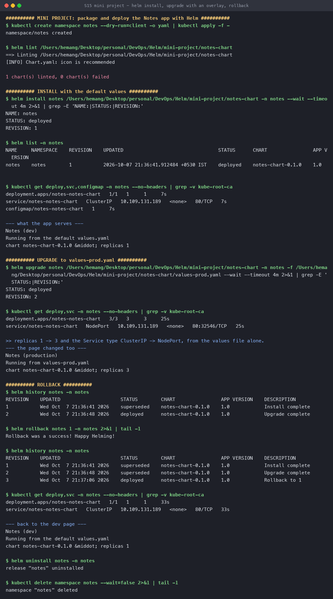

# Session 15 — Mini Project: Package an App as a Helm Chart

**Name:** Hemang
**Enrollment number:** 24bcs10209

Build a chart from scratch, install it, upgrade it with an environment overlay, and roll it back —
on a live minikube cluster, namespace `notes`.

Chart: [`notes-chart/`](notes-chart/)

| | |
|---|---|
| [The chart](#the-chart) | Templates, helpers, two values files |
| [Install](#install) | Revision 1 — dev defaults |
| [Upgrade](#upgrade) | Revision 2 — `-f values-prod.yaml` |
| [Rollback](#rollback) | Revision 3 — *"Rollback to 1"* |

---

## The chart

```text
notes-chart/
├── Chart.yaml            name, version 0.1.0, appVersion 1.0
├── values.yaml           dev defaults
├── values-prod.yaml      production overlay
└── templates/
    ├── _helpers.tpl      fullname + label blocks, defined once
    ├── configmap.yaml    the page itself, rendered from values
    ├── deployment.yaml   replicas, image, probes, resources
    └── service.yaml      type from values
```

**The page content lives in values**, which is the whole point of this project — it makes an
upgrade *visible* rather than something you have to infer from `kubectl get`:

```yaml
# templates/configmap.yaml
<h1>{{ .Values.notes.title }}</h1>
<p>{{ .Values.notes.message }}</p>
<p>chart {{ .Chart.Name }}-{{ .Chart.Version }} &middot; replicas {{ .Values.replicaCount }}</p>
```

### What changes between the two values files

| | `values.yaml` (dev) | `values-prod.yaml` |
|---|---|---|
| `replicaCount` | 1 | 3 |
| `service.type` | ClusterIP | NodePort |
| `notes.title` | Notes (dev) | Notes (production) |
| `resources.requests` | 25m / 32Mi | 100m / 128Mi |
| `resources.limits` | 200m / 128Mi | 500m / 512Mi |

`image`, `pullPolicy` and `service.port` appear in **neither** override — Helm deep-merges, so
anything the overlay omits falls through to the defaults. The overlay only has to say what differs.

### Two details worth calling out

**Helpers exist so names are defined once.** `_helpers.tpl` holds `fullname` and two label
blocks; every template calls `include`. Change the naming convention in one place and all four
manifests follow.

**The checksum annotation:**

```yaml
annotations:
  checksum/config: {{ include (print $.Template.BasePath "/configmap.yaml") . | sha256sum }}
```

A ConfigMap change alone does **not** restart pods — Kubernetes updates the mounted file
eventually and nginx never notices. Hashing the ConfigMap into a pod annotation changes the pod
template, which is what makes the Deployment roll. Without this line, `helm upgrade` would report
success while every pod still served the old page.

```console
$ helm lint notes-chart
==> Linting notes-chart
[INFO] Chart.yaml: icon is recommended

1 chart(s) linted, 0 chart(s) failed
```

---

## Install

```console
$ helm install notes notes-chart -n notes --wait
NAME: notes
STATUS: deployed
REVISION: 1

$ kubectl get deploy,svc,configmap -n notes
deployment.apps/notes-notes-chart   1/1   1   1     7s
service/notes-notes-chart   ClusterIP   10.109.131.189   80/TCP   7s
configmap/notes-notes-chart   1     7s

$ curl <service>
Notes (dev)
Running from the default values.yaml
chart notes-chart-0.1.0 · replicas 1
```

One replica, ClusterIP, dev copy — exactly `values.yaml`.

---

## Upgrade

```console
$ helm upgrade notes notes-chart -n notes -f notes-chart/values-prod.yaml --wait
STATUS: deployed
REVISION: 2

$ kubectl get deploy,svc -n notes
deployment.apps/notes-notes-chart   3/3   3   3     25s
service/notes-notes-chart   NodePort   10.109.131.189   80:32546/TCP   25s

$ curl <service>
Notes (production)
Running from values-prod.yaml
chart notes-chart-0.1.0 · replicas 3
```

**Replicas 1 → 3 and the Service type ClusterIP → NodePort, from one `-f` flag.** No template was
edited. The ClusterIP `10.109.131.189` is unchanged across the type switch — a NodePort Service
*is* a ClusterIP Service with a node port added on top, not a different object.

And the page says `production`, which proves the ConfigMap rolled with the pods rather than
sitting stale behind a successful-looking upgrade.

---

## Rollback

```console
$ helm history notes -n notes
REVISION  STATUS      CHART              DESCRIPTION
1         superseded  notes-chart-0.1.0  Install complete
2         deployed    notes-chart-0.1.0  Upgrade complete

$ helm rollback notes 1 -n notes
Rollback was a success! Happy Helming!

$ helm history notes -n notes
REVISION  STATUS      CHART              DESCRIPTION
1         superseded  notes-chart-0.1.0  Install complete
2         superseded  notes-chart-0.1.0  Upgrade complete
3         deployed    notes-chart-0.1.0  Rollback to 1      ← a NEW revision
```

Rolling back to 1 creates **revision 3**. The history is append-only — revision 2 is marked
`superseded`, not deleted, so you can roll forward to it again. Helm stores each revision's full
rendered manifest in a Secret in the namespace; a rollback re-applies a stored manifest rather
than re-rendering templates, which is why it works even if the chart source has since changed.

```console
$ kubectl get deploy,svc -n notes
deployment.apps/notes-notes-chart   1/1   1   1   33s
service/notes-notes-chart   ClusterIP   10.109.131.189   80/TCP   33s

$ curl <service>
Notes (dev)
Running from the default values.yaml
chart notes-chart-0.1.0 · replicas 1
```

Back to one replica, ClusterIP and the dev page — **including the NodePort being withdrawn**,
which is the part a hand-rolled rollback script usually forgets.

```console
$ helm uninstall notes -n notes
release "notes" uninstalled
```



---

## Reproduce

```bash
kubectl create namespace notes
helm lint notes-chart
helm install notes notes-chart -n notes --wait
helm upgrade notes notes-chart -n notes -f notes-chart/values-prod.yaml --wait
helm history notes -n notes
helm rollback notes 1 -n notes
helm uninstall notes -n notes && kubectl delete namespace notes
```

To see the rendered YAML without touching the cluster:

```bash
helm template notes notes-chart -f notes-chart/values-prod.yaml
helm install notes notes-chart -n notes --dry-run --debug
```

---

## What I took away

1. **An overlay only states differences.** `values-prod.yaml` is fifteen lines and changes five
   things; everything else deep-merges from the defaults. That is what makes one chart serve
   every environment.
2. **ConfigMap changes do not restart pods on their own.** The `checksum/config` annotation is
   the standard fix, and without it `helm upgrade` lies to you convincingly.
3. **Rollback is a new revision, not an erasure.** Append-only history means you can always go
   back *and* forward, and `helm history` stays an accurate record of what happened.
4. **Rollback restores everything in the release**, including the Service type — not just the
   workload, which is where imperative `kubectl` scripts drift.
5. **Helpers are not decoration.** Four templates sharing one `fullname` definition is the
   difference between renaming a release cleanly and chasing string literals.
