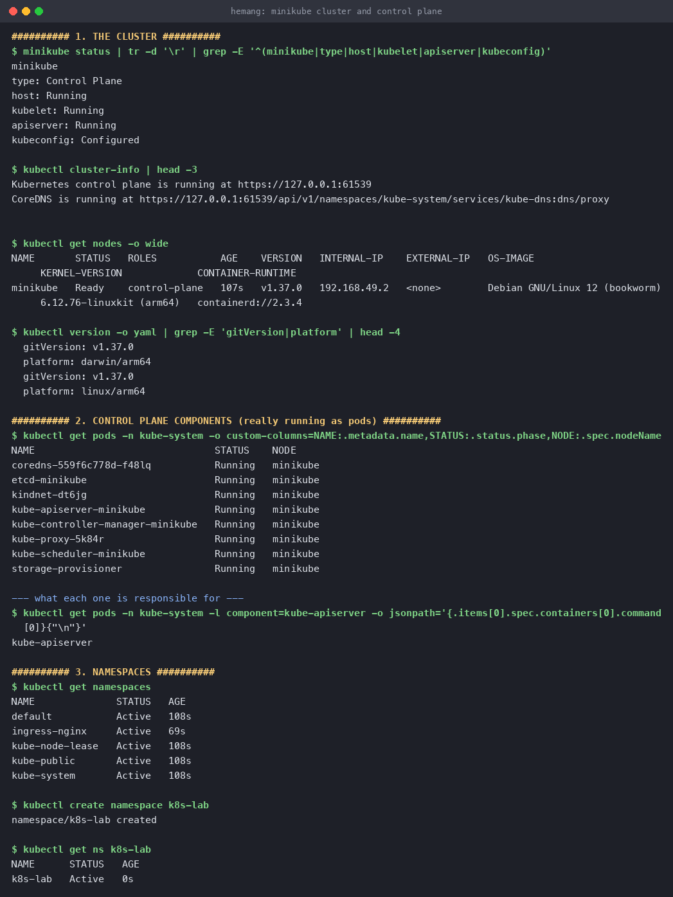
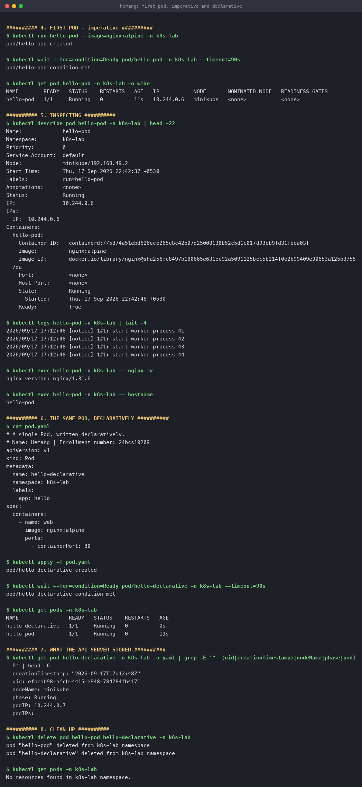

# Kubernetes Fundamentals

**Name:** Hemang
**Enrollment number:** 24bcs10209

Architecture, the control plane, namespaces, and the first Pod — run against a real
single-node **minikube** cluster (Kubernetes **v1.37.0**, containerd runtime) on macOS.

---

## 1. Why Kubernetes at all

Docker gets one container running on one machine. That leaves a list of things nobody wants to
do by hand:

| Problem | What Kubernetes does about it |
|---|---|
| A container dies at 3am | Restarts it automatically — the cluster is self-healing |
| Traffic triples | `kubectl scale` , or the HorizontalPodAutoscaler does it for you |
| A machine dies | Reschedules its workloads onto a healthy node |
| Pod IPs keep changing | A Service gives a stable name and IP in front of them |
| Deploying a new version without downtime | Rolling updates, with a one-command rollback |
| Config and passwords baked into images | ConfigMaps and Secrets, injected at runtime |

The single idea underneath all of it: **you declare the desired state, and controllers work
continuously to make reality match it.** You never say "start a container" — you say "I want
three of these running", and a controller notices whenever that stops being true.

---

## 2. Architecture

```text
┌──────────────────────── CONTROL PLANE (the brain) ────────────────────────┐
│                                                                           │
│   kube-apiserver  ← the ONLY component that talks to etcd.                │
│        │            Every kubectl command, every controller, every        │
│        │            kubelet goes through here. REST + validation + auth.  │
│        │                                                                  │
│      etcd         ← the cluster's database. Key-value store holding the   │
│                     entire desired AND observed state. Back this up.      │
│                                                                           │
│   kube-scheduler  ← watches for Pods with no node assigned, picks a node  │
│                     based on resources, affinity, taints. It only DECIDES;│
│                     it does not start anything.                           │
│                                                                           │
│   kube-controller-manager ← runs the control loops (Deployment, ReplicaSet,│
│                     Node, Job...). Each loop: observe → diff → act.       │
└───────────────────────────────────────────────────────────────────────────┘
                                    │
┌──────────────────────── WORKER NODE (the muscle) ─────────────────────────┐
│                                                                           │
│   kubelet         ← the node's agent. Asks the apiserver "what should run │
│                     on me?", then tells the container runtime to do it.   │
│                     Reports health back. Runs the probes.                 │
│                                                                           │
│   kube-proxy      ← programmes iptables/IPVS so Service IPs actually route│
│                     to Pod IPs.                                           │
│                                                                           │
│   container runtime (containerd) ← actually pulls images and runs         │
│                     containers.                                           │
└───────────────────────────────────────────────────────────────────────────┘
```

The flow when you run `kubectl apply -f deployment.yaml`:

1. **kubectl** → `kube-apiserver`: "store this Deployment".
2. **apiserver** validates it and writes it to **etcd**. Nothing is running yet.
3. **Deployment controller** notices a Deployment with no ReplicaSet → creates one.
4. **ReplicaSet controller** notices a ReplicaSet with 0/3 Pods → creates 3 Pod objects.
   Still nothing running — these Pods have no node.
5. **scheduler** notices Pods with `nodeName: ""` → picks nodes, writes the assignment back.
6. **kubelet** on the chosen node notices Pods assigned to it → tells **containerd** to pull
   and run the containers.
7. kubelet reports status back to the apiserver, which stores it in etcd.

Nobody issued an order to anybody. Each component just watches the apiserver and reacts. That
is the **reconciliation loop**, and it is the whole design.

---

## 3. The cluster

```console
$ minikube status
minikube
type: Control Plane
host: Running
kubelet: Running
apiserver: Running
kubeconfig: Configured

$ kubectl cluster-info
Kubernetes control plane is running at https://127.0.0.1:61539
CoreDNS is running at https://127.0.0.1:61539/api/v1/namespaces/kube-system/services/kube-dns:dns/proxy

$ kubectl get nodes -o wide
NAME       STATUS   ROLES           AGE    VERSION   INTERNAL-IP    OS-IMAGE                        CONTAINER-RUNTIME
minikube   Ready    control-plane   107s   v1.37.0   192.168.49.2   Debian GNU/Linux 12 (bookworm)  containerd://2.3.4

$ kubectl version -o yaml | grep -E 'gitVersion|platform'
  gitVersion: v1.37.0
  platform: darwin/arm64      # my kubectl
  gitVersion: v1.37.0
  platform: linux/arm64       # the cluster
```

This is a single-node cluster, so the one node is *both* control plane and worker — note
`ROLES: control-plane` and yet it still runs workloads. On a production cluster these would be
separate machines.

### The control plane components are really just Pods

```console
$ kubectl get pods -n kube-system -o custom-columns=NAME:.metadata.name,STATUS:.status.phase,NODE:.spec.nodeName
NAME                               STATUS    NODE
coredns-559f6c778d-f48lq           Running   minikube
etcd-minikube                      Running   minikube
kindnet-dt6jg                      Running   minikube
kube-apiserver-minikube            Running   minikube
kube-controller-manager-minikube   Running   minikube
kube-proxy-5k84r                   Running   minikube
kube-scheduler-minikube            Running   minikube
storage-provisioner                Running   minikube
```

Every component from the diagram above is visible here as a running Pod. `etcd`, the
`kube-apiserver`, the `kube-scheduler` and the `kube-controller-manager` are the control plane;
`kube-proxy` and `kindnet` (the CNI) are the node-level networking; `coredns` is cluster DNS.

These are **static Pods** — the kubelet runs them from manifest files in `/etc/kubernetes/manifests`
rather than from the apiserver. That solves the chicken-and-egg problem: the apiserver cannot
schedule the apiserver.



---

## 4. Namespaces

Namespaces are virtual clusters inside the cluster — a scope for names and a boundary for
quotas and RBAC.

```console
$ kubectl get namespaces
NAME              STATUS   AGE
default           Active   108s
ingress-nginx     Active   69s
kube-node-lease   Active   108s
kube-public       Active   108s
kube-system       Active   108s

$ kubectl create namespace k8s-lab
namespace/k8s-lab created
```

| Namespace | What lives there |
|---|---|
| `default` | Where your objects go if you don't say otherwise |
| `kube-system` | The cluster's own components |
| `kube-public` | Readable by everyone, even unauthenticated — cluster info |
| `kube-node-lease` | Node heartbeat leases, used for failure detection |

Two objects of the same kind cannot share a name **within** a namespace, but `web` in `dev` and
`web` in `prod` are entirely different objects. Note that namespaces are not a security sandbox
on their own — without NetworkPolicies, Pods in different namespaces can still reach each other.

---

## 5. The first Pod

A **Pod** is the smallest deployable unit — one or more containers that share a network
namespace (same IP, same localhost) and can share volumes. Usually one container per Pod; extra
containers are sidecars that genuinely belong to the same lifecycle.

### Imperative — quick, but leaves no record

```console
$ kubectl run hello-pod --image=nginx:alpine -n k8s-lab
pod/hello-pod created

$ kubectl wait --for=condition=Ready pod/hello-pod -n k8s-lab --timeout=90s
pod/hello-pod condition met

$ kubectl get pod hello-pod -n k8s-lab -o wide
NAME        READY   STATUS    RESTARTS   AGE   IP           NODE
hello-pod   1/1     Running   0          11s   10.244.0.6   minikube
```

`READY 1/1` means one of one containers passed its readiness check. The `IP` is a **cluster-internal
Pod IP** — reachable from other Pods, not from my Mac.

### Inspecting it

```console
$ kubectl describe pod hello-pod -n k8s-lab | head -22
Name:             hello-pod
Namespace:        k8s-lab
Node:             minikube/192.168.49.2
Start Time:       Thu, 17 Sep 2026 22:42:37 +0530
Labels:           run=hello-pod
Status:           Running
IP:               10.244.0.6
Containers:
  hello-pod:
    Container ID:   containerd://5d74a51ebd626ece265c8c42b07d2500...
    Image:          nginx:alpine
    State:          Running
    Ready:          True

$ kubectl logs hello-pod -n k8s-lab | tail -2
2026/09/17 17:12:48 [notice] 1#1: start worker process 43
2026/09/17 17:12:48 [notice] 1#1: start worker process 44

$ kubectl exec hello-pod -n k8s-lab -- nginx -v
nginx version: nginx/1.31.6

$ kubectl exec hello-pod -n k8s-lab -- hostname
hello-pod
```

`describe` is the first thing to reach for when something is wrong — the **Events** at the
bottom of its output explain scheduling failures, image pull errors and probe failures far
better than `get` does.

### Declarative — the way you actually work

[`pod.yaml`](pod.yaml):

```yaml
apiVersion: v1
kind: Pod
metadata:
  name: hello-declarative
  namespace: k8s-lab
  labels:
    app: hello
spec:
  containers:
    - name: web
      image: nginx:alpine
      ports:
        - containerPort: 80
```

```console
$ kubectl apply -f pod.yaml
pod/hello-declarative created

$ kubectl get pods -n k8s-lab
NAME                READY   STATUS    RESTARTS   AGE
hello-declarative   1/1     Running   0          0s
hello-pod           1/1     Running   0          11s
```

Every Kubernetes object has the same four top-level fields: **`apiVersion`**, **`kind`**,
**`metadata`**, **`spec`**. You write `spec` (desired state); Kubernetes writes back `status`
(observed state), and a controller's job is to close the gap between the two:

```console
$ kubectl get pod hello-declarative -n k8s-lab -o yaml | grep -E 'uid|creationTimestamp|nodeName|phase|podIP'
  creationTimestamp: "2026-09-17T17:12:48Z"
  uid: efbcab98-afcb-4415-a948-784784fb4171
  nodeName: minikube        # the scheduler wrote this
  phase: Running            # the kubelet wrote this
  podIP: 10.244.0.7         # the CNI wrote this
```

None of those four lines were in my YAML. `apply` is idempotent — run it fifty times and the
cluster converges to the same state, which is what makes the whole file safe to keep in git.



### Clean up

```console
$ kubectl delete pod hello-pod hello-declarative -n k8s-lab
pod "hello-pod" deleted from k8s-lab namespace
pod "hello-declarative" deleted from k8s-lab namespace

$ kubectl get pods -n k8s-lab
No resources found in k8s-lab namespace.
```

Both stayed deleted — a bare Pod has no controller behind it. That is exactly the gap
Deployments fill, which is the [next topic](../Kubernetes%20Pods%20ReplicaSets%20and%20Deployments/).

---

## 6. kubectl commands worth knowing

| Command | Purpose |
|---|---|
| `kubectl get <kind>` , `-o wide` , `-o yaml` | List; more columns; the full object |
| `kubectl get <kind> -A` | Across all namespaces |
| `kubectl describe <kind>/<name>` | Full detail **plus Events** — first stop when debugging |
| `kubectl logs <pod>` , `-f` , `--previous` | Logs; follow; logs from the crashed instance |
| `kubectl exec -it <pod> -- sh` | Shell inside a container |
| `kubectl apply -f <file>` | Create or update from YAML (declarative) |
| `kubectl delete -f <file>` | Remove what that file created |
| `kubectl get events --sort-by=.lastTimestamp` | What just happened in the cluster |
| `kubectl explain pod.spec.containers` | Field documentation, straight from the API server |
| `kubectl api-resources` | Every kind this cluster knows, with short names |
| `kubectl run <name> --image= --dry-run=client -o yaml` | Generate a starting manifest |

`--previous` is the one people miss: when a pod is in `CrashLoopBackOff`, the current container
has no logs yet — the useful output is in the one that just died.

---

## 7. Reproduce

```bash
brew install minikube
minikube start --driver=docker --cpus=4 --memory=4096
kubectl get nodes

kubectl create namespace k8s-lab
kubectl apply -f pod.yaml
kubectl get pods -n k8s-lab
kubectl delete -f pod.yaml
```

---

## 8. What I took away

1. **Kubernetes is a set of control loops, not an orchestrator issuing commands.** Every
   component watches the apiserver and reconciles. That is why it heals itself.
2. **The apiserver is the only door to etcd.** Everything — kubectl, kubelet, controllers —
   goes through it, which is why it is also the single point to secure and to scale.
3. **The scheduler only decides.** It writes `nodeName` and stops; the kubelet does the work.
4. **A bare Pod is not durable.** Nothing recreates it. Pods are cattle, and you want a
   controller in front of them.
5. **`describe` before `logs`.** If a Pod never started, there are no logs — the reason is in
   the Events.
