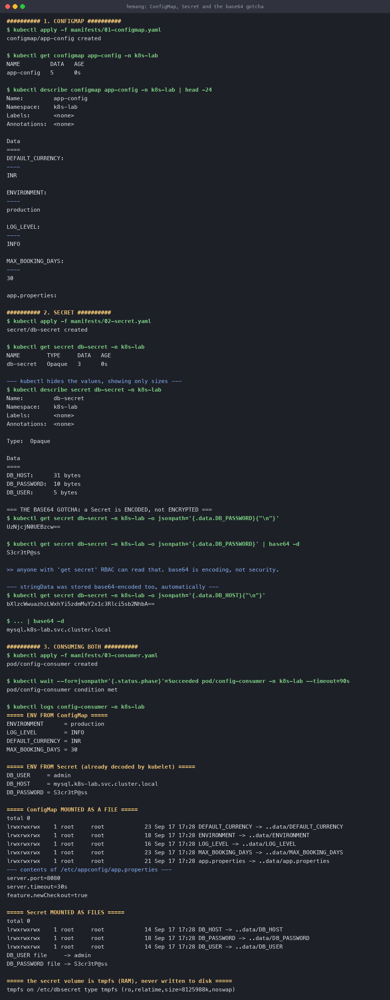
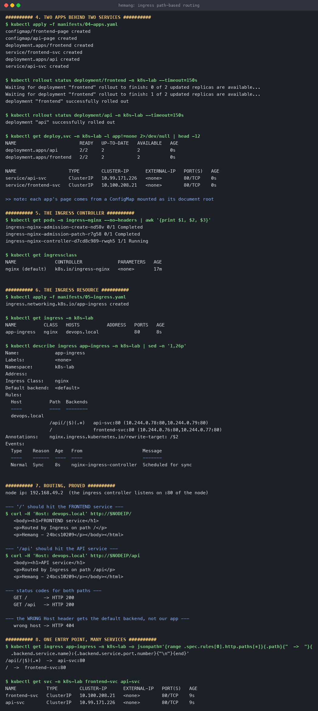

# Kubernetes Ingress, ConfigMaps and Secrets

**Name:** Hemang
**Enrollment number:** 24bcs10209

Configuration separated from images, and one entry point routing to many services — run on a
real minikube cluster (Kubernetes v1.37.0) with the `ingress-nginx` controller.

Manifests: [`manifests/`](manifests/)

| Section | Covers |
|---|---|
| [1](#1-configmap) | ConfigMap — env vars and mounted files |
| [2](#2-secret) | Secret, and why base64 is not security |
| [3](#3-consuming-both) | Both injected into a running pod |
| [4](#4-ingress) | Ingress: path routing, one entry point |
| [5](#5-troubleshooting) | The common failures |

---

## 1. ConfigMap

The point is to keep configuration **out of the image**, so the same image runs in dev, staging
and prod with different settings.

[`manifests/01-configmap.yaml`](manifests/01-configmap.yaml):

```yaml
apiVersion: v1
kind: ConfigMap
metadata:
  name: app-config
data:
  # simple key/value pairs -> injected as environment variables
  ENVIRONMENT: "production"
  LOG_LEVEL: "INFO"
  DEFAULT_CURRENCY: "INR"
  MAX_BOOKING_DAYS: "30"

  # a whole file -> mounted as a volume
  app.properties: |
    server.port=8080
    server.timeout=30s
    feature.newCheckout=true
```

```console
$ kubectl get configmap app-config -n k8s-lab
NAME         DATA   AGE
app-config   5      0s

$ kubectl describe configmap app-config -n k8s-lab
Data
====
DEFAULT_CURRENCY:
----
INR
ENVIRONMENT:
----
production
LOG_LEVEL:
----
INFO
MAX_BOOKING_DAYS:
----
30
app.properties:
```

`DATA 5` — four scalars plus one embedded file. A ConfigMap key can hold a single value *or* an
entire file's contents, and the two are consumed differently.

---

## 2. Secret

Structurally identical to a ConfigMap, with one difference that trips everyone up.

[`manifests/02-secret.yaml`](manifests/02-secret.yaml):

```yaml
apiVersion: v1
kind: Secret
metadata:
  name: db-secret
type: Opaque
data:
  # values here must ALREADY be base64
  DB_USER: YWRtaW4=              # echo -n 'admin' | base64
  DB_PASSWORD: UzNjcjN0UEBzcw==  # echo -n 'S3cr3tP@ss' | base64
stringData:
  # stringData takes PLAIN text and Kubernetes encodes it for you
  DB_HOST: "mysql.k8s-lab.svc.cluster.local"
```

```console
$ kubectl get secret db-secret -n k8s-lab
NAME        TYPE     DATA   AGE
db-secret   Opaque   3      0s

$ kubectl describe secret db-secret -n k8s-lab
Data
====
DB_HOST:      31 bytes
DB_PASSWORD:  10 bytes
DB_USER:      5 bytes
```

`describe` deliberately prints **sizes, not values** — a small guard against shoulder-surfing
and against secrets landing in terminal scrollback or CI logs.

### The base64 gotcha

That guard is very thin:

```console
$ kubectl get secret db-secret -n k8s-lab -o jsonpath='{.data.DB_PASSWORD}'
UzNjcjN0UEBzcw==

$ kubectl get secret db-secret -n k8s-lab -o jsonpath='{.data.DB_PASSWORD}' | base64 -d
S3cr3tP@ss
```

**A Secret is base64-encoded, not encrypted.** Base64 is a transport encoding — it exists so
binary values (TLS keys, certificates) survive YAML, not to protect anything. Anyone with `get
secret` RBAC, or read access to etcd, or your committed YAML file, has the password.

What actually protects Secrets:

| Measure | What it does |
|---|---|
| **RBAC** | Restrict `get`/`list` on secrets — the single most important one |
| **Encryption at rest** | `EncryptionConfiguration` so etcd stores ciphertext |
| **External secret stores** | Vault, AWS Secrets Manager, Sealed Secrets, External Secrets Operator |
| **Never commit them** | A Secret manifest in git is a plaintext password in git |

`stringData` is the ergonomic half: you write plain text, and Kubernetes encodes it on the way
in. It is write-only — reading the object back always shows `data`:

```console
$ kubectl get secret db-secret -o jsonpath='{.data.DB_HOST}'
bXlzcWwuazhzLWxhYi5zdmMuY2x1c3Rlci5sb2NhbA==

$ ... | base64 -d
mysql.k8s-lab.svc.cluster.local
```

Use `stringData` for anything you type by hand — it removes the classic bug of running
`echo 'password' | base64` **without `-n`**, which silently appends a newline to your password.

---

## 3. Consuming both

[`manifests/03-consumer.yaml`](manifests/03-consumer.yaml) injects them **both ways at once**:

```yaml
envFrom:
  - configMapRef:
      name: app-config          # every key becomes an env var
env:
  - name: DB_PASSWORD
    valueFrom:
      secretKeyRef: { name: db-secret, key: DB_PASSWORD }
volumeMounts:
  - name: config-volume
    mountPath: /etc/appconfig
    readOnly: true
  - name: secret-volume
    mountPath: /etc/dbsecret
    readOnly: true
```

The pod's actual output:

```console
$ kubectl logs config-consumer -n k8s-lab
===== ENV FROM ConfigMap =====
ENVIRONMENT      = production
LOG_LEVEL        = INFO
DEFAULT_CURRENCY = INR
MAX_BOOKING_DAYS = 30

===== ENV FROM Secret (already decoded by kubelet) =====
DB_USER     = admin
DB_HOST     = mysql.k8s-lab.svc.cluster.local
DB_PASSWORD = S3cr3tP@ss

===== ConfigMap MOUNTED AS A FILE =====
lrwxrwxrwx  DEFAULT_CURRENCY -> ..data/DEFAULT_CURRENCY
lrwxrwxrwx  ENVIRONMENT -> ..data/ENVIRONMENT
lrwxrwxrwx  LOG_LEVEL -> ..data/LOG_LEVEL
lrwxrwxrwx  MAX_BOOKING_DAYS -> ..data/MAX_BOOKING_DAYS
lrwxrwxrwx  app.properties -> ..data/app.properties
--- contents of /etc/appconfig/app.properties ---
server.port=8080
server.timeout=30s
feature.newCheckout=true

===== Secret MOUNTED AS FILES =====
DB_USER file     -> admin
DB_PASSWORD file -> S3cr3tP@ss

===== the secret volume is tmpfs (RAM), never written to disk =====
tmpfs on /etc/dbsecret type tmpfs (ro,relatime,size=8125988k,noswap)
```

Three things worth pulling out of that:

**1. The kubelet decodes Secrets for you.** `DB_PASSWORD = S3cr3tP@ss`, not the base64. Your app
never calls a decoder.

**2. Every key is a symlink to `..data/`.** That indirection is how Kubernetes updates mounted
config **atomically** — it writes a new directory and swings one symlink, so a reader never sees
a half-written file.

**3. Secret volumes are `tmpfs`.** Mounted in RAM, never on the node's disk. The `noswap` flag
means it can't be paged out either.

### env vars vs mounted files

| | Environment variables | Mounted volume |
|---|---|---|
| Updates when the ConfigMap changes | **No** — fixed at pod start | **Yes**, automatically (~60s) |
| Visible in `kubectl describe pod` | Yes — leaks secrets | No |
| Inherited by child processes | Yes (can leak into crash dumps) | No |
| Good for | Simple scalars, 12-factor apps | Whole config files, certificates, secrets |

**Prefer volumes for secrets.** Environment variables show up in `describe pod`, in process
listings, and in crash dumps. And note the top row: **changing a ConfigMap does not restart your
pods** — env vars keep their old values until you roll the Deployment
(`kubectl rollout restart deployment/x`).



---

## 4. Ingress

### The problem it solves

One `LoadBalancer` Service = one cloud load balancer = one bill. Thirty microservices means
thirty of them, each on its own IP, with TLS configured thirty times.

**Ingress is a single entry point that routes by host and path** to many Services — an L7
HTTP router instead of L4 IP plumbing.

```text
                    ┌──────────────────────────┐
  devops.local/     │                          │──► frontend-svc ──► frontend pods
  devops.local/api  │   Ingress Controller     │──► api-svc      ──► api pods
        ───────────►│   (nginx, one LB / port) │
                    └──────────────────────────┘
```

### Two parts that are easy to confuse

| | What it is |
|---|---|
| **Ingress resource** | The YAML you write. Just routing *rules*. Inert on its own. |
| **Ingress controller** | The pod that **reads** those rules and actually proxies traffic. |

Without a controller, an Ingress resource does nothing at all. Here `minikube addons enable
ingress` installed `ingress-nginx`:

```console
$ kubectl get pods -n ingress-nginx
ingress-nginx-controller-d7cd8c989-rwqh5   1/1   Running

$ kubectl get ingressclass
NAME              CONTROLLER             PARAMETERS   AGE
nginx (default)   k8s.io/ingress-nginx   <none>       17m
```

### The two backends

Each app serves a distinguishable page mounted from a ConfigMap — so the routing proof needs no
custom image:

```console
$ kubectl get deploy,svc -n k8s-lab
deployment.apps/api        2/2   2   2
deployment.apps/frontend   2/2   2   2

service/api-svc        ClusterIP   10.99.171.226   80/TCP
service/frontend-svc   ClusterIP   10.100.208.21   80/TCP
```

Both are **ClusterIP** — not exposed externally. Only the Ingress is.

### The Ingress resource

[`manifests/05-ingress.yaml`](manifests/05-ingress.yaml):

```yaml
apiVersion: networking.k8s.io/v1
kind: Ingress
metadata:
  name: app-ingress
  annotations:
    nginx.ingress.kubernetes.io/rewrite-target: /$2   # /api/foo -> /foo
spec:
  ingressClassName: nginx
  rules:
    - host: devops.local
      http:
        paths:
          - path: /api(/|$)(.*)
            pathType: ImplementationSpecific
            backend:
              service: { name: api-svc, port: { number: 80 } }
          - path: /
            pathType: Prefix
            backend:
              service: { name: frontend-svc, port: { number: 80 } }
```

```console
$ kubectl get ingress -n k8s-lab
NAME          CLASS   HOSTS          ADDRESS   PORTS   AGE
app-ingress   nginx   devops.local             80      8s

$ kubectl describe ingress app-ingress -n k8s-lab
Rules:
  Host          Path  Backends
  ----          ----  --------
  devops.local
                /api(/|$)(.*)   api-svc:80      (10.244.0.78:80,10.244.0.79:80)
                /               frontend-svc:80 (10.244.0.76:80,10.244.0.77:80)
Annotations:    nginx.ingress.kubernetes.io/rewrite-target: /$2
Events:
  Normal  Sync   8s   nginx-ingress-controller  Scheduled for sync
```

`describe` resolving each rule to **actual pod IPs** is the useful confirmation — it proves the
Services behind the rules have endpoints.

### Routing, proved

```console
--- '/' should hit the FRONTEND service ---
$ curl -H 'Host: devops.local' http://192.168.49.2/
   <h1>FRONTEND service</h1>
   <p>Routed by Ingress on path /</p>
   <p>Hemang - 24bcs10209</p>

--- '/api' should hit the API service ---
$ curl -H 'Host: devops.local' http://192.168.49.2/api
   <h1>API service</h1>
   <p>Routed by Ingress on path /api</p>
   <p>Hemang - 24bcs10209</p>

--- status codes ---
   GET /      -> HTTP 200
   GET /api   -> HTTP 200

--- the WRONG Host header ---
   wrong host -> HTTP 404
```

**Same IP, same port 80, two different applications** — chosen purely by path. And the `Host`
header genuinely matters: `nope.local` gets a 404 from the default backend, because the rule is
scoped to `devops.local`. That is name-based virtual hosting, and it is how one controller serves
many domains.

> **Why `-H 'Host:'` and why from inside the node:** `devops.local` is not real DNS, so the
> header substitutes for it (in normal use you'd add it to `/etc/hosts` or point real DNS at the
> LB). The requests were issued via `minikube ssh` because — as in the
> [Services topic](../Kubernetes%20Networking%20and%20Services/#why-the-second-one-fails) —
> minikube's node IP lives inside the Docker VM and macOS has no route to it. On Linux or a real
> cluster, `curl -H 'Host: devops.local' http://<ingress-ip>/` works straight from your terminal.

### `pathType` matters

| `pathType` | `/api` matches |
|---|---|
| `Exact` | only `/api` |
| `Prefix` | `/api`, `/api/`, `/api/v1/users` — segment-aware |
| `ImplementationSpecific` | up to the controller; enables nginx regex like `/api(/|$)(.*)` |

The regex path plus `rewrite-target: /$2` is what lets the backend receive `/foo` when the client
asked for `/api/foo` — without it, the API pod would get `/api/foo` and return 404 for a file it
doesn't have.



---

## 5. Troubleshooting

| Symptom | Likely cause | Check |
|---|---|---|
| Ingress `ADDRESS` stays empty | No controller, or no cloud LB | `kubectl get pods -n ingress-nginx` |
| 404 from the ingress | `Host` header doesn't match a rule | `kubectl describe ingress` |
| 503 from the ingress | Backend Service has **no endpoints** | `kubectl get endpoints <svc>` |
| Backend 404s on every path | Missing `rewrite-target` | The app sees `/api/foo`, not `/foo` |
| Pod won't start, `CreateContainerConfigError` | ConfigMap/Secret name is wrong or missing | `kubectl describe pod` Events |
| Config change didn't take effect | Injected as **env vars** | `kubectl rollout restart deployment/x` |
| Secret value has a trailing newline | `echo` without `-n` | Use `stringData` instead |

`ADDRESS` is empty in my `kubectl get ingress` output above for the same reason the LoadBalancer
Service stayed `<pending>` — minikube has no cloud load balancer to report back an address.
Routing still works, because the controller is listening on the node's port 80.

---

## Reproduce

```bash
minikube addons enable ingress
kubectl create namespace k8s-lab

kubectl apply -f manifests/01-configmap.yaml
kubectl apply -f manifests/02-secret.yaml
kubectl apply -f manifests/03-consumer.yaml
kubectl logs config-consumer -n k8s-lab

kubectl apply -f manifests/04-apps.yaml
kubectl apply -f manifests/05-ingress.yaml
kubectl describe ingress app-ingress -n k8s-lab

# test (from inside the node on Docker Desktop for macOS)
minikube ssh -- "curl -s -H 'Host: devops.local' http://localhost/"
minikube ssh -- "curl -s -H 'Host: devops.local' http://localhost/api"

kubectl delete namespace k8s-lab
```

---

## What I took away

1. **ConfigMaps and Secrets are the same object with different handling.** Secrets are
   base64-encoded, hidden from `describe`, and mounted on tmpfs — but they are **not encrypted**,
   and `base64 -d` is one command away. RBAC and encryption-at-rest are the real protection.
2. **Mounted volumes update live; env vars do not.** If config changes must apply without a
   restart, mount them. Secrets should be mounted anyway, to keep them out of `describe pod` and
   process listings.
3. **The `..data/` symlink indirection** is how Kubernetes updates mounted config atomically.
4. **An Ingress resource without a controller does nothing.** The resource is rules; the
   controller is the proxy.
5. **Ingress is L7, Services are L4.** That is why one Ingress can host many apps on one IP and
   one certificate, while each LoadBalancer Service needs its own.
6. **`rewrite-target` is not optional** when you route by path prefix — the backend receives the
   full original path unless you strip it.
