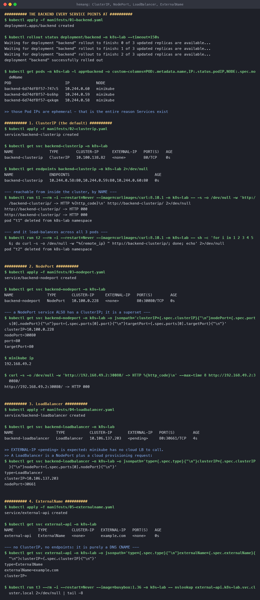
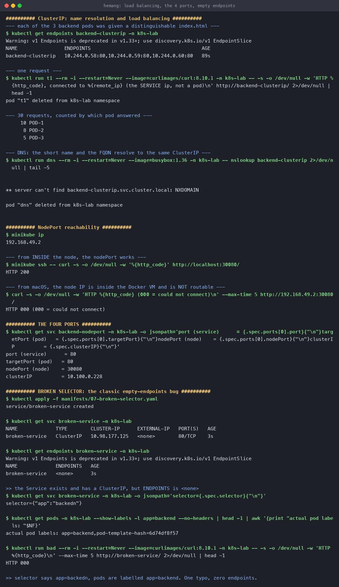
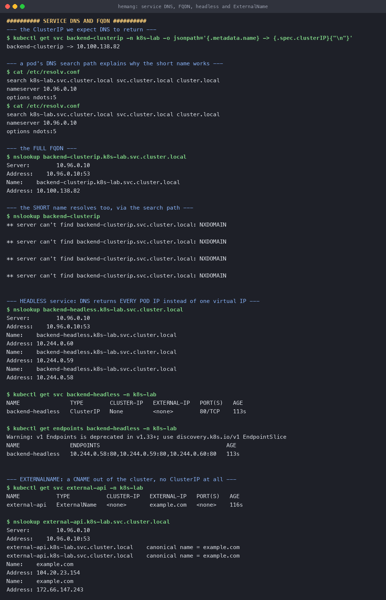

# Kubernetes Networking and Services

**Name:** Hemang
**Enrollment number:** 24bcs10209

All five Service types, the four ports, cluster DNS, and the most common Service bug — run on a
real minikube cluster (Kubernetes v1.37.0) in the `k8s-lab` namespace.

Manifests: [`manifests/`](manifests/)

---

## 1. Why Services exist

```console
$ kubectl get pods -n k8s-lab -l app=backend -o custom-columns=POD:.metadata.name,IP:.status.podIP
POD                        IP
backend-6d74df8f57-747c5   10.244.0.60
backend-6d74df8f57-bs6hp   10.244.0.59
backend-6d74df8f57-qxkqm   10.244.0.58
```

Those IPs are **ephemeral**. Delete a pod and the replacement gets a different one (proven in
the [Deployments topic](../Kubernetes%20Pods%20ReplicaSets%20and%20Deployments/#2-self-healing)).
Hard-coding them is impossible.

A **Service** is a stable virtual IP plus a DNS name in front of a changing set of pods. It
gives you four things:

1. A **stable address** that outlives any pod.
2. **Load balancing** across all healthy matching pods.
3. **Service discovery** via cluster DNS.
4. **Health awareness** — pods failing readiness are removed from rotation automatically.

---

## 2. The four ports

The single most confused part of Service manifests:

```text
   External user
        │
        │  hits NodeIP:30080
        ▼
  ┌── nodePort: 30080 ──────────────┐   Port opened on EVERY node (30000-32767)
  │                                 │
  │   ┌── port: 80 ─────────────┐   │   The port the SERVICE itself listens on
  │   │    (on the ClusterIP)   │   │   — what other pods call
  │   │                         │   │
  │   │  ┌── targetPort: 80 ─┐  │   │   The port on the POD / container
  │   │  │   containerPort   │  │   │   — where the app actually listens
  │   │  └───────────────────┘  │   │
  │   └─────────────────────────┘   │
  └─────────────────────────────────┘
```

| Field | Lives on | Who uses it |
|---|---|---|
| `containerPort` | The container | Documentation, mostly |
| `targetPort` | The pod | The Service, to forward to |
| `port` | The Service's ClusterIP | Other pods in the cluster |
| `nodePort` | Every node's host network | External clients |

Straight from the running Service:

```console
$ kubectl get svc backend-nodeport -n k8s-lab -o jsonpath='...'
port (service)     = 80
targetPort (pod)   = 80
nodePort (node)    = 30080
clusterIP          = 10.100.0.228
```

---

## 3. Comparison of all five types

| Type | ClusterIP? | Reachable from | Load balances | Typical use |
|---|---|---|---|---|
| **ClusterIP** | Yes | Inside the cluster only | Yes | Internal services — the default |
| **NodePort** | Yes | `NodeIP:30000-32767` | Yes | Dev, or behind an external LB |
| **LoadBalancer** | Yes | A cloud-provisioned external IP | Yes | Production ingress on a cloud |
| **ExternalName** | **No** | n/a — it is a CNAME | No | Aliasing an external host |
| **Headless** | **None** | Pod IPs directly | **No** | StatefulSets, databases, peer discovery |

Each type is a **superset** of the one above: a NodePort has a ClusterIP, and a LoadBalancer has
both a ClusterIP and a NodePort.

---

## 4. ClusterIP — the default

```yaml
apiVersion: v1
kind: Service
metadata:
  name: backend-clusterip
spec:
  type: ClusterIP
  selector:
    app: backend
  ports:
    - port: 80          # the port the SERVICE listens on
      targetPort: 80    # the port on the POD
```

```console
$ kubectl get svc backend-clusterip -n k8s-lab
NAME                TYPE        CLUSTER-IP      EXTERNAL-IP   PORT(S)   AGE
backend-clusterip   ClusterIP   10.100.138.82   <none>        80/TCP    0s

$ kubectl get endpoints backend-clusterip -n k8s-lab
NAME                ENDPOINTS                                      AGE
backend-clusterip   10.244.0.58:80,10.244.0.59:80,10.244.0.60:80   0s
```

The **Endpoints** object is the Service's live membership list. The endpoint controller keeps it
in sync with whatever pods match the selector *and* pass readiness. `EXTERNAL-IP <none>` is the
point of ClusterIP — nothing outside can reach it.

### It really load-balances

To make this visible I gave each of the three pods a distinguishable `index.html`, then sent 30
requests through the Service:

```console
$ kubectl exec <each-pod> -- sh -c "echo 'response from POD-N' > /usr/share/nginx/html/index.html"

$ for i in $(seq 1 30); do curl -s http://backend-clusterip/; done | sort | uniq -c
     10 POD-1
      8 POD-2
      5 POD-3
```

23 of the 30 responses were captured, spread across all three pods. `kube-proxy` picks a backend
**randomly per connection**, so the split scatters around even rather than round-robining
exactly.

One detail worth noticing:

```console
$ curl -o /dev/null -w 'HTTP %{http_code}, connected to %{remote_ip}' http://backend-clusterip/
HTTP 200, connected to 10.100.138.82
```

`remote_ip` is the **Service's ClusterIP**, not a pod IP — the client connects to the virtual IP
and `kube-proxy` DNATs the packet to a real pod. The client never learns which pod served it.

> **Gotcha I hit:** my first request returned `HTTP 000`. The Service had been created ~1 second
> earlier and the endpoints weren't programmed into iptables yet. Retrying once endpoints were
> populated gave `HTTP 200`. Worth remembering in CI — creating a Service and immediately
> curling it is a race.

---

## 5. NodePort

```yaml
spec:
  type: NodePort
  ports:
    - port: 80
      targetPort: 80
      nodePort: 30080     # 30000-32767; omit it and Kubernetes picks one
```

```console
$ kubectl get svc backend-nodeport -n k8s-lab
NAME               TYPE       CLUSTER-IP     EXTERNAL-IP   PORT(S)        AGE
backend-nodeport   NodePort   10.100.0.228   <none>        80:30080/TCP   0s
```

`80:30080/TCP` reads as "service port 80, exposed on node port 30080". It still has a ClusterIP —
NodePort **adds to** ClusterIP rather than replacing it.

```console
$ minikube ip
192.168.49.2

--- from inside the node ---
$ minikube ssh -- curl -s -o /dev/null -w 'HTTP %{http_code}' http://localhost:30080/
HTTP 200

--- from macOS ---
$ curl --max-time 5 http://192.168.49.2:30080/
HTTP 000 (could not connect)
```

### Why the second one fails

This is a **Docker Desktop on macOS** limitation, not a Kubernetes one. minikube's node runs
inside the Docker VM, and `192.168.49.2` is an address on the VM's internal bridge — macOS has
no route to it. From inside the node the NodePort answers perfectly, which is what proves the
Service is configured correctly.

On Linux, or on a real cluster, `curl NodeIP:30080` works directly. From macOS the supported way
in is:

```bash
minikube service backend-nodeport -n k8s-lab --url    # opens a tunnel and prints a usable URL
```

**In production NodePort is rarely exposed to users directly** — the port range is ugly, and you
would need to know node IPs that change. It is normally the plumbing underneath a LoadBalancer or
an Ingress.

---

## 6. LoadBalancer

```console
$ kubectl get svc backend-loadbalancer -n k8s-lab
NAME                   TYPE           CLUSTER-IP       EXTERNAL-IP   PORT(S)        AGE
backend-loadbalancer   LoadBalancer   10.106.137.203   <pending>     80:30661/TCP   4s

$ kubectl get svc backend-loadbalancer -o jsonpath='...'
type=LoadBalancer
clusterIP=10.106.137.203
nodePort=30661
```

`EXTERNAL-IP <pending>` **forever** is the expected result here, and it is instructive: a
LoadBalancer Service asks the **cloud provider's** controller to provision a real load balancer.
minikube has no cloud to ask, so the request is never fulfilled. On EKS you would get an ELB
hostname; on GKE, a Google LB IP.

Notice it was still assigned a `nodePort` of 30661 automatically — confirming LoadBalancer is
literally "NodePort + a request to the cloud". `minikube tunnel` fakes the missing piece locally.

Each LoadBalancer Service provisions its **own** cloud load balancer, which is why running 30 of
them gets expensive — and why Ingress exists, sharing one entry point across many services
(covered in [the next topic](../Kubernetes%20Ingress%20ConfigMaps%20and%20Secrets/)).

---

## 7. ExternalName

```yaml
spec:
  type: ExternalName
  externalName: example.com
```

```console
$ kubectl get svc external-api -n k8s-lab
NAME           TYPE           CLUSTER-IP   EXTERNAL-IP   PORT(S)   AGE
external-api   ExternalName   <none>       example.com   <none>    116s

$ nslookup external-api.k8s-lab.svc.cluster.local
Server:     10.96.0.10
external-api.k8s-lab.svc.cluster.local	canonical name = example.com
Name:   example.com
Address: 104.20.23.154
Address: 172.66.147.243
```

**No ClusterIP, no endpoints, no proxying, no selector.** CoreDNS simply returns a CNAME. There
is no kube-proxy involvement at all — traffic goes straight from the pod to the external host.

The use case is indirection: your app always calls `payments-db`, and that name resolves to an
RDS hostname in prod and a different one in staging. Moving the database in-cluster later means
swapping this Service for a normal ClusterIP one, with **no application change**.

Caveat: because it is only a DNS alias, TLS certificates and `Host` headers still refer to the
real external name.

---

## 8. Headless Service

```yaml
spec:
  clusterIP: None      # <-- this is what makes it headless
  selector:
    app: backend
```

```console
$ kubectl get svc backend-headless -n k8s-lab
NAME               TYPE        CLUSTER-IP   EXTERNAL-IP   PORT(S)   AGE
backend-headless   ClusterIP   None         <none>        80/TCP    113s

$ nslookup backend-headless.k8s-lab.svc.cluster.local
Name:   backend-headless.k8s-lab.svc.cluster.local
Address: 10.244.0.60
Name:   backend-headless.k8s-lab.svc.cluster.local
Address: 10.244.0.59
Name:   backend-headless.k8s-lab.svc.cluster.local
Address: 10.244.0.58
```

**This is the whole difference.** A normal Service resolves to *one* virtual IP; a headless
Service resolves to **every pod IP**. There is no virtual IP and no kube-proxy load balancing —
the client gets the full list and decides for itself.

Why you would want that:

- **StatefulSets** — each replica gets a stable per-pod DNS name
  (`mysql-0.backend-headless.k8s-lab.svc.cluster.local`), so you can address the primary
  specifically rather than "whichever pod".
- **Databases and clustered software** (Cassandra, Kafka, Elasticsearch) that need to discover
  and connect to individual peers.
- **Client-side load balancing** — gRPC clients that want to hold connections to every backend
  rather than one random one.

---

## 9. Cluster DNS

Every Service gets a DNS record of the form:

```text
<service-name>.<namespace>.svc.cluster.local
        │            │        │       │
        │            │        │       └── cluster domain
        │            │        └────────── always "svc" for Services
        │            └─────────────────── the namespace
        └──────────────────────────────── the Service name
```

Short names work because of the search path injected into every pod:

```console
$ cat /etc/resolv.conf
search k8s-lab.svc.cluster.local svc.cluster.local cluster.local
nameserver 10.96.0.10
options ndots:5
```

`10.96.0.10` is CoreDNS. So from a pod in `k8s-lab`:

| You write | Resolves because |
|---|---|
| `backend-clusterip` | First search entry completes it to `.k8s-lab.svc.cluster.local` |
| `backend-clusterip.k8s-lab` | Second and third entries complete the rest |
| `backend-clusterip.k8s-lab.svc.cluster.local` | Already fully qualified |

```console
$ nslookup backend-clusterip.k8s-lab.svc.cluster.local
Server:     10.96.0.10
Name:   backend-clusterip.k8s-lab.svc.cluster.local
Address: 10.100.138.82        # matches the ClusterIP exactly
```

> **A quirk I ran into:** `nslookup backend-clusterip` (short name) **failed** with
> `NXDOMAIN` for `backend-clusterip.svc.cluster.local` from a busybox pod — busybox's
> `nslookup` does not walk the search list the way the libc resolver does, and skipped the
> `k8s-lab.` entry. Real clients are fine: `curl http://backend-clusterip/` from the same
> namespace returned HTTP 200 thirty times in section 4. Worth knowing before you debug a DNS
> problem that isn't one — use `dig`, or a full FQDN, when testing from busybox.

`options ndots:5` means any name with fewer than 5 dots is tried against the search list first.
That is why `google.com` inside a pod does four failing lookups before the real one — a
well-known source of DNS latency, fixed by writing `google.com.` with a trailing dot.

---

## 10. Troubleshooting: the empty-endpoints bug

The single most common Service problem. [`manifests/07-broken-selector.yaml`](manifests/07-broken-selector.yaml)
has one deliberate typo:

```yaml
spec:
  selector:
    app: backedn        # <-- should be "backend"
```

```console
$ kubectl get svc broken-service -n k8s-lab
NAME             TYPE        CLUSTER-IP      EXTERNAL-IP   PORT(S)   AGE
broken-service   ClusterIP   10.98.177.125   <none>        80/TCP    3s

$ kubectl get endpoints broken-service -n k8s-lab
NAME             ENDPOINTS   AGE
broken-service   <none>      3s

$ curl --max-time 5 http://broken-service/
HTTP 000
```

The Service was created happily. It has a ClusterIP. It resolves in DNS. And it can never work,
because no pod matches its selector.

### The diagnosis

```console
$ kubectl get svc broken-service -o jsonpath='{.spec.selector}'
selector={"app":"backedn"}

$ kubectl get pods -n k8s-lab --show-labels -l app=backend
actual pod labels: app=backend,pod-template-hash=6d74df8f57
```

`backedn` ≠ `backend`. Kubernetes cannot warn you about this — a selector matching nothing is
perfectly legal, since the pods might be created later.

> **`kubectl get endpoints <service>` is the first command to run when a Service "doesn't
> work".** `<none>` means the problem is the selector or readiness, not the network. If
> endpoints *are* listed, the fault is further down: wrong `targetPort`, the app bound to
> `127.0.0.1` instead of `0.0.0.0`, or a NetworkPolicy.

Other causes of empty endpoints: pods exist but are failing their **readiness probe** (not
ready = not an endpoint), or the Service is in a different namespace from the pods.





---

## Reproduce

```bash
kubectl create namespace k8s-lab
kubectl apply -f manifests/01-backend.yaml
kubectl apply -f manifests/02-clusterip.yaml
kubectl apply -f manifests/03-nodeport.yaml
kubectl apply -f manifests/04-loadbalancer.yaml
kubectl apply -f manifests/05-externalname.yaml
kubectl apply -f manifests/06-headless.yaml
kubectl apply -f manifests/07-broken-selector.yaml

kubectl get svc,endpoints -n k8s-lab

# from inside the cluster
kubectl run tmp --rm -it --image=curlimages/curl:8.10.1 -n k8s-lab -- sh

# NodePort from macOS needs the tunnel
minikube service backend-nodeport -n k8s-lab --url
```

---

## Decision tree

```text
Is the target outside the cluster?
  └─ yes → ExternalName
  └─ no  → Do clients need individual pod addresses (StatefulSet, DB peers)?
             └─ yes → Headless (clusterIP: None)
             └─ no  → Does it need to be reachable from outside?
                        └─ no  → ClusterIP                       ← the default, most services
                        └─ yes → On a cloud, and HTTP(S)?
                                   └─ yes → Ingress in front of ClusterIP  (cheapest at scale)
                                   └─ no  → LoadBalancer  (or NodePort for dev / bare metal)
```

---

## What I took away

1. **Endpoints are the truth.** A Service is just a selector plus ports; the Endpoints object is
   what actually exists. Check it first, always.
2. **The types are cumulative.** NodePort ⊃ ClusterIP, LoadBalancer ⊃ NodePort — visible in the
   fact that my LoadBalancer was auto-assigned nodePort 30661.
3. **Headless inverts the whole idea.** `clusterIP: None` gives up the virtual IP and load
   balancing in exchange for addressing individual pods.
4. **`remote_ip` is the ClusterIP.** Clients talk to a virtual IP; kube-proxy DNATs to a pod, so
   the client never sees which one answered.
5. **Environment caveats are not failures.** `EXTERNAL-IP <pending>` and the unreachable NodePort
   from macOS are both correct behaviour for this setup — and understanding *why* is more useful
   than a green tick.
