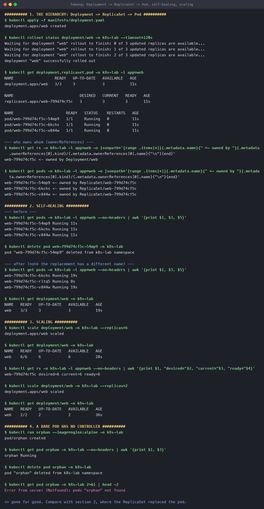
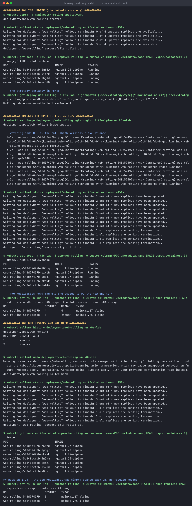
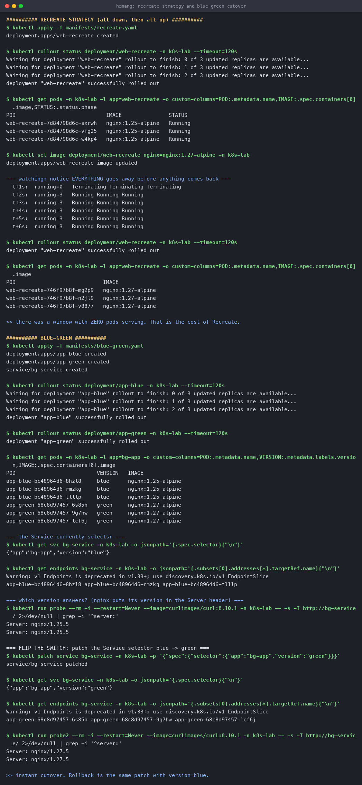
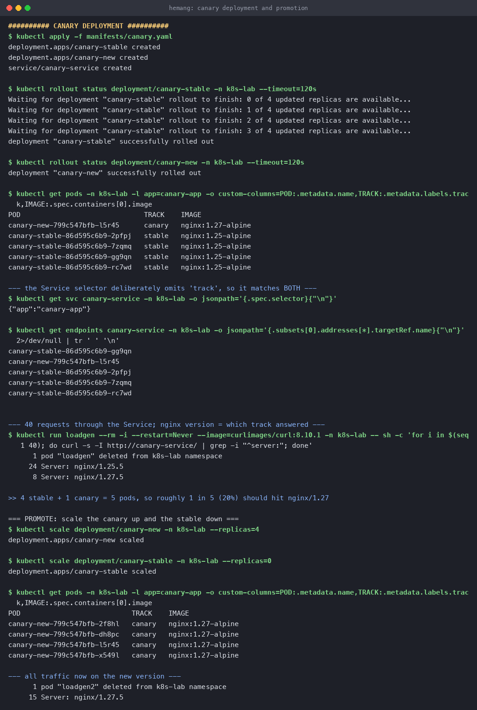
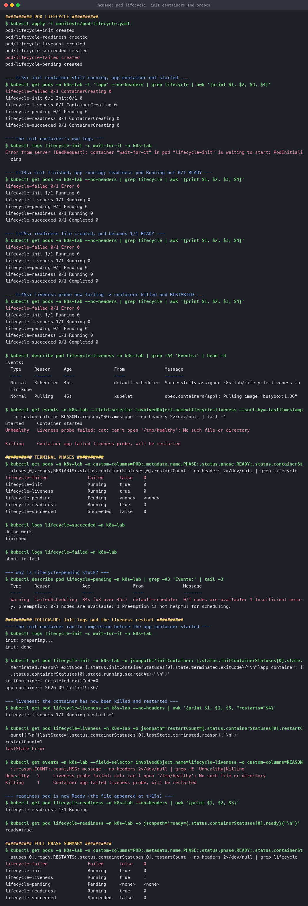
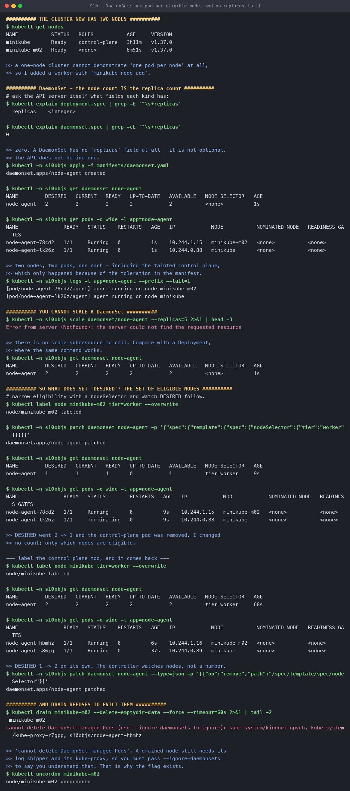
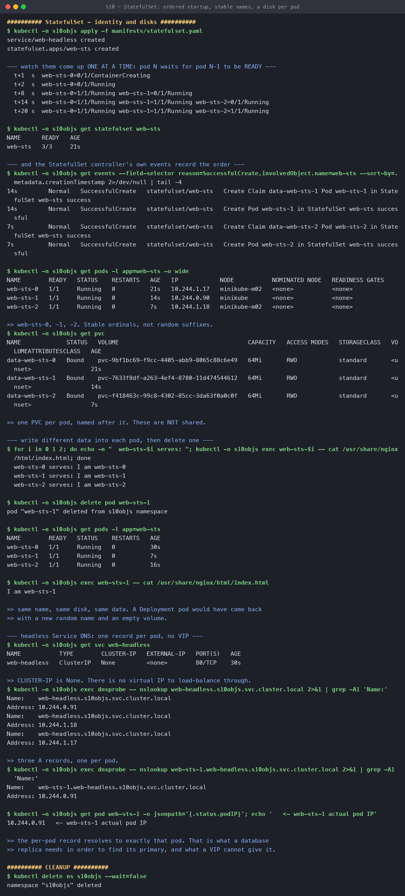

# Kubernetes Pods, ReplicaSets and Deployments

**Name:** Hemang
**Enrollment number:** 24bcs10209

Core workload objects and the four deployment strategies, all run on a real minikube cluster
(Kubernetes v1.37.0) in the `k8s-lab` namespace.

| Section | Covers |
|---|---|
| [1](#1-the-hierarchy) | Deployment → ReplicaSet → Pod, and ownership |
| [2](#2-self-healing) | Killing a Pod and watching it come back |
| [3](#3-scaling) | Scaling up and down |
| [4](#4-rolling-update) | Rolling update, rollout history, rollback |
| [5](#5-recreate) | Recreate strategy and its downtime |
| [6](#6-blue-green) | Blue-green cutover via a Service selector |
| [7](#7-canary) | Canary release and promotion |
| [8](#8-pod-lifecycle) | Init containers, readiness, liveness, phases |
| [9](#9-daemonset--one-pod-per-node) | DaemonSet on a **two-node** cluster, tolerations, nodeSelector |
| [10](#10-statefulset--identity-and-disks) | StatefulSet: ordered startup, stable names, a disk per Pod |

Manifests: [`manifests/`](manifests/)

---

## 1. The hierarchy

Three objects, three jobs:

```text
Deployment    "I manage versions and rollouts."
    │          Creates a NEW ReplicaSet for each change to the pod template.
    ▼
ReplicaSet    "I keep exactly N pods alive."
    │          Does nothing about versions — only counting.
    ▼
Pod           "I run containers."
               Disposable. Never created directly in production.
```

[`manifests/deployment.yaml`](manifests/deployment.yaml):

```yaml
apiVersion: apps/v1
kind: Deployment
metadata:
  name: web
  namespace: k8s-lab
spec:
  replicas: 3
  selector:
    matchLabels:          # how the Deployment finds the Pods it owns
      app: web
  template:               # everything below is a Pod spec
    metadata:
      labels:
        app: web          # MUST match spec.selector.matchLabels
    spec:
      containers:
        - name: nginx
          image: nginx:1.25-alpine
          ports:
            - containerPort: 80
          resources:
            requests: { cpu: "10m",  memory: "16Mi" }
            limits:   { cpu: "200m", memory: "128Mi" }
```

```console
$ kubectl apply -f manifests/deployment.yaml
deployment.apps/web created

$ kubectl rollout status deployment/web -n k8s-lab
Waiting for deployment "web" rollout to finish: 0 of 3 updated replicas are available...
deployment "web" successfully rolled out

$ kubectl get deployment,replicaset,pod -n k8s-lab -l app=web
NAME                  READY   UP-TO-DATE   AVAILABLE   AGE
deployment.apps/web   3/3     3            3           11s

NAME                             DESIRED   CURRENT   READY   AGE
replicaset.apps/web-799d74cf5c   3         3         3       11s

NAME                       READY   STATUS    RESTARTS   AGE
pod/web-799d74cf5c-54mp9   1/1     Running   0          11s
pod/web-799d74cf5c-6kchs   1/1     Running   0          11s
pod/web-799d74cf5c-v844w   1/1     Running   0          11s
```

I created **one** object and got three. The ownership chain is real and queryable:

```console
$ kubectl get rs -n k8s-lab -l app=web -o jsonpath='...ownerReferences...'
web-799d74cf5c <- owned by Deployment/web

$ kubectl get pods -n k8s-lab -l app=web -o jsonpath='...ownerReferences...'
web-799d74cf5c-54mp9 <- owned by ReplicaSet/web-799d74cf5c
web-799d74cf5c-6kchs <- owned by ReplicaSet/web-799d74cf5c
web-799d74cf5c-v844w <- owned by ReplicaSet/web-799d74cf5c
```

The `799d74cf5c` in the ReplicaSet name is a **hash of the pod template**. Change the template
and you get a different hash, hence a different ReplicaSet — which is exactly how rollbacks
work later on.

> **The label selector is the one thing to get right.** `spec.selector.matchLabels` must match
> `spec.template.metadata.labels`, or the API rejects the Deployment. Labels are the only way
> these objects find each other; there are no pointers.

---

## 2. Self-healing

```console
--- before ---
web-799d74cf5c-54mp9 Running 11s
web-799d74cf5c-6kchs Running 11s
web-799d74cf5c-v844w Running 11s

$ kubectl delete pod web-799d74cf5c-54mp9 -n k8s-lab
pod "web-799d74cf5c-54mp9" deleted from k8s-lab namespace

--- after ---
web-799d74cf5c-6kchs Running 19s
web-799d74cf5c-rltq5 Running 8s     <-- NEW pod, 8s old
web-799d74cf5c-v844w Running 19s

$ kubectl get deployment/web -n k8s-lab
NAME   READY   UP-TO-DATE   AVAILABLE   AGE
web    3/3     3            3           19s
```

Still 3/3. The ReplicaSet controller saw 2 pods where its spec says 3 and created one — note
the replacement has a **different name** (`rltq5`, age 8s). It is not the old pod restarted; it
is a brand new one.

### Compare with a bare Pod

```console
$ kubectl run orphan --image=nginx:alpine -n k8s-lab
pod/orphan created

$ kubectl delete pod orphan -n k8s-lab
pod "orphan" deleted from k8s-lab namespace

$ kubectl get pod orphan -n k8s-lab
Error from server (NotFound): pods "orphan" not found
```

Gone for good. **Self-healing is a property of the controller, not of Pods.** This is the whole
argument for never deploying a bare Pod.

---

## 3. Scaling

```console
$ kubectl scale deployment/web -n k8s-lab --replicas=6
deployment.apps/web scaled

$ kubectl get deployment/web -n k8s-lab
NAME   READY   UP-TO-DATE   AVAILABLE   AGE
web    6/6     6            6           28s

$ kubectl get rs -n k8s-lab -l app=web
web-799d74cf5c desired=6 current=6 ready=6

$ kubectl scale deployment/web -n k8s-lab --replicas=2
deployment.apps/web scaled

$ kubectl get deployment/web -n k8s-lab
NAME   READY   UP-TO-DATE   AVAILABLE   AGE
web    2/2     2            2           36s
```

Scaling changes **one number**. No new ReplicaSet appears, because the pod template didn't
change — the same ReplicaSet just has a new target.



---

## 4. Rolling update

The default strategy: replace pods a few at a time so the service never fully goes down.

```yaml
strategy:
  type: RollingUpdate
  rollingUpdate:
    maxUnavailable: 1   # at most 1 pod down at a time
    maxSurge: 1         # at most 1 extra pod above replicas
```

With `replicas: 4`, that means between 3 and 5 pods exist at any moment, and at least 3 are
always serving.

```console
$ kubectl get deploy web-rolling -n k8s-lab -o jsonpath='{.spec.strategy...}'
RollingUpdate maxUnavailable=1 maxSurge=1

$ kubectl set image deployment/web-rolling nginx=nginx:1.27-alpine -n k8s-lab
deployment.apps/web-rolling image updated
```

**Both versions are alive at the same time** during the roll:

```console
  t+1s:  web-rolling-548d57497b-lgdg7(ContainerCreating)   <- new
         web-rolling-548d57497b-nksvk(ContainerCreating)   <- new
         web-rolling-5c848dcfdb-6mf4w(Running)             <- old
         web-rolling-5c848dcfdb-94rrx(Running)             <- old
         web-rolling-5c848dcfdb-9hgdd(Running)             <- old
         web-rolling-5c848dcfdb-zv5d6(Terminating)         <- old, going away
```

`rollout status` narrates the whole thing:

```console
$ kubectl rollout status deployment/web-rolling -n k8s-lab
Waiting for deployment "web-rolling" rollout to finish: 2 out of 4 new replicas have been updated...
Waiting for deployment "web-rolling" rollout to finish: 3 out of 4 new replicas have been updated...
Waiting for deployment "web-rolling" rollout to finish: 1 old replicas are pending termination...
deployment "web-rolling" successfully rolled out
```

### Two ReplicaSets, one active

```console
$ kubectl get rs -n k8s-lab -l app=web-rolling
RS                       DESIRED   READY    IMAGE
web-rolling-548d57497b   4         4        nginx:1.27-alpine
web-rolling-5c848dcfdb   0         <none>   nginx:1.25-alpine
```

The old ReplicaSet isn't deleted — it is **scaled to 0 and kept**. That is what makes rollback
instant.

### Rollback

```console
$ kubectl rollout history deployment/web-rolling -n k8s-lab
REVISION  CHANGE-CAUSE
1         <none>
2         <none>

$ kubectl rollout undo deployment/web-rolling -n k8s-lab
deployment.apps/web-rolling rolled back

$ kubectl get rs -n k8s-lab -l app=web-rolling
RS                       DESIRED   IMAGE
web-rolling-548d57497b   0         nginx:1.27-alpine
web-rolling-5c848dcfdb   4         nginx:1.25-alpine
```

The numbers simply swapped. **No image was rebuilt or re-pulled** — Kubernetes scaled the old
ReplicaSet back up and the new one down. That is why rollback takes seconds.

`CHANGE-CAUSE` is `<none>` because I didn't annotate the change. Adding
`kubectl annotate deployment/web-rolling kubernetes.io/change-cause="upgrade to 1.27"` makes
the history readable — worth doing in real projects.



---

## 5. Recreate

All old pods are killed **first**, then new ones start. Simple, and it has downtime.

```yaml
strategy:
  type: Recreate
```

```console
$ kubectl set image deployment/web-recreate nginx=nginx:1.27-alpine -n k8s-lab
deployment.apps/web-recreate image updated

  t+1s:  running=0   Terminating Terminating Terminating    <-- NOTHING is serving
  t+2s:  running=3   Running Running Running
  t+3s:  running=3   Running Running Running
```

`running=0` at t+1s is the downtime window, captured. On this tiny nginx it lasted about a
second; with a JVM app that takes 40s to warm up, it would be 40s of 503s.

**Use Recreate when** the app cannot tolerate two versions running at once — a schema migration
that isn't backward compatible, or a singleton holding an exclusive lock. Otherwise prefer
RollingUpdate.

---

## 6. Blue-Green

Two complete environments; a **Service selector** decides which one gets traffic.

```yaml
# Deployment app-blue  -> labels: {app: bg-app, version: blue}   image nginx:1.25
# Deployment app-green -> labels: {app: bg-app, version: green}  image nginx:1.27
---
apiVersion: v1
kind: Service
metadata:
  name: bg-service
spec:
  selector:
    app: bg-app
    version: blue     # <-- THE SWITCH
```

Both environments are running the whole time:

```console
$ kubectl get pods -n k8s-lab -l app=bg-app
POD                          VERSION   IMAGE
app-blue-bc48964d6-8hzl8     blue      nginx:1.25-alpine
app-blue-bc48964d6-rmzkg     blue      nginx:1.25-alpine
app-blue-bc48964d6-tlllp     blue      nginx:1.25-alpine
app-green-68c8d97457-6s85h   green     nginx:1.27-alpine
app-green-68c8d97457-9g7hw   green     nginx:1.27-alpine
app-green-68c8d97457-lcf6j   green     nginx:1.27-alpine
```

But only blue is wired to the Service. nginx reports its version in the `Server:` header, so
the response itself proves which pods answered:

```console
$ kubectl get endpoints bg-service -n k8s-lab
app-blue-bc48964d6-8hzl8 app-blue-bc48964d6-rmzkg app-blue-bc48964d6-tlllp

$ curl -I http://bg-service/      # from a pod in the cluster
Server: nginx/1.25.5
```

### Flip the switch

```console
$ kubectl patch service bg-service -n k8s-lab -p '{"spec":{"selector":{"app":"bg-app","version":"green"}}}'
service/bg-service patched

$ kubectl get endpoints bg-service -n k8s-lab
app-green-68c8d97457-6s85h app-green-68c8d97457-9g7hw app-green-68c8d97457-lcf6j

$ curl -I http://bg-service/
Server: nginx/1.27.5
```

One patch, and the endpoints and the served version both changed. **Rollback is the identical
command with `version: blue`** — which is blue-green's real selling point: the old environment
is still running, untouched, ready to take traffic back in a second.

The cost is that you need **double the resources** for the whole period both environments are
up.



---

## 7. Canary

One Service in front of **both** versions. The trick is what the selector *omits*:

```yaml
# canary-stable: replicas 4, labels {app: canary-app, track: stable}  nginx:1.25
# canary-new:    replicas 1, labels {app: canary-app, track: canary}  nginx:1.27
---
spec:
  selector:
    app: canary-app     # NOTE: no 'track' - so it matches BOTH deployments
```

```console
$ kubectl get pods -n k8s-lab -l app=canary-app
POD                              TRACK    IMAGE
canary-new-799c547bfb-l5r45      canary   nginx:1.27-alpine
canary-stable-86d595c6b9-2pfpj   stable   nginx:1.25-alpine
canary-stable-86d595c6b9-7zqmq   stable   nginx:1.25-alpine
canary-stable-86d595c6b9-gg9qn   stable   nginx:1.25-alpine
canary-stable-86d595c6b9-rc7wd   stable   nginx:1.25-alpine

$ kubectl get endpoints canary-service -n k8s-lab
canary-stable-...gg9qn
canary-new-...l5r45        <-- the canary is in the same endpoint list
canary-stable-...2pfpj
canary-stable-...7zqmq
canary-stable-...rc7wd
```

### The split is the replica ratio

40 requests through the Service, counted by `Server:` header:

```console
     24 Server: nginx/1.25.5     <- stable
      8 Server: nginx/1.27.5     <- canary
```

**24 : 8** out of the 32 responses that were captured — about **25% canary**, against a
theoretical 20% (1 canary pod out of 5). `kube-proxy` load-balances randomly per connection, so
a sample this small scatters around the expected ratio rather than hitting it exactly.

That is the honest limitation of this technique: **your traffic granularity is limited by your
replica count.** 1-in-5 pods is the finest split you can get with 5 pods. For a true 1% canary
you need either 100 pods or a service mesh / ingress that splits by weight rather than by pod
count.

### Promote

```console
$ kubectl scale deployment/canary-new    -n k8s-lab --replicas=4
$ kubectl scale deployment/canary-stable -n k8s-lab --replicas=0

$ kubectl get pods -n k8s-lab -l app=canary-app
POD                           TRACK    IMAGE
canary-new-799c547bfb-2f8hl   canary   nginx:1.27-alpine
canary-new-799c547bfb-dh8pc   canary   nginx:1.27-alpine
canary-new-799c547bfb-l5r45   canary   nginx:1.27-alpine
canary-new-799c547bfb-x549l   canary   nginx:1.27-alpine

--- all traffic now on the new version ---
     15 Server: nginx/1.27.5
```

100% on 1.27. Aborting instead would have been `kubectl scale deployment/canary-new --replicas=0`,
affecting only the 20% who had been routed to it.



---

## 8. Pod lifecycle

[`manifests/pod-lifecycle.yaml`](manifests/pod-lifecycle.yaml) creates six pods, one per
situation.

### Phases

| Phase | Meaning |
|---|---|
| `Pending` | Accepted, but not running yet — unscheduled, or still pulling the image |
| `Running` | Bound to a node, at least one container started |
| `Succeeded` | All containers exited **0** and will not restart |
| `Failed` | All containers terminated, at least one **non-zero** |
| `Unknown` | The node stopped reporting |

All five, live at once:

```console
$ kubectl get pods -n k8s-lab -o custom-columns=POD:...,PHASE:...,READY:...,RESTARTS:...
lifecycle-failed               Failed      false    0
lifecycle-init                 Running     true     0
lifecycle-liveness             Running     true     1
lifecycle-pending              Pending     <none>   <none>
lifecycle-readiness            Running     true     0
lifecycle-succeeded            Succeeded   false    0
```

### Init containers

Run to completion, in order, **before** any app container starts. For waiting on a dependency,
running a migration, or fetching config.

```console
--- t+3s ---
lifecycle-init 0/1 Init:0/1 0          <-- "Init:0/1" = 0 of 1 init containers done

$ kubectl logs lifecycle-init -c wait-for-it -n k8s-lab
init: preparing...
init: done

$ kubectl get pod lifecycle-init -o jsonpath='...'
initContainer: Completed exitCode=0
app container: 2026-09-17T17:19:36Z
```

The app container's `startedAt` is after the init container's `Completed` — the ordering is
enforced, not hoped for. Note `-c wait-for-it` is required: `kubectl logs` on a pod with init
containers needs to be told which container you mean.

### Readiness probe — "should I get traffic?"

```console
--- t+14s: running, but NOT ready ---
lifecycle-readiness 0/1 Running 0

--- t+25s: the probe's file was created at t+15s ---
lifecycle-readiness 1/1 Running 0
ready=true
```

`Running` and `Ready` are different things. A failing readiness probe pulls the pod out of
Service endpoints but **does not restart it** — the app is alive, just not able to serve yet.
This is what prevents traffic hitting a pod that is still warming up.

### Liveness probe — "am I broken?"

The container creates `/tmp/healthy`, then deletes it after 20s so the probe starts failing:

```console
$ kubectl get pod lifecycle-liveness -n k8s-lab
lifecycle-liveness 1/1 Running restarts=1

$ kubectl get pod lifecycle-liveness -o jsonpath='...'
restartCount=1
lastState=Error

$ kubectl get events ... | grep -E 'Unhealthy|Killing'
Unhealthy   2     Liveness probe failed: cat: can't open '/tmp/healthy': No such file or directory
Killing     1     Container app failed liveness probe, will be restarted
```

`Unhealthy` fired **twice** — matching `failureThreshold: 2` — and only then did `Killing`
happen. Kubernetes does not restart on a single blip.

> **The distinction that matters:** readiness failing = *stop sending traffic*.
> Liveness failing = *kill and restart the container*. Putting a slow dependency check in a
> liveness probe is a classic way to build a restart loop: the database gets slow, every pod
> fails liveness, every pod restarts, and the outage gets worse.

### Pending — why it never scheduled

```console
$ kubectl describe pod lifecycle-pending -n k8s-lab
  Warning  FailedScheduling  34s (x3 over 45s)  default-scheduler
  0/1 nodes are available: 1 Insufficient memory.
  preemption: 0/1 nodes are available: 1 Preemption is not helpful for scheduling.
```

This pod requested 500Gi. The scheduler tells you exactly why in the Events — which is why
`describe` beats `get` when something is stuck.

### Succeeded and Failed

```console
$ kubectl logs lifecycle-succeeded -n k8s-lab
doing work
finished

$ kubectl logs lifecycle-failed -n k8s-lab
about to fail
```

Both have `restartPolicy: Never`, so they stay in their terminal phase. With the default
`restartPolicy: Always`, the failed one would have gone into `CrashLoopBackOff` — Kubernetes
restarting it with increasing backoff (10s, 20s, 40s… capped at 5 min).



---

## 9. DaemonSet — one Pod per node

A Deployment asks "how many?" A DaemonSet asks "which nodes?" — and the answer to the first
follows from the answer to the second.

```console
$ kubectl explain deployment.spec | grep -E '^\s+replicas'
  replicas	<integer>

$ kubectl explain daemonset.spec | grep -cE '^\s+replicas'
0
```

**`replicas` is not optional on a DaemonSet — the API does not define it.** Which is why this
fails rather than being ignored:

```console
$ kubectl scale daemonset/node-agent --replicas=5
Error from server (NotFound): the server could not find the requested resource
```

There is no `scale` subresource to call.

> **A one-node cluster cannot demonstrate any of this**, so I added a worker with
> `minikube node add` — `minikube` (control-plane) and `minikube-m02`.

```console
$ kubectl apply -f manifests/daemonset.yaml
daemonset.apps/node-agent created

$ kubectl get daemonset node-agent
NAME         DESIRED   CURRENT   READY   UP-TO-DATE   AVAILABLE   NODE SELECTOR   AGE
node-agent   2         2         2       2            2           <none>          1s

$ kubectl get pods -o wide -l app=node-agent
NAME               READY   STATUS    RESTARTS   NODE
node-agent-brjdt   1/1     Running   0          minikube-m02
node-agent-jlmkc   1/1     Running   0          minikube

$ kubectl logs -l app=node-agent --prefix --tail=1
[pod/node-agent-brjdt/agent] agent running on node minikube-m02
[pod/node-agent-jlmkc/agent] agent running on node minikube
```

Two nodes, two Pods, one each — **including the control plane**, which carries a `NoSchedule`
taint. A Deployment would simply have skipped it; this landed there only because of the
toleration in the manifest:

```yaml
tolerations:
  - key: node-role.kubernetes.io/control-plane
    operator: Exists
    effect: NoSchedule
```

That is almost always what you want from a node agent: a control-plane node needs its logs
shipped and its metrics exported just as much as a worker does.

### So what *does* set `DESIRED`?

The set of eligible nodes. Narrow it and watch the number follow:

```console
$ kubectl label node minikube-m02 tier=worker
$ kubectl patch daemonset node-agent \
    -p '{"spec":{"template":{"spec":{"nodeSelector":{"tier":"worker"}}}}}'

$ kubectl get daemonset node-agent
NAME         DESIRED   CURRENT   READY   NODE SELECTOR   AGE
node-agent   1         1         1       tier=worker     9s     ← 2 → 1

$ kubectl get pods -o wide -l app=node-agent
node-agent-brjdt   1/1   Running       minikube-m02
node-agent-jlmkc   1/1   Terminating   minikube        ← evicted, not scaled down
```

Label the control plane too and it comes back on its own:

```console
$ kubectl label node minikube tier=worker

$ kubectl get daemonset node-agent
node-agent   2   2   2   2   2   tier=worker   68s      ← 1 → 2
node-agent-hbmhz   1/1   Running   6s    minikube-m02
node-agent-s8wjg   1/1   Running   37s   minikube
```

**I never typed a number.** The controller watches the node list and reconciles against it,
which is exactly what you want from something that must exist on every machine — add a node to
the cluster at 3am and the log shipper is already there.

### Drain refuses to evict them

```console
$ kubectl drain minikube-m02 --delete-emptydir-data --force
cannot delete DaemonSet-managed Pods (use --ignore-daemonsets to ignore):
  kube-system/kindnet-npvch, kube-system/kube-proxy-r7gpp, s10objs/node-agent-brjdt
```

A node being drained still needs its CNI and its `kube-proxy` right up until it is removed —
evicting those would cut the node off mid-drain. So `drain` stops and makes you pass
`--ignore-daemonsets` to say you understand. That flag exists because of this exact class of
Pod.



---

## 10. StatefulSet — identity and disks

A Deployment's Pods are interchangeable. A StatefulSet's are not, and three things enforce that.

### Ordered startup

```console
$ kubectl apply -f manifests/statefulset.yaml

  t+1s   web-sts-0=0/1/ContainerCreating
  t+2s   web-sts-0=0/1/Running
  t+8s   web-sts-0=1/1/Running  web-sts-1=0/1/Running      ← -1 started once -0 was READY
  t+14s  web-sts-0=1/1/Running  web-sts-1=1/1/Running  web-sts-2=0/1/Running
  t+20s  web-sts-0=1/1/Running  web-sts-1=1/1/Running  web-sts-2=1/1/Running
```

Exactly seven seconds apart, matching the `initialDelaySeconds: 6` readiness probe — pod *N* is
not created until pod *N−1* reports **Ready**, not merely Running. That is `podManagementPolicy:
OrderedReady`, the default, and it is what lets a database replica assume its primary is already
up. The controller's own events record it:

```console
$ kubectl get events --field-selector reason=SuccessfulCreate,involvedObject.name=web-sts
14s   Create Claim data-web-sts-1 Pod web-sts-1 in StatefulSet web-sts success
14s   Create Pod web-sts-1 in StatefulSet web-sts successful
 7s   Create Claim data-web-sts-2 Pod web-sts-2 in StatefulSet web-sts success
 7s   Create Pod web-sts-2 in StatefulSet web-sts successful
```

> The probe is `tcpSocket`, not `httpGet`. The mounted volume starts empty and nginx answers
> **403** for a directory with no `index.html`, so an `httpGet /` probe never passes — I hit
> exactly that, and the StatefulSet stalled at `1/3` forever, because pod 1 could not become
> Ready so pod 2 was never created. An ordered StatefulSet turns a bad probe into a stuck
> rollout rather than a crash loop.

### Stable names and a disk each

```console
$ kubectl get pods -l app=web-sts
web-sts-0   1/1   Running   21s
web-sts-1   1/1   Running   14s
web-sts-2   1/1   Running    7s

$ kubectl get pvc
NAME             STATUS   VOLUME                                     CAPACITY
data-web-sts-0   Bound    pvc-9bf1bc69-f9cc-4405-abb9-8065c88c6e49   64Mi
data-web-sts-1   Bound    pvc-7633f8df-a263-4ef4-8780-11d474544612   64Mi
data-web-sts-2   Bound    pvc-f418463c-99c8-4302-85cc-3da63f0a0c0f   64Mi
```

Ordinals, not the `web-548d57497b-765tq` random suffix a Deployment gives you — and one PVC per
Pod from `volumeClaimTemplates`, each a **different** volume.

The test that matters: write different data into each, then delete one.

```console
  web-sts-0 serves: I am web-sts-0
  web-sts-1 serves: I am web-sts-1
  web-sts-2 serves: I am web-sts-2

$ kubectl delete pod web-sts-1
pod "web-sts-1" deleted

$ kubectl get pods -l app=web-sts
web-sts-1   1/1   Running   7s          ← same name

$ kubectl exec web-sts-1 -- cat /usr/share/nginx/html/index.html
I am web-sts-1                          ← same data
```

**Same name, same PVC, same data.** A Deployment Pod would have come back with a new random name
and, if it had a volume at all, a shared one. This is why `mysql-0` can be the primary: its
identity and its disk both survive a restart.

### Headless Service — one DNS record per Pod

```console
$ kubectl get svc web-headless
NAME           TYPE        CLUSTER-IP   PORT(S)
web-headless   ClusterIP   None         80/TCP     ← no virtual IP at all

$ nslookup web-headless.s10objs.svc.cluster.local
Address: 10.244.0.91
Address: 10.244.1.18
Address: 10.244.1.17                    ← three A records, one per pod

$ nslookup web-sts-1.web-headless.s10objs.svc.cluster.local
Address: 10.244.0.91

$ kubectl get pod web-sts-1 -o jsonpath='{.status.podIP}'
10.244.0.91                             ← exactly that pod
```

A normal Service hands out one VIP and load-balances behind it, which is useless when you need
to reach *the primary specifically*. `clusterIP: None` gives each Pod its own name, and
`web-sts-1.web-headless` is stable across restarts because the Pod name is.



---

## Reproduce

```bash
kubectl create namespace k8s-lab

kubectl apply -f manifests/deployment.yaml
kubectl apply -f manifests/rolling-update.yaml
kubectl set image deployment/web-rolling nginx=nginx:1.27-alpine -n k8s-lab
kubectl rollout status  deployment/web-rolling -n k8s-lab
kubectl rollout history deployment/web-rolling -n k8s-lab
kubectl rollout undo    deployment/web-rolling -n k8s-lab

kubectl apply -f manifests/recreate.yaml
kubectl apply -f manifests/blue-green.yaml
kubectl patch service bg-service -n k8s-lab -p '{"spec":{"selector":{"app":"bg-app","version":"green"}}}'

kubectl apply -f manifests/canary.yaml
kubectl apply -f manifests/pod-lifecycle.yaml

# DaemonSet and StatefulSet need more than one node
minikube node add
kubectl apply -f manifests/daemonset.yaml
kubectl get daemonset node-agent
kubectl get pods -o wide -l app=node-agent
kubectl scale daemonset/node-agent --replicas=5        # fails: no scale subresource

kubectl apply -f manifests/statefulset.yaml
kubectl get pods,pvc -l app=web-sts
kubectl delete pod web-sts-1                            # comes back with its disk
kubectl run dnsprobe --image=busybox:1.36 --restart=Never --command -- sleep 300
kubectl exec dnsprobe -- nslookup web-sts-1.web-headless.k8s-lab.svc.cluster.local

kubectl delete namespace k8s-lab       # clean up everything at once
```

---

## Strategy comparison

| | Downtime | Extra resources | Rollback speed | Blast radius of a bad release |
|---|---|---|---|---|
| **RollingUpdate** | None | ~1 extra pod | Fast (scale old RS up) | Grows as the roll proceeds |
| **Recreate** | **Yes** | None | Slow (another full cycle) | Everyone, immediately |
| **Blue-Green** | None | **2× for the cutover** | Instant (flip selector back) | Everyone, but only after the flip |
| **Canary** | None | 1 extra pod | Instant (scale canary to 0) | **Only the canary %** |

## Which object

| Question | Object |
|---|---|
| How many identical Pods, and are they alive? | **Deployment** (via its ReplicaSet) |
| One Pod on **every node**? | **DaemonSet** — you never set a count |
| Stable names and a stable disk per Pod? | **StatefulSet** |

Default to RollingUpdate. Reach for Blue-Green when you need an instant, complete rollback path,
and Canary when you want real users to validate a release before everyone gets it.

---

## What I took away

1. **A DaemonSet has no replica count, and that is the design.** `kubectl explain` shows the
   field simply does not exist, and `kubectl scale` fails with *the server could not find the
   requested resource*. `DESIRED` is computed from eligible nodes — I moved it 2 → 1 → 2 by
   changing labels and a `nodeSelector`, never a number.
2. **`drain` refusing to evict DaemonSet Pods is correct, not an obstacle.** A node being drained
   still needs its CNI and `kube-proxy`; `--ignore-daemonsets` exists so you have to say you know.
3. **`OrderedReady` waits for Ready, not Running** — my Pods came up exactly seven seconds apart,
   matching the readiness delay. A probe that can never pass therefore *stalls the whole
   StatefulSet* instead of crash-looping one Pod: an `httpGet /` probe against an empty mounted
   volume left mine at `1/3` indefinitely, because pod 2 is never created until pod 1 is Ready.
4. **StatefulSet identity is name + disk together.** Deleting `web-sts-1` brought back the same
   name bound to the same PVC with the same data. Neither half alone would be enough.
5. **A headless Service is how you address one Pod.** `clusterIP: None` replaces the VIP with one
   A record per Pod, and `web-sts-1.web-headless` resolved to exactly that Pod's IP.
6. **Deployments manage versions; ReplicaSets manage counts.** Every template change mints a
   new ReplicaSet named after the template hash, and the old ones are kept at 0 replicas — that
   is the entire rollback mechanism.
7. **Labels and selectors are the wiring.** Blue-green and canary differ only in which labels
   the Service selector includes. No code changes, no proxy config.
8. **Self-healing belongs to the controller.** A deleted Pod under a ReplicaSet returns with a
   new name; a bare Pod stays dead.
9. **Readiness and liveness solve different problems** and conflating them causes outages.
10. **Canary granularity is bounded by replica count.** 1 in 5 pods is a 20% canary, and the
   observed 24:8 split shows kube-proxy's randomness around that target.
