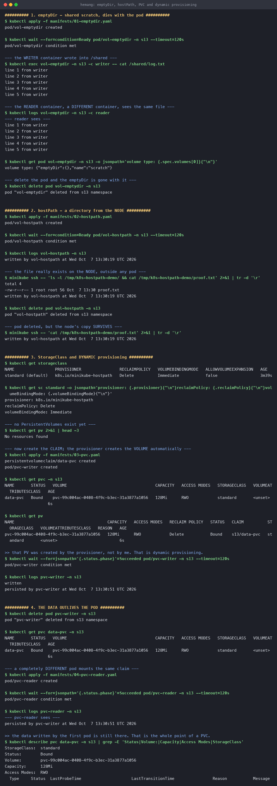
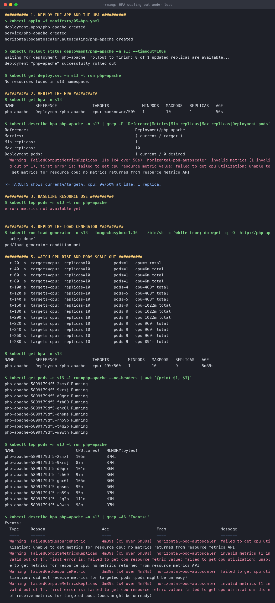
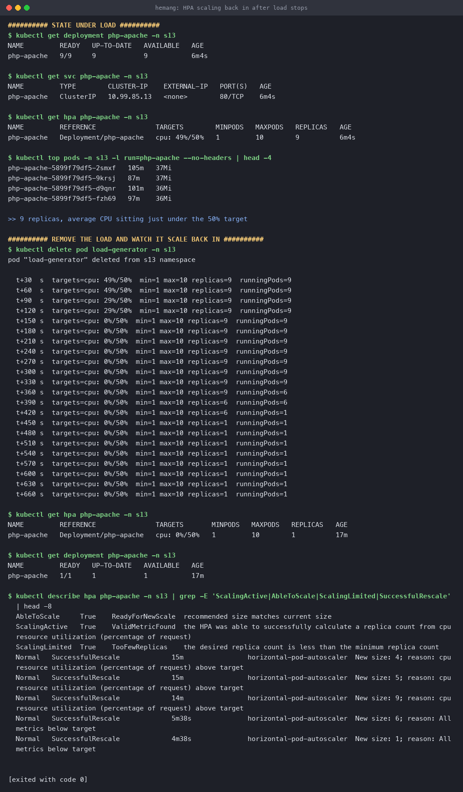
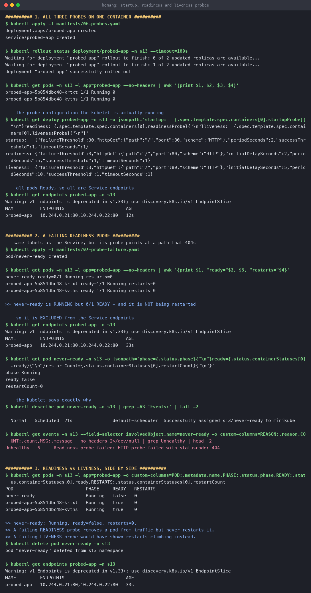
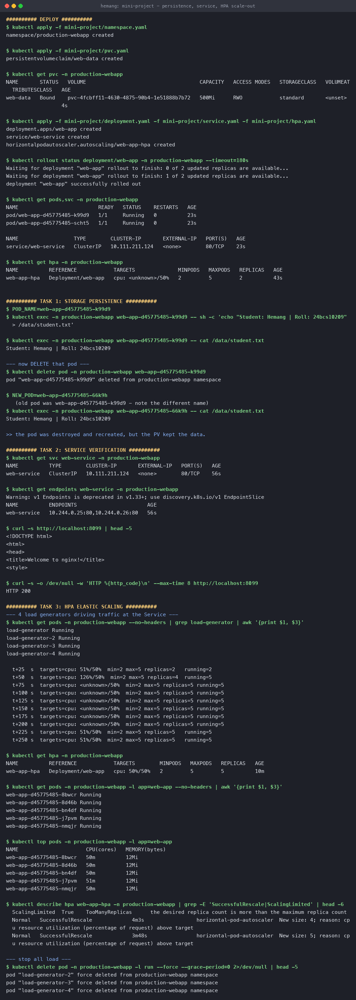
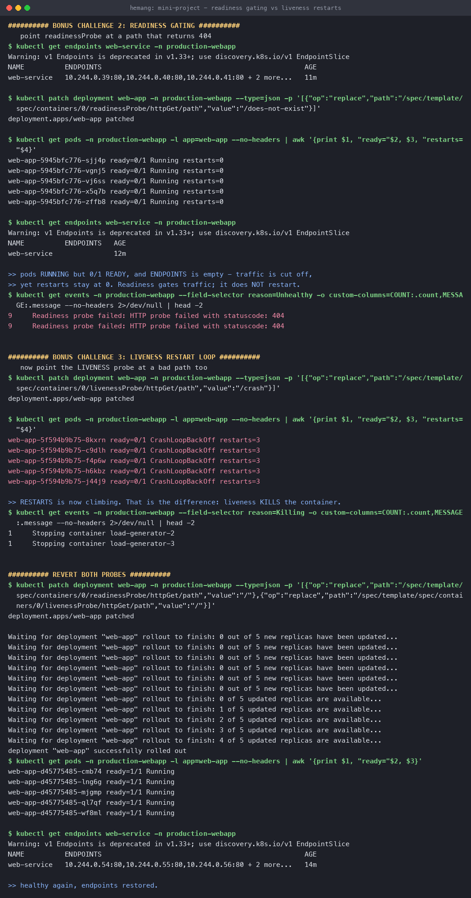

# Kubernetes Storage, HPA and Probes

**Name:** Hemang
**Enrollment number:** 24bcs10209

Session 13. Storage that outlives Pods, autoscaling driven by real CPU load, and the three
probe types — all run on a live minikube cluster (Kubernetes v1.37.0) with the
`metrics-server` and `default-storageclass` addons enabled.

| Task | Covers |
|---|---|
| [Task 1](#1-volumes) | `emptyDir`, `hostPath`, PV, PVC, StorageClass, dynamic provisioning |
| [Task 2](#2-hpa--horizontal-pod-autoscaler) | HPA with a load generator — full scale-out and scale-in |
| [Task 3](#3-mini-project--production-ready-web-app) | Mini project: all three pillars together |

- Volume deep-dive: [`01-kubernetes-volumes/README.md`](01-kubernetes-volumes/)
- Manifests: [`manifests/`](manifests/) · Mini project: [`mini-project/`](mini-project/)

---

## 1. Volumes

Full write-up in [`01-kubernetes-volumes/`](01-kubernetes-volumes/). The runs:

### `emptyDir` — shared between containers, dies with the Pod

```console
$ kubectl exec vol-emptydir -c writer -- cat /shared/log.txt
line 1 from writer
...
line 5 from writer

$ kubectl logs vol-emptydir -c reader
--- reader sees ---
line 1 from writer
...
line 5 from writer
```

Two **different containers** in one Pod, one shared directory. Delete the Pod and it's gone.

### `hostPath` — a directory on the node

```console
$ kubectl logs vol-hostpath
written by vol-hostpath at Wed Oct  7 13:30:19 UTC 2026

$ minikube ssh -- 'cat /tmp/k8s-hostpath-demo/proof.txt'
written by vol-hostpath at Wed Oct  7 13:30:19 UTC 2026

$ kubectl delete pod vol-hostpath
$ minikube ssh -- 'cat /tmp/k8s-hostpath-demo/proof.txt'
written by vol-hostpath at Wed Oct  7 13:30:19 UTC 2026     # survived
```

The data belongs to the **node**, which is also why it breaks the moment a Pod reschedules
elsewhere.

### StorageClass and dynamic provisioning

```console
$ kubectl get storageclass
NAME                 PROVISIONER                RECLAIMPOLICY   VOLUMEBINDINGMODE   AGE
standard (default)   k8s.io/minikube-hostpath   Delete          Immediate           3m39s

$ kubectl get pv
No resources found                      # nothing exists yet

$ kubectl apply -f manifests/03-pvc.yaml
persistentvolumeclaim/data-pvc created

$ kubectl get pvc -n s13
NAME       STATUS   VOLUME                                     CAPACITY   STORAGECLASS
data-pvc   Bound    pvc-99c004ac-0408-4f9c-b3ec-31a3877a1056   128Mi      standard

$ kubectl get pv
NAME                                       CAPACITY   RECLAIM POLICY   STATUS   CLAIM          STORAGECLASS
pvc-99c004ac-0408-4f9c-b3ec-31a3877a1056   128Mi      Delete           Bound    s13/data-pvc   standard
```

**I never wrote a PersistentVolume.** I created a *claim*, and the provisioner created the
volume and bound it. The `pvc-<uuid>` name is the tell that it was machine-generated.

### The data outlives the Pod

```console
$ kubectl logs pvc-writer
persisted by pvc-writer at Wed Oct  7 13:30:51 UTC 2026

$ kubectl delete pod pvc-writer
pod "pvc-writer" deleted

# a DIFFERENT pod mounts the SAME claim
$ kubectl logs pvc-reader
--- pvc-reader sees ---
persisted by pvc-writer at Wed Oct  7 13:30:51 UTC 2026
```



---

## 2. HPA — Horizontal Pod Autoscaler

The HPA watches a metric and changes a Deployment's `replicas` to keep it near a target.

```yaml
apiVersion: autoscaling/v2
kind: HorizontalPodAutoscaler
spec:
  scaleTargetRef:
    kind: Deployment
    name: php-apache
  minReplicas: 1
  maxReplicas: 10
  metrics:
    - type: Resource
      resource:
        name: cpu
        target:
          type: Utilization
          averageUtilization: 50     # 50% of the REQUEST, not of the node
```

> **The percentage is measured against `resources.requests.cpu`.** With `requests.cpu: 200m`,
> a target of 50% means 100m per Pod. **A container with no CPU request cannot be autoscaled on
> CPU at all** — the HPA has nothing to compute a percentage from.

### Scaling out

```console
$ kubectl run load-generator --image=busybox:1.36 -- \
    /bin/sh -c 'while true; do wget -q -O- http://php-apache; done'

  t+20 s   pods=1   cpu=     -        (metrics not ready yet)
  t+40 s   pods=1   cpu=6m
  t+100s   pods=4   cpu=468m
  t+120s   pods=5   cpu=468m
  t+160s   pods=9   cpu=1022m
  t+280s   pods=9   cpu=894m

$ kubectl get hpa -n s13
NAME         REFERENCE               TARGETS        MINPODS   MAXPODS   REPLICAS   AGE
php-apache   Deployment/php-apache   cpu: 49%/50%   1         10        9          5m39s
```

**1 → 4 → 5 → 9 replicas**, settling at 49% — just under the 50% target. The controller's
formula is:

```text
desiredReplicas = ceil( currentReplicas × currentMetric / targetMetric )
```



### Scaling back in

```console
$ kubectl delete pod load-generator

  t+30 s   targets=cpu: 49%/50%   replicas=9   running=9
  t+90 s   targets=cpu: 29%/50%   replicas=9   running=9
  t+150s   targets=cpu:  0%/50%   replicas=9   running=9     <-- CPU already idle
  t+300s   targets=cpu:  0%/50%   replicas=9   running=9     <-- still 9!
  t+360s   targets=cpu:  0%/50%   replicas=9   running=6     <-- finally scaling in
  t+420s   targets=cpu:  0%/50%   replicas=6   running=1
  t+660s   targets=cpu:  0%/50%   replicas=1   running=1
```

The interesting part: **CPU hit 0% at t+150s but nothing scaled down until t+360s.** That gap is
the **downscale stabilisation window**, 5 minutes by default
(`--horizontal-pod-autoscaler-downscale-stabilization`). The HPA deliberately scales **out fast
and in slow**, so a brief dip in traffic doesn't throw away capacity you are about to need.

```console
$ kubectl describe hpa php-apache -n s13
  Normal  SuccessfulRescale  15m     New size: 4; reason: cpu resource utilization above target
  Normal  SuccessfulRescale  15m     New size: 5; reason: cpu resource utilization above target
  Normal  SuccessfulRescale  14m     New size: 9; reason: cpu resource utilization above target
  Normal  SuccessfulRescale  5m38s   New size: 6; reason: All metrics below target
  Normal  SuccessfulRescale  4m38s   New size: 1; reason: All metrics below target
```



### `<unknown>` is normal at first

```console
$ kubectl get hpa -n s13
NAME         TARGETS              REPLICAS
php-apache   cpu: <unknown>/50%   1

  Warning  FailedGetResourceMetric  failed to get cpu utilization:
           no metrics returned from resource metrics API
```

metrics-server needs ~60 seconds of scrape history before it reports Pod metrics. This warning
on a fresh HPA is expected and resolves itself. If it **persists**, the real causes are:
metrics-server not installed, or no `resources.requests.cpu` on the container.

---

## 3. Probes

Three probes, three different questions:

| Probe | Question | On failure |
|---|---|---|
| **Startup** | Has it finished booting? | Restart — and it **disables the other two** until it passes |
| **Readiness** | Should it get traffic? | Remove from Service endpoints. **No restart.** |
| **Liveness** | Is it wedged? | **Kill and restart** the container |

```yaml
startupProbe:                     # up to 30 × 2s = 60s to boot
  httpGet: { path: /, port: 80 }
  failureThreshold: 30
  periodSeconds: 2
readinessProbe:
  httpGet: { path: /, port: 80 }
  periodSeconds: 5
  failureThreshold: 3
livenessProbe:
  httpGet: { path: /, port: 80 }
  periodSeconds: 10
  failureThreshold: 3
```

### A failing readiness probe

`never-ready` carries the Service's labels but probes a path that 404s:

```console
$ kubectl get pods -l app=probed-app
never-ready                   ready=0/1   Running   restarts=0
probed-app-5b854dbc48-krtxt   ready=1/1   Running   restarts=0
probed-app-5b854dbc48-kvths   ready=1/1   Running   restarts=0

$ kubectl get endpoints probed-app -n s13
NAME         ENDPOINTS
probed-app   10.244.0.21:80,10.244.0.22:80      # never-ready is NOT here

$ kubectl get events --field-selector involvedObject.name=never-ready
Unhealthy   6   Readiness probe failed: HTTP probe failed with statuscode: 404
```

**Running, not Ready, restarts=0, excluded from the Service.** That is readiness doing exactly
its job: it gates traffic without touching the container.



### Why the distinction matters

Putting a dependency check (database, downstream API) in a **liveness** probe is a classic
outage amplifier: the database gets slow → every Pod fails liveness → every Pod restarts → the
dependency gets hammered by reconnects → the outage gets worse. The same check in a
**readiness** probe just takes Pods out of rotation until things recover.

---

## 4. Mini project — production-ready web app

[`mini-project/`](mini-project/) combines all three pillars: a PVC for state, an HPA for elastic
scaling (min 2, max 5), and all three probes.

```console
$ kubectl apply -f mini-project/namespace.yaml -f mini-project/pvc.yaml
namespace/production-webapp created
persistentvolumeclaim/web-data created

$ kubectl get pvc -n production-webapp
NAME       STATUS   VOLUME                                     CAPACITY   STORAGECLASS
web-data   Bound    pvc-4fcbff11-4630-4875-90b4-1e51888b7b72   500Mi      standard

$ kubectl get pods,svc -n production-webapp
pod/web-app-d45775485-k99d9   1/1   Running
pod/web-app-d45775485-scht5   1/1   Running
service/web-service   ClusterIP   10.111.211.124   80/TCP
```

### Task 1 — storage persistence

```console
$ kubectl exec -n production-webapp web-app-d45775485-k99d9 -- \
    sh -c 'echo "Student: Hemang | Roll: 24bcs10209" > /data/student.txt'

$ kubectl exec -n production-webapp web-app-d45775485-k99d9 -- cat /data/student.txt
Student: Hemang | Roll: 24bcs10209

$ kubectl delete pod -n production-webapp web-app-d45775485-k99d9
pod "web-app-d45775485-k99d9" deleted

# a NEW pod, different name
$ kubectl exec -n production-webapp web-app-d45775485-66k9h -- cat /data/student.txt
Student: Hemang | Roll: 24bcs10209
```

The Pod was destroyed and rescheduled; the PersistentVolume kept the data.

### Task 2 — service verification

```console
$ kubectl get endpoints web-service -n production-webapp
NAME          ENDPOINTS
web-service   10.244.0.25:80,10.244.0.26:80

$ kubectl port-forward -n production-webapp svc/web-service 8099:80 &
$ curl -s http://localhost:8099 | head -4
<!DOCTYPE html>
<html>
<head>
<title>Welcome to nginx!</title>

$ curl -s -o /dev/null -w 'HTTP %{http_code}\n' http://localhost:8099
HTTP 200
```

### Task 3 — elastic scaling

One `wget` loop only reached **40%**, below the 50% target, so nothing scaled. That is a real
result worth keeping: *the autoscaler is working, the load just isn't enough.* Adding three more
generators crossed the threshold:

```console
$ kubectl get pods -n production-webapp | grep load-generator
load-generator     Running
load-generator-2   Running
load-generator-3   Running
load-generator-4   Running

  t+25 s   targets=cpu: 51%/50%   replicas=2   running=2
  t+50 s   targets=cpu: 126%/50%  replicas=4   running=5
  t+75 s   targets=cpu: <unknown> replicas=5   running=5
  t+225s   targets=cpu: 51%/50%   replicas=5   running=5

$ kubectl get hpa -n production-webapp
NAME          REFERENCE            TARGETS        MINPODS   MAXPODS   REPLICAS
web-app-hpa   Deployment/web-app   cpu: 50%/50%   2         5         5

$ kubectl top pods -n production-webapp -l app=web-app
web-app-d45775485-8bwcr   50m   12Mi
web-app-d45775485-8d46b   50m   12Mi
web-app-d45775485-bn4df   50m   12Mi
web-app-d45775485-j7pvm   51m   12Mi
web-app-d45775485-nmqjr   50m   12Mi

  ScalingLimited  True   TooManyReplicas   the desired replica count is more than the maximum
```

It landed on **exactly `50%/50%`** — 50m used against a 100m request, per Pod. `ScalingLimited:
TooManyReplicas` says the HPA wanted *more* than 5 but was capped by `maxReplicas`.



### Bonus challenges — readiness vs liveness, side by side

**Challenge 2 — readiness gating:**

```console
$ kubectl patch deployment web-app --type=json \
    -p '[{"op":"replace","path":".../readinessProbe/httpGet/path","value":"/does-not-exist"}]'

$ kubectl get pods -l app=web-app
web-app-5945bfc776-sjj4p   ready=0/1   Running   restarts=0
...all 5 the same...

$ kubectl get endpoints web-service -n production-webapp
NAME          ENDPOINTS
web-service               <-- EMPTY

Unhealthy   9   Readiness probe failed: HTTP probe failed with statuscode: 404
```

**Challenge 3 — liveness restart loop:**

```console
$ kubectl patch deployment web-app --type=json \
    -p '[{"op":"replace","path":".../livenessProbe/httpGet/path","value":"/crash"}]'

$ kubectl get pods -l app=web-app
web-app-5f594b9b75-8kxrn   ready=0/1   CrashLoopBackOff   restarts=3
...all 5 the same...
```

The contrast in one table:

| | Readiness fails | Liveness fails |
|---|---|---|
| Pod status | `Running` | `CrashLoopBackOff` |
| `READY` | `0/1` | `0/1` |
| **`RESTARTS`** | **0** | **3 and climbing** |
| Service endpoints | Empty | Empty |
| Recovers on its own? | Yes, when the probe passes | Only if the container starts passing |

Both cut traffic; only liveness kills the container. Reverting both paths brought all five Pods
back to `1/1 Running` with endpoints restored.



---

## Reproduce

```bash
minikube addons enable metrics-server
minikube addons enable default-storageclass
kubectl create namespace s13

kubectl apply -f manifests/01-emptydir.yaml
kubectl apply -f manifests/02-hostpath.yaml
kubectl apply -f manifests/03-pvc.yaml
kubectl apply -f manifests/04-pvc-reader.yaml
kubectl apply -f manifests/05-hpa.yaml
kubectl apply -f manifests/06-probes.yaml
kubectl apply -f manifests/07-probe-failure.yaml

# mini project
kubectl apply -f mini-project/
kubectl run load-generator -n production-webapp --image=busybox:1.36 --restart=Never -- \
  /bin/sh -c 'while true; do wget -q -O- http://web-service; done'
kubectl get hpa -n production-webapp -w

kubectl delete namespace s13 production-webapp
```

---

## Troubleshooting notes from this run

| Issue | Cause | Fix |
|---|---|---|
| `TARGETS: <unknown>/50%` for the first minute | metrics-server has no scrape history yet | Wait ~60s |
| `<unknown>` forever | No `resources.requests.cpu`, or no metrics-server | Add a CPU request; enable the addon |
| HPA never scales despite load | Load genuinely below target — mine plateaued at 40% | Add more load generators |
| Replicas stay high long after load stops | 5-minute downscale stabilisation window | Expected; wait, or tune the flag |
| PVC stuck `Pending` | No default StorageClass | `minikube addons enable default-storageclass` |
| `hostPath` data missing after reschedule | The data is on the *other* node | Use a PVC instead |

---

## What I took away

1. **HPA percentages are relative to `requests`, not to the node.** No CPU request means no
   CPU-based autoscaling.
2. **Scale out fast, scale in slow.** The 5-minute stabilisation window was clearly visible —
   CPU at 0% for 3.5 minutes before anything shrank.
3. **`maxReplicas` is a real ceiling**, and `ScalingLimited: TooManyReplicas` tells you when you
   have hit it.
4. **Readiness and liveness differ in exactly one observable:** the restart count. Everything
   else looks the same.
5. **A PVC is the only one of the three volume types that survives both Pod deletion and
   rescheduling** — `emptyDir` dies with the Pod, `hostPath` stays behind on one node.
