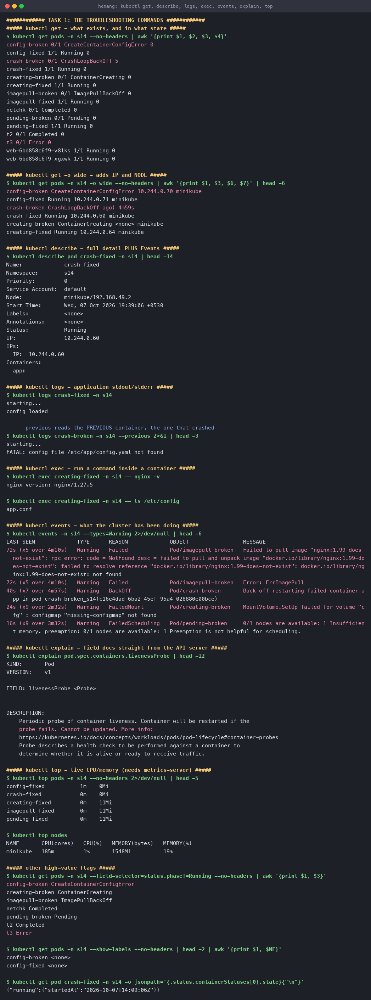
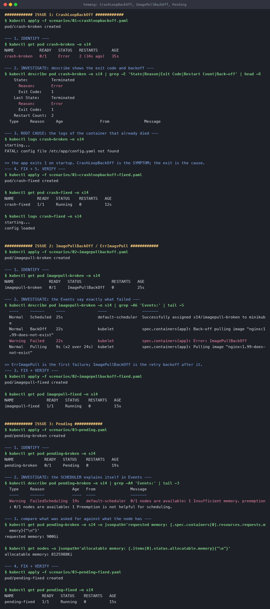
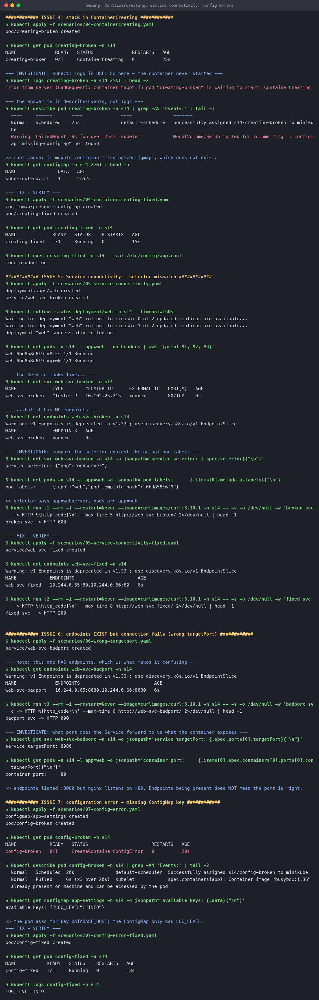
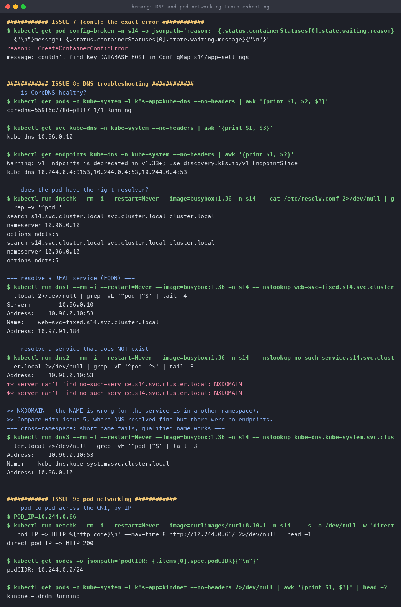

# Kubernetes Troubleshooting

**Name:** Hemang
**Enrollment number:** 24bcs10209

Session 14. The diagnostic commands, then **nine real failures** — each one deliberately broken,
investigated, root-caused, fixed and verified on a live minikube cluster in namespace `s14`.

Manifests: [`scenarios/`](scenarios/)

| | |
|---|---|
| [Task 1](#task-1--the-commands) | `get`, `describe`, `logs`, `exec`, `events`, `explain`, `top` |
| [Task 2](#task-2--nine-failures) | Nine issues, each broken → diagnosed → fixed → verified |
| [Method](#the-method) | The order to check things in |
| [Mini project](mini-project/) | One working app, two faults injected into it, each taken through the method |

---

## The method

Every scenario below follows the same five steps, because the order matters:

```text
1. IDENTIFY     kubectl get pods            → what STATUS?
2. INVESTIGATE  kubectl describe pod        → the Events at the bottom
3. ROOT CAUSE   kubectl logs [--previous]   → only if the container actually STARTED
4. FIX          edit + kubectl apply
5. VERIFY       kubectl get / curl          → prove it
```

**The single most useful rule:** if the container never started, `kubectl logs` has nothing for
you — the answer is in `describe`. Pod status tells you *which* tool to reach for:

| STATUS | Container started? | Look at |
|---|---|---|
| `Pending` | No — not even scheduled | `describe` → scheduler Events |
| `ContainerCreating` | No — kubelet is stuck | `describe` → `FailedMount` etc. |
| `ErrImagePull` / `ImagePullBackOff` | No — image never arrived | `describe` → pull Events |
| `CreateContainerConfigError` | No — config is invalid | `describe` → the waiting message |
| `CrashLoopBackOff` | **Yes**, then died | `logs --previous` |
| `Running` but `0/1` | Yes — readiness failing | `describe` → probe Events |

---

## Task 1 — the commands

### `kubectl get` — what exists and in what state

```console
$ kubectl get pods -n s14
config-broken      0/1   CreateContainerConfigError   0
crash-broken       0/1   CrashLoopBackOff             5
creating-broken    0/1   ContainerCreating            0
imagepull-broken   0/1   ImagePullBackOff             0
pending-broken     0/1   Pending                      0
crash-fixed        1/1   Running                      0
```

Filter straight to the problems:

```console
$ kubectl get pods -n s14 --field-selector=status.phase!=Running
config-broken      CreateContainerConfigError
creating-broken    ContainerCreating
imagepull-broken   ImagePullBackOff
pending-broken     Pending
```

`-o wide` adds the Pod IP and node — essential when a problem is node-specific:

```console
$ kubectl get pods -n s14 -o wide
config-fixed      Running   10.244.0.71   minikube
creating-broken   ContainerCreating   <none>   minikube     # no IP yet
```

### `kubectl describe` — detail **plus Events**

The Events block at the bottom is where Kubernetes explains itself. This is the first command
for almost every failure.

### `kubectl logs` — and `--previous`

```console
$ kubectl logs crash-broken -n s14 --previous
starting...
FATAL: config file /etc/app/config.yaml not found
```

**`--previous` is the one people forget.** In `CrashLoopBackOff` the current container is
usually waiting to start, so plain `logs` shows nothing useful — the error is in the instance
that just died.

### `kubectl exec`

```console
$ kubectl exec creating-fixed -n s14 -- nginx -v
nginx version: nginx/1.27.5

$ kubectl exec creating-fixed -n s14 -- ls /etc/config
app.conf
```

Confirms what the container *actually* sees — mounted files, env vars, reachable ports — rather
than what the YAML claims.

### `kubectl events` — the whole cluster's recent history

```console
$ kubectl events -n s14 --types=Warning
Warning  Failed             Pod/imagepull-broken   Failed to pull image "nginx:1.99-does-not-exist":
                                                   ... not found
Warning  BackOff            Pod/crash-broken       Back-off restarting failed container app
Warning  FailedMount        Pod/creating-broken    MountVolume.SetUp failed for volume "cfg":
                                                   configmap "missing-configmap" not found
Warning  FailedScheduling   Pod/pending-broken     0/1 nodes are available: 1 Insufficient memory.
```

**Four different root causes in one view.** When several things are broken at once this beats
describing each Pod individually.

### `kubectl explain`

```console
$ kubectl explain pod.spec.containers.livenessProbe
FIELD: livenessProbe <Probe>
DESCRIPTION:
    Periodic probe of container liveness. Container will be restarted if the
    probe fails. Cannot be updated.
```

Documentation from the API server itself, so it always matches **your** cluster version.

### `kubectl top`

```console
$ kubectl top nodes
NAME       CPU(cores)   CPU(%)   MEMORY(bytes)   MEMORY(%)
minikube   185m         1%       1548Mi          19%

$ kubectl top pods -n s14
creating-fixed    0m    11Mi
imagepull-fixed   0m    11Mi
```

Needs metrics-server. Essential for OOMKills and for sizing requests/limits.



---

## Task 2 — nine failures

### 1. `CrashLoopBackOff`

**Symptom**

```console
$ kubectl get pod crash-broken -n s14
NAME           READY   STATUS   RESTARTS      AGE
crash-broken   0/1     Error    2 (34s ago)   35s
```

**Investigate**

```console
$ kubectl describe pod crash-broken -n s14
    State:          Terminated
      Reason:       Error
      Exit Code:    1
    Restart Count:  2

$ kubectl logs crash-broken -n s14
starting...
FATAL: config file /etc/app/config.yaml not found
```

**Root cause** — the process exits 1 on startup. `CrashLoopBackOff` is not the problem; it is
Kubernetes' *response* to the problem, backing off between restarts (10s, 20s, 40s… capped at
5 min).

**Fix + verify**

```console
$ kubectl get pod crash-fixed -n s14
crash-fixed   1/1   Running   0   12s
$ kubectl logs crash-fixed -n s14
starting...
config loaded
```

**Other causes:** missing env var, wrong command/entrypoint, OOMKilled (check
`Reason: OOMKilled`), a failing liveness probe, or a dependency not yet reachable.

---

### 2. `ImagePullBackOff` / `ErrImagePull`

```console
$ kubectl get pod imagepull-broken -n s14
imagepull-broken   0/1   ImagePullBackOff   0   25s

$ kubectl describe pod imagepull-broken -n s14
  Normal   Pulling   Pulling image "nginx:1.99-does-not-exist"
  Warning  Failed    Error: ImagePullBackOff
  Normal   BackOff   Back-off pulling image "nginx:1.99-does-not-exist"

$ kubectl events -n s14 --types=Warning
Failed to pull image "nginx:1.99-does-not-exist": rpc error: code = NotFound
  desc = failed to resolve reference ... not found
```

**`ErrImagePull` vs `ImagePullBackOff`:** the first is the immediate failure, the second is the
state after Kubernetes starts backing off its retries. Same underlying cause.

**Root cause** — that tag does not exist. **Fix** — a real tag:

```console
$ kubectl get pod imagepull-fixed -n s14
imagepull-fixed   1/1   Running   0   15s
```

**Other causes:** typo in the image name, private registry with no `imagePullSecrets`, expired
registry credentials, rate limiting, or no network route to the registry.

---

### 3. `Pending`

```console
$ kubectl get pod pending-broken -n s14
pending-broken   0/1   Pending   0   19s

$ kubectl describe pod pending-broken -n s14
  Warning  FailedScheduling  default-scheduler
  0/1 nodes are available: 1 Insufficient memory.
  preemption: 0/1 nodes are available: 1 Preemption is not helpful for scheduling.
```

**Root cause** — compare the ask against the supply:

```console
$ kubectl get pod pending-broken -o jsonpath='{.spec.containers[0].resources.requests.memory}'
900Gi

$ kubectl get nodes -o jsonpath='{.items[0].status.allocatable.memory}'
8125988Ki                                      # ~7.75 Gi
```

**Fix + verify** — request `64Mi` instead → `1/1 Running`.

**Pending always means the scheduler could not place it.** Other causes: no node matches
`nodeSelector`/affinity, every node has a `taint` the Pod doesn't tolerate, or an unbound PVC.

---

### 4. Stuck in `ContainerCreating`

```console
$ kubectl get pod creating-broken -n s14
creating-broken   0/1   ContainerCreating   0   25s

$ kubectl logs creating-broken -n s14
Error from server (BadRequest): container "app" in pod "creating-broken"
  is waiting to start: ContainerCreating
```

**`logs` is useless here** — the container does not exist yet. The answer is in Events:

```console
$ kubectl describe pod creating-broken -n s14
  Warning  FailedMount  MountVolume.SetUp failed for volume "cfg":
                        configmap "missing-configmap" not found

$ kubectl get configmap -n s14
NAME               DATA   AGE
kube-root-ca.crt   1      2m52s          # the expected configmap is absent
```

**Fix + verify**

```console
$ kubectl get pod creating-fixed -n s14
creating-fixed   1/1   Running   0   15s
$ kubectl exec creating-fixed -n s14 -- cat /etc/config/app.conf
mode=production
```

**Other causes:** a PVC still `Pending`, a missing Secret, or a slow CNI/image pull.

---

### 5. Service connectivity — selector mismatch

The Service looks perfectly healthy:

```console
$ kubectl get svc web-svc-broken -n s14
web-svc-broken   ClusterIP   10.102.25.215   80/TCP
```

But:

```console
$ kubectl get endpoints web-svc-broken -n s14
NAME             ENDPOINTS   AGE
web-svc-broken   <none>      0s

$ curl --max-time 5 http://web-svc-broken/
broken svc -> HTTP 000
```

**Investigate** — compare the two strings that must match:

```console
$ kubectl get svc web-svc-broken -o jsonpath='{.spec.selector}'
{"app":"webserver"}

$ kubectl get pods -l app=web -o jsonpath='{.items[0].metadata.labels}'
{"app":"web","pod-template-hash":"6bd858c6f9"}
```

`webserver` ≠ `web`. **Fix + verify:**

```console
$ kubectl get endpoints web-svc-fixed -n s14
web-svc-fixed   10.244.0.65:80,10.244.0.66:80

$ curl http://web-svc-fixed/
fixed svc  -> HTTP 200
```

> **`kubectl get endpoints <svc>` is the first command for any "service doesn't work".**
> `<none>` → selector or readiness. Populated → look further down the stack.

---

### 6. Endpoints exist but connections still fail — wrong `targetPort`

This is the nastier sibling of #5, because the usual check **passes**:

```console
$ kubectl get endpoints web-svc-badport -n s14
web-svc-badport   10.244.0.65:8080,10.244.0.66:8080        # populated!

$ curl --max-time 6 http://web-svc-badport/
badport svc -> HTTP 000                                     # still broken
```

**Investigate**

```console
$ kubectl get svc web-svc-badport -o jsonpath='{.spec.ports[0].targetPort}'
8080

$ kubectl get pods -l app=web -o jsonpath='{.items[0].spec.containers[0].ports[0].containerPort}'
80
```

**Root cause** — the selector matched, so endpoints were created, but they point at port 8080
where nothing is listening. **Endpoints being present does not mean the port is right.**

Same class of bug: an app bound to `127.0.0.1` instead of `0.0.0.0` — endpoints look fine and
nothing can connect.

---

### 7. Configuration error — missing ConfigMap key

```console
$ kubectl get pod config-broken -n s14
config-broken   0/1   CreateContainerConfigError   0   20s

$ kubectl get pod config-broken -o jsonpath='{.status.containerStatuses[0].state.waiting}'
reason:  CreateContainerConfigError
message: couldn't find key DATABASE_HOST in ConfigMap s14/app-settings
```

The message names the exact key and the exact ConfigMap:

```console
$ kubectl get configmap app-settings -o jsonpath='{.data}'
{"LOG_LEVEL":"INFO"}
```

**Fix + verify** — reference a key that exists:

```console
$ kubectl get pod config-fixed -n s14
config-fixed   1/1   Running   0   13s
$ kubectl logs config-fixed -n s14
LOG_LEVEL=INFO
```

Adding `optional: true` to the `configMapKeyRef` is the alternative when the value is genuinely
not required.

---

### 8. DNS issues

Work down the chain:

```console
# 1. Is CoreDNS up?
$ kubectl get pods -n kube-system -l k8s-app=kube-dns
coredns-559f6c778d-p8tt7   1/1   Running

# 2. Does its Service have endpoints?
$ kubectl get endpoints kube-dns -n kube-system
kube-dns   10.244.0.4:9153,10.244.0.4:53,10.244.0.4:53

# 3. Does the pod have the right resolver?
$ kubectl exec <pod> -- cat /etc/resolv.conf
search s14.svc.cluster.local svc.cluster.local cluster.local
nameserver 10.96.0.10
options ndots:5

# 4. Resolve something real
$ nslookup web-svc-fixed.s14.svc.cluster.local
Name:    web-svc-fixed.s14.svc.cluster.local
Address: 10.97.91.184

# 5. Resolve something that doesn't exist
$ nslookup no-such-service.s14.svc.cluster.local
** server can't find no-such-service.s14.svc.cluster.local: NXDOMAIN
```

**The key distinction:**

| Result | Meaning |
|---|---|
| `NXDOMAIN` | The **name** is wrong — typo, or the Service is in another namespace |
| Resolves, connection fails | **Not DNS.** The Service has no endpoints, or the port is wrong (issues 5 and 6) |

Cross-namespace needs qualification — `kube-dns` alone fails from `s14`,
`kube-dns.kube-system.svc.cluster.local` works.

---

### 9. Pod networking

```console
$ POD_IP=10.244.0.66
$ curl --max-time 8 http://10.244.0.66/
direct pod IP -> HTTP 200

$ kubectl get nodes -o jsonpath='{.items[0].spec.podCIDR}'
10.244.0.0/24

$ kubectl get pods -n kube-system -l k8s-app=kindnet
kindnet-tdndm   Running
```

Hitting the Pod IP **directly**, bypassing the Service, is the quickest way to split the problem
in half:

- **Pod IP works, Service doesn't** → the fault is the Service (selector, port, kube-proxy).
- **Pod IP also fails** → the fault is the app or the CNI.

If pod-to-pod fails entirely, check the CNI DaemonSet (`kindnet` here), the node's `podCIDR`,
and any NetworkPolicies — a default-deny policy silently blackholes traffic.





---

## Reproduce

```bash
kubectl create namespace s14
kubectl apply -f scenarios/01-crashloopbackoff.yaml
kubectl describe pod crash-broken -n s14
kubectl logs crash-broken -n s14 --previous
kubectl apply -f scenarios/01-crashloopbackoff-fixed.yaml
# ...and so on for 02 through 07

kubectl events -n s14 --types=Warning     # all root causes at once
kubectl delete namespace s14
```

---

## Quick reference

| STATUS / symptom | Most likely cause | First command |
|---|---|---|
| `Pending` | Not schedulable — resources, taints, affinity, unbound PVC | `kubectl describe pod` |
| `ContainerCreating` (stuck) | Missing ConfigMap/Secret/PVC, CNI slow | `kubectl describe pod` |
| `ErrImagePull` / `ImagePullBackOff` | Bad tag, private registry, no pull secret | `kubectl describe pod` |
| `CreateContainerConfigError` | Missing ConfigMap/Secret **key** | `kubectl get pod -o jsonpath=...waiting` |
| `CrashLoopBackOff` | App exits non-zero, OOMKilled, bad liveness probe | `kubectl logs --previous` |
| `Running` but `0/1` | Readiness probe failing | `kubectl describe pod` → Events |
| Service unreachable, endpoints `<none>` | Selector mismatch or pods not Ready | `kubectl get endpoints` |
| Service unreachable, endpoints present | Wrong `targetPort`, app on `127.0.0.1` | compare `targetPort` to `containerPort` |
| `NXDOMAIN` | Wrong name or wrong namespace | `nslookup <fqdn>` |
| OOMKilled | Memory limit too low | `kubectl top pods`, `describe` → Last State |

---

## What I took away

1. **Status tells you which tool to use.** `logs` only helps once a container has started;
   everything before that lives in `describe` and Events.
2. **`--previous` is essential for CrashLoopBackOff** — the useful output belongs to the
   container that already died.
3. **`kubectl events --types=Warning` is underrated** — it surfaced four unrelated root causes
   in a single command.
4. **Endpoints present ≠ working Service.** Issue 6 passed the usual check and was still broken;
   the port has to match too.
5. **Distinguish DNS from routing.** `NXDOMAIN` is a naming problem; "resolves but won't
   connect" never is.
6. **Curl the Pod IP directly** to cut the problem space in half in one step.
