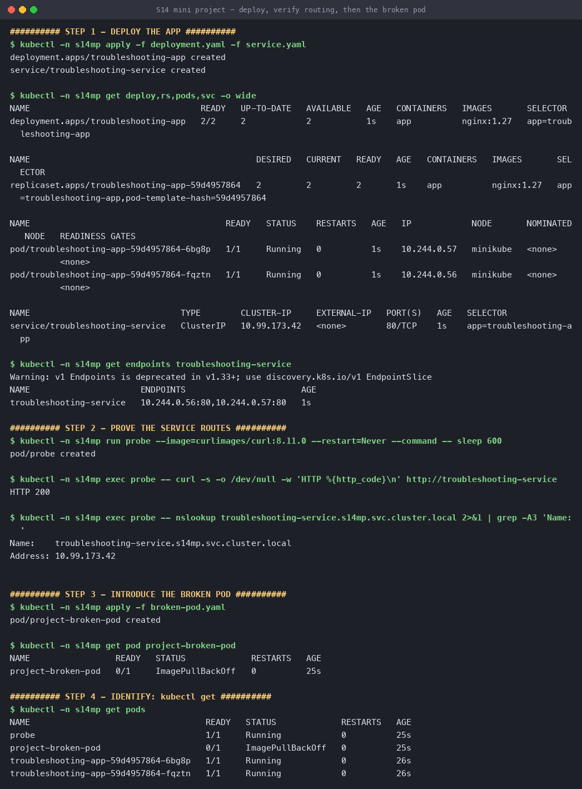
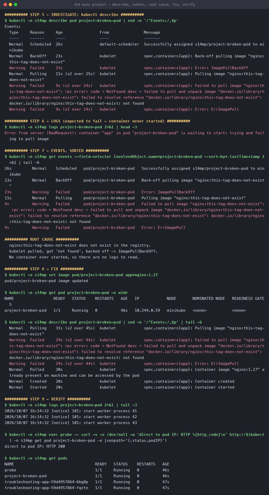
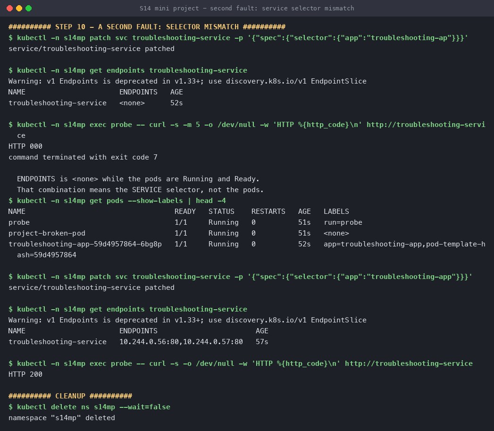

# Session 14 — Mini Project: Troubleshoot a Broken Deployment

**Name:** Hemang
**Enrollment number:** 24bcs10209

Deploy an app, prove it works, **then break it** — and diagnose the break with nothing but
`kubectl`. Run live on minikube in namespace `s14mp`.

| Manifest | What it is |
|---|---|
| [`deployment.yaml`](deployment.yaml) | `troubleshooting-app`, 2 replicas of `nginx:1.27` |
| [`service.yaml`](service.yaml) | `troubleshooting-service`, ClusterIP, `80 → 80` |
| [`broken-pod.yaml`](broken-pod.yaml) | `project-broken-pod` — image tag that does not exist |

The nine standalone failure scenarios are in the [parent session README](../README.md); this is
the project brief: one working app, two faults injected into it, each taken through the same
five-step method.

```text
1. IDENTIFY     kubectl get pods            → what STATUS?
2. INVESTIGATE  kubectl describe pod        → the Events at the bottom
3. ROOT CAUSE   kubectl logs                → only if the container actually STARTED
4. FIX          edit + apply
5. VERIFY       prove it, don't assume it
```

---

## Step 1 — a working baseline

You cannot tell what a break did unless you know what working looked like.

```console
$ kubectl -n s14mp apply -f deployment.yaml -f service.yaml
deployment.apps/troubleshooting-app created
service/troubleshooting-service created

$ kubectl -n s14mp get deploy,pods,svc -o wide
deployment.apps/troubleshooting-app   2/2   2   2   1s   nginx:1.27   app=troubleshooting-app
pod/troubleshooting-app-59d4957864-6btbc   1/1   Running   0   1s   10.244.0.52
pod/troubleshooting-app-59d4957864-nl5r9   1/1   Running   0   1s   10.244.0.53
service/troubleshooting-service   ClusterIP   10.99.173.42   80/TCP   app=troubleshooting-app

$ kubectl -n s14mp get endpoints troubleshooting-service
NAME                      ENDPOINTS                       AGE
troubleshooting-service   10.244.0.52:80,10.244.0.53:80   1s
```

**The endpoints list is the most useful line on this page.** It is the Service's selector
resolved against real pod IPs — the two pod IPs above appear in it verbatim. Keep that picture.

```console
$ kubectl -n s14mp exec probe -- curl -s -w 'HTTP %{http_code}' http://troubleshooting-service
HTTP 200

$ kubectl -n s14mp exec probe -- nslookup troubleshooting-service.s14mp.svc.cluster.local
Name:	troubleshooting-service.s14mp.svc.cluster.local
Address: 10.99.173.42
```

DNS resolves to the ClusterIP, and the ClusterIP serves traffic. Baseline established.



---

## Fault 1 — the broken pod

```console
$ kubectl -n s14mp apply -f broken-pod.yaml
pod/project-broken-pod created
```

### 1. Identify

```console
$ kubectl -n s14mp get pods
NAME                                   READY   STATUS             RESTARTS   AGE
project-broken-pod                     0/1     ImagePullBackOff   0          25s
troubleshooting-app-59d4957864-6btbc   1/1     Running            0          32s
troubleshooting-app-59d4957864-nl5r9   1/1     Running            0          32s
```

`ImagePullBackOff`, not `CrashLoopBackOff`. The distinction decides the next command:
**CrashLoop means the container started and died — read logs. ImagePull means it never
started — there are no logs to read.**

### 2. Investigate

```console
$ kubectl -n s14mp describe pod project-broken-pod
Events:
  Normal   Scheduled  25s   default-scheduler  Successfully assigned s14mp/project-broken-pod to minikube
  Normal   Pulling    8s    kubelet            Pulling image "nginx:this-tag-does-not-exist"
  Warning  Failed     6s    kubelet            Failed to pull image "nginx:this-tag-does-not-exist":
                                               rpc error: code = NotFound desc = failed to resolve reference
                                               "docker.io/library/nginx:this-tag-does-not-exist": not found
  Warning  Failed     6s    kubelet            Error: ErrImagePull
  Normal   BackOff    23s   kubelet            Back-off pulling image "nginx:this-tag-does-not-exist"
```

`Scheduled` succeeded — so this is **not** a scheduling problem; the pod has a node. The failure
is after placement, in the kubelet, and the message says exactly what: `not found`.

### 3. Logs — and why they are the wrong command here

```console
$ kubectl -n s14mp logs project-broken-pod
Error from server (BadRequest): container "app" in pod "project-broken-pod" is waiting to start:
trying and failing to pull image
```

Worth running once to see this. A container that never started has no stdout. `describe` is the
only source of truth for pre-start failures.

### 4. Root cause

`nginx:this-tag-does-not-exist` is not a tag in the registry. The kubelet pulled, got `NotFound`,
and entered exponential backoff — which is why the status is `ImagePullBackOff` rather than a
permanent error: Kubernetes keeps retrying in case the tag appears.

### 5. Fix and verify

```console
$ kubectl -n s14mp set image pod/project-broken-pod app=nginx:1.27
pod/project-broken-pod image updated

$ kubectl -n s14mp get pod project-broken-pod -o wide
NAME                 READY   STATUS    RESTARTS   AGE   IP
project-broken-pod   1/1     Running   0          45s   10.244.0.55

$ kubectl -n s14mp describe pod project-broken-pod     # the Events now tell the whole story
  Warning  Failed   26s (x2)  kubelet  Failed to pull image "nginx:this-tag-does-not-exist"
  Normal   Pulled   20s       kubelet  Container image "nginx:1.27" already present on machine
  Normal   Created  20s       kubelet  Container created
  Normal   Started  20s       kubelet  Container started

$ kubectl -n s14mp logs project-broken-pod             # NOW there are logs
2026/10/07 16:12:52 [notice] 1#1: start worker process 41

$ curl http://10.244.0.55
direct to pod IP: HTTP 200
```

`RESTARTS 0` — it never crashed, it just never started. And `Pulled` says *already present on
machine*, because the Deployment had already pulled `nginx:1.27` onto this node.



---

## Fault 2 — a Service that routes nowhere

The harder class of bug: **everything is `Running` and `Ready`, and the app is still down.**

```console
$ kubectl -n s14mp patch svc troubleshooting-service \
    -p '{"spec":{"selector":{"app":"troubleshooting-ap"}}}'     # one missing letter
service/troubleshooting-service patched

$ kubectl -n s14mp get endpoints troubleshooting-service
NAME                      ENDPOINTS   AGE
troubleshooting-service   <none>      57s

$ kubectl -n s14mp exec probe -- curl -m 5 http://troubleshooting-service
HTTP 000
command terminated with exit code 7
```

Exit code 7 is curl's *could not connect*. Not a 404, not a 502 — nothing is listening, because
nothing is behind the Service.

### The diagnostic that isolates it

```console
$ kubectl -n s14mp get pods --show-labels
NAME                                   READY   STATUS    LABELS
troubleshooting-app-59d4957864-6btbc   1/1     Running   app=troubleshooting-app,pod-template-hash=...
```

Pods `Running`, pods `Ready`, pods labelled `app=troubleshooting-app` — and
**`ENDPOINTS <none>`**. That combination can only mean one thing: the Service's selector does not
match the pods' labels. `describe pod` would have shown nothing wrong, because nothing *is* wrong
with the pods.

```console
$ kubectl -n s14mp patch svc troubleshooting-service \
    -p '{"spec":{"selector":{"app":"troubleshooting-app"}}}'

$ kubectl -n s14mp get endpoints troubleshooting-service
troubleshooting-service   10.244.0.52:80,10.244.0.53:80   63s     ← back

$ kubectl -n s14mp exec probe -- curl http://troubleshooting-service
HTTP 200
```

No pod was touched. The endpoints controller re-evaluated the selector and repopulated the list
within seconds.



---

## Reproduce

```bash
kubectl create ns s14mp
kubectl -n s14mp apply -f deployment.yaml -f service.yaml
kubectl -n s14mp get endpoints troubleshooting-service

kubectl -n s14mp apply -f broken-pod.yaml
kubectl -n s14mp get pods
kubectl -n s14mp describe pod project-broken-pod
kubectl -n s14mp set image pod/project-broken-pod app=nginx:1.27

kubectl -n s14mp patch svc troubleshooting-service -p '{"spec":{"selector":{"app":"wrong"}}}'
kubectl -n s14mp get endpoints troubleshooting-service
kubectl delete ns s14mp
```

---

## What I took away

1. **The STATUS column picks your next command.** `ImagePullBackOff` → `describe`.
   `CrashLoopBackOff` → `logs --previous`. `Pending` → `describe` for scheduling events. Reading
   logs on a pod that never started wastes the first minute of every outage.
2. **`RESTARTS 0` on a failing pod is information**, not an absence of it — it means the failure
   is before the container, so the problem is the image, the node, or the spec.
3. **`kubectl get endpoints` is the fastest Service diagnostic there is.** Empty endpoints with
   healthy pods points straight at the selector; populated endpoints with a failing curl points
   at ports, the network, or the app itself.
4. **"Running" is not "working".** Both faults here left at least some pods perfectly healthy;
   only the second one took the whole service down.
5. **Establish the baseline first.** Capturing the endpoints list while it worked is what made
   `<none>` obviously wrong a minute later.
