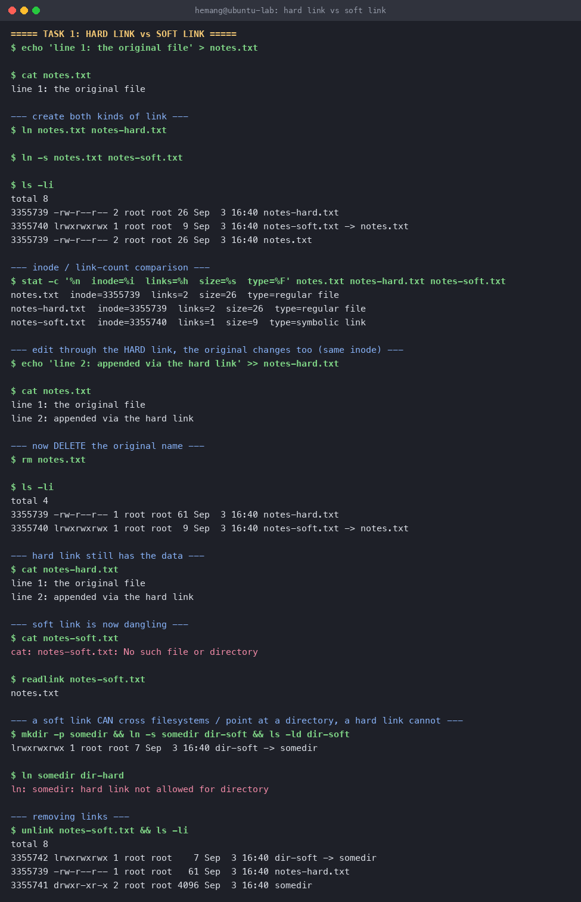
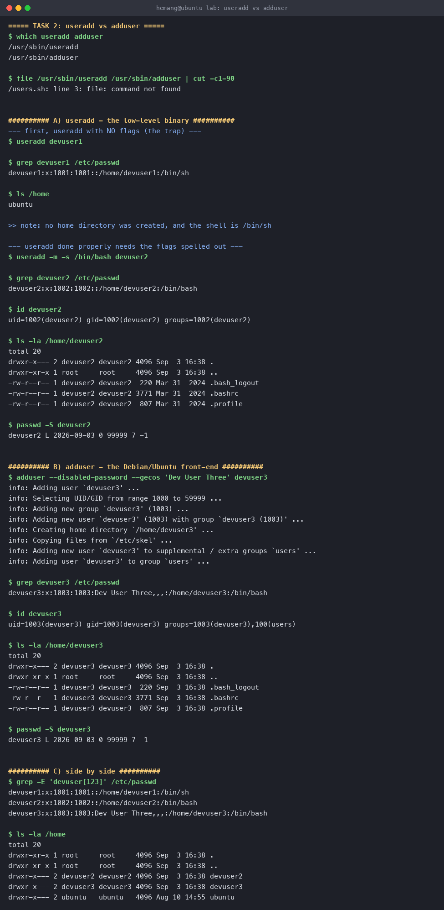
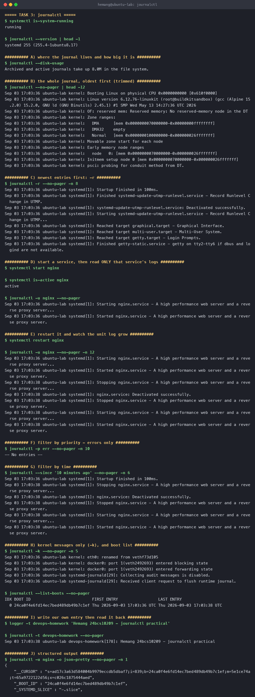
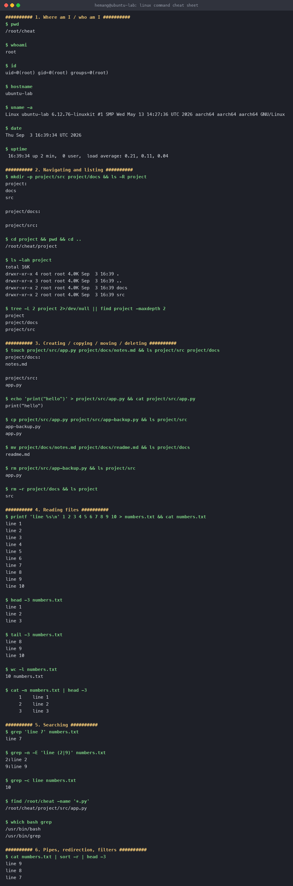
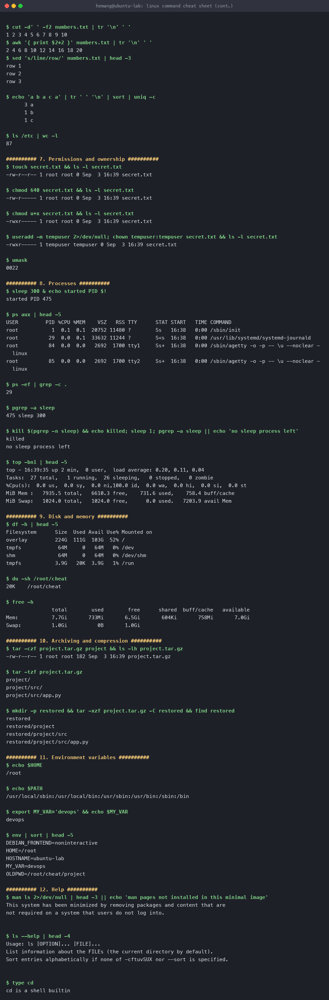

# Linux Fundamentals

**Name:** Hemang
**Enrollment number:** 24bcs10209

Every command on this page was actually run in an Ubuntu 24.04 container (hostname
`ubuntu-lab`) and the output below is pasted straight from that session. The `journalctl`
task needed a live `systemd`, so it was run in a container booted with `/sbin/init` as PID 1
([`Dockerfile.systemd`](Dockerfile.systemd)).

| Task | What it covers |
|---|---|
| [Task 1](#task-1--soft-link-vs-hard-link) | Soft links vs hard links |
| [Task 2](#task-2--adduser-vs-useradd) | `adduser` vs `useradd` |
| [Task 3](#task-3--journalctl) | `journalctl` |
| [Task 4](#task-4--linux-command-cheat-sheet) | Linux command cheat sheet |

---

## Task 1 — Soft link vs hard link

### The idea

In Linux a file name is not the file. A name is just a directory entry pointing at an
**inode**, and the inode is what actually owns the metadata and the data blocks. Links are two
different ways of attaching another name to data.

- **Hard link** — a second directory entry pointing at the **same inode**. The two names are
  equal peers; neither is "the original". Creating one bumps the inode's link count, and the
  data is only freed when that count reaches zero.
- **Soft link (symbolic link)** — a small file of its own, whose *content* is a path string
  pointing at another name. It has its own inode. Delete the target and the link survives but
  points at nothing — it "dangles".

### Difference at a glance

| | Hard link | Soft link |
|---|---|---|
| What it stores | A reference to the same inode | A path string |
| Has its own inode? | No — shares the target's | Yes |
| Target's link count | Goes up by 1 | Unchanged |
| Survives deleting the original name | **Yes**, data stays reachable | **No**, becomes dangling |
| Can cross filesystems | No | Yes |
| Can point at a directory | No (not for normal users) | Yes |
| How `ls -l` shows it | Looks like an ordinary file | Type `l`, prints `-> target` |

### Commands

```bash
ln  notes.txt notes-hard.txt     # hard link — same inode
ln -s notes.txt notes-soft.txt   # soft link — stores the path "notes.txt"
ls -li                           # -i prints inode numbers
stat -c '%n inode=%i links=%h' notes.txt notes-hard.txt notes-soft.txt
rm notes.txt                     # delete the original NAME
readlink notes-soft.txt          # what a symlink points at
unlink notes-soft.txt            # remove a link (same effect as rm)
```

### Session output

```console
$ echo 'line 1: the original file' > notes.txt

$ ln notes.txt notes-hard.txt

$ ln -s notes.txt notes-soft.txt

$ ls -li
total 8
3352790 -rw-r--r-- 2 root root 26 Sep  3 16:38 notes-hard.txt
3352806 lrwxrwxrwx 1 root root  9 Sep  3 16:38 notes-soft.txt -> notes.txt
3352790 -rw-r--r-- 2 root root 26 Sep  3 16:38 notes.txt

$ stat -c '%n  inode=%i  links=%h  size=%s  type=%F' notes.txt notes-hard.txt notes-soft.txt
notes.txt       inode=3352790  links=2  size=26  type=regular file
notes-hard.txt  inode=3352790  links=2  size=26  type=regular file
notes-soft.txt  inode=3352806  links=1  size=9   type=symbolic link
```

`notes.txt` and `notes-hard.txt` share inode **3352790** and both report a link count of **2**.
The symlink has its own inode **3352806**, a link count of 1, and a size of 9 bytes — exactly
the length of the string `notes.txt`, which is all it stores.

Writing through the hard link changes the original, because they are the same file:

```console
$ echo 'line 2: appended via the hard link' >> notes-hard.txt

$ cat notes.txt
line 1: the original file
line 2: appended via the hard link
```

Now delete the original name — this is where the two kinds separate:

```console
$ rm notes.txt

$ ls -li
total 4
3352790 -rw-r--r-- 1 root root 61 Sep  3 16:38 notes-hard.txt
3352806 lrwxrwxrwx 1 root root  9 Sep  3 16:38 notes-soft.txt -> notes.txt

$ cat notes-hard.txt          # data is still here
line 1: the original file
line 2: appended via the hard link

$ cat notes-soft.txt          # the link now dangles
cat: notes-soft.txt: No such file or directory

$ readlink notes-soft.txt     # it still "points" — at a name that is gone
notes.txt
```

The hard link's count dropped from 2 to 1 but the data survived. The symlink still holds the
path `notes.txt`, but nothing is there any more.

Directories are the other clear split:

```console
$ mkdir -p somedir && ln -s somedir dir-soft && ls -ld dir-soft
lrwxrwxrwx 1 root root 7 Sep  3 16:38 dir-soft -> somedir

$ ln somedir dir-hard
ln: somedir: hard link not allowed for directory
```



### Interview answer

> A hard link is another name for the same inode, so it is indistinguishable from the original
> and the data lives as long as any name points at it. A soft link is a separate file holding a
> path, so it can cross filesystems and point at directories, but it breaks if the target is
> removed or renamed. Hard links can't cross filesystems because inode numbers are only unique
> within a single filesystem.

---

## Task 2 — `adduser` vs `useradd`

### The difference

- **`useradd`** is the low-level binary from `shadow-utils`. It is in POSIX-land: it does
  precisely what the flags tell it and nothing else. No home directory unless you pass `-m`,
  no login shell unless you pass `-s`, and no password is set at all.
- **`adduser`** is a Perl front-end that Debian and Ubuntu ship on top of `useradd`. It calls
  `useradd` internally but also picks the next free UID, creates the home directory, copies
  `/etc/skel`, sets `/bin/bash`, adds the account to the `users` group, and interactively
  prompts for a password and the full-name (GECOS) fields.

### Which is preferred on Ubuntu, and why

**`adduser`** for interactive admin work on Ubuntu. It is the Debian-policy-endorsed tool and
it leaves the account in a usable, complete state in a single step — home directory, shell,
skeleton dotfiles and a password, with no chance of forgetting `-m`.

**`useradd`** is the right choice inside scripts, Dockerfiles and configuration management,
where you want every detail explicit, no interactive prompts, and identical behaviour across
distributions (`adduser` doesn't exist on RHEL-family systems).

### Commands

```bash
useradd devuser1                                          # bare useradd, to show the trap
useradd -m -s /bin/bash devuser2                          # useradd done properly
adduser --disabled-password --gecos 'Dev User Three' devuser3   # the recommended tool
id devuser2 ; grep devuser2 /etc/passwd ; ls -la /home/devuser2
```

`--disabled-password` and `--gecos` are passed only so the run is non-interactive; a normal
`adduser devuser3` would prompt for those.

### Session output

Bare `useradd` — note what is missing:

```console
$ useradd devuser1

$ grep devuser1 /etc/passwd
devuser1:x:1001:1001::/home/devuser1:/bin/sh

$ ls /home
ubuntu
```

`/etc/passwd` claims a home of `/home/devuser1`, but `ls /home` shows it was never created, and
the shell fell back to `/bin/sh`. That is the classic `useradd` trap.

The same tool used properly:

```console
$ useradd -m -s /bin/bash devuser2

$ grep devuser2 /etc/passwd
devuser2:x:1002:1002::/home/devuser2:/bin/bash

$ id devuser2
uid=1002(devuser2) gid=1002(devuser2) groups=1002(devuser2)

$ ls -la /home/devuser2
drwxr-x--- 2 devuser2 devuser2 4096 Sep  3 16:38 .
-rw-r--r-- 1 devuser2 devuser2  220 Mar 31  2024 .bash_logout
-rw-r--r-- 1 devuser2 devuser2 3771 Mar 31  2024 .bashrc
-rw-r--r-- 1 devuser2 devuser2  807 Mar 31  2024 .profile
```

The recommended tool on Ubuntu — notice how much it narrates and does for you:

```console
$ adduser --disabled-password --gecos 'Dev User Three' devuser3
info: Adding user `devuser3' ...
info: Selecting UID/GID from range 1000 to 59999 ...
info: Adding new group `devuser3' (1003) ...
info: Adding new user `devuser3' (1003) with group `devuser3 (1003)' ...
info: Creating home directory `/home/devuser3' ...
info: Copying files from `/etc/skel' ...
info: Adding new user `devuser3' to supplemental / extra groups `users' ...
info: Adding user `devuser3' to group `users' ...

$ id devuser3
uid=1003(devuser3) gid=1003(devuser3) groups=1003(devuser3),100(users)
```

Side by side, the three accounts show the difference clearly:

```console
$ grep -E 'devuser[123]' /etc/passwd
devuser1:x:1001:1001::/home/devuser1:/bin/sh
devuser2:x:1002:1002::/home/devuser2:/bin/bash
devuser3:x:1003:1003:Dev User Three,,,:/home/devuser3:/bin/bash

$ ls -la /home
drwxr-x--- 2 devuser2 devuser2 4096 Sep  3 16:38 devuser2
drwxr-x--- 2 devuser3 devuser3 4096 Sep  3 16:38 devuser3
drwxr-x--- 2 ubuntu   ubuntu   4096 Aug 10 14:55 ubuntu
```

Two things only `adduser` did on its own: it filled in the GECOS field
(`Dev User Three,,,`) and it added the account to the supplementary `users` group (`100(users)`).
`devuser1` has no home directory on disk at all.



**Test user created using the recommended command:** `devuser3`, via `adduser`.

---

## Task 3 — `journalctl`

### What it is for

`systemd-journald` collects log records from the kernel, from early boot, from every service's
stdout/stderr and from the classic syslog API, and stores them in a single indexed **binary**
journal. `journalctl` is the reader for it.

Because the journal is structured rather than plain text, you can filter by unit, priority,
time window or boot without any `grep` gymnastics — which is the main reason it replaced
digging through individual files in `/var/log`.

### The commands that matter

| Command | What it does |
|---|---|
| `journalctl` | Whole journal, oldest first |
| `journalctl -r` | Newest first |
| `journalctl -n 20` | Last 20 lines |
| `journalctl -f` | Follow live, like `tail -f` |
| `journalctl -u nginx` | **Only** that service's logs |
| `journalctl -u nginx -f` | Follow one service live |
| `journalctl -p err` | Priority `err` and worse |
| `journalctl --since '10 min ago'` / `--until` | Time window |
| `journalctl -k` | Kernel messages only (like `dmesg`) |
| `journalctl -b` / `--list-boots` | Current boot / all recorded boots |
| `journalctl -t <tag>` | Filter by syslog tag |
| `journalctl -o json-pretty` | Structured output with all fields |
| `journalctl --disk-usage` | How much space the journal uses |
| `journalctl --vacuum-time=7d` | Trim the journal |

### Session output

```console
$ systemctl is-system-running
running

$ journalctl --version | head -1
systemd 255 (255.4-1ubuntu8.17)

$ journalctl --disk-usage
Archived and active journals take up 8.0M in the file system.
```

The journal starts at the very beginning of boot — these are kernel messages, which no
plain-text logger would have captured this early:

```console
$ journalctl --no-pager | head -6
Sep 03 17:03:36 ubuntu-lab kernel: Booting Linux on physical CPU 0x0000000000 [0x610f0000]
Sep 03 17:03:36 ubuntu-lab kernel: Linux version 6.12.76-linuxkit ...
Sep 03 17:03:36 ubuntu-lab kernel: OF: reserved mem: Reserved memory: No reserved-memory node in the DT
Sep 03 17:03:36 ubuntu-lab kernel: Zone ranges:
Sep 03 17:03:36 ubuntu-lab kernel:   DMA      [mem 0x0000000070000000-0x00000000ffffffff]
Sep 03 17:03:36 ubuntu-lab kernel:   DMA32    empty
```

**Checking logs for a specific service.** This is the part of the task that matters most in
practice — start `nginx`, then read only what `nginx` logged:

```console
$ systemctl start nginx

$ systemctl is-active nginx
active

$ journalctl -u nginx --no-pager
Sep 03 17:03:36 ubuntu-lab systemd[1]: Starting nginx.service - A high performance web server and a reverse proxy server...
Sep 03 17:03:36 ubuntu-lab systemd[1]: Started nginx.service - A high performance web server and a reverse proxy server.
```

Restart it and the unit's own log grows, with the stop/start cycle recorded in order:

```console
$ systemctl restart nginx

$ journalctl -u nginx --no-pager -n 12
Sep 03 17:03:36 ubuntu-lab systemd[1]: Starting nginx.service ...
Sep 03 17:03:36 ubuntu-lab systemd[1]: Started nginx.service ...
Sep 03 17:03:38 ubuntu-lab systemd[1]: Stopping nginx.service ...
Sep 03 17:03:38 ubuntu-lab systemd[1]: nginx.service: Deactivated successfully.
Sep 03 17:03:38 ubuntu-lab systemd[1]: Stopped nginx.service ...
Sep 03 17:03:38 ubuntu-lab systemd[1]: Starting nginx.service ...
Sep 03 17:03:38 ubuntu-lab systemd[1]: Started nginx.service ...
```

Filtering by priority, time and boot:

```console
$ journalctl -p err --no-pager -n 10
-- No entries --

$ journalctl --since '10 minutes ago' --no-pager -n 3
Sep 03 17:03:38 ubuntu-lab systemd[1]: Stopped nginx.service ...
Sep 03 17:03:38 ubuntu-lab systemd[1]: Starting nginx.service ...
Sep 03 17:03:38 ubuntu-lab systemd[1]: Started nginx.service ...

$ journalctl --list-boots --no-pager
IDX BOOT ID                          FIRST ENTRY                 LAST ENTRY
  0 24ca0f4e6fd14ec7bed489db49b7c1ef Thu 2026-09-03 17:03:36 UTC Thu 2026-09-03 17:03:38 UTC
```

`-p err` returning `-- No entries --` is itself the useful answer: nothing on this box has
logged at error priority or worse.

Anything can write to the journal with `logger`, and it comes straight back out filtered by tag:

```console
$ logger -t devops-homework 'Hemang 24bcs10209 - journalctl practical'

$ journalctl -t devops-homework --no-pager
Sep 03 17:03:38 ubuntu-lab devops-homework[178]: Hemang 24bcs10209 - journalctl practical
```

Finally, the reason the journal is more than a text file — every record is structured:

```console
$ journalctl -u nginx -o json-pretty --no-pager -n 1
{
        "MESSAGE" : "Started nginx.service - A high performance web server and a reverse proxy server.",
        "UNIT" : "nginx.service",
        "PRIORITY" : "6",
        "_HOSTNAME" : "ubuntu-lab",
        "_PID" : "1",
        "_COMM" : "systemd",
        "_BOOT_ID" : "24ca0f4e6fd14ec7bed489db49b7c1ef",
        "CODE_FILE" : "src/core/job.c",
        "CODE_LINE" : "796",
        "CODE_FUNC" : "job_emit_done_message",
        ...
}
```

Those `_`-prefixed fields are trusted metadata added by journald itself — the sender cannot
forge them — which is what makes `-u`, `-p` and `-t` exact rather than a text search.



---

## Task 4 — Linux command cheat sheet

Grouped by what you are trying to *do*. Everything here was run; the full captured session is
in the two screenshots at the end.

### 1. Where am I / who am I

| Command | Purpose |
|---|---|
| `pwd` | Print working directory |
| `whoami` / `id` | Current user / full UID, GID and groups |
| `hostname` | Machine name |
| `uname -a` | Kernel, architecture, build |
| `date` | Current date and time |
| `uptime` | How long the box has been up, load average |

```console
$ id
uid=0(root) gid=0(root) groups=0(root)

$ uname -a
Linux ubuntu-lab 6.12.76-linuxkit #1 SMP Wed May 13 14:27:36 UTC 2026 aarch64 aarch64 aarch64 GNU/Linux

$ uptime
 16:39:34 up 2 min,  0 user,  load average: 0.21, 0.11, 0.04
```

### 2. Navigating and listing

| Command | Purpose |
|---|---|
| `cd <dir>` | Change directory (`cd -` = previous, `cd` = home) |
| `ls -l` | Long listing |
| `ls -a` | Include dotfiles |
| `ls -lah` | Long, all, human-readable sizes |
| `ls -R` | Recurse into subdirectories |
| `tree -L 2` | Directory tree, 2 levels deep |

```console
$ ls -lah project
total 16K
drwxr-xr-x 4 root root 4.0K Sep  3 16:39 .
drwxr-xr-x 3 root root 4.0K Sep  3 16:39 ..
drwxr-xr-x 2 root root 4.0K Sep  3 16:39 docs
drwxr-xr-x 2 root root 4.0K Sep  3 16:39 src
```

### 3. Creating, copying, moving, deleting

| Command | Purpose |
|---|---|
| `mkdir -p a/b/c` | Create directories, parents included |
| `touch f` | Create an empty file / update its timestamp |
| `cp a b` , `cp -r dir1 dir2` | Copy a file / a directory |
| `mv a b` | Move **or** rename |
| `rm f` , `rm -r dir` | Delete a file / a directory tree |

```console
$ cp project/src/app.py project/src/app-backup.py && ls project/src
app-backup.py
app.py

$ mv project/docs/notes.md project/docs/readme.md && ls project/docs
readme.md
```

### 4. Reading files

| Command | Purpose |
|---|---|
| `cat f` | Print the whole file |
| `cat -n f` | With line numbers |
| `head -3 f` / `tail -3 f` | First / last 3 lines |
| `tail -f f` | Follow a growing file live |
| `less f` | Page through a file |
| `wc -l f` | Count lines |

```console
$ head -3 numbers.txt
line 1
line 2
line 3

$ wc -l numbers.txt
10 numbers.txt
```

### 5. Searching

| Command | Purpose |
|---|---|
| `grep 'x' f` | Lines containing `x` |
| `grep -n` / `-i` / `-c` / `-r` | With line numbers / case-insensitive / count / recursive |
| `grep -E` | Extended regex |
| `find <dir> -name '*.py'` | Find files by name |
| `which <cmd>` | Where a command lives on `$PATH` |

```console
$ grep -n -E 'line (2|9)' numbers.txt
2:line 2
9:line 9

$ find /root/cheat -name '*.py'
/root/cheat/project/src/app.py
```

### 6. Pipes, redirection and filters

| Symbol / command | Purpose |
|---|---|
| `\|` | Send one command's stdout into the next command's stdin |
| `>` / `>>` | Redirect stdout, overwriting / appending |
| `2>` / `&>` | Redirect stderr / both streams |
| `sort` , `sort -r` | Sort, reverse-sort |
| `uniq -c` | Collapse duplicate adjacent lines, with counts |
| `cut -d' ' -f2` | Pull out a field |
| `awk '{print $2}'` | Field processing with arithmetic |
| `sed 's/a/b/'` | Stream editing / substitution |
| `tr` | Translate or delete characters |

```console
$ awk '{ print $2*2 }' numbers.txt | tr '\n' ' '
2 4 6 8 10 12 14 16 18 20

$ echo 'a b a c a' | tr ' ' '\n' | sort | uniq -c
      3 a
      1 b
      1 c
```

`sort` before `uniq` matters — `uniq` only collapses lines that are already adjacent.

### 7. Permissions and ownership

| Command | Purpose |
|---|---|
| `chmod 640 f` | Set permissions numerically (`rw- r-- ---`) |
| `chmod u+x f` | Set them symbolically |
| `chown user:group f` | Change owner and group |
| `umask` | Default permission mask for new files |

The three octal digits are owner / group / others, and each is `read 4 + write 2 + execute 1`:

```console
$ touch secret.txt && ls -l secret.txt
-rw-r--r-- 1 root root 0 Sep  3 16:39 secret.txt

$ chmod 640 secret.txt && ls -l secret.txt
-rw-r----- 1 root root 0 Sep  3 16:39 secret.txt

$ chmod u+x secret.txt && ls -l secret.txt
-rwxr----- 1 root root 0 Sep  3 16:39 secret.txt

$ chown tempuser:tempuser secret.txt && ls -l secret.txt
-rwxr----- 1 tempuser tempuser 0 Sep  3 16:39 secret.txt
```

### 8. Processes

| Command | Purpose |
|---|---|
| `ps aux` | Every process, with CPU and memory |
| `ps -ef` | Every process, parent-PID view |
| `top` / `htop` | Live process view |
| `pgrep -a <name>` | Find PIDs by name |
| `kill <pid>` , `kill -9 <pid>` | Terminate politely / forcibly |
| `<cmd> &` | Run in the background |
| `jobs` , `fg` , `bg` | Manage background jobs |

```console
$ sleep 300 & echo started PID $!
started PID 475

$ pgrep -a sleep
475 sleep 300

$ kill $(pgrep -n sleep) && echo killed
killed

$ pgrep -a sleep || echo 'no sleep process left'
no sleep process left
```

### 9. Disk and memory

| Command | Purpose |
|---|---|
| `df -h` | Free space per mounted filesystem |
| `du -sh <dir>` | Size of one directory |
| `free -h` | RAM and swap |

```console
$ df -h | head -3
Filesystem      Size  Used Avail Use% Mounted on
overlay         224G  111G  103G  52% /
tmpfs            64M     0   64M   0% /dev

$ free -h
               total        used        free      shared  buff/cache   available
Mem:           7.7Gi       733Mi       6.5Gi       604Ki       758Mi       7.0Gi
Swap:          1.0Gi          0B       1.0Gi
```

`df` answers "is the disk full", `du` answers "what filled it".

### 10. Archiving and compression

| Command | Purpose |
|---|---|
| `tar -czf out.tar.gz dir` | **c**reate a gzipped archive |
| `tar -tzf out.tar.gz` | **t**ell me what's inside, without extracting |
| `tar -xzf out.tar.gz -C dest` | e**x**tract into a directory |
| `gzip` / `gunzip` , `zip` / `unzip` | Single-file and zip-format compression |

```console
$ tar -czf project.tar.gz project && ls -lh project.tar.gz
-rw-r--r-- 1 root root 182 Sep  3 16:39 project.tar.gz

$ tar -tzf project.tar.gz
project/
project/src/
project/src/app.py
```

### 11. Environment variables

| Command | Purpose |
|---|---|
| `echo $HOME` , `echo $PATH` | Read a variable |
| `export VAR=value` | Set one for this shell and its children |
| `env` | List them all |

```console
$ export MY_VAR='devops' && echo $MY_VAR
devops

$ echo $PATH
/usr/local/sbin:/usr/local/bin:/usr/sbin:/usr/bin:/sbin:/bin
```

### 12. Getting help

| Command | Purpose |
|---|---|
| `man <cmd>` | Full manual page |
| `<cmd> --help` | Quick usage summary |
| `type <cmd>` | Is it a binary, a builtin, or an alias? |

```console
$ ls --help | head -3
Usage: ls [OPTION]... [FILE]...
List information about the FILEs (the current directory by default).
Sort entries alphabetically if none of -cftuvSUX nor --sort is specified.

$ type cd
cd is a shell builtin
```

`type` is worth knowing: `cd` is a shell builtin, not a program in `/usr/bin`, which is why
`which cd` finds nothing.




---

## How to reproduce

```bash
# Tasks 1, 2 and 4
docker run --rm -it -h ubuntu-lab ubuntu:24.04 bash

# Task 3 needs a real systemd, so PID 1 must be /sbin/init
docker build -f Dockerfile.systemd -t linux-lab:systemd .
docker run -d --name systemd-lab -h ubuntu-lab --privileged --cgroupns=host \
  -v /sys/fs/cgroup:/sys/fs/cgroup:rw --tmpfs /run --tmpfs /run/lock linux-lab:systemd
docker exec -it systemd-lab bash
```
