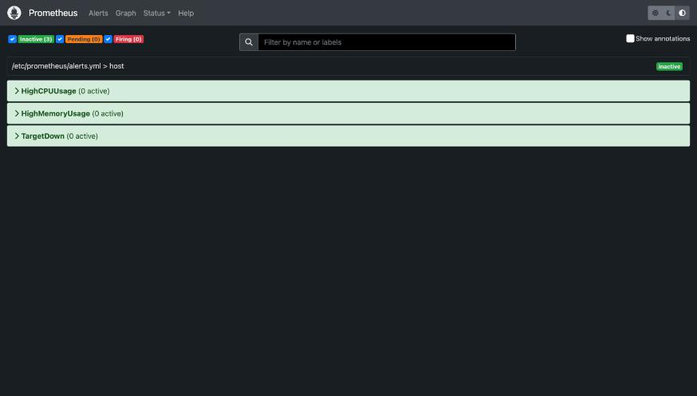
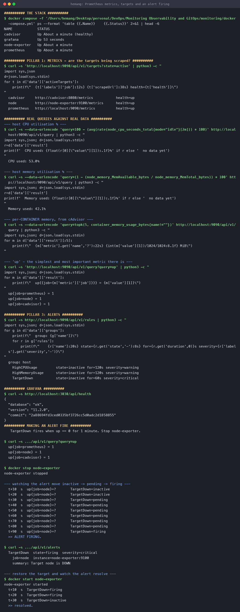
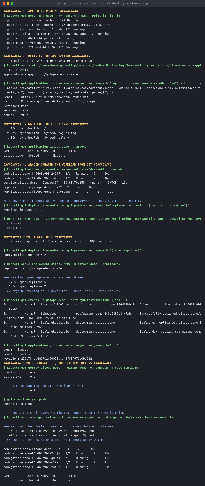

# Monitoring, Observability and GitOps

**Name:** Hemang
**Enrollment number:** 24bcs10209

Session 20. A real Prometheus + Grafana stack with an alert that actually fires, and **ArgoCD
reconciling a live cluster against this very repository**.

| Task | |
|---|---|
| [Task 1](#task-1--monitoring) | Metrics, logs, alerts, CPU/memory, app health |
| [Task 2](#task-2--observability) | The three pillars and why they differ |
| [Task 3](#task-3--gitops) | ArgoCD: sync from git, self-heal, git-driven change |
| [Mini project](mini-project/) | Namespace + Deployment + Service managed end-to-end by ArgoCD, plus the viva answers |

Config: [`monitoring/`](monitoring/) · [`gitops/`](gitops/) · [`mini-project/`](mini-project/)

---

## Task 1 — Monitoring

### The stack

```text
  node-exporter :9100 ─┐
  cAdvisor      :8080 ─┼──scrape every 10s──► Prometheus :9090 ──► Grafana :3030
  prometheus    :9090 ─┘                       (TSDB + alert rules)   (dashboards)
```

| Component | Job |
|---|---|
| **node-exporter** | Host CPU, memory, disk, network |
| **cAdvisor** | Per-container CPU and memory |
| **Prometheus** | Scrapes targets, stores time series, evaluates alert rules |
| **Grafana** | Queries Prometheus and draws it |

Prometheus is **pull-based**: it scrapes targets on a schedule rather than receiving pushes.
That means Prometheus always knows whether a target is reachable — which is what makes `up`
possible.

```console
$ docker compose ps
NAME            STATUS
cadvisor        Up About a minute (healthy)
grafana         Up 53 seconds
node-exporter   Up About a minute
prometheus      Up About a minute
```

### Are the targets healthy?

```console
$ curl -s 'http://localhost:9090/api/v1/targets?state=active'
  cadvisor     http://cadvisor:8080/metrics      health=up
  node         http://node-exporter:9100/metrics health=up
  prometheus   http://localhost:9090/metrics     health=up
```

### Real queries against real data

**CPU utilisation** — PromQL has no "cpu percent" metric; you derive it from the counter of
seconds spent idle:

```promql
100 - (avg(rate(node_cpu_seconds_total{mode="idle"}[2m])) * 100)
```

```console
  CPU used: 53.0%
```

`rate()` over a counter gives per-second change; averaging the idle fraction and subtracting
from 100 gives busy percent.

**Memory utilisation:**

```promql
(1 - (node_memory_MemAvailable_bytes / node_memory_MemTotal_bytes)) * 100
```

```console
  Memory used: 42.1%
```

Note **`MemAvailable`, not `MemFree`** — Linux uses free RAM for page cache, so `MemFree` makes a
healthy machine look nearly out of memory.

**Application health** — the simplest and most valuable metric Prometheus has:

```console
$ curl -s 'http://localhost:9090/api/v1/query?query=up'
  up{job=prometheus} = 1
  up{job=node}       = 1
  up{job=cadvisor}   = 1
```

`up` is synthesised by Prometheus itself on every scrape: 1 if the target answered, 0 if not.
You get it for free for every target, with no instrumentation.

### Alerts

[`monitoring/alerts.yml`](monitoring/alerts.yml):

```yaml
- alert: TargetDown
  expr: up == 0
  for: 1m                      # must stay true for a full minute
  labels: { severity: critical }
  annotations:
    summary: "Target {{ $labels.job }} is DOWN"
```

```console
$ curl -s http://localhost:9090/api/v1/rules
  group: host
    HighCPUUsage      state=inactive  for=120s  severity=warning
    HighMemoryUsage   state=inactive  for=120s  severity=warning
    TargetDown        state=inactive  for=60s   severity=critical
```

### Making one fire

Rather than describe the lifecycle, I stopped a target:

```console
$ docker stop node-exporter
node-exporter stopped

  t+10s   TargetDown=inactive
  t+30s   TargetDown=pending      ← condition true, waiting out `for: 1m`
  t+60s   TargetDown=pending
  t+90s   TargetDown=firing       ← 1 minute elapsed
```

```console
$ curl -s http://localhost:9090/api/v1/alerts
  TargetDown  state=firing  severity=critical
    job=node  instance=node-exporter:9100
    summary: Target node is DOWN
```

And restoring it:

```console
$ docker start node-exporter
  t+10s   TargetDown=firing
  t+30s   TargetDown=inactive     ← resolved
```

**`inactive → pending → firing → inactive`**, observed end to end. The `for:` duration is what
separates a real outage from a single failed scrape — without it, every transient blip pages
somebody at 3am.



### Grafana

Provisioned with Prometheus as its datasource from
[`monitoring/provisioning/datasources/prometheus.yml`](monitoring/provisioning/datasources/) —
config as code rather than clicking through the UI:

```console
$ curl -s http://localhost:3030/api/health
{ "database": "ok", "version": "11.2.0" }

$ curl -s http://localhost:3030/api/datasources
datasources: [('Prometheus', 'prometheus', 'http://prometheus:9090')]

$ curl -s 'http://localhost:3030/api/datasources/proxy/1/api/v1/query?query=up'
  up{job=prometheus} = 1
  up{job=node}       = 1
  up{job=cadvisor}   = 1
```

Grafana is querying Prometheus successfully through its own proxy.

> **One thing I hit:** `GF_AUTH_ANONYMOUS_ENABLED=true` alone gives `Unauthorized` — anonymous
> access also needs `GF_AUTH_ANONYMOUS_ORG_ROLE`. And port 3000 was already in use on this Mac,
> so Grafana is published on **3030**.



---

## Task 2 — Observability

### Monitoring vs observability

| **Monitoring** | **Observability** |
|---|---|
| "Is the thing I expected to break, broken?" | "Why is it behaving like this?" |
| Known unknowns — dashboards you built in advance | **Unknown** unknowns |
| Pre-defined metrics and thresholds | Ask new questions without shipping new code |
| Tells you **that** something is wrong | Helps you work out **why** |

Monitoring is a subset. You can have perfect dashboards and still be unable to answer "why are
*these particular* requests slow?" — that gap is what observability addresses.

### The three pillars

| | **Metrics** | **Logs** | **Traces** |
|---|---|---|---|
| What | Numbers over time | Discrete timestamped events | One request's path across services |
| Answers | "How much? How many?" | "What exactly happened?" | "Where did the time go?" |
| Cost | Cheap — aggregated | Expensive at volume | Moderate, usually sampled |
| Cardinality | **Must stay low** | Arbitrary | Arbitrary |
| Tools | Prometheus, CloudWatch | Loki, ELK, CloudWatch Logs | Jaeger, Tempo, X-Ray |
| Good for | Alerting, dashboards, trends | Debugging a specific failure | Latency in distributed systems |

**Metrics** — `http_requests_total{status="500"}`. Tiny to store, perfect for alerting, but
they tell you *how many* 500s, never *which* request or *why*.

**Logs** — the detail metrics throw away: the stack trace, the user ID, the exact query. The
discipline that makes them useful is **structured logging** (JSON with consistent fields) so you
can query them instead of grepping.

**Traces** — in a microservice system, a request crossing six services produces six sets of logs
with nothing linking them. A trace propagates a **trace ID** across every hop and records a span
per service, so you can see that 2 of 2.3 seconds were spent in one database call.

### How they work together

```text
ALERT    metrics  →  "error rate is 12%, up from 0.1%"      ← what and when
INVESTIGATE traces →  "all failures pass through payments-svc" ← where
ROOT CAUSE  logs   →  "connection pool exhausted at 14:32"     ← why
```

That is the loop: **metrics alert, traces localise, logs explain.** Each pillar alone leaves a
gap — metrics can't tell you why, logs can't be aggregated cheaply enough to alert on, traces
don't contain the error text.

### Cardinality — the thing that bites people

A metric label with unbounded values (user ID, request ID, full URL path) creates a **separate
time series per value**. A million users means a million series, and Prometheus falls over. Those
belong in logs and traces, which are built for high cardinality.

### In Kubernetes

| Pillar | Typical implementation |
|---|---|
| Metrics | `metrics-server` for `kubectl top`; Prometheus (kube-prometheus-stack) for the rest |
| Logs | A **DaemonSet** (Fluent Bit / Promtail) on every node shipping to Loki or Elasticsearch |
| Traces | OpenTelemetry SDK in the app + a collector, exporting to Jaeger or Tempo |

The DaemonSet pattern is why node-level log collectors mount `hostPath` — exactly the use case
noted in [the volumes write-up](../Kubernetes%20Storage%20HPA%20and%20Probes/01-kubernetes-volumes/#2-hostpath).

---

## Task 3 — GitOps

### What it is

**Git is the single source of truth for both application and infrastructure state, and an agent
in the cluster continuously reconciles reality against it.**

Four principles:

1. **Declarative** — the whole system is described as data, not scripts.
2. **Versioned and immutable** — git history is the audit log; `git revert` is the rollback.
3. **Pulled automatically** — an in-cluster agent pulls; nothing pushes credentials in.
4. **Continuously reconciled** — drift is detected and corrected, not just applied once.

### Push vs pull

| | **Push CI/CD** | **Pull GitOps** |
|---|---|---|
| Who talks to the cluster | The CI runner | An agent **inside** the cluster |
| Cluster credentials | Stored in CI | **Never leave the cluster** |
| Drift | Undetected until the next deploy | Detected and corrected continuously |
| Rollback | Re-run an old pipeline | `git revert` |

The credential argument is the strongest one: in the
[Session 17 pipeline](../DevSecOps/#6-deploy-stage) the deploy step would need a `KUBECONFIG`
secret. With GitOps the cluster pulls, so CI never holds cluster access at all.

### The setup

ArgoCD installed on minikube, pointed at **this repository**:

```yaml
spec:
  source:
    repoURL: https://github.com/hemangtk/DevOps.git
    targetRevision: main
    path: Monitoring Observability and GitOps/gitops
  destination:
    namespace: gitops-demo
  syncPolicy:
    automated:
      prune: true        # delete what git no longer declares
      selfHeal: true     # revert manual cluster changes
```

```console
$ kubectl get pods -n argocd
argocd-application-controller-0        1/1   Running
argocd-repo-server-d89c7967d-v2c5m     1/1   Running
argocd-server-776b7cdd4d-fb7bb         1/1   Running
...

$ kubectl apply -f 'Monitoring Observability and GitOps/argocd-application.yaml'
application.argoproj.io/gitops-demo created

  t+10s  sync/health = /
  t+20s  sync/health = Synced/Progressing
  t+30s  sync/health = Synced/Healthy

$ kubectl get application gitops-demo -n argocd
NAME          SYNC STATUS   HEALTH STATUS
gitops-demo   Synced        Healthy

$ kubectl get all -n gitops-demo
pod/gitops-demo-846d68b9b8-242j7   1/1   Running
pod/gitops-demo-846d68b9b8-zwf6q   1/1   Running
service/gitops-demo                ClusterIP   10.98.76.155   80/TCP
deployment.apps/gitops-demo        2/2
```

**I never ran `kubectl apply` for that deployment.** ArgoCD read it from GitHub and created it.

### One layout rule that is easy to get wrong

[`argocd-application.yaml`](argocd-application.yaml) sits **beside** `gitops/`, not inside it.
ArgoCD renders *every* manifest under the path it watches, so an Application stored there is
rendered as one of its own workloads and ends up managing itself. I had it inside at first; one
directory level up is the whole fix, and afterwards the Application manages only what it should:

```console
$ kubectl get application gitops-demo -n argocd \
    -o jsonpath='{range .status.resources[*]}{.kind}/{.name}{"\n"}{end}'
Service/gitops-demo
Deployment/gitops-demo
```

Two managed resources, and **no Application among them**.

### Demo 1 — self-heal

Git says `replicas: 2`. Scale to 5 manually and do not touch git:

```console
$ kubectl get deploy gitops-demo -o jsonpath='{.spec.replicas}'
spec.replicas before = 2

$ kubectl scale deployment/gitops-demo -n gitops-demo --replicas=5
deployment.apps/gitops-demo scaled

--- sampling twice a second ---
   0.5s  spec.replicas=5        ← my change landed
   1.0s  spec.replicas=2        ← ArgoCD already reverted it
```

The cluster's own events record both halves:

```console
$ kubectl get events -n gitops-demo --sort-by=.lastTimestamp | tail -2
Normal  ScalingReplicaSet  deployment/gitops-demo  Scaled up replica set from 2 to 5
Normal  ScalingReplicaSet  deployment/gitops-demo  Scaled down replica set from 5 to 2
```

**Under one second.** I never ran `kubectl scale --replicas=2` — `selfHeal: true` did. Any change
not in git is treated as drift and undone, which is what makes git genuinely authoritative
rather than merely aspirational.

### Demo 2 — change git, the cluster follows

```console
cluster before = 2
git before     = 2

--- edit the manifest, replicas 2 -> 4 ---
git after      = 4

$ git commit && git push
pushed to github

$ kubectl annotate application gitops-demo -n argocd argocd.argoproj.io/refresh=hard --overwrite

  t+5s   spec.replicas=2  ready=2/2  argocd=Synced
  t+10s  spec.replicas=4  ready=2/4  argocd=Synced
  >> the cluster now matches git. No kubectl apply was run.

$ kubectl get deploy,pods -n gitops-demo
deployment.apps/gitops-demo      2/4   4   2
pod/gitops-demo-846d68b9b8-242j7   1/1   Running   93s
pod/gitops-demo-846d68b9b8-qd8zj   0/1   Running   4s     ← new
pod/gitops-demo-846d68b9b8-w29kb   0/1   Running   4s     ← new
pod/gitops-demo-846d68b9b8-zwf6q   1/1   Running   93s
```

**A git commit was the entire deployment process.** The `refresh=hard` annotation only skips
ArgoCD's ~3-minute polling interval so the demo doesn't stall; without it the same thing happens,
just later. A webhook makes it instant in production.



### The workflow

```text
Developer                 Git                      Cluster
    │                      │                          │
    ├── edit manifest ────►│                          │
    ├── open PR            │                          │
    │   review + approve   │                          │
    ├── merge ────────────►│ main updated             │
    │                      │◄──── ArgoCD polls ───────┤
    │                      │                          │
    │                      ├──── desired state ──────►│ reconcile
    │                      │                          │ ✓ Synced / Healthy
```

Rollback is `git revert` — and because ArgoCD reconciles continuously, reverting the commit is
enough; nobody has to remember to redeploy.

---

## Reproduce

```bash
# monitoring
cd monitoring && docker compose up -d
curl -s 'http://localhost:9090/api/v1/targets?state=active'
docker stop node-exporter            # watch TargetDown fire
curl -s http://localhost:9090/api/v1/alerts
docker start node-exporter

# gitops
kubectl create namespace argocd
kubectl apply -n argocd -f https://raw.githubusercontent.com/argoproj/argo-cd/stable/manifests/install.yaml
kubectl wait --for=condition=available --timeout=420s deployment/argocd-server -n argocd
kubectl apply -f argocd-application.yaml          # NOT inside gitops/
kubectl get application gitops-demo -n argocd

kubectl scale deployment/gitops-demo -n gitops-demo --replicas=5   # watch it revert

# the full mini project
kubectl apply -f mini-project/argocd-application.yaml
kubectl get application session20-mini -n argocd
```

---

## What I took away

1. **`up` is the highest-value metric you get for free.** Prometheus synthesises it per scrape,
   so you can alert on "is it there at all" with zero instrumentation.
2. **`for:` is what makes an alert trustworthy.** Watching `inactive → pending → firing` made
   concrete why the delay exists: it filters single failed scrapes.
3. **The pillars answer different questions.** Metrics alerted, and metrics alone could never
   have said *why*. Cardinality is the hard boundary between metrics and logs.
4. **GitOps makes git authoritative, not aspirational.** Manual drift was undone in under a
   second — that is a categorically different guarantee from "we always deploy from main".
5. **Pull beats push for credentials.** The cluster reaches out to git, so no CI system ever
   holds cluster access.
6. **A commit is the deploy.** Changing one number in a YAML file and pushing was the entire
   release process.
