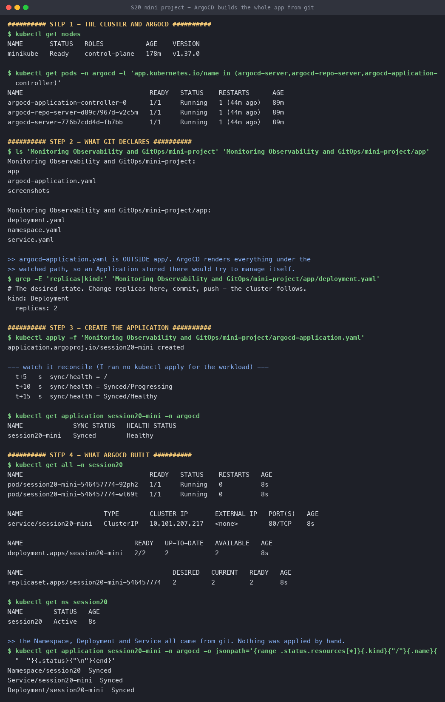
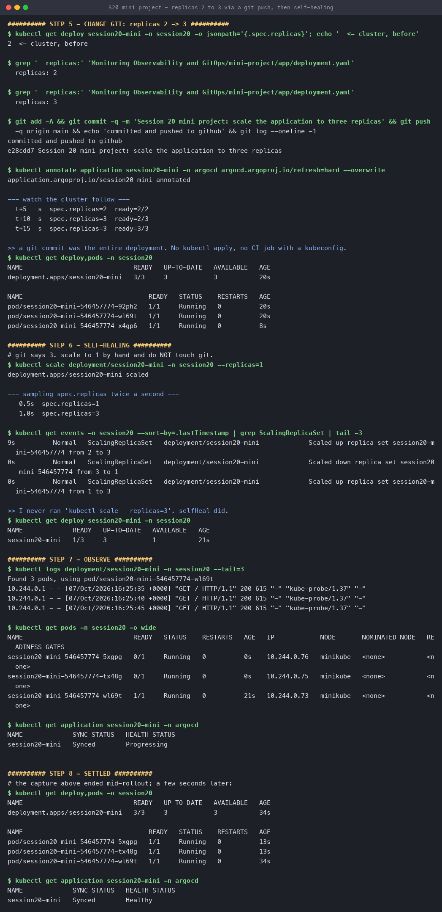

# Session 20 — Mini Project: Kubernetes + Git + GitOps + Argo CD

**Name:** Hemang
**Enrollment number:** 24bcs10209

```text
Git  ──desired state──►  Argo CD  ──automatic sync──►  Kubernetes  ──►  Application
```

A namespace, a deployment and a service that **only ever exist in git**. Argo CD creates them,
follows them when git changes, and puts them back when the cluster drifts. Run live on minikube
with Argo CD installed in namespace `argocd`.

| | |
|---|---|
| [`app/`](app/) | `namespace.yaml`, `deployment.yaml` (replicas 2), `service.yaml` — the watched path |
| [`argocd-application.yaml`](argocd-application.yaml) | The Application, deliberately **outside** `app/` |

### Why the Application lives outside `app/`

Argo CD renders **every** manifest under the path it watches. An `Application` stored in that
same directory would be rendered as one of the workloads and end up managing itself — so it sits
one level up, where nothing watches it, and is applied by hand exactly once.

```yaml
source:
  repoURL: https://github.com/hemangtk/DevOps.git
  targetRevision: main
  path: Monitoring Observability and GitOps/mini-project/app   # app/ only
syncPolicy:
  automated:
    prune: true      # delete what git no longer declares
    selfHeal: true   # revert manual cluster changes
  syncOptions:
    - CreateNamespace=true
```

---

## Step 1 — the cluster and Argo CD

```console
$ kubectl get nodes
NAME       STATUS   ROLES           AGE    VERSION
minikube   Ready    control-plane   178m   v1.37.0

$ kubectl get pods -n argocd
argocd-application-controller-0      1/1   Running     ← the reconciler
argocd-repo-server-d89c7967d-v2c5m   1/1   Running     ← clones git, renders manifests
argocd-server-776b7cdd4d-fb7bb       1/1   Running     ← API and UI
```

Three pods matter here: the **repo-server** fetches and renders, the **application-controller**
compares and reconciles, the **server** is the interface. Reconciliation is the controller's job
and happens with or without anybody logged in.

## Step 2 — create the Application

```console
$ kubectl apply -f argocd-application.yaml
application.argoproj.io/session20-mini created

  t+5s   sync/health = /
  t+10s  sync/health = Synced/Progressing
  t+15s  sync/health = Synced/Healthy
```

**That is the only `kubectl apply` in this whole project.** Fifteen seconds later:

```console
$ kubectl get all -n session20
pod/session20-mini-546457774-92ph2   1/1   Running
pod/session20-mini-546457774-wl69t   1/1   Running
service/session20-mini   ClusterIP   10.101.207.217   80/TCP
deployment.apps/session20-mini   2/2   2   2
replicaset.apps/session20-mini-546457774   2   2   2

$ kubectl get application session20-mini -n argocd \
    -o jsonpath='{range .status.resources[*]}{.kind}/{.name}  {.status}{"\n"}{end}'
Namespace/session20         Synced
Service/session20-mini      Synced
Deployment/session20-mini   Synced
```

Argo CD tracks each object individually, which is how it knows later whether *that specific
resource* has drifted.



---

## Step 3 — change git, watch the cluster follow

```console
$ kubectl get deploy session20-mini -n session20 -o jsonpath='{.spec.replicas}'
2                                           ← cluster, before

--- edit app/deployment.yaml: replicas 2 -> 3 ---
$ grep '  replicas:' app/deployment.yaml
  replicas: 3

$ git commit -m 'Session 20 mini project: scale the application to three replicas' && git push
committed and pushed to github
e28cdd7 Session 20 mini project: scale the application to three replicas
```

```console
  t+5s   spec.replicas=2  ready=2/2
  t+10s  spec.replicas=3  ready=2/3        ← argocd applied the new manifest
  t+15s  spec.replicas=3  ready=3/3

$ kubectl get deploy,pods -n session20
deployment.apps/session20-mini   3/3   3   3   20s
pod/session20-mini-546457774-92ph2   1/1   Running   20s
pod/session20-mini-546457774-wl69t   1/1   Running   20s
pod/session20-mini-546457774-x4gp6   1/1   Running   8s   ← new
```

**A git commit was the entire deployment process.** No `kubectl apply`, and no CI job holding a
kubeconfig — the cluster pulled.

> The demo adds `kubectl annotate ... argocd.argoproj.io/refresh=hard` purely to skip Argo CD's
> ~3-minute polling interval. Without it the identical thing happens, just up to three minutes
> later. A repository webhook makes it immediate in production.

## Step 4 — self-healing

Git says `replicas: 3`. Scale to 1 by hand and **do not touch git**:

```console
$ kubectl scale deployment/session20-mini -n session20 --replicas=1
deployment.apps/session20-mini scaled

--- sampling spec.replicas twice a second ---
   0.5s  spec.replicas=1        ← my change landed
   1.0s  spec.replicas=3        ← argocd had already reverted it
```

The cluster's own event log records both halves, so this is not Argo CD marking its own homework:

```console
$ kubectl get events -n session20 --sort-by=.lastTimestamp | grep ScalingReplicaSet
9s   Normal   ScalingReplicaSet   deployment/session20-mini   Scaled up   ... from 2 to 3
0s   Normal   ScalingReplicaSet   deployment/session20-mini   Scaled down ... from 3 to 1
0s   Normal   ScalingReplicaSet   deployment/session20-mini   Scaled up   ... from 1 to 3
```

**Under one second, and I never ran `kubectl scale --replicas=3`.** `selfHeal: true` did. That is
what makes git genuinely authoritative rather than merely a record of intent — a change made
outside git does not survive.

```console
$ kubectl get deploy,pods -n session20                       # once it settled
deployment.apps/session20-mini   3/3   3   3   34s
pod/session20-mini-546457774-5xgpg   1/1   Running   13s     ← replacements
pod/session20-mini-546457774-tx48g   1/1   Running   13s
pod/session20-mini-546457774-wl69t   1/1   Running   34s

$ kubectl get application session20-mini -n argocd
NAME             SYNC STATUS   HEALTH STATUS
session20-mini   Synced        Healthy
```



## Step 5 — observe

```console
$ kubectl logs deployment/session20-mini -n session20 --tail=3
Found 3 pods, using pod/session20-mini-546457774-wl69t
10.244.0.1 - - [07/Oct/2026:16:25:45 +0000] "GET / HTTP/1.1" 200 615 "-" "kube-probe/1.37" "-"
```

The only traffic is the readiness probe — `kube-probe/1.37` hitting `/` every five seconds,
exactly as `periodSeconds: 5` asks.

---

## The answers

**Monitoring vs observability.** Monitoring answers questions you prepared for: is CPU above 80%,
is the pod up. Observability is whether the system emits enough for you to answer questions you
had *not* prepared for — why is this one user's request slow. Monitoring is dashboards and
alerts; observability is a property of the system.

**Metrics vs logs vs traces.** Metrics are numbers over time — cheap, aggregatable, no detail.
Logs are discrete events with context — detailed, expensive, hard to aggregate. Traces follow one
request across services — the only one that shows *where* time went. Metrics tell you something
is wrong, traces tell you which service, logs tell you why.

**Prometheus.** A time-series database that **pulls** metrics from HTTP endpoints it discovers,
stores them with labels, and evaluates PromQL and alert rules over them.

**Grafana.** The query and visualisation layer. It stores no metrics; it queries Prometheus (and
others) and renders dashboards.

**GitOps.** Git is the single source of truth for desired state, and an agent **inside** the
cluster continuously reconciles reality against it.

**Why git is the source of truth.** Because it already is an audit log, a review mechanism and a
rollback mechanism. Every change is attributable, reviewable before it lands, and revertible by
commit — none of which `kubectl apply` from a laptop gives you.

**What Argo CD does.** Watches a git path, renders the manifests, compares them with the live
cluster and applies the difference — continuously, not once.

**Desired state** is what git declares. **Actual state** is what the cluster currently has.
**Reconciliation** is the loop that compares them and applies the difference. **Self-healing**
is reconciliation acting on drift the cluster introduced rather than on a new commit — which is
why the manual scale to 1 lasted half a second.

**Replicas 2 → 3 in git** makes the next reconciliation find a difference and apply it;
the Deployment scales up and Argo CD returns to `Synced`.

---

## Reproduce

```bash
kubectl create namespace argocd
kubectl apply -n argocd -f https://raw.githubusercontent.com/argoproj/argo-cd/stable/manifests/install.yaml
kubectl wait --for=condition=available -n argocd deploy/argocd-repo-server --timeout=300s

kubectl apply -f argocd-application.yaml
kubectl get application session20-mini -n argocd -w

# change git
sed -i '' 's/replicas: 2/replicas: 3/' app/deployment.yaml
git commit -am 'scale to three replicas' && git push
kubectl annotate application session20-mini -n argocd argocd.argoproj.io/refresh=hard --overwrite
kubectl get deployment -n session20 -w

# self-heal
kubectl scale deployment/session20-mini -n session20 --replicas=1
kubectl get deploy session20-mini -n session20 -o jsonpath='{.spec.replicas}'

kubectl delete -f argocd-application.yaml
```

Deleting the Application with `prune: true` removes the workloads it created, because git no
longer declares them.

---

## What I took away

1. **One `kubectl apply` for the whole project**, and it was the Application — not a workload.
   Everything else reached the cluster through a `git push`.
2. **Self-healing is sub-second**, and the proof is in `kubectl get events`, not in Argo CD's own
   status: the cluster logged the scale down to 1 and the scale back to 3 one after the other.
3. **The Application must not live in the path it watches**, or Argo CD renders and manages
   itself. One directory level is the whole fix.
4. **Pull beats push on credentials.** A CI job that deploys needs a kubeconfig; an agent inside
   the cluster needs none, so no cluster credential ever leaves the cluster.
5. **`Synced` and `Healthy` are different axes.** Right after the scale-up it read
   `Synced/Progressing` — the manifests matched git, the pods were not ready yet. Alerting on the
   wrong one of those is how you get woken up for a normal rollout.
