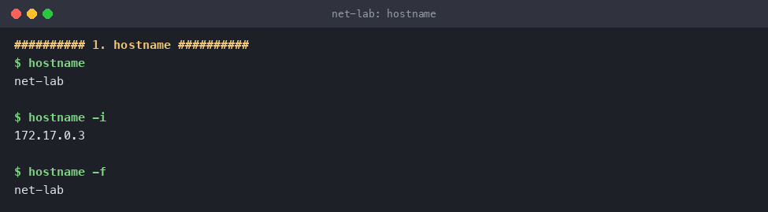
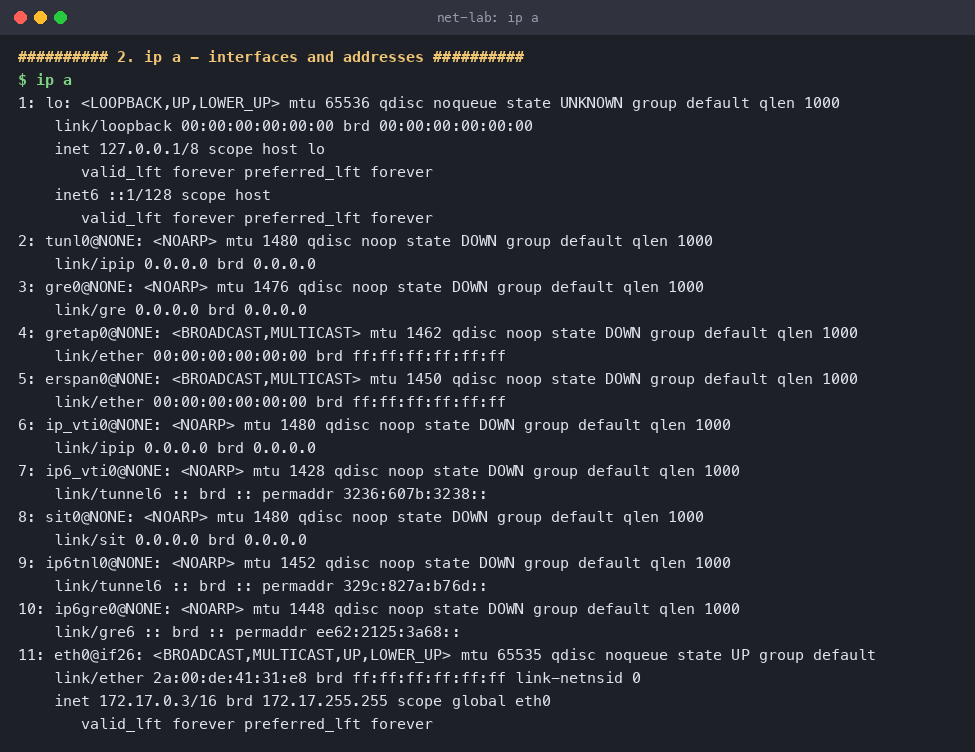
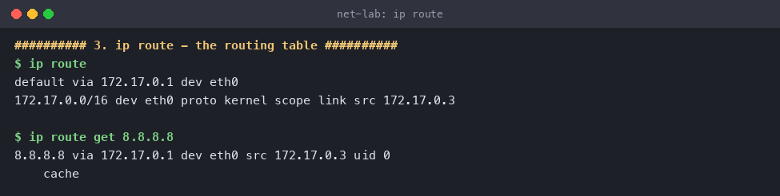
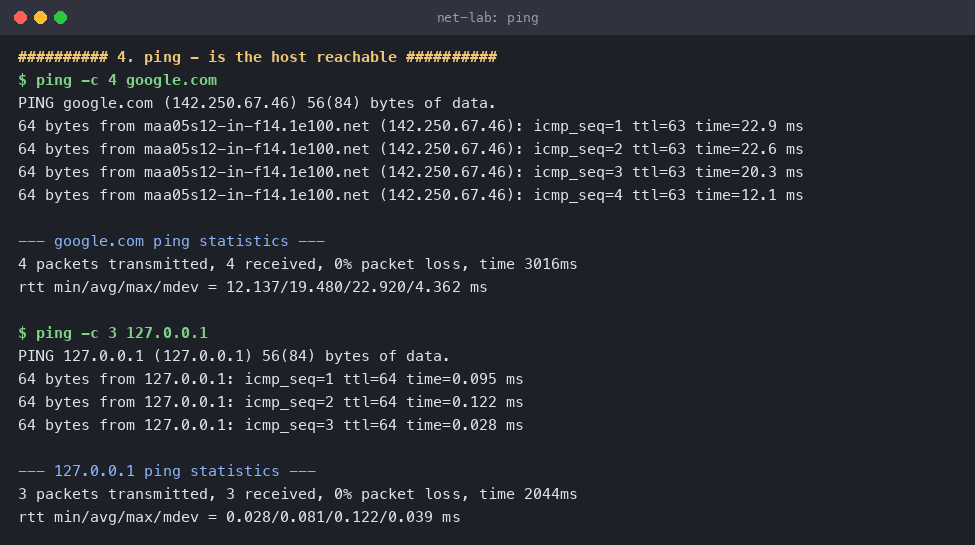
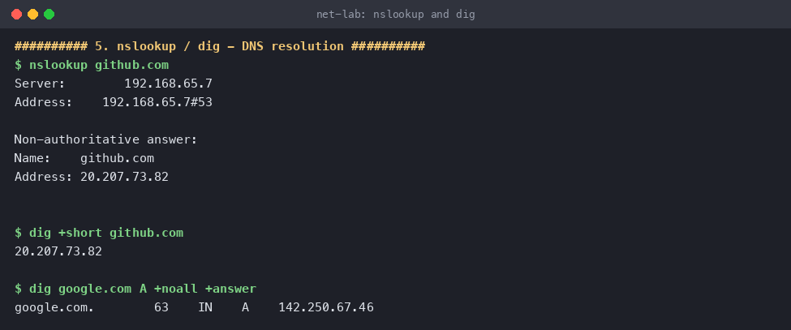
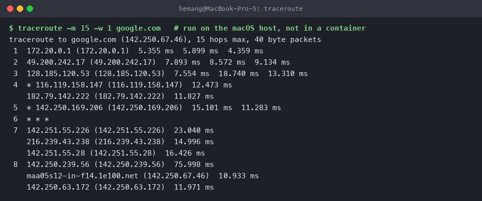
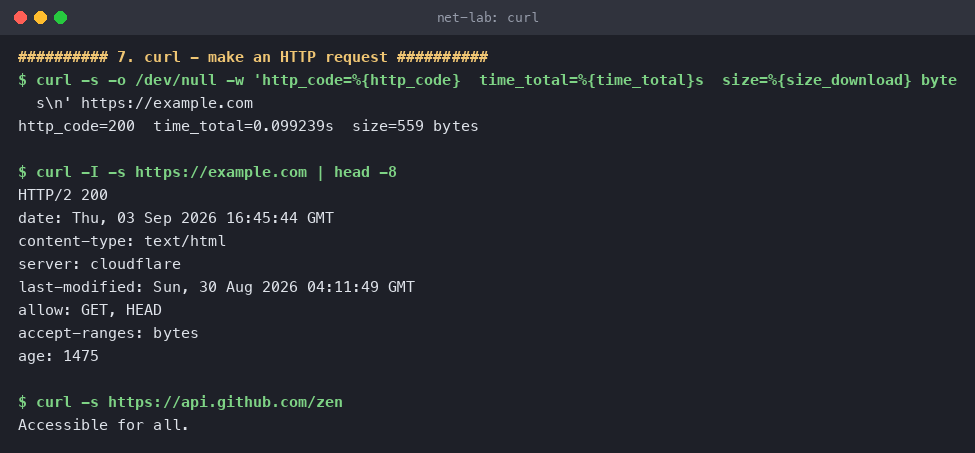
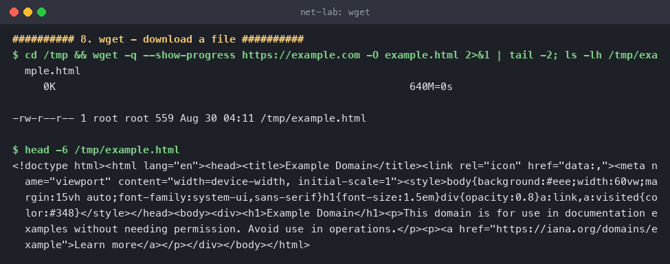
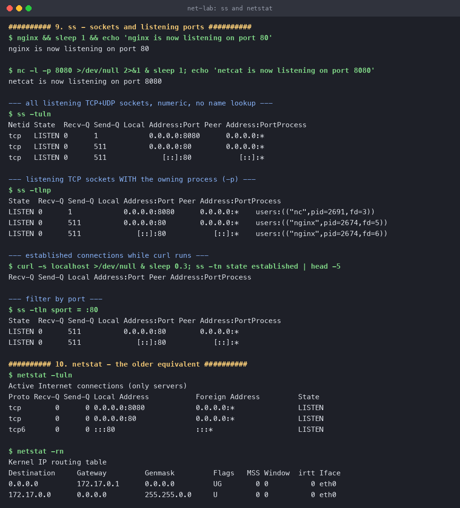
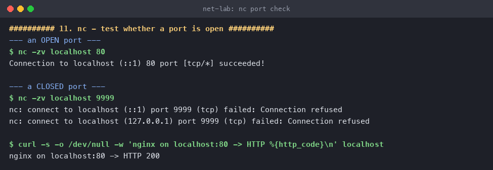

# Networking Fundamentals

**Name:** Hemang
**Enrollment number:** 24bcs10209

Each command below was run for real, the output is pasted in unmodified, and there is a short
note on what I understood from it.

Most commands were run in an Ubuntu 24.04 container (hostname `net-lab`, IP `172.17.0.3` on
Docker's default bridge). `traceroute` was run on the macOS host instead, because Docker
Desktop's VM drops the probe packets and every hop past the gateway comes back as `* * *`.

| # | Command | What it answers |
|---|---|---|
| 1 | [`hostname`](#1-hostname) | What is this machine called? |
| 2 | [`ip a`](#2-ip-a) | What interfaces and addresses do I have? |
| 3 | [`ip route`](#3-ip-route) | Where do my packets go? |
| 4 | [`ping`](#4-ping) | Is that host reachable, and how far away? |
| 5 | [`nslookup` / `dig`](#5-nslookup--dig) | What IP does this name resolve to? |
| 6 | [`traceroute`](#6-traceroute) | What path do my packets take? |
| 7 | [`curl`](#7-curl) | What does the server actually reply? |
| 8 | [`wget`](#8-wget) | Download this file. |
| 9 | [`ss` / `netstat`](#9-ss--netstat) | What is listening on this machine? |
| 10 | [`nc`](#10-nc-netcat) | Is that port open? |

---

## 1. `hostname`

```console
$ hostname
net-lab

$ hostname -i
172.17.0.3
```

**What I understood.** `hostname` just prints the machine's name — the same string that shows
up in your shell prompt and in every log line. `-i` resolves that name to an IP. It is the
first thing to check when you're on a box and not sure which box you're on.



---

## 2. `ip a`

`ip a` (short for `ip address show`) lists every network interface and the addresses on it.

```console
$ ip a
1: lo: <LOOPBACK,UP,LOWER_UP> mtu 65536 qdisc noqueue state UNKNOWN group default qlen 1000
    link/loopback 00:00:00:00:00:00 brd 00:00:00:00:00:00
    inet 127.0.0.1/8 scope host lo
       valid_lft forever preferred_lft forever
    inet6 ::1/128 scope host
       valid_lft forever preferred_lft forever
...
11: eth0@if26: <BROADCAST,MULTICAST,UP,LOWER_UP> mtu 65535 qdisc noqueue state UP group default
    link/ether 2a:00:de:41:31:e8 brd ff:ff:ff:ff:ff:ff link-netnsid 0
    inet 172.17.0.3/16 brd 172.17.255.255 scope global eth0
       valid_lft forever preferred_lft forever
```

**What I understood.** Two interfaces matter here:

- **`lo`** is the loopback. `127.0.0.1` never leaves the machine — it's how processes on the
  same host talk to each other.
- **`eth0`** is the real one. `inet 172.17.0.3/16` is the IPv4 address and its subnet mask; the
  `/16` means everything from `172.17.0.0` to `172.17.255.255` is on the same local network and
  reachable without a router. `link/ether 2a:00:de:41:31:e8` is the MAC address (layer 2),
  while the `inet` line is layer 3.
- `state UP` means the link is actually usable. An interface with an address but `state DOWN`
  is a very common cause of "the network is broken".
- The `@if26` suffix is a giveaway that this is a container: `eth0` is one end of a virtual
  ethernet pair, and interface 26 on the host is the other end.

The many `tunl0`, `gre0`, `sit0` entries are tunnelling interfaces the kernel creates by
default. They are all `DOWN` and can be ignored.



---

## 3. `ip route`

```console
$ ip route
default via 172.17.0.1 dev eth0
172.17.0.0/16 dev eth0 proto kernel scope link src 172.17.0.3

$ ip route get 8.8.8.8
8.8.8.8 via 172.17.0.1 dev eth0 src 172.17.0.3 uid 0
    cache
```

**What I understood.** This is the decision table the kernel consults for every outbound packet,
and it is read most-specific-first:

- Line 2 says anything in `172.17.0.0/16` is on my own link — send it straight out `eth0`, no
  router involved.
- Line 1 is the **default route**: anything else goes to the gateway `172.17.0.1`. That is the
  `docker0` bridge on the host here; on a laptop it would be your Wi-Fi router.

`ip route get` is the useful one for debugging — instead of making you read the table, it tells
you the exact decision for one destination. "No route to host" almost always means the default
route is missing.



---

## 4. `ping`

```console
$ ping -c 4 google.com
PING google.com (142.250.67.46) 56(84) bytes of data.
64 bytes from maa05s12-in-f14.1e100.net (142.250.67.46): icmp_seq=1 ttl=63 time=22.9 ms
64 bytes from maa05s12-in-f14.1e100.net (142.250.67.46): icmp_seq=2 ttl=63 time=22.6 ms
64 bytes from maa05s12-in-f14.1e100.net (142.250.67.46): icmp_seq=3 ttl=63 time=20.3 ms
64 bytes from maa05s12-in-f14.1e100.net (142.250.67.46): icmp_seq=4 ttl=63 time=12.1 ms

--- google.com ping statistics ---
4 packets transmitted, 4 received, 0% packet loss, time 3016ms
rtt min/avg/max/mdev = 12.137/19.480/22.920/4.362 ms

$ ping -c 3 127.0.0.1
PING 127.0.0.1 (127.0.0.1) 56(84) bytes of data.
64 bytes from 127.0.0.1: icmp_seq=1 ttl=64 time=0.095 ms
...
rtt min/avg/max/mdev = 0.028/0.081/0.122/0.039 ms
```

**What I understood.** `ping` sends an ICMP echo request and times the reply. One command
actually proves three separate things at once:

1. **DNS works** — the name `google.com` became `142.250.67.46` before any packet was sent.
2. **Routing works** — the packet found its way out and back.
3. **How far away it is** — round-trip time ~19 ms average.

`0% packet loss` is the number to look at; loss is what makes connections feel broken even when
they technically work. Comparing the two runs makes the scale obvious: **0.08 ms** to loopback
(never left the machine) versus **19 ms** to Google. `mdev` is jitter — how much the times
varied.

`ttl=63` is also a hint. TTL starts at 64 and drops by one per router, so 63 means exactly one
hop decremented it — the Docker gateway.

A failed ping does **not** always mean the host is down: plenty of servers and firewalls simply
drop ICMP. That's when you reach for `curl` or `nc` instead.



---

## 5. `nslookup` / `dig`

```console
$ nslookup github.com
Server:		192.168.65.7
Address:	192.168.65.7#53

Non-authoritative answer:
Name:	github.com
Address: 20.207.73.82

$ dig +short github.com
20.207.73.82

$ dig google.com A +noall +answer
google.com.		63	IN	A	142.250.67.46
```

**What I understood.** Both tools ask a DNS server to turn a name into an address.

- `Server: 192.168.65.7#53` is the resolver that was asked, on the standard DNS port **53**.
- **"Non-authoritative answer"** means this resolver isn't the owner of the `github.com` zone —
  it's replying from its cache. That's normal and it's why DNS is fast.
- In the `dig` output, `63` is the **TTL in seconds**: how much longer this answer may be
  cached before it must be looked up again. `IN` is the class (Internet) and `A` is the record
  type (IPv4 address). Other useful types: `AAAA` for IPv6, `MX` for mail, `CNAME` for aliases,
  `NS` for nameservers.

`dig +short` is what you want in a script; full `dig` is what you want when debugging, because
it shows the TTL and which server answered. If `ping google.com` fails but
`ping 142.250.67.46` works, the fault is DNS, not the network.



---

## 6. `traceroute`

Run on the macOS host — inside Docker Desktop every hop past the gateway is filtered.

```console
$ traceroute -m 15 -w 1 google.com
traceroute to google.com (142.250.67.46), 15 hops max, 40 byte packets
 1  172.20.0.1 (172.20.0.1)  5.355 ms  5.899 ms  4.359 ms
 2  49.200.242.17 (49.200.242.17)  7.893 ms  8.572 ms  9.134 ms
 3  128.185.120.53 (128.185.120.53)  7.554 ms  18.740 ms  13.310 ms
 4  * 116.119.158.147 (116.119.158.147)  12.473 ms
    182.79.142.222 (182.79.142.222)  11.827 ms
 5  * 142.250.169.206 (142.250.169.206)  15.101 ms  11.283 ms
 6  * * *
 7  142.251.55.226 (142.251.55.226)  23.040 ms
    216.239.43.238 (216.239.43.238)  14.996 ms
    142.251.55.28 (142.251.55.28)  16.426 ms
 8  142.250.239.56 (142.250.239.56)  75.998 ms
    maa05s12-in-f14.1e100.net (142.250.67.46)  10.933 ms
    142.250.63.172 (142.250.63.172)  11.971 ms
```

**What I understood.** Where `ping` says *whether* you can get there, `traceroute` shows *how*.
It works by sending packets with TTL=1, then 2, then 3… Each router that decrements the TTL to
zero has to send back a "time exceeded" error, and that error reveals the router's address. So
the list of hops is really a list of routers that complained.

Reading this particular trace:

- **Hop 1** `172.20.0.1` — my own Wi-Fi router.
- **Hops 2–3** — the ISP's network.
- **Hops 4–5** — leaving the ISP and entering Google's network (`142.250.x` is Google).
- **Hop 8** — `maa05s12-in-f14.1e100.net`. `1e100.net` is Google's own domain (1e100 = 10¹⁰⁰ =
  a googol), and `maa` is the airport code for Chennai, so the traffic terminates at a Google
  edge node in India. That's why the RTT is only ~11 ms.

Three timings per line appear because three probes are sent per hop. `* * *` at hop 6 does
**not** mean the path is broken — traffic clearly continued to hops 7 and 8. It just means that
router was configured not to reply. Some hops show several different addresses because
load balancing sent each probe a slightly different way.



---

## 7. `curl`

```console
$ curl -s -o /dev/null -w 'http_code=%{http_code}  time_total=%{time_total}s  size=%{size_download} bytes\n' https://example.com
http_code=200  time_total=0.099239s  size=559 bytes

$ curl -I -s https://example.com | head -8
HTTP/2 200
date: Thu, 03 Sep 2026 16:45:44 GMT
content-type: text/html
server: cloudflare
last-modified: Sun, 30 Aug 2026 04:11:49 GMT
allow: GET, HEAD
accept-ranges: bytes
age: 1475

$ curl -s https://api.github.com/zen
Accessible for all.
```

**What I understood.** `curl` speaks HTTP, so it tests the thing users actually care about,
several layers above `ping`. A server can answer pings perfectly while its application is down.

- `-s` silences the progress meter, `-o /dev/null` throws the body away, and `-w` prints
  exactly the fields I want — this is the standard way to check an endpoint from a script.
- `-I` sends a `HEAD` request: headers only, no body. `HTTP/2 200` is the status line;
  `server: cloudflare` shows the request went through a CDN, and `age: 1475` means the response
  was served from cache, 1475 seconds old.
- The third call shows a plain API response coming back as text.

Useful flags: `-v` to see the whole conversation including TLS, `-L` to follow redirects,
`-X POST -d` to send data, and `-H` to add headers.



---

## 8. `wget`

```console
$ wget -q --show-progress https://example.com -O example.html
     0K                                                         640M=0s

$ ls -lh /tmp/example.html
-rw-r--r-- 1 root root 559 Aug 30 04:11 /tmp/example.html

$ head -6 /tmp/example.html
<!doctype html><html lang="en"><head><title>Example Domain</title>...
<h1>Example Domain</h1><p>This domain is for use in documentation examples
without needing permission. Avoid use in operations.</p>...
```

**What I understood.** `wget` is a downloader: by default it *saves to a file*, where `curl`
prints to stdout. The 559 bytes on disk match the `size_download=559` that `curl` reported for
the same URL, which is a nice cross-check that both fetched the same thing.

The practical split: **`curl` to inspect a response, `wget` to fetch files.** `wget` is the
better tool when you want retries on a flaky link (`-c` to resume a partial download) or a
whole tree (`-r` to mirror a site recursively) — things `curl` doesn't do on its own.



---

## 9. `ss` / `netstat`

For this section `nginx` was started on port 80 and a `netcat` listener on port 8080, so there
would be something real to see.

```console
$ ss -tuln
Netid State  Recv-Q Send-Q Local Address:Port Peer Address:Port
tcp   LISTEN 0      1            0.0.0.0:8080      0.0.0.0:*
tcp   LISTEN 0      511          0.0.0.0:80        0.0.0.0:*
tcp   LISTEN 0      511             [::]:80           [::]:*

$ ss -tlnp
State  Recv-Q Send-Q Local Address:Port Peer Address:Port Process
LISTEN 0      1            0.0.0.0:8080      0.0.0.0:*    users:(("nc",pid=2691,fd=3))
LISTEN 0      511          0.0.0.0:80        0.0.0.0:*    users:(("nginx",pid=2674,fd=5))
LISTEN 0      511             [::]:80           [::]:*    users:(("nginx",pid=2674,fd=6))

$ ss -tln sport = :80
LISTEN 0      511          0.0.0.0:80        0.0.0.0:*
LISTEN 0      511             [::]:80           [::]:*
```

**What I understood.** `ss` ("socket statistics") lists sockets. The flags decompose neatly:
`-t` TCP, `-u` UDP, `-l` listening only, `-n` numeric (don't translate 80 into "http"), `-p`
show the owning process.

- **`0.0.0.0:80`** means "listening on port 80 on *every* interface". If it said
  `127.0.0.1:80`, the service would only be reachable from inside the machine — that is the
  single most common reason a container or VM "won't accept connections".
- The `[::]:80` line is the same thing for IPv6.
- **`Send-Q` on a LISTEN row is the accept-queue size**, not queued bytes: nginx allows 511
  pending connections, the netcat listener only 1.
- `-p` is what turns this into a real answer. "Port 80 is taken" is not actionable;
  `users:(("nginx",pid=2674))` is.

`netstat` is the older tool for the same job, from `net-tools`. It still works and shows the
same three listeners, plus the routing table with `-rn`:

```console
$ netstat -tuln
Proto Recv-Q Send-Q Local Address           Foreign Address         State
tcp        0      0 0.0.0.0:8080            0.0.0.0:*               LISTEN
tcp        0      0 0.0.0.0:80              0.0.0.0:*               LISTEN
tcp6       0      0 :::80                   :::*                    LISTEN

$ netstat -rn
Destination     Gateway         Genmask         Flags   MSS Window  irtt Iface
0.0.0.0         172.17.0.1      0.0.0.0         UG        0 0          0 eth0
172.17.0.0      0.0.0.0         255.255.0.0     U         0 0          0 eth0
```

`net-tools` is deprecated and often isn't installed on a modern minimal image, so `ss` is the
one to reach for. The flags are nearly identical, which makes switching easy.



---

## 10. `nc` (netcat)

```console
--- an OPEN port ---
$ nc -zv localhost 80
Connection to localhost (::1) 80 port [tcp/*] succeeded!

--- a CLOSED port ---
$ nc -zv localhost 9999
nc: connect to localhost (::1) port 9999 (tcp) failed: Connection refused
nc: connect to localhost (127.0.0.1) port 9999 (tcp) failed: Connection refused

$ curl -s -o /dev/null -w 'nginx on localhost:80 -> HTTP %{http_code}\n' localhost
nginx on localhost:80 -> HTTP 200
```

**What I understood.** `nc -z` attempts a TCP connection and reports whether it completed, with
`-v` to make it say so out loud. It tests one specific port rather than the whole host, which
is what you usually actually need.

The contrast between the two calls is the whole lesson:

- Port 80 → **succeeded**, because nginx is listening.
- Port 9999 → **Connection refused**, which means the machine was reached and actively said
  "nothing here". That is very different from a **timeout**, which means the packet vanished —
  usually a firewall silently dropping it. Refused = wrong port; timeout = blocked.

Note that it tried IPv6 (`::1`) first and then IPv4 (`127.0.0.1`), since `localhost` resolves to
both.

`nc` is also a listener (`nc -l -p 8080`, as used in the previous section) and can pipe data
between machines, which makes it a handy end-to-end test when there's no application ready yet.



---

## Summary — which tool for which layer

| Layer | Question | Tool |
|---|---|---|
| Link / interface | Do I have an address, is the link up? | `ip a` |
| Routing | Where will this packet go? | `ip route`, `ip route get` |
| Reachability | Can I reach that host at all? | `ping` |
| Path | Which routers is it going through? | `traceroute` |
| Naming | What does this name resolve to? | `nslookup`, `dig` |
| Ports | Is the port open / what is listening? | `nc -z`, `ss -tlnp` |
| Application | Does the service actually answer correctly? | `curl`, `wget` |

Working top-down through that table is the fastest way to localise a fault: if `ip a` shows no
address, nothing above it can possibly work.
