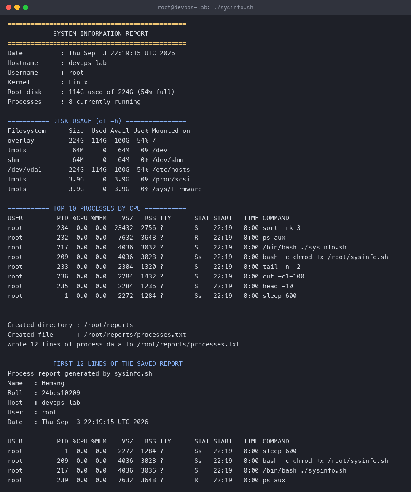
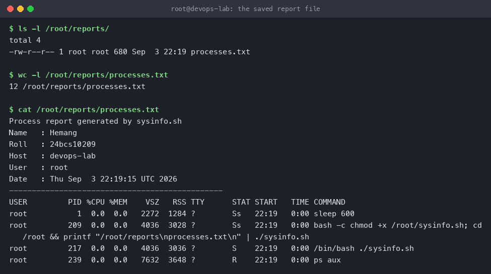

# Shell Scripting — `sysinfo.sh`

**Name:** Hemang
**Enrollment number:** 24bcs10209

A Bash script that prints a summary of the machine it runs on, asks the user where to save a
report, and writes the full running-process list to that file using `>` output redirection.

Script: [`sysinfo.sh`](sysinfo.sh)

Run in an Ubuntu 24.04 container (hostname `devops-lab`); the output below is from that run.

---

## Requirements checklist

| Requirement | How the script does it |
|---|---|
| Print the current date | `today=$(date)` |
| Print the hostname | `box=$(hostname)` |
| Print the username | `me=$(whoami)` |
| Print the disk usage | `df -h`, plus a one-line summary parsed with `awk` |
| Print the running processes | `ps aux`, sorted by CPU, top 10 |
| Use variables | `today`, `box`, `me`, `kernel`, `disk_summary`, `proc_count`, `report_dir`, `report_file`, `report_path`, `lines` |
| Take user input with `read -p` | Two prompts: the directory and the file name |
| Create a directory with `mkdir` | `mkdir -p "$report_dir"` |
| Create a file with `touch` | `touch "$report_path"` |
| Store processes in the file with `>` | `{ ... } > "$report_path"` for the header, then `ps aux >> "$report_path"` |

---

## The script

```bash
#!/bin/bash
# sysinfo.sh - System Information Script
# Name: Hemang | Enrollment number: 24bcs10209

# ---- variables: capture command output with $( ) ----
today=$(date)
box=$(hostname)
me=$(whoami)
kernel=$(uname -s)
disk_summary=$(df -h / | awk 'NR==2 { print $3 " used of " $2 " (" $5 " full)" }')
proc_count=$(ps ax | wc -l | tr -d ' ')

# ---- 1. print the basics ----
echo "==============================================="
echo "            SYSTEM INFORMATION REPORT           "
echo "==============================================="
echo "Date          : $today"
echo "Hostname      : $box"
echo "Username      : $me"
echo "Kernel        : $kernel"
echo "Root disk     : $disk_summary"
echo "Processes     : $proc_count currently running"
echo

# ---- 2. disk usage ----
echo "----------- DISK USAGE (df -h) ----------------"
df -h
echo

# ---- 3. running processes ----
echo "----------- TOP 10 PROCESSES BY CPU -----------"
ps aux | head -1
ps aux | tail -n +2 | sort -rk 3 | head -10 | cut -c1-100
echo

# ---- 4. take input from the user with read -p ----
read -p "Directory to save the report in : " report_dir
read -p "Report file name               : " report_file

report_dir=${report_dir:-./reports}          # defaults if the user just hits Enter
report_file=${report_file:-processes.txt}
report_path="$report_dir/$report_file"

# ---- 5. create the directory and the file ----
mkdir -p "$report_dir"
touch "$report_path"

# ---- 6. store the process list in the file with > redirection ----
{
    echo "Process report generated by sysinfo.sh"
    echo "Name   : Hemang"
    echo "Roll   : 24bcs10209"
    echo "Host   : $box"
    echo "User   : $me"
    echo "Date   : $today"
    echo "-----------------------------------------------"
} > "$report_path"

ps aux >> "$report_path"

# ---- 7. confirm ----
lines=$(wc -l < "$report_path" | tr -d ' ')
echo
echo "Created directory : $report_dir"
echo "Created file      : $report_path"
echo "Wrote $lines lines of process data to $report_path"
echo
echo "----------- FIRST 12 LINES OF THE SAVED REPORT ----"
head -12 "$report_path" | cut -c1-100
```

---

## How to run

```bash
chmod +x sysinfo.sh
./sysinfo.sh
```

It then prompts twice. For a non-interactive run the answers can be piped in:

```bash
printf '/root/reports\nprocesses.txt\n' | ./sysinfo.sh
```

---

## Output

```console
$ ./sysinfo.sh
===============================================
            SYSTEM INFORMATION REPORT
===============================================
Date          : Thu Sep  3 22:19:15 UTC 2026
Hostname      : devops-lab
Username      : root
Kernel        : Linux
Root disk     : 114G used of 224G (54% full)
Processes     : 8 currently running

----------- DISK USAGE (df -h) ----------------
Filesystem      Size  Used Avail Use% Mounted on
overlay         224G  114G  100G  54% /
tmpfs            64M     0   64M   0% /dev
shm              64M     0   64M   0% /dev/shm
/dev/vda1       224G  114G  100G  54% /etc/hosts
tmpfs           3.9G     0  3.9G   0% /proc/scsi
tmpfs           3.9G     0  3.9G   0% /sys/firmware

----------- TOP 10 PROCESSES BY CPU -----------
USER         PID %CPU %MEM    VSZ   RSS TTY      STAT START   TIME COMMAND
root         234  0.0  0.0  23432  2756 ?        S    22:19   0:00 sort -rk 3
root         232  0.0  0.0   7632  3648 ?        R    22:19   0:00 ps aux
root         217  0.0  0.0   4036  3032 ?        S    22:19   0:00 /bin/bash ./sysinfo.sh
root         209  0.0  0.0   4036  3028 ?        Ss   22:19   0:00 bash -c chmod +x /root/sysinfo.sh
root         233  0.0  0.0   2304  1320 ?        S    22:19   0:00 tail -n +2
root         236  0.0  0.0   2284  1432 ?        S    22:19   0:00 cut -c1-100
root         235  0.0  0.0   2284  1236 ?        S    22:19   0:00 head -10
root           1  0.0  0.0   2272  1284 ?        Ss   22:19   0:00 sleep 600

Directory to save the report in : /root/reports
Report file name               : processes.txt

Created directory : /root/reports
Created file      : /root/reports/processes.txt
Wrote 12 lines of process data to /root/reports/processes.txt

----------- FIRST 12 LINES OF THE SAVED REPORT ----
Process report generated by sysinfo.sh
Name   : Hemang
Roll   : 24bcs10209
Host   : devops-lab
User   : root
Date   : Thu Sep  3 22:19:15 UTC 2026
-----------------------------------------------
USER         PID %CPU %MEM    VSZ   RSS TTY      STAT START   TIME COMMAND
root           1  0.0  0.0   2272  1284 ?        Ss   22:19   0:00 sleep 600
root         209  0.0  0.0   4036  3028 ?        Ss   22:19   0:00 bash -c chmod +x /root/sysinfo.sh
root         217  0.0  0.0   4036  3036 ?        S    22:19   0:00 /bin/bash ./sysinfo.sh
root         239  0.0  0.0   7632  3648 ?        R    22:19   0:00 ps aux
```



### The report file that was created

The two `read -p` answers decided this path — the directory did not exist before the run and
`mkdir -p` created it:

```console
$ ls -l /root/reports/
total 4
-rw-r--r-- 1 root root 680 Sep  3 22:19 processes.txt

$ wc -l /root/reports/processes.txt
12 /root/reports/processes.txt

$ head -8 /root/reports/processes.txt
Process report generated by sysinfo.sh
Name   : Hemang
Roll   : 24bcs10209
Host   : devops-lab
User   : root
Date   : Thu Sep  3 22:19:15 UTC 2026
-----------------------------------------------
USER         PID %CPU %MEM    VSZ   RSS TTY      STAT START   TIME COMMAND
```



---

## Notes on the shell features used

- **`$( )` command substitution** runs a command and hands back its stdout as a string, which
  is how `date`, `hostname` and `whoami` end up inside variables.
- **`>` truncates, `>>` appends.** The script writes its header block with `>` (creating the
  file fresh) and then appends the process list with `>>`. Using `>` twice would have thrown
  the header away.
- **`{ ...; } > file`** redirects a whole group of commands in one go, instead of repeating
  `>>` on every `echo`.
- **`${var:-default}`** supplies a fallback when the user presses Enter without typing
  anything, so the script never builds a path like `/processes.txt`.
- **Quoting `"$report_path"`** keeps the script working when a path contains spaces.
- `touch` is technically redundant here since the redirection would create the file anyway, but
  it is in the task list and it makes the intent explicit.
