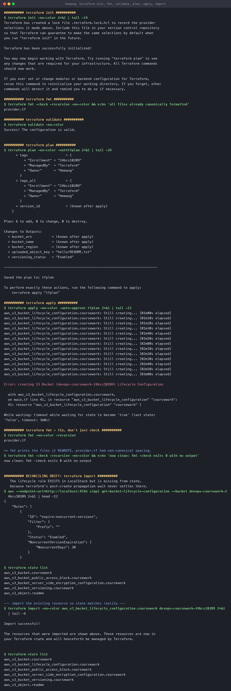
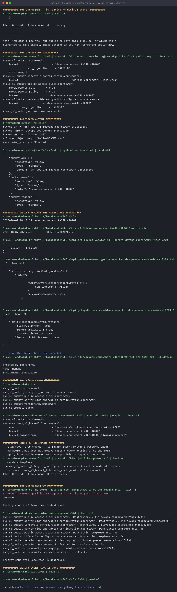

# Terraform and Infrastructure as Code

**Name:** Hemang
**Enrollment number:** 24bcs10209

Session 18. A complete Terraform project taken through the full lifecycle — `init` → `fmt` →
`validate` → `plan` → `apply` → `import` → `show` → `output` → `destroy` — plus written notes on
five core AWS services.

> **Where this ran:** against **LocalStack**, an AWS API emulator in Docker, not real AWS. Every
> API call below is genuine — LocalStack implements the S3 API and the AWS CLI output is real —
> but nothing is billable and no AWS account is involved. Pointing this at real AWS means deleting
> the `endpoints` block and the fake credentials from `provider.tf`; nothing else changes.

| Task | |
|---|---|
| [Task 1](#task-1--terraform-s3-demo) | [`terraform-s3-demo/`](terraform-s3-demo/) — build an S3 bucket with Terraform |
| [Task 2](#task-2--aws-services) | [`aws-services/`](aws-services/) — IAM, EC2, S3, VPC, DynamoDB & RDS |

---

## What IaC buys you

| Clicking in the console | Terraform |
|---|---|
| Undocumented, un-reviewable | The config **is** the documentation, and it is in git |
| "Works on my account" | Same config → same result, every environment |
| Drift is invisible | `terraform plan` shows it |
| Teardown is manual and error-prone | `terraform destroy` |

Terraform is **declarative**: you describe the end state, and it computes the diff. The
**state file** is what makes that possible — it maps your config to real resource IDs.

---

## Task 1 — terraform-s3-demo

```text
terraform-s3-demo/
├── provider.tf       # terraform block + aws provider (pointed at LocalStack)
├── variables.tf      # typed inputs, with validation
├── main.tf           # the resources
├── outputs.tf        # what to surface after apply
└── terraform.tfvars  # values for this environment
```

Splitting by purpose is convention, not a requirement — Terraform concatenates every `.tf` in the
directory.

### Variables with validation

```hcl
variable "bucket_name" {
  description = "Globally unique name for the S3 bucket"
  type        = string
  default     = "devops-coursework-24bcs10209"

  validation {
    condition     = can(regex("^[a-z0-9][a-z0-9.-]{1,61}[a-z0-9]$", var.bucket_name))
    error_message = "Bucket names must be lowercase, 3-63 chars, and start/end alphanumeric."
  }
}
```

The validation block catches a bad name at **plan** time with a clear message, rather than as an
opaque API error during apply.

### The resources

Six in total — a bucket plus its security and lifecycle configuration:

```hcl
resource "aws_s3_bucket"                                "coursework" { ... }
resource "aws_s3_bucket_versioning"                     "coursework" { ... }
resource "aws_s3_bucket_server_side_encryption_configuration" "coursework" { ... }
resource "aws_s3_bucket_public_access_block"            "coursework" { ... }
resource "aws_s3_bucket_lifecycle_configuration"        "coursework" { ... }
resource "aws_s3_object"                                "readme"     { ... }
```

Note that modern AWS provider versions split bucket settings into **separate resources** rather
than inline blocks — each one references `aws_s3_bucket.coursework.id`, and that reference is
what builds Terraform's dependency graph.

---

### `terraform init`

```console
$ terraform init
Terraform has created a lock file .terraform.lock.hcl to record the provider
selections it made above. Include this file in your version control repository...

Terraform has been successfully initialized!
```

Downloads providers and writes `.terraform.lock.hcl`, which pins exact provider versions and
checksums. **Commit the lock file** — it is what makes builds reproducible.

### `terraform fmt`

```console
$ terraform fmt -check -recursive
provider.tf                      # ← exits non-zero, names the offending file

$ terraform fmt -recursive
provider.tf                      # ← rewrites it

$ terraform fmt -check -recursive && echo clean
now clean: fmt -check exits 0 with no output
```

`-check` reports without changing anything, which is the form you put in CI.

### `terraform validate`

```console
$ terraform validate
Success! The configuration is valid.
```

Checks syntax and internal consistency **without contacting the provider** — so it is fast and
works with no credentials.

### `terraform plan`

```console
$ terraform plan -out=tfplan
      + tags                   = {
          + "Enrollment" = "24bcs10209"
          + "ManagedBy"  = "Terraform"
          + "Owner"      = "Hemang"
        }
      + version_id             = (known after apply)

Plan: 6 to add, 0 to change, 0 to destroy.

Changes to Outputs:
  + bucket_arn          = (known after apply)
  + bucket_name         = (known after apply)
  + uploaded_object_key = "hello/README.txt"
  + versioning_status   = "Enabled"

Saved the plan to: tfplan
```

`(known after apply)` marks values only the API can supply. Saving with `-out` and applying
*that file* guarantees apply does exactly what you reviewed — the right pattern for CI.

### `terraform apply`

```console
$ terraform apply -auto-approve tfplan
```

Five of six resources created. The sixth hit a LocalStack limitation — see below.

---

### A real problem: the lifecycle rule, and `terraform import`

```console
Error: creating S3 Bucket Lifecycle Configuration
  While waiting: timeout while waiting for state to become 'true' (timeout: 3m0s)
```

The AWS provider creates the lifecycle rule and then **polls until it reads back as applied**.
LocalStack never satisfies that check. But the rule *was* created:

```console
$ aws --endpoint-url=http://localhost:4566 s3api get-bucket-lifecycle-configuration \
    --bucket devops-coursework-24bcs10209
{ "Rules": [{ "ID": "expire-noncurrent-versions", "Status": "Enabled",
              "NoncurrentVersionExpiration": { "NoncurrentDays": 30 } }] }

$ terraform state list
aws_s3_bucket.coursework
aws_s3_bucket_public_access_block.coursework
aws_s3_bucket_server_side_encryption_configuration.coursework
aws_s3_bucket_versioning.coursework
aws_s3_object.readme                       # ← the lifecycle resource is MISSING
```

**This is drift**: the resource exists in reality but not in state, so Terraform doesn't know it
owns it. The fix is `terraform import`:

```console
$ terraform import aws_s3_bucket_lifecycle_configuration.coursework devops-coursework-24bcs10209
Import successful!

$ terraform state list
aws_s3_bucket.coursework
aws_s3_bucket_lifecycle_configuration.coursework        # ← now tracked
aws_s3_bucket_public_access_block.coursework
aws_s3_bucket_server_side_encryption_configuration.coursework
aws_s3_bucket_versioning.coursework
aws_s3_object.readme
```

```console
$ terraform plan
  # aws_s3_bucket_lifecycle_configuration.coursework will be updated in-place
Plan: 0 to add, 1 to change, 0 to destroy.
```

**`import` adopts a resource but does not always capture every attribute**, so one more apply is
normally needed to converge. That is expected, and it is exactly the workflow for bringing
click-ops infrastructure under Terraform.



---

### `terraform show` and `terraform output`

```console
$ terraform output
bucket_arn = "arn:aws:s3:::devops-coursework-24bcs10209"
bucket_name = "devops-coursework-24bcs10209"
bucket_region = "ap-south-1"
uploaded_object_key = "hello/README.txt"
versioning_status = "Enabled"
```

`terraform output -json` is the machine-readable form — how a CI job passes a bucket name or
cluster endpoint to the next stage.

### Verified against the actual API

Terraform claiming success is not proof. Asking S3 directly is:

```console
$ aws --endpoint-url=http://localhost:4566 s3 ls
2026-10-07 20:12:22 devops-coursework-24bcs10209

$ aws --endpoint-url=http://localhost:4566 s3 ls s3://devops-coursework-24bcs10209/ --recursive
2026-10-07 20:12:22         58 hello/README.txt

$ aws ... s3api get-bucket-versioning --bucket devops-coursework-24bcs10209
{ "Status": "Enabled" }

$ aws ... s3api get-bucket-encryption --bucket devops-coursework-24bcs10209
"ApplyServerSideEncryptionByDefault": { "SSEAlgorithm": "AES256" }

$ aws ... s3api get-public-access-block --bucket devops-coursework-24bcs10209
"BlockPublicAcls": true, "IgnorePublicAcls": true,
"BlockPublicPolicy": true, "RestrictPublicBuckets": true

$ aws ... s3 cp s3://devops-coursework-24bcs10209/hello/README.txt -
Created by Terraform.
Name: Hemang
Enrollment: 24bcs10209
```

Versioning, encryption, public-access blocking and the uploaded object all confirmed by the API.

### `terraform destroy`

```console
$ terraform destroy -auto-approve
aws_s3_bucket_public_access_block.coursework: Destruction complete after 0s
aws_s3_bucket_server_side_encryption_configuration.coursework: Destruction complete after 0s
aws_s3_bucket_lifecycle_configuration.coursework: Destruction complete after 0s
aws_s3_bucket_versioning.coursework: Destruction complete after 0s
aws_s3_bucket.coursework: Destruction complete after 0s

Destroy complete! Resources: 5 destroyed.

$ terraform state list        # empty
$ aws --endpoint-url=http://localhost:4566 s3 ls    # empty
```

Destroy runs the dependency graph **in reverse** — configuration resources before the bucket
they attach to. The object was removed first (S3 refuses to delete a non-empty bucket), which
is why the run used a targeted destroy for it.



---

## Task 2 — AWS services

Written notes, one folder each:

| | Service | Covers |
|---|---|---|
| [01](aws-services/01-iam/) | **IAM** | Users, groups, roles, policies, evaluation logic, least privilege |
| [02](aws-services/02-ec2/) | **EC2** | AMIs, instance types, key pairs, security groups, EBS, IP addressing, lifecycle |
| [03](aws-services/03-s3/) | **S3** | Buckets, objects, storage classes, versioning, lifecycle, encryption, policies |
| [04](aws-services/04-vpc/) | **VPC** | CIDR, subnets, route tables, IGW, NAT, security groups vs NACLs |
| [05](aws-services/05-dynamodb-rds/) | **DynamoDB & RDS** | Partition/sort keys, capacity; engines, Multi-AZ, read replicas, backups |

The S3 notes map directly onto the bucket built above — every setting documented there is one
that was applied and then verified against the API.

---

## Reproduce

```bash
# LocalStack stands in for AWS
docker run -d --name localstack -p 4566:4566 -e SERVICES=s3,ec2,iam,dynamodb localstack/localstack:3.8
export AWS_ACCESS_KEY_ID=test AWS_SECRET_ACCESS_KEY=test AWS_DEFAULT_REGION=ap-south-1

cd terraform-s3-demo
terraform init
terraform fmt -recursive
terraform validate
terraform plan -out=tfplan
terraform apply -auto-approve tfplan
terraform output

aws --endpoint-url=http://localhost:4566 s3 ls

terraform destroy -auto-approve
docker rm -f localstack
```

---

## Command reference

| Command | Purpose |
|---|---|
| `terraform init` | Download providers, write the lock file |
| `terraform fmt [-check]` | Canonical formatting (`-check` for CI) |
| `terraform validate` | Syntax and consistency, no API calls |
| `terraform plan [-out=f]` | Show the diff; save it to apply exactly that |
| `terraform apply [f]` | Make reality match |
| `terraform show` | Human-readable state |
| `terraform output [-json]` | Surface values for humans or scripts |
| `terraform state list/show` | Inspect what Terraform tracks |
| `terraform import <addr> <id>` | Adopt an existing resource into state |
| `terraform destroy` | Remove everything, in reverse dependency order |

---

## What I took away

1. **The state file is the whole game.** It is the mapping from config to real resource IDs. The
   lifecycle resource existed in S3 but was absent from state, and Terraform therefore had no
   idea it owned it — `import` is how you reconcile that.
2. **`plan -out` then `apply <file>`** is the only way to guarantee apply does what you reviewed.
3. **`validate` ≠ `plan`.** Validate is offline and local; plan talks to the provider and is the
   one that catches "this bucket name is taken".
4. **Verify against the API, not against Terraform's own output.** `terraform apply` reporting
   success and `aws s3api` agreeing are two different claims.
5. **Timeouts are not always failures.** The resource was created; only the provider's
   read-back check failed. Checking reality before re-running saved a duplicate-resource mess.
6. **Commit `.terraform.lock.hcl`; never commit `terraform.tfstate`** — it holds resource IDs and
   sometimes secrets. Use a remote backend (S3 + DynamoDB locking) for anything shared.
